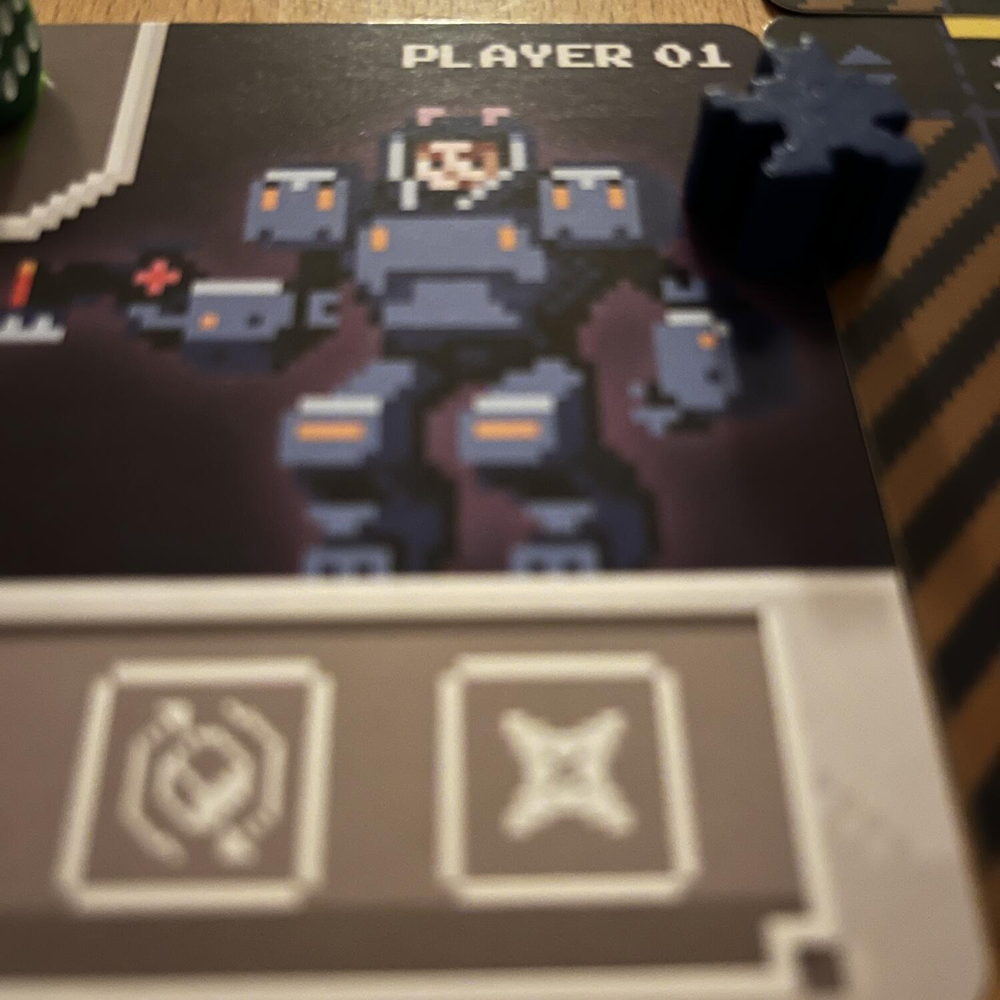
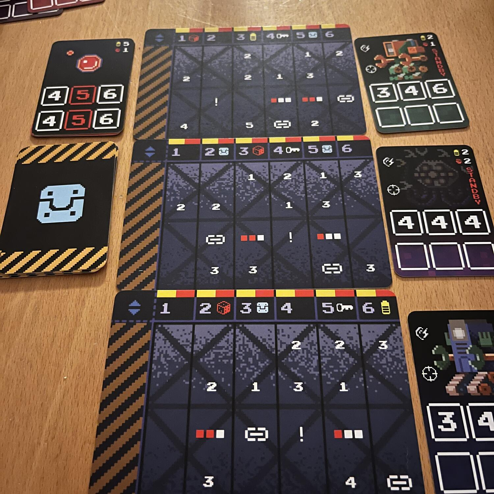

<Setting>

  Lì in cima, dietro a quella Porta, c’è l’IA malvagia che domina il mondo.
  L’unica persona in grado di fermarla sei tu. Trova le chiavi, sconfiggi le
  sentinelle e salva il mondo.  
  <strong> Benvenuto alla Cyberdoom Tower </strong> !

</Setting>

<Rules>

  Cyberdoom Tower è un gioco da <Link to="/mechasnims/solitario">1</Link> a 2
  giocatori che si rifà al genere del cyberpunk. Lo scopo dei giocatori sarà
  quello di collezionare 4-5 chiavi, raccogliendo nel frattempo oggetti ed
  energia, ma anche sviluppando nuove abilità. Ogni turno i giocatori avranno
  tre punti azioni con cui muoversi nella torre. A fine turno dovranno rimanere
  nascosti alle IA. In caso di fallimento del tiro furtività, la sentinella che
  domina il piano sarà attiva e di lì in poi cercherà di ammazzare i giocatori.{" "}
    Sopravvissuti ai piani e raccolte le chiavi, ci si troverà ad
  affrontare l’IA. <strong>Riusciranno i nostri eroi</strong>?

</Rules>

<Feedback>

  Cyberdoom Tower è un gioco con molto potenziale. Le meccaniche ci sono tutte.
  Il combattimento, seppur a base di dadi, ha uno spin davvero interessante.
  L’idea delle sentinelle che ti bloccano mentre i round di gioco scorrono
  facendo da timer mette la giusta pressione.  
  Peccato però che le varie meccaniche non siano amalgamate nel modo in cui ci si
  aspetterebbe. Infatti, probabilmente il modo migliore per giocare Cyberdoom Tower
  è quello di non scontrarsi mai con le sentinelle, privarsi della bellezza di sbloccare
  le abilità dopo una sconfitta, invece che una vittoria, e focalizzarsi solamente
  sulla torre.
   
  Quindi… <strong>Un gioco da provare</strong> - visto il prezzo contenuto -, ma,
  ammesso che sopravviviate ad un regolamento scritto non migliore dei modi, da approcciare
  senza alcuna aspettativa!

</Feedback>

