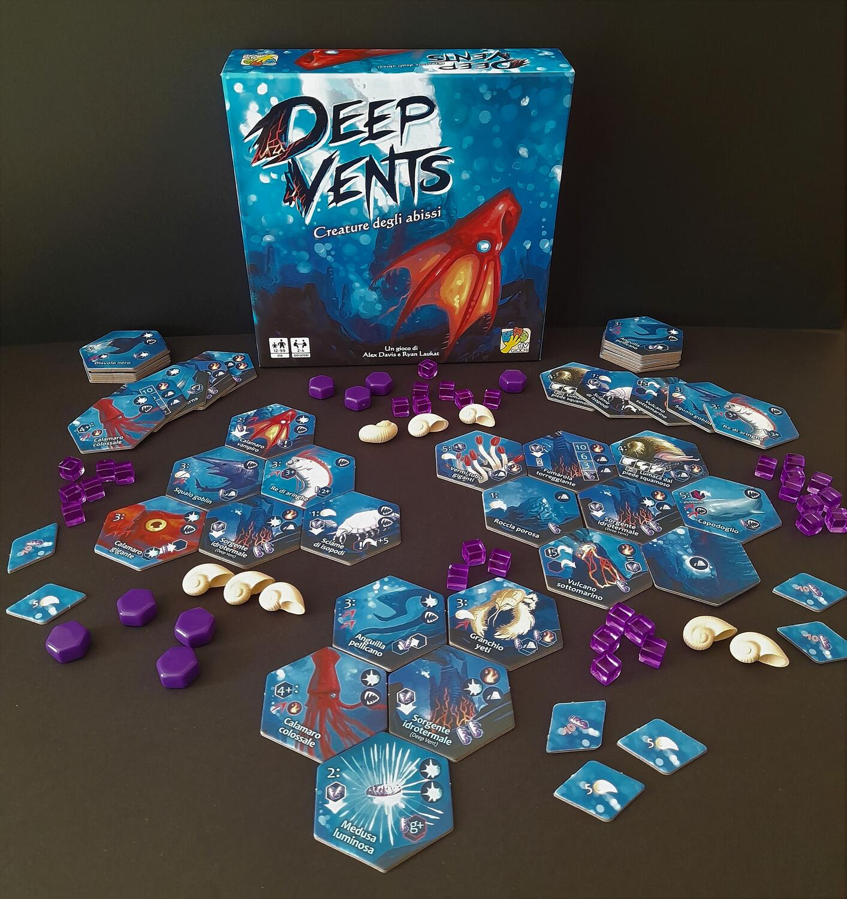
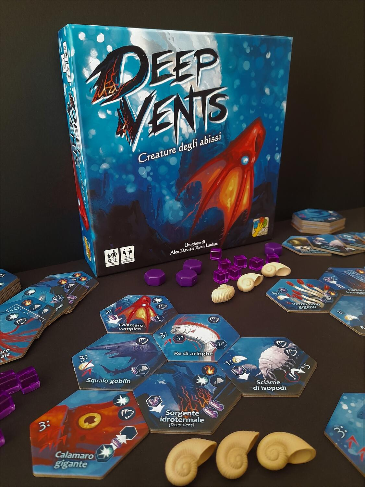

<Setting>

  Chi non ha mai sognato di poter controllare un ecosistema nelle profondità marine? Se la risposta è “io mai”, beh, non
  siete gli unici. In effetti questo gioco propone un tema inusuale ma che, a conti fatti, funziona. Pronti quindi ad
  immergervi nelle acque delle profondità oceaniche per gestire fonti idrotermali, calamari, molluschi, pesci di ogni
  sorta e… conchiglie!

</Setting>

<Rules>

  Una partita dura 8 round, composti dai turni dei vari giocatori. In un turno si acquista una tessera dal mercato
  comune e la si inserisce nel proprio habitat, cercando di piazzarla in modo sinergico alle altre. Fatto ciò si decide
  se espandere o attivare ogni tessera nel proprio ecosistema. Con la prima si produrrà <i>archea</i> sulla tessera
  espansa, usata per attivare tessere, per tener conto della propria “vita” e, a fine partita, conteggiata nel punteggio
  . 
  Attivando una tessera invece si spenderà archea per eseguirne l'effetto: attaccare gli avversari facendogli perdere archea,
  guadagnare conchiglie, esaurire tessere, spostare archea da una tessera alla propria riserva, ecc.
   
  È importante notare che quando, a seguito di un attacco, non si ha più archea da scartare dalla propria riserva, se ne
  potrà ottenere una quantità pari a 10 assieme ad un segnalino carenza. Questi segnalini possono essere eliminati spendendo
  10 archea in qualunque momento del gioco, dal momento che se un giocatore dovesse averne due, verrebbe eliminato.
   
  Al rimanere di un solo giocatore o allo scoccare del nono turno, la partita si conclude e si calcola il punteggio, con
  la differenza che l'archea sulle tessere varrà la metà di quella in riserva.

</Rules>

<Feedback>

  Deep Vents è un german interessante che in giusto un'oretta metterà alla prova le vostre capacità di ottimizzazione
  delle mosse. Saranno infatti fondamentali la scelta e soprattutto il posizionamento delle tessere, dal momento che un
  piazzamento non ottimale potrebbe precludervi la possibilità di attivare combo e concatenazioni fondamentali per la
  vittoria.
   
  Un'iconografia di non facile lettura, almeno inizialmente, potrebbe esservi d'ostacolo, mentre una certa ripetitività
  di tessere e azioni potrebbe farvelo venire a noia, sul lungo periodo.
   
  Da giocare sicuramente in 4 giocatori, in quanto ne viene esaltata la componente di interazione, mettendo un po'
  d'ansia soprattutto a quei giocatori che pensano di farsi il proprio orticello sottomarino.
   
  Atipico rispetto agli altri giochi di Laukat, state attenti a non farvi ingannare dalla durata contenuta, dai disegni
  evocativi o dalle belle conchiglie: non è un gioco semplice da usare come introduttivo, ma un bel gioco da fine serata
  che, se avrete la pazienza di entrare nel sistema di lettura delle icone e nelle sottigliezze del piazzamento,
  potrebbe darvi belle soddisfazioni.

</Feedback>

