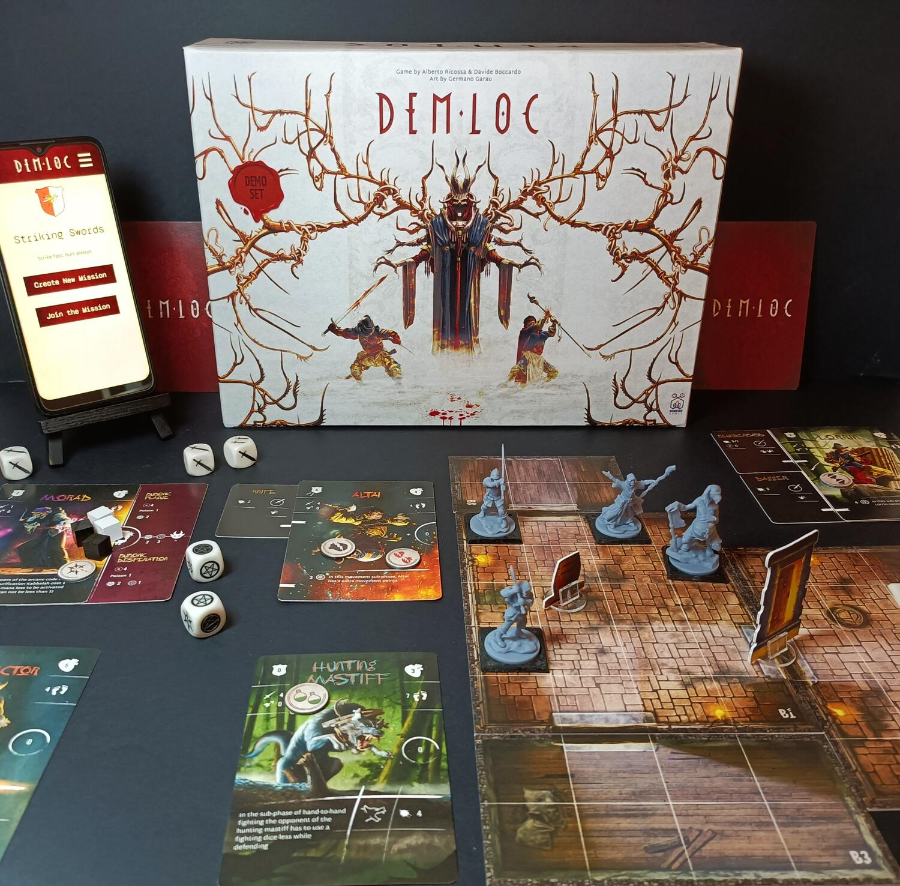
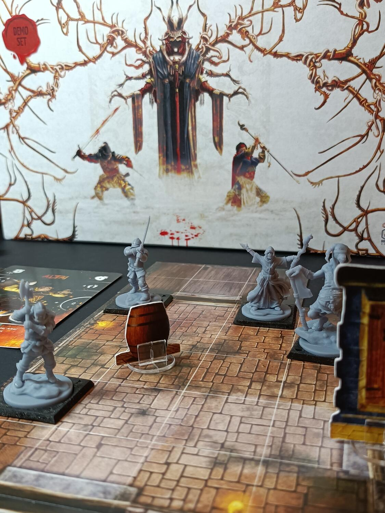

<Setting>

  <strong>Damonenlocho</strong>, il buco del demone, è la città in cui inizia la
  vostra storia. Un’enorme voragine, un cratere di un vulcano spento, ora,
  dimora dell'Arena. Borghi costruiti come bolge dantesche si affacciano
  sull’abissale voragine, ospite di demoniache superstizioni e storie.
    Ma non è sempre stato così. Prima queste terre erano chiamate Loch, il buco:
  una fiorente città, che cresceva alle pendici del cratere, insieme al commercio
  e agli studi. Tutto però cominciò a peggiorare quando arrivò la guerra, e con essa{" "}
  <strong>la Grande Eresia</strong>. Culti di religioni antiche si sparsero per i
  borghi, accrescendo la paura e il sospetto. Una notte, dopo un enorme bagliore
  rosso ed un’esplosione, il lago al centro del cratere si prosciugò in una voragine,
  dando alla luce un misterioso e antico edificio, <strong>l'Arena</strong>. {" "}
  Demoni e superstizioni dilagavano come peste, e la città, pian piano, diventò quasi
  deserta. Gran parte della popolazione della ora ribattezzata Dämonen Loch scappò
  via, lasciando spazio ai mercenari che dopo la Guerra non avevano più una dimora
  in cui ritornare. Gilde di guerrieri e mercenari crebbero nei sobborghi della città,
  lottando per la supremazia di queste terre. Voi, vestirete i panni di uno di questi
  Capomastri, pronti a lottare fino alla morte nell'Arena per portare fama e gloria
  alla vostra Gilda. Siete pronti?

</Setting>

<Rules>

  Demloc presenta <strong>due grandi fasi</strong>: la Gestione della Gilda e le
  Missioni. La fase della gestione sarà pilotata è accompagnata completamente da{" "}
  <strong>un’applicazione</strong>. I giocatori, <strong>separatamente</strong>,
  potranno: assoldare nuovi mercenari o seguaci e ospitarli nel Dormitorio,
  acquistare nuove armi e oggetti, ricercare nuovi libri nella Biblioteca
  arcana, accrescere il loro Pantheon di demoni e/o esplorare il fantastico e
  misterioso mondo di Demloc. Questa sarà una delle fasi più importanti del
  gioco, durante la quale dovrete decidere il destino della vostra Gilda, e il
  percorso che vorrete seguire. Tutto questo, come già detto, sarà gestito
  dall’applicazione, che salverà di volta in volta i vostri progressi.
    La seconda fase di Demloc saranno <strong>le Missioni</strong>. Saranno
  di vario genere, durata e difficoltà, e vi porranno di fronte ad innumerevoli sfide,
  oltre che ai vostri avversari, che, come voi, cercheranno in tutti modi di rendere
  incontrastata la loro Gilda. Ad inizio missione ogni giocatore dovrà decidere tre
  mercenari e un seguace, assegnare loro le armi e gli incantesimi e poi disporre
  le sue truppe sulla mappa generata dall'applicazione. A turno dovrete spostare
  i mercenari e decidere se accumulare energia arcana per scatenare potenti magie,
  richiamare immondi demoni o scagliare attacchi a distanza.  
  La situazione si farà più incandescente quando i mercenari ingaggeranno il
  combattimento. Se posizionati vicino, due personaggi si scontreranno nella
  seconda fase del turno, <strong>la fase di mischia</strong>. Il giocatore
  attivo potrà far attaccare i suoi mercenari, lanciando un numero di dadi
  prestabilito dato dalla posizione e dall’arma che impugna; il difensore potrà
  fare lo stesso . Se il risultato è superiore alla difesa, l'attaccante avrà la
  chance di spezzare l’armatura ed eventualmente infliggere ingenti ferite
  all’avversario. In caso contrario, sarà il difensore ad attaccare. Il gioco
  continua fino a che i mercenari di una Gilda sono uccisi, l’obiettivo è stato
  raggiunto o sono passati sufficienti turni per la conclusione della missione.

</Rules>

<Feedback>

  Premetto che ho provato solo <strong>la demo </strong> di Demloc, quindi
  alcune regole, informazioni e materiali potranno cambiare nel corso della fase
  di progettazione. Demloc nella fase di gameplay non si allontana molto dai
  classici del genere skirmish: lancio di dadi, movimento, posizionamento e
  qualche colpo di scena dato da lanci di incantesimi e evocazioni. Cose già
  viste e riviste probabilmente, ma che non annoiano mai se condite con qualche
  aggiunta qua e là.
   
  La parte che più mi ha affascinato e attirato di questo gioco è invece{" "}
  <strong> la fase di gestione della Gilda </strong>, profonda e dettagliata,
  che accompagnerà i giocatori di missione in missione, personalizzando sempre
  di più l’esperienza. L’applicazione, anche se ancora in fase embrionale,
  risulta semplice e immediata, ricca di opzioni e personalizzazioni. L’art è
  davvero bella, curata e ricca di dettagli, che mi hanno permesso di immergermi
  ancora di più nel fantastico mondo di Demoloc.
   I materiali, anche se non ancora completi, sono numerosi e di ottima fattura.
  Già da alcune anticipazioni sappiamo che nel Kickstarter saranno presenti più di{" "}
  <strong>cinquanta </strong> miniature, oltre a numerosi elementi scenici.  
  In conclusione, Demloc a prima vista risulta un titolo già visto, ma che, a
  mio avviso, nasconde un ottimo potenziale. Un gioco che va vissuto, missione
  dopo missione, evento dopo evento, perché solo in questo modo riuscirete ad
  apprezzare e immergervi in questa meravigliosa ambientazione.

</Feedback>

