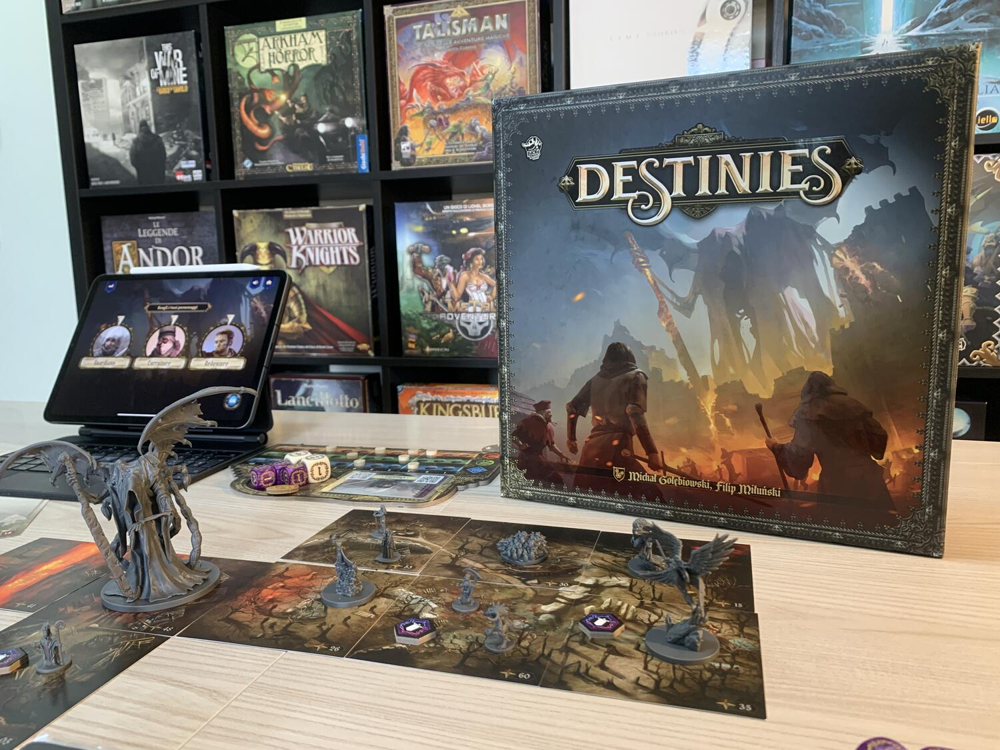
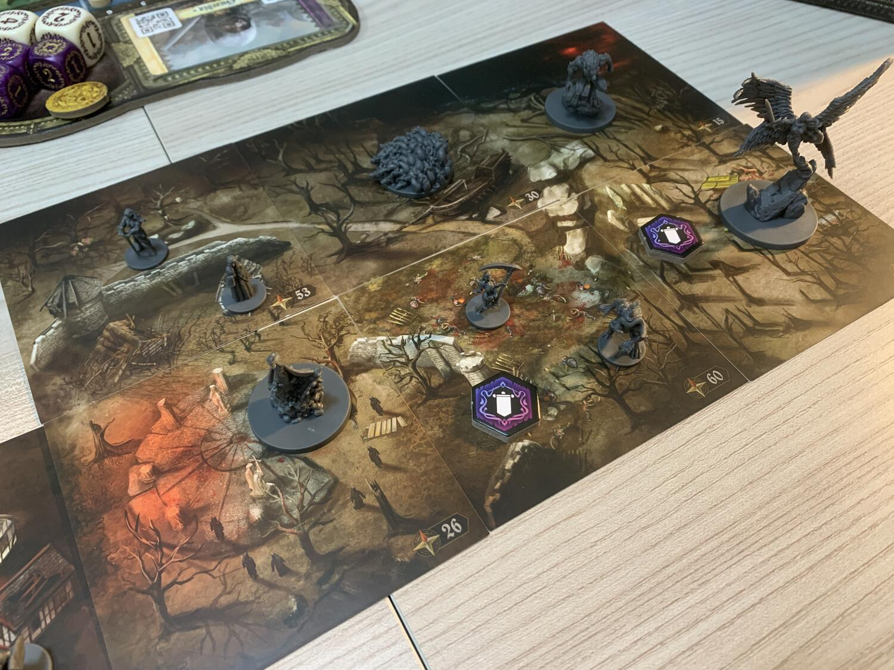

<Setting>

  Medioevo: da tempo i profeti predicano la Fine dei Giorni per mano dell’Angelo
  della Morte, disceso in terra per compiere l’ultimo atto “divino” e porre fine
  al degrado perpetrato dai comuni mortali allo sbando.
   
  Tra cavalieri senza macchia (o quasi) che vagano in cerca di azioni eroiche
  per riscattarsi, streghe che vivono nell’ombra per scampare al rogo, nobili
  caduti in miseria che tentano di riacquisire ricchezze per ripristinare il
  loro titolo e suore credenti che fanno di tutto per portare salvezza e
  redenzione ai poveri, quest’epoca passata rivivrà.
   
  Mentre la Peste e altre piaghe modellano il mondo, strane creature bestiali e
  demoniache attendono nelle foreste ai margini delle città i più sventurati che
  avranno il coraggio o la stoltezza di avventurarvisi.
   
  Forgiare armi possenti, assicurarsi la benevolenza di eroi e potenti
  dell’epoca, abbracciare la religione e compiere atti guidati da un Dio
  superiore è l’unico modo per cercare di evitare ciò che sembra impossibile, ma
  che invece sta accadendo proprio ora… lì, ai bordi delle strade e nelle città
  medievali.
   
  La Bestia, il Vescovo, Giovanna D’Arco e l’Angelo della Morte sono solo alcune
  delle figure che chiunque avesse voglia di giocare a Destinies avrà l’onore di
  incontrare ed affrontare. Mentre si delineerà la storia di fondo, i giocatori
  impersoneranno personaggi sempre diversi che dovranno competere con altri per
  compiere il proprio DESTINO!

</Setting>

<Rules>

  Il Setup di Destinies è molto semplice e veloce, sarà l’app a guidarvi.
   
  Dopo aver preparato le plance di ogni giocatore, aver scelto i personaggi
  giocabili dello scenario (sempre indicati dall’app) e dopo aver intavolato le
  prime carte luogo, verrà narrato l’incipit dello scenario e delineato
  l’ambiente circostante da una voce fuori campo.
   
  Destinies consta di un numero indefinito di round di gioco in cui ogni
  giocatore compie interamente il proprio turno (diviso in più fasi) prima di
  passare la mano al giocatore successivo. La prima fase è la fase INIZIO DEL
  TURNO in cui ogni giocatore ripristina sulla propria plancia di gioco un DADO
  TENTATIVO (dado viola) eventualmente speso in precedenza, in questa fase hanno
  luogo anche molti degli eventi di gioco descritti sempre dall’applicazione. La
  seconda fase è il MOVIMENTO, con cui un giocatore può spostarsi su una
  qualsiasi tessera che dista al massimo due tessere dalla posizione attuale, se
  incontra una tessera inesplorata deve terminare preventivamente il suo
  movimento.
   
  Dopo essersi spostato un giocatore può VISITARE UN PUNTO DI INTERESSE, per
  farlo il giocatore clicca sul punto di interesse scelto sull’applicazione.
   
  Nel visitare un qualsiasi punto di interesse si avranno a disposizione diverse
  opzioni tra cui scegliere (si possono scegliere anche tutte o nessuna) ed ogni
  scelta corrisponde generalmente ad una prova da affrontare.
   
  Tra le opzioni si trovano: INTERAZIONI con personaggi o oggetti, PROVE
  calcolate su una delle 3 abilità (destrezza - forza - intelligenza) da
  affrontare tramite un tiro di dadi, SCANSIONARE CARTE OGGETTO o CARTE DESTINO
  per ottenere informazioni su oggetti in possesso del giocatore e consigli
  sulle azioni da fare per compiere il destino del personaggio. Ultima opzione
  diversa dalle altre è lo SCAMBIO che permette ai giocatori acquistare nuove
  carte oggetto in cambio di denaro.
   
  Solo quando un giocatore avrà compiuto il destino del suo personaggio sarà
  visibile l’opzione INTERAZIONE FINALE tramite la quale dovrà affrontare alcune
  prove epiche per vincere il gioco.

</Rules>

<Feedback>

  Destinies è uno dei primissimi giochi con App che il nostro gruppo ha giocato:
  l’esperienza è stata sicuramente positiva; l’applicazione è un valore aggiunto
  in questo caso, che, oltre a creare ambientazione con la voce narrante
  iniziale e a guidare i giocatori durante la partita, migliora il gioco anche
  con effetti sonori, favorendo maggiore interazione al tavolo e portando una
  certa chiarezza, così da evitare la seccatura di dover controllare il manuale
  continuamente.
   
  L’ambientazione è molto ben resa: le carte luogo sono dettagliatissime e
  davvero belle: sembra proprio che la città sotto assedio, la foresta e tutto
  il resto prendano vita ! L’esplorazione e lo storytelling la fanno da padrone
  sul tavolo da gioco, ma sono accompagnate da elementi di strategia nella
  scelta delle carte o del percorso del Destino da seguire.
   
  La competitività è molto alta, anche perché può capitare che due giocatori
  debbano compiere un Destino simile e che pertanto uno dei due debba cercare
  altrove gli oggetti da raccogliere o le azioni da compiere … un aspetto
  interessante, che consente di ostacolare gli altri mentre si prova a vincere,
  ma che alla lunga potrebbe essere frustrante.
   
  Se è vero che la miniatura dell’Angelo della Morte è imponente e farà
  “sbavare” gli appassionati, quelle dei personaggi/eroi usati durante la
  partita sono troppo striminzite e piccole, alcune si assomigliano tra loro… si
  potevano fare sicuramente più grandi e rifinite meglio.
   
  Insomma, tolte queste piccolezze DESTINIES è un gioco coinvolgente, bello da
  intavolare e di vera esplorazione in puro stile American, che vi farà
  desiderare di espandere i 5 scenari (introduttivo compreso), troppo pochi per
  godersi veramente il gioco nella sua interezza… Ma non temete: noi di GdiGioco
  stiamo pregando che Asmodee Italia localizzi in lingua anche le espansioni.

</Feedback>

