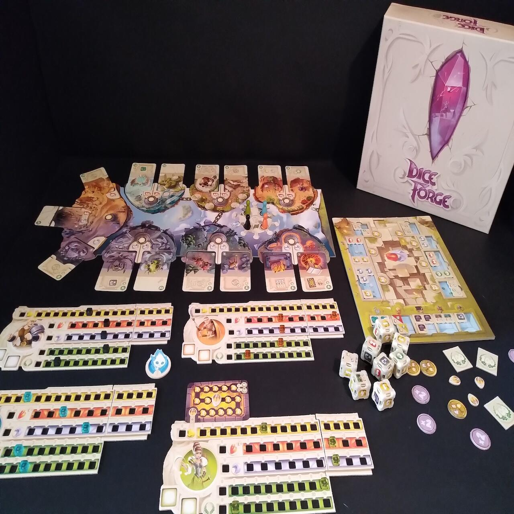
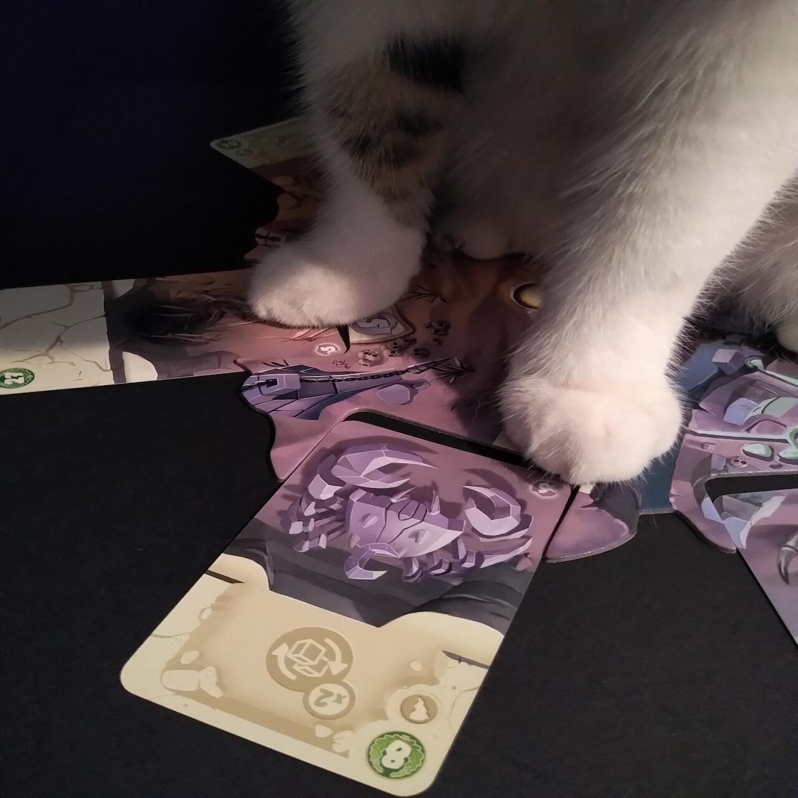

<Setting>

Sulle Isole Celestiali gli dèi vivono circondati da una quieta perfezione, si annoiano e trascorrono il loro tempo guardando svogliatamente dall’alto le imprese dei mortali. 
Quattro eroi tra gli uomini, grazie al loro valore e alle loro imprese, attirano la loro attenzione, risvegliandoli dal loro millenario torpore. Ecco finalmente un’occasione di divertimento anche per gli dèi: stabilire chi tra questi eroi sia il più potente, attraverso un torneo di combattimenti a suon di tiri di dado.

 Sembra tutta una questione di fortuna… ma la vera fortuna è quella che si forgia grazie alle proprie capacità!

</Setting>

<Rules>

Il gioco si presenta come una matrioska di componenti, diversi tra loro ma tutti indispensabili al set up generale della partita. La preparazione iniziale consiste nella disposizione delle <strong>Isole Celestiali</strong> (tabellone e carte) e del <strong>Tempio</strong>  (in cui posizionare le facce dei dadi intercambiabili); ogni giocatore sarà poi dotato di una Plancia Eroe.
La partita è suddivisa in round, ciascuno dei quali comprende un turno attivo di ogni giocatore. 
Ogni turno è suddiviso in quattro fasi:
<ul>
<li><strong>Benedizione Divina</strong>: tutti i giocatori contemporaneamente lanciano i propri dadi e, in base al risultato ottenuto, aumentano l’indicatore delle risorse corrispondenti sulla propria Plancia Eroe. Le risorse possono essere: oro, frammenti di pietra solare, frammenti di pietra lunare, punti vittoria.</li>
<li><strong>Giocare carte</strong>: il giocatore di turno può applicare l’effetto di una o più carte in suo possesso.</li>
</ul>
Il giocatore di turno può effettuare un’azione tra:
<ul>
    <li>fare un’<strong>Offerta agli Dèi</strong>: spendere risorse oro per ottenere una faccia intercambiabile da sostituire immediatamente in un proprio dado</li>
    <li>compiere un’<strong>Impresa Eroica</strong>: spostarsi in una della Isole della plancia Isole Celestiali pagando la risorsa richiesta e ottenere la carta corrispondente.</li>
    <li><strong>Azione Extra</strong>: il giocatore attivo una volta per turno può spendere due risorse frammento di pietra solare per fare (o rifare) una delle due azioni sopra descritte.</li>
</ul>

 Quando tutti i giocatori hanno effettuato il proprio turno attivo termina il round in corso; alla fine dell’ultimo round la partita si conclude e si procede al conteggio dei punti vittoria.

</Rules>

<Feedback>

Primissimo punto a favore del gioco è la sistemazione dei componenti all’interno della scatola: i materiali sono tanti, ma tutto è splendidamente ordinato grazie all’organizer di plastica rigida, incluso nel gioco stesso. 
La varietà dei componenti implica un set up leggermente dispersivo e un po’ lungo, soprattutto alla prima partita. In base al numero di giocatori cambia l’allocamento delle carte sulla Plancia Isole Celestiali e delle facce dei dadi intercambiabili disponibili sulla Plancia Tempio. 
La costruzione dei dadi di partenza dei giocatori va effettuata seguendo i disegni all’interno del regolamento, cosa che non risulta intuiva né immediata (sarebbe stato più comodo un elenco delle facce da applicare). Viene fatta inoltre una distinzione - in realtà ininfluente ai fini del gioco - tra dado bianco e dado grigio: i due colori però sono talmente simili che si distinguono difficilmente. 
Sempre per quanto riguarda la costruzione dei dadi, non è semplice il meccanismo di sostituzione delle facce: utilizzando le proprie dita come leva è molto facile spezzarsi le unghie nel tentativo, mentre utilizzando la tecnica suggerita nel regolamento (ovvero far leva con una faccia intercambiabile) spesso si otterrà di far saltare verso l’alto la faccia tolta dal dado, creando certamente ilarità ma anche un po’ di confusione. 
La meccanica di sostituzione delle facce dei dadi, tuttavia, è decisamente interessante perché inserisce una componente strategica in un sistema basato unicamente sulla fortuna.

 
Il regolamento rimane snello e fornisce un compendio riassuntivo con la spiegazione
degli effetti delle varie carte, molto utile da consultare durante la partita.{" "}

 
Anche la grafica è decisamente gradevole, i colori hanno un forte impatto visivo
e in particolare è molto apprezzabile il fatto che l’illustrazione sulle carte sia
in continuità con l’illustrazione della Plancia Isole Celestiali nello spazio in
cui va ad inserirsi.{" "}

 
L’ambientazione, per quanto descritta nella prefazione del regolamento, è in realtà
abbastanza inconsistente e non incide sull’esperienza di gioco.{" "}

 Si tratta quindi di un gioco piacevole e leggero, basato più sulla costruzione personale che sull’interazione tra i giocatori e che reinventa il concetto di fortuna aggiungendo un pizzico di strategia gestionale.

</Feedback>

