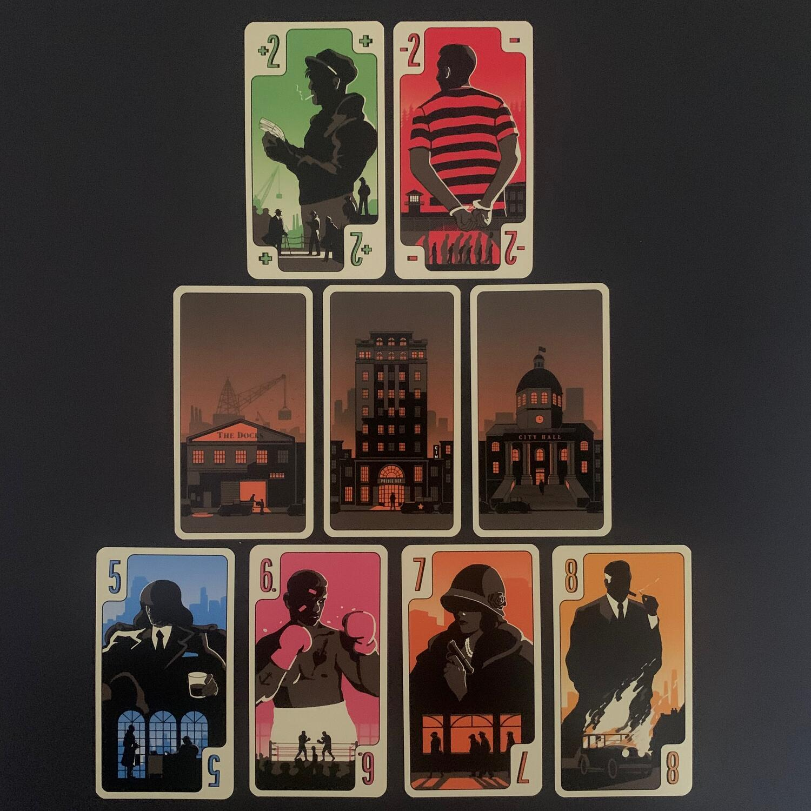
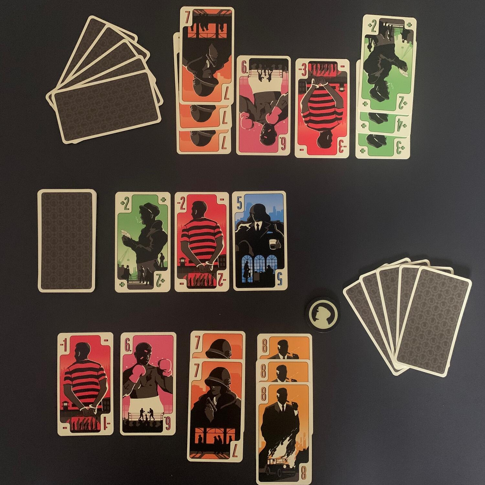

<Setting>

  A capo delle più grandi organizzazioni criminali della città, uomini e donne
  lottano per controllare i territori e ottenere consensi, cercando in tutti i
  modi di accrescere la propria influenza.{" "}
  <strong>    Il controllo del Distretto Noir, un'area centrale e altamente contesa,
    rimane la questione principale che farà la differenza nel dominio della
    città.</strong>

</Setting>

<Rules>

  District Noir si svolge in <strong>4 round</strong>.  
  All'inizio di ogni round, <strong>    ogni giocatore pesca 5 carte e dovrà svolgere 6 azioni</strong>: 5 per giocare le 5 carte e 1 per collezionare le ultime 5 carte giocate
  da entrambi i giocatori. Va da sé che, se un giocatore decide di raccogliere le
  5 carte dal tavolo come prima azione, poi dovrà effettuare 5 azioni per calare
  le carte.  
  Le carte di District Noir si dividono in 3 gruppi:  
  <ul>
    <li>      <strong>Carte Affiliati</strong>: Sono le carte che faranno punti
      solamente se il giocatore ne possiede più dell'avversario. Con la
      maggioranza dei 5, si faranno 5 punti, con quella da 6 se ne
      collezioneranno 6, e via così;</li>
    <li>      <strong>Carte Alleati e Traditori</strong>: Sono dei semplici punti da
      sommare algebricamente al totale raccolto con le carte supporto;</li>
    <li>      <strong>Carte Città</strong>: Se un giocatore le colleziona tutte e 3,
      vince immediatamente la partita.</li>
  </ul>
  Quando si sceglierà di ottenere le carte, queste{" "}
  <strong>verranno posizionate pubblicamente</strong> davanti a noi, in modo che
  tutti sappiano sempre la situazione delle prese.
   
  Una volta svolti i 4 round (e quindi avendo finito il mazzo di pesca){" "}
  <strong>si contano i punti</strong>: oltre ai punti generati dalle carte
  affiliati e dalle carte alleanza/traditori, bisogna sommare 5 per ogni set di
  5-6-7-8 collezionati.  
  Questo è tutto.

</Rules>

<Feedback>

  La varietà di giochi che si possono creare con il supporto carta mi ha sempre
  affascinato e mi affascina sempre di più.
   
  Ci troviamo davanti a un gioco <strong>semplicissimo</strong> da spiegare,
  facile da giocare… incredibilmente <strong>ansiogeno</strong> da
  padroneggiare.  
  Avete mai provato <Link to="/reviews/mindbug">Mindbug</Link>? Avete presente la
  sensazione che provate quando giocate una carta che vorreste tanto ma che prima
  dovete offrire su un piatto d'argento al vostro avversario? District Noir offre
  la stessa sensazione, ma molte, molte più volte. Ansia.  
  Tutto il gioco sta nel capire.  
  Sta nel capire <strong>quanto l'avversario vuole raccogliere</strong> le carte
  in tavola piuttosto che aspettare.
   
  Sta nel capire <strong>cosa giocare per forzargli la mano</strong> e fargli pensare
  che raccogliere in quel momento è la mossa migliore che possa fare, convinto che
  altrimenti raccogliereste voi sul suo passo… e invece avete in mano ancora delle
  carte capaci di farvi vincere la partita.
   
  Sta nel capire <strong>quando giocare le carte Tradimento</strong> per mettergli
  il bastone tra le ruote, senza farsi del male nel caso qualcosa non andasse proprio
  come previsto.
   
  Sta nell'entrare <strong>nella testa dell'avversario</strong>, facendolo perdere,
  al contempo, nei vostri pensieri.
   
  Un "giochino" di carte sì, ma uno nominato tra i finalisti del "as d'or", mica
  pizza e fichi.
   
  Le partite durano poco, ma sono davvero cariche, anche per il fatto che, a inizio
  partita, 3 carte segrete saranno scartate aggiungendo entropia a un gioco che,
  altrimenti, sarebbe a informazione totale.
   
  Se vi piacciono i giochi <strong>1vs1</strong>, se vi piacciono i giochi "easy
  to play but hard to master", se vi piace entrare nella testa dell'avversario leggendo
  il gioco che sta facendo e, soprattutto, se vi piace cercare di sviare l'altro
  con un po' di bluff… sapete assolutamente cosa comprare.

</Feedback>

