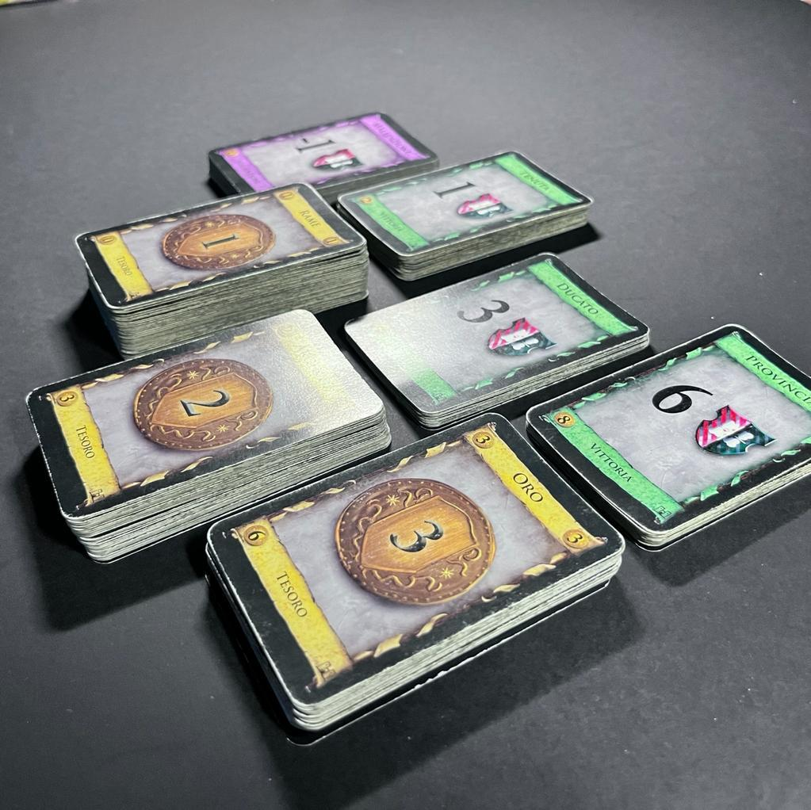
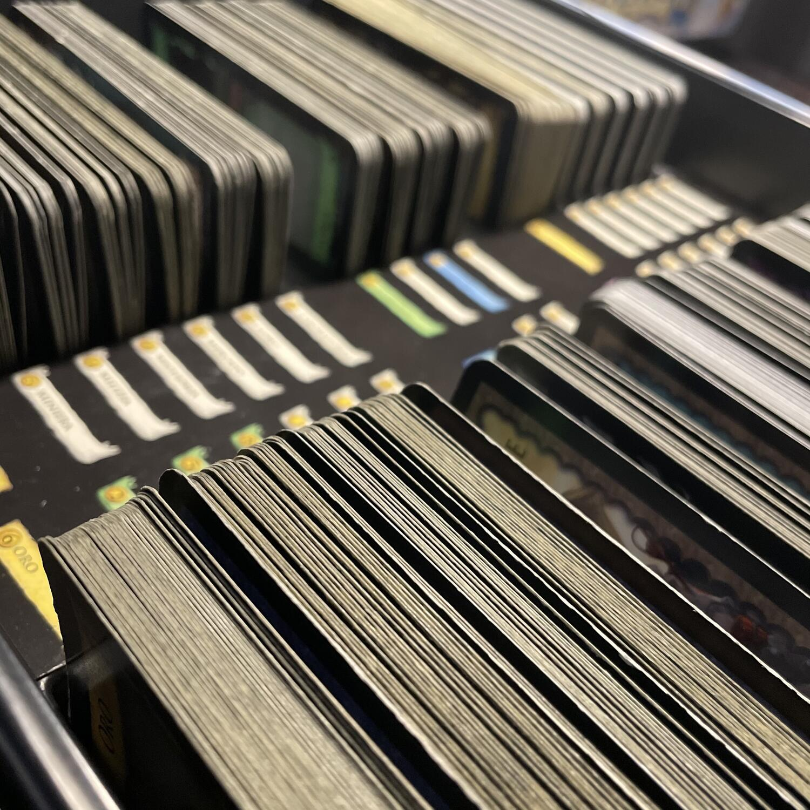

<Setting>

  "
  <em>    Siete il signore di un piccolo regno appena succeduto al trono e partendo da
    quattro case (in realtà 3 Tenute) e da poche monete (7 Rami per la
    precisione) cercherete di espandere il vostro Dominio(n) fino ai confini
    della terra</em>  ". Dominion ha un’ambientazione <strong>medioevale/fantasy</strong> classica, in
  cui le carte, ben illustrate, ci mostrano di volta in volta chi potremo accogliere
  nel nostro dominio o quali edifici potremo costruire.
   

</Setting>

<Rules>

  In ogni partita di Dominion non si useranno tutte le carte presenti nella
  scatola, ma solo 10 mazzi scelti di volta in volta fra i 26 disponibili. Ogni
  giocatore parte con un mazzetto di 10 carte, 7 monete di valore d’acquisto
  pari a 1 (monete di Rame) e 3 carte vittoria di valore 1 (Tenute). Fatto
  questo, ogni giocatore pesca 5 carte dal proprio mazzo, si decide il primo
  giocatore e si è pronti per giocare!  
  I giocatori si alternano facendo il proprio turno e poi passando la mano fino alla
  fine della partita. Durante il proprio turno ogni giocatore farà 4 cose:
   
  <ul>
    <li>      <strong>giocare al massimo una azione</strong>: all'inizio non sono presenti carte Azione nel mazzo ma si possono acquistare dai mazzetti in gioco; la loro risoluzione influenzerà notevolmente il turno, permettendo di pescare carte, effettuare altre azioni e addirittura modificare i mazzi o le mani degli avversari</li>
    <li>      <strong>giocare tutte le carte tesoro in mano</strong></li>
    <li>      <strong>fare un singolo acquisto</strong>: una volta sommati tutti i tesori e gli eventuali bonus, il giocatore sceglie una carta dai vari mazzetti in gioco dal valore massimo dei soldi a sua disposizione e la colloca nei propri scarti</li>
    <li>      <strong>scartare</strong>: il giocatore scarta tutte le carte in mano (cercate quindi di giocarle tutte), tutte le carte in gioco e pesca 5 nuove carte; nel caso in cui nel proprio mazzo non ce ne fossero abbastanza, pesca quello che può e poi i suoi scarti (mescolati) diventano il suo nuovo mazzo e termina la pescata</li>
  </ul>
       
      Questa semplice meccanica, che ha creato il genere deck-building, permette
      lo svilupparsi della strategia che pian piano permetterà a ogni giocatore
      di comprare carte sempre più potenti e costose cercando di accaparrarsi la
      maggior parte delle province (le carte dal valore più alto) prima che la
      partita termini. Quando si esauriscono tre mazzetti in gioco oppure il
      mazzetto delle province la partita finisce e il giocatore con più punti
      nel mazzo vince!

</Rules>

<Feedback>

  Dimentichiamoci per un istante di quello che, più o meno, dice il trafiletto
  introduttivo del gioco riportato in apertura perché, a dire la verità, non è
  che la spinta narrativa si senta molto (o, meglio, si sente a sprazzi, a
  seconda delle carte in gioco): la verità è che l’ambientazione, più o meno
  sentita che sia, non riduce assolutamente la godibilità del titolo.  
  Parliamo invece del fatto che Dominion è un gioco da molti sottovalutato, quando
  invece dovremmo rilevare che è sicuramente uno dei migliori deck building in circolazione:
  la grande variabilità della singola partita, unita a un flusso di gioco semplice,
  lineare e veloce (le partite durano al massimo un'ora) e alla buona profondità
  strategica, non ostacolata dal fatto che si tratta un gioco per nulla banale, lo
  rendono ideale per quasi qualsiasi pubblico. Ogni partita è piena di decisioni
  da prendere: su che carte puntare? in che ordine giocarle? quando smettere di aumentare
  la capacità di generare soldi del proprio mazzo per comprare i punti vittoria?
   
  L'interazione indiretta e il fatto che tutti siano consapevoli delle scelte degli
  altri giocatori lo rendono tranquillo da apprendere, senza che una mossa avventata
  butti fuori il giocatore inesperto dalla partita.
   
  Ma allora perché è sottovalutato? Perché è un gioco che richiede una discreta conoscenza
  per essere apprezzato: la mia prima partita è stata con altri dilettanti ed è stata
  una noia mortale! Sembrava che tutto dipendesse dalla pescata, si tendeva ad acquistare
  sempre la carta più costosa e a passare la partita sperando che in quelle 5 maledette
  carte di ogni mano si formasse una combinazione decente.
   
  Una considerazione importante va allora fatta sull'importanza dell'esperienza:
  le combinazioni sono tante e spesso conoscerle in anticipo permette di impostare
  strategie che difficilmente un giocatore alle prime armi vedrà. Inoltre, è sempre
  bene sapere qualche regola di gioco “non scritta” se siete giocatori inesperti:
  ad esempio, non comprare praticamente mai le monete di rame oppure comprare solo
  azioni che potete giocare (e fidatevi: sono meno di quelle che pensate di poter
  comprare). Questo vi eviterà da una parte di giocare una partita senza strategia
  in cui, per la maggior parte, le vostre carte azione si impacceranno vicendevolmente,
  dandovi l’impressione che sia totalmente il caso a determinare il vostro turno
  e non voi; dall’altra, non vi farà sembrare un miraggio arrivare a comprare una
  carta di valore 6 o un’utopia comprarne una di valore 8. Se volete approcciarvi
  a questo gioco ma non c’è nessuno “esperto” nella vostra comunità di gioco un buon
  punto di partenza è questo sito (in inglese): <a href="https://dominionstrategy.com/" target="_blank">https://dominionstrategy.com/</a>. Qui troverete una grande quantità di articoli che spiegano tutte le strategie
  di base (Big Money, Slog, Combo, Engine o Rush) con articoli e video per tutti
  i gusti che possono portare il vostro gioco a tutto un altro livello.
   
  In sintesi, Dominion è un gioco veloce, semplice, ma con una grande profondità
  strategica. Il setup variabile conferisce una grande variabilità di partita in
  partita, resa praticamente infinita dalle numerose espansioni! Vedrete che, una
  volta capito come funziona, una partita tirerà l’altra in una ricerca continua
  di capire la migliore strategia tenendo conto delle carte a disposizione, del numero
  di giocatori, della vostra posizione al tavolo e, ovviamente, di quello che i vostri
  avversari stanno facendo. E non vi preoccupate se vi trovate a pagare le conseguenze
  di un piano non eccellente: lasciate godere al vostro avversario questo momento
  di gloria, perché nella prossima partita sarete certo voi a cantare vittoria!

</Feedback>

