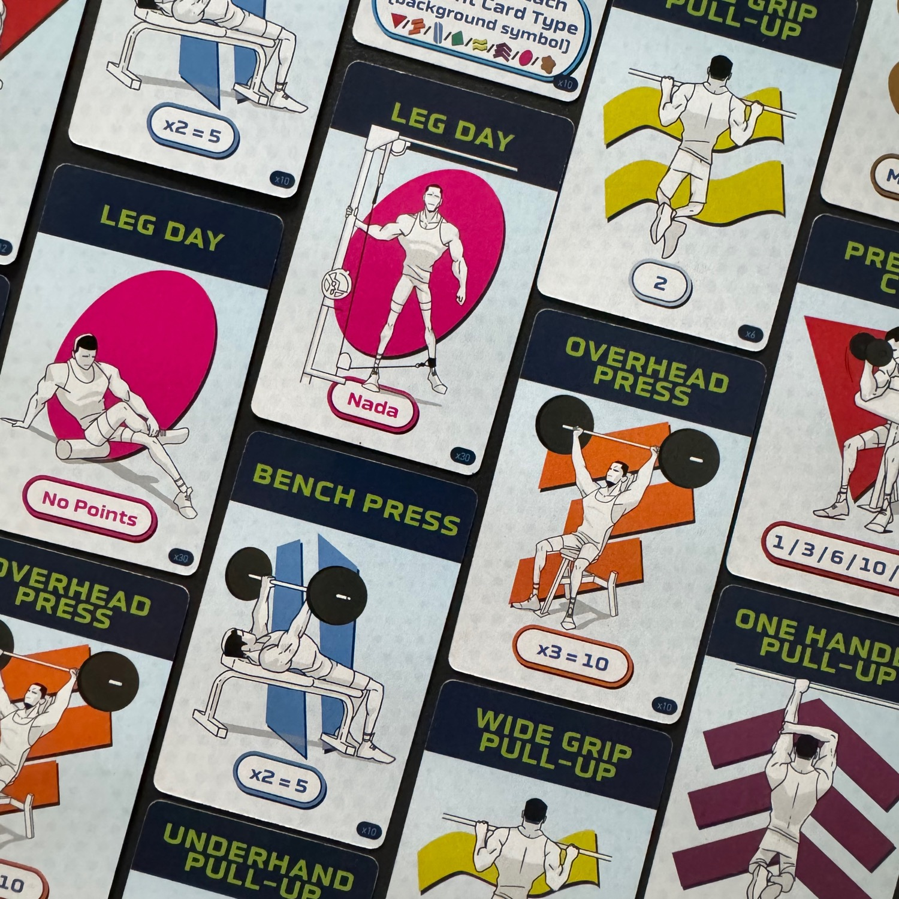
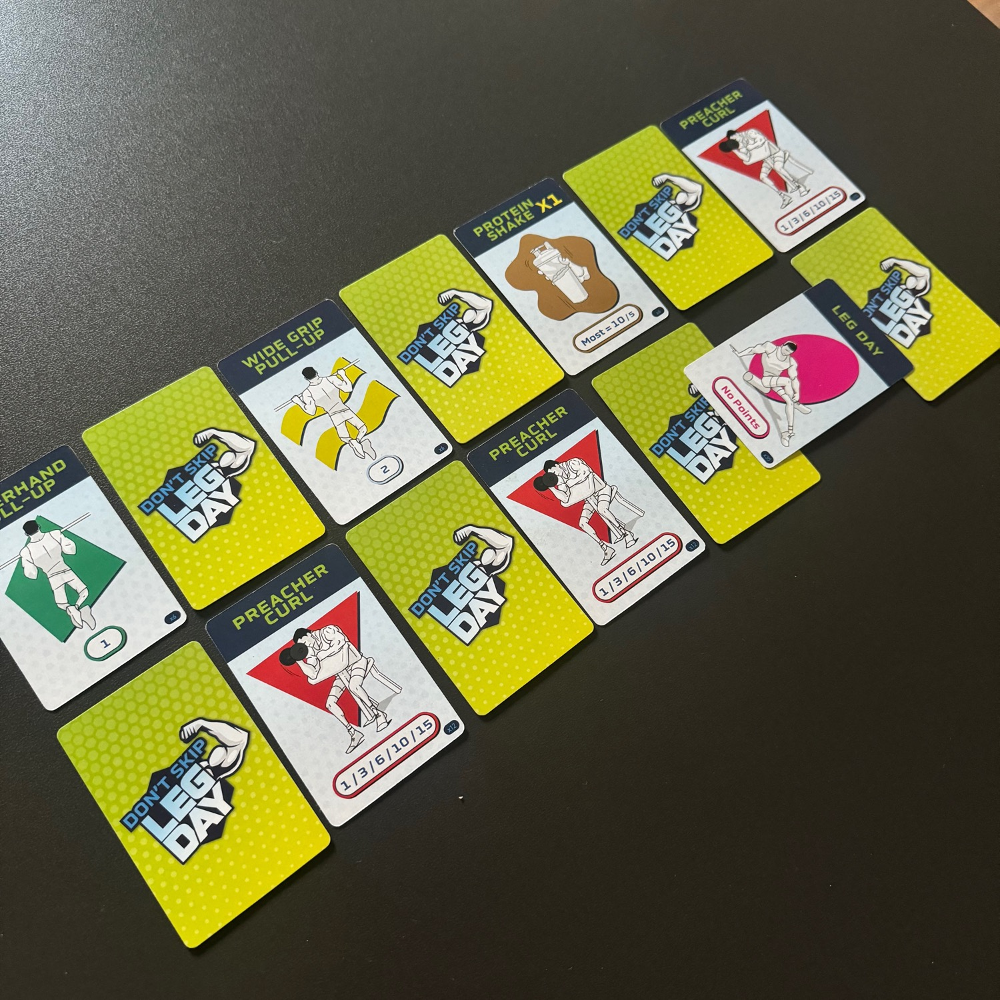
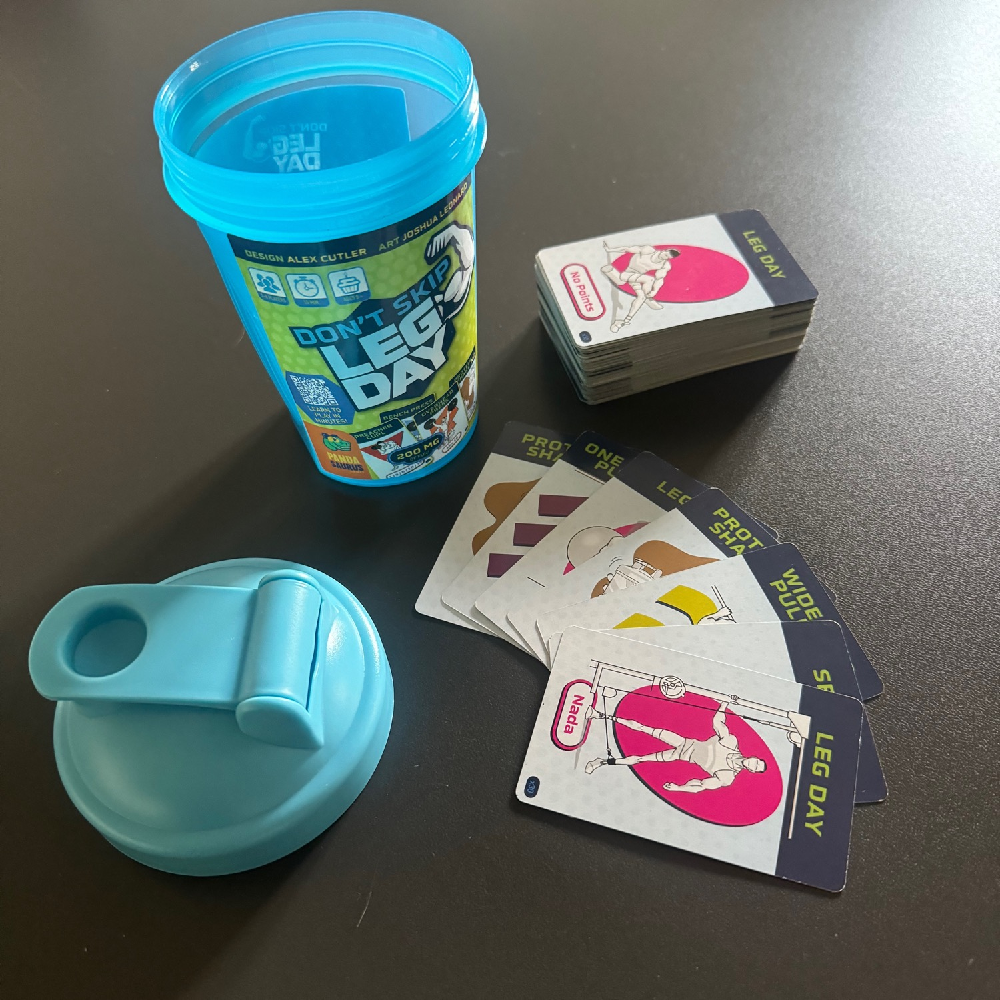

<Setting>

  Bro! mancano solo due settimane alla competizione: è il momento di fare sul serio per diventare ancora più grossi! 
Bro! Devi maxare i tuoi allenamenti se vuoi flexare i tuoi muscoli sul palco. Qualunque cosa tu faccia, bro, non dimenticarti di fare gambe: a nessuno piacciono le gambe di pollo, bro. 
No pain, no gain!

</Setting>

<Rules>

 Il gioco si svolge in due settimane, composte da sette giorni l'una. Come in <Link to="/reviews/7wonders/">7 Wonders</Link>, ogni turno tutti i giocatori scelgono una carta dalla loro mano da tenere e, poi, passano il resto della mano al giocatore successivo. La carta scelta viene giocata, alternando allenamenti pubblici ad allenamenti privati. Alla fine della prima settimana, verranno distribuite nuovamente delle carte allenamento e si procederà come nella prima settimana.  
Alla fine della partita, ogni giocatore avrà davanti a sé 7 carte pubbliche e 7 carte a faccia in giù.  
Si rivelano tutte le carte giocate e si contano i punti come descritto su ogni tipologia di carta; da questi punti si sottraggono gli allenamenti di gambe fatti pubblicamente (precedentemente conteggiati). Tuttavia, chi ha fatto meno gambe viene immediatamente escluso dal conteggio dei punti; tra gli altri rimasti, chi ha fatto più punti è dichiarato il gymbro più grosso di sempre!

</Rules>

<Feedback>

  Don't Skip Leg Day, per gli amici "GymBro", è un gioco carino che riesce a portare al tavolo <strong>persone che non ti aspetteresti</strong>, complice il fatto che le partite durano davvero poco e che la spiegazione viene smarcata in 3 minuti.  
GymBro ricorda molto <em>Sushi go</em>!, con l'aggiunta dell'informazione nascosta dovuta agli allenamenti privati.  
Il punto di forza di questo gioco è anche, senza ombra di dubbio, la sua più grande debolezza: <strong>il tema</strong>, talmente particolare da portare i veri GymBro a sedersi e a giocare ma, al contempo, non riesce ad attirare molti gamer. Ho fatto provare questo gioco a molti tavoli e ho visto comportamenti tanto diversi: molti si gasano, altri iniziano a sollevare manubri invisibili o a mettersi in posizioni davvero strane tra un turno e l'altro. In ogni caso, il gioco "si fa giocare" <strong>ma, dopo 2-3 partite, è come guardare un film già visto</strong>. 
Se siete dei veri GymBro, se portate giochi in spiaggia e se vi piace portare al tavolo gente che non sia solita giocare, questo gioco potrebbe essere molto interessante.

</Feedback>

