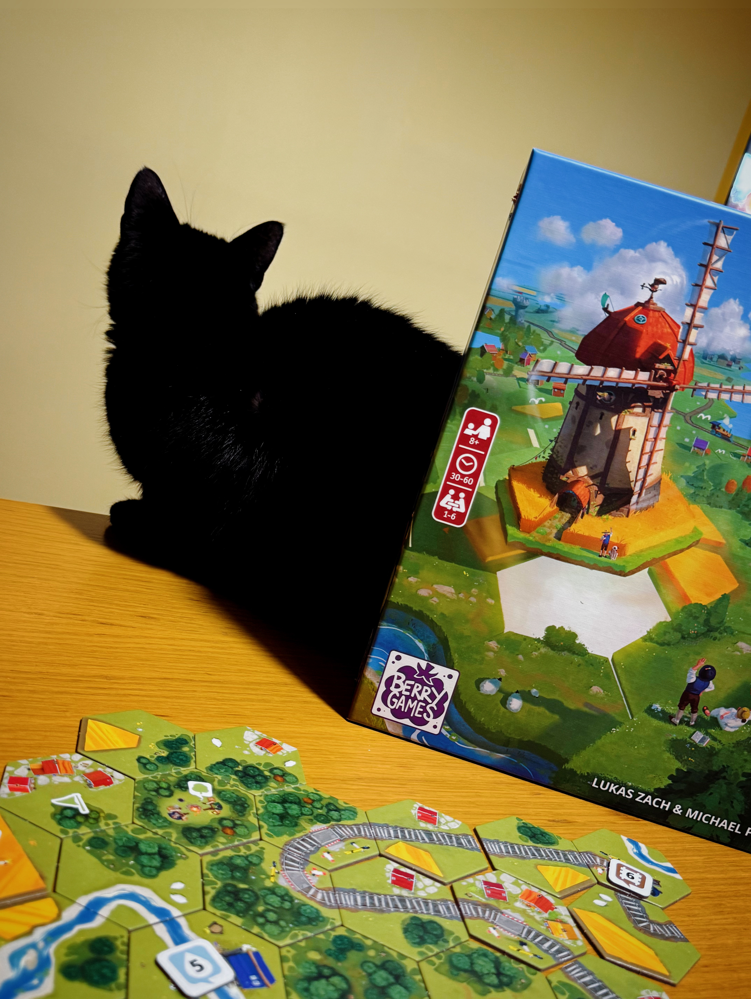
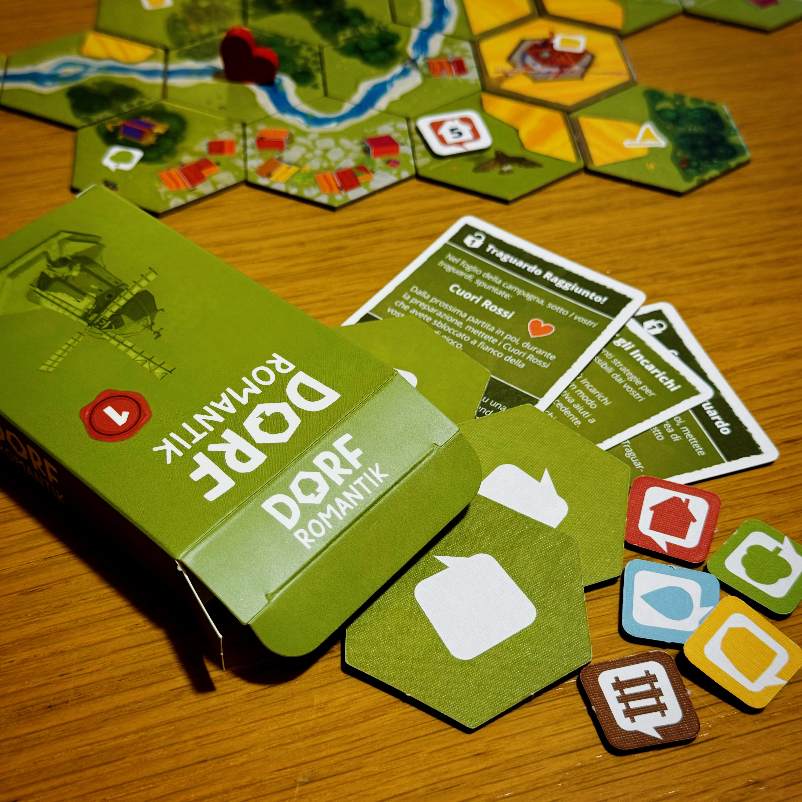
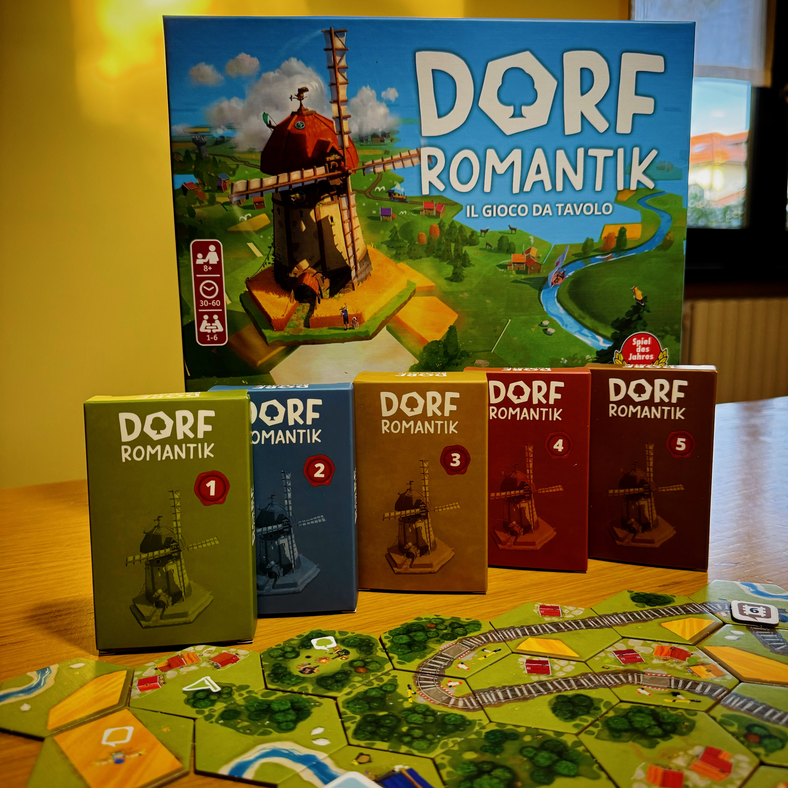

<Setting>

  “<strong>Dorf</strong>”: che si voglia intendere come il comune svizzero nel Canton Zurigo o con la sua connotazione grammaticale di nome maschile singolare tedesco traducibile con “villaggio” (molto affine a quella del cugino svedese “Torp”, usato per indicare le case isolate abitate o piccoli casali attorniati da un terreno coltivato), questo termine ci permette già di percepire l’ambientazione del gioco! 
I giocatori verranno trasportati in un paesaggio verdeggiante: io me lo immagino collinare, con <strong>fiumi increspati</strong>, <strong>foreste fruscianti</strong>, <strong>campi di grano che ondeggiano al vento</strong> e qua e là un <strong>piccolo villaggio</strong>. Questo è Dorfromantik!  
&nbsp; 

</Setting>

<Rules>

 Titolo dalle poche regole, in Dorfromantik i giocatori dovranno collaborare per posare nel miglior modo possibile le diverse tessere esagonali, al fine di<strong> creare un bellissimo paesaggio</strong> e <strong>soddisfare i desideri della popolazione</strong>. 
Le tessere possono essere di due tipologie: le <strong>Tessere Paesaggio</strong> propriamente dette forniranno gli elementi naturali ed architettonici per formare il panorama, mentre le <strong>Tessere Incarico</strong> indicheranno ai giocatori gli obiettivi da raggiungere per ottenere punti. 
Questi <strong>obiettivi</strong> sono abbinati ai cinque elementi raffigurati sulle tessere (fiumi, case, ferrovie, campi e foreste) e vengono soddisfatti tramite un numero di <strong>tessere confinanti aventi lo stesso elemento</strong>. 
Svelata una Tessera Incarico, si rivelerà anche un <strong>Token Punteggio</strong> in base all’elemento presente sulla tessera, che verrà posizionato su di essa come memorandum e indicherà il numero di tessere <strong>necessarie</strong> per raggiungere l’obbiettivo, nonché i punti che l’obiettivo farà fare ai giocatori se soddisfatto; una volta concluso, verrà poi messo da parte per il conteggio finale. 
Punti ulteriori possono esser fatti in base all’<strong>estensione più ampia di un elemento</strong> sulla mappa: se si tratta di campi, case o foreste devono avere inizio dalla tessera con la<strong> bandierina</strong> e dovranno esser necessariamente <strong>chiusi</strong>; se si tratta di fiumi e ferrovie invece questo non sarà necessario. 
Durante la partita i giocatori potranno sbizzarrirsi per cercare il piazzamento migliore per ogni tessera ricordandosi giusto due regole: 
<ul>
<li>fiumi e ferrovie non potranno mai confinare con un altro elemento, neanche il semplice prato</li>
<li>ogni tessera dovrà essere posizionata perfettamente adiacente ad una già esistente</li>
</ul>
La partita termina con il termine delle Tessere Paesaggio. 
&nbsp; 

</Rules>

<Feedback>

  Già famosissimo nella sua versione videoludica, questo titolo di <strong>strategia</strong> e <strong>rompicapo</strong> ha entusiasmato presto la comunità anche nella sua versione gioco da tavolo per famiglie, guadagnandosi oltretutto il <strong>titolo Spiel des Jares</strong> proprio l’anno scorso! Beh, se si è guadagnato uno dei premi più ambiti del mondo ludico un motivo ci sarà ed io non posso che esser d’accordo! 
Salvo una frase del regolamento che non esprime in maniera chiarissima quante Tessere Incarico posizionare nei primi tre turni, le regole sono ben esposte e molto semplici, rendendo il gioco un <strong>ottimo introduttivo</strong>, perfetto per tutta la famiglia e adatto anche ai più navigati se si vuole passare una serata tranquilla. 
Il gameplay è poi lineare e quasi ripetitivo, ma questo non toglie profondità al gioco!  
È indubbia l’<strong>alta componente aleatoria</strong>, data dalla scelta casuale delle Tessere e dei Token, ma il gioco lascia comunque ampio spazio ai giocatori per imbastire una strategia poiché sarà importantissimo, nonché essenziale, organizzare gli ambienti sulla mappa in funzione dei Token Punteggio ancora da rivelare, così da poter concludere gli obiettivi nel momento stesso in cui vengono piazzati o poco dopo. 
Inoltre, un parametro che non trovo mai banale e che penso sia indicativo per definire la qualità di un titolo è la voglia di rigiocarlo che ti lascia quando perdi! Se, nonostante la sconfitta, il giocatore non è frustrato da essa e ha voglia di mettersi alla prova di nuovo, allora il gioco è valido! Ecco, Dorfromantik in questo ha fatto centro! 
Ma vogliamo lodarlo ancora un po’ se non siete del tutto convinti? Si può giocare anche in <strong>solitaria</strong> e, rullo di tamburi, addirittura a <strong>campagna</strong>! Infatti, nella scatola possiamo trovare dei fogli appositi sui quali segnare i punti di partita in partita, progredire nella carriera fino a diventare imperatori e sbloccare <strong>contenuti extra</strong> e <strong>regole aggiuntive</strong> che sono teneramente racchiusi in cinque scatoline. 
Insomma, <strong>rigiocabilità</strong> e <strong>variabilità</strong> sono garantite! 
Quindi cosa aspettate?! Siete ancora in tempo per farvelo recapitare a Natale!!  
&nbsp; 

</Feedback>

