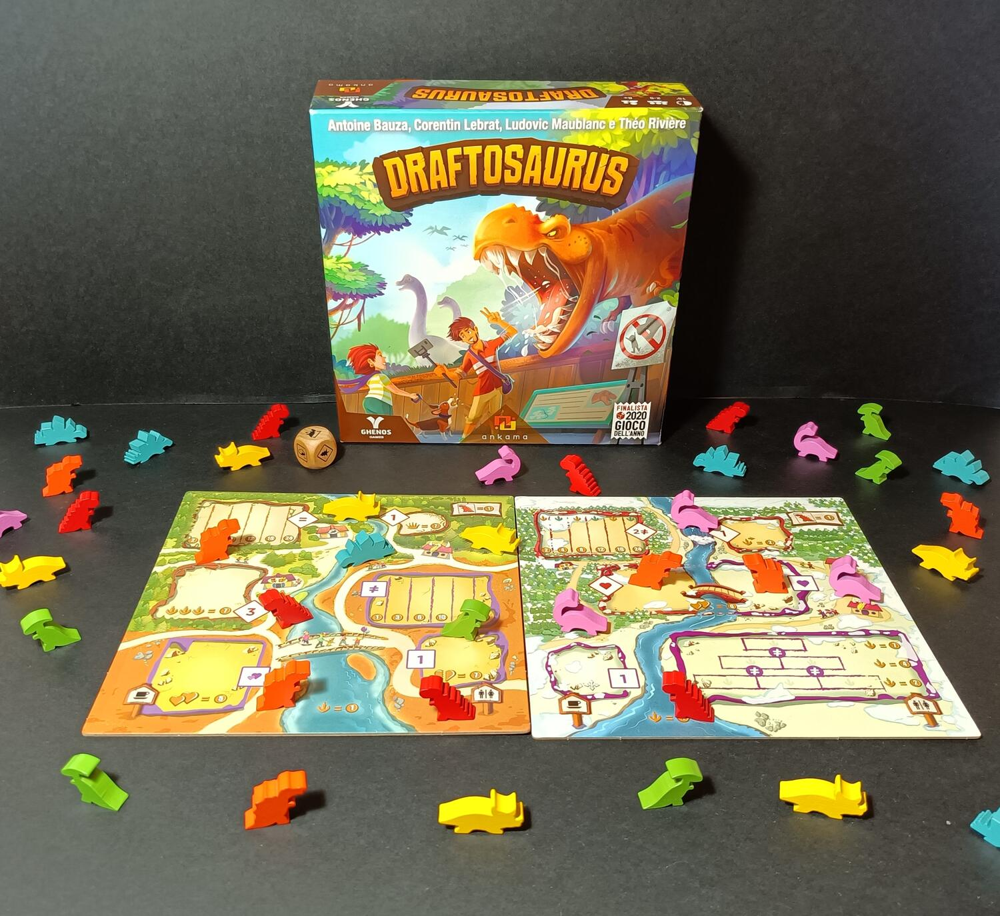
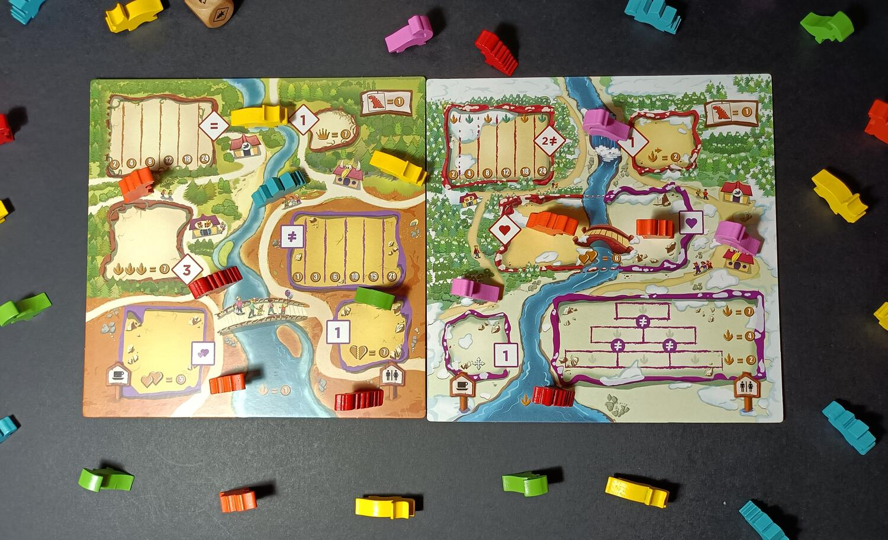

<Setting>

  Benvenuti a Draftosaurus!
   
  Siete pronti a costruire il vostro fantastico parco a tema? Riuscirete a
  gestire le varie specie di dinosauri e accogliere il maggior numero di
  visitatori? L'impresa non sarà affatto semplice; solo il più bravo tra di voi
  riuscirà a riempire i recinti con i dinosauri più affini e ottenere la
  vittoria. Ma non perdiamo altro tempo, immergiamoci nel fantastico mondo dei
  dinosauri.

</Setting>

<Rules>

  In Draftosaurus dovrete gestire i dinosauri che di volta in volta avrete a
  disposizione e posizionarli nei recinti per ottenere più punti a fine partita.
  Per iniziare, ogni giocatore riceverà <strong>6 dinosauri</strong> presi
  casualmente dal sacchetto e ovviamente una plancia personale. Essa rappresenta
  il vostro <strong>Zoo</strong>, costituito da vari recinti pronti ad essere
  riempiti. Ma non correte, perché ogni recinto potrà essere riempito, ma solo
  seguendo alcune regole, e inoltre vi farà ottenere punti vittoria in maniera
  diversa. Starà a voi gestire i dinosauri e posizionarli nelle abitazioni
  migliori per il vostro grandioso parco a tema. Come fa intuire anche la
  parola, <strong>Draftosaurus</strong>, si basa sulla meccanica del draft.
  Infatti, ogni giocatore, in contemporanea, dovrà scegliere un dinosauro dalla
  propria mano, posizionarlo in un recinto e passare i restanti al giocatore a
  fianco. <strong>Fate però attenzione!</strong> Non solo ogni recinto avrà
  delle limitazioni di riempimento, ma ogni turno il giocatore attivo dovrà
  lanciare un dado, che darà ulteriori limitazioni al posizionamento.
   
  Una volta posizionati 6 dinosauri il Round termina e inizia il secondo e
  ultimo Round in cui i giocatori dovranno posizionare nuovamente 6 dinosauri
  ciascuno.
   
  Alla fine di quest'ultimo la partita termina, si contano i punti dati da ogni
  recinto e il giocatore che ne ha di più vince.

</Rules>

<Feedback>

  Draftosaurus è davvero un bel gioco. Un party game con i fiocchi, sia per la
  componentistica, davvero colorata e simpatica, ma anche dal gameplay semplice
  e intuitivo seppur con un'ottima profondità strategica. L'interazione non è
  altissima, ma comunque avremo modo di ostacolare i nostri avversari e inoltre,
  superato un certo livello di esperienza, osservare le mosse degli altri sarà
  un fattore davvero importante per arrivare alla vittoria. La longevità è data
  dalla casualità delle partite, inoltre è presente anche{" "}
  <strong>un secondo lato della plancia</strong>, con recinti leggermente più
  complicati, quindi, su questo aspetto non possiamo lamentarci. Ovviamente il
  fattore fortuna è sempre presente, ma comunque per la tipologia di gioco e per
  la sua rapidità non darà così tanto fastidio. La scalabilità è ottima con
  qualsiasi configurazione di giocatori poiché andremo ad effettuare ogni turno
  in contemporanea.
   
  Che dire, Draftosaurus è davvero bello. Un titolo che consiglio caldamente a
  ogni tipologia di giocatore, un <strong>chiudi</strong> serata snello, rapido,
  ma che comunque vi terrà incollati alla sedia per tutta la partita grazie
  anche ad un'ottima componente strategica. Promosso a pieni voti.

</Feedback>

