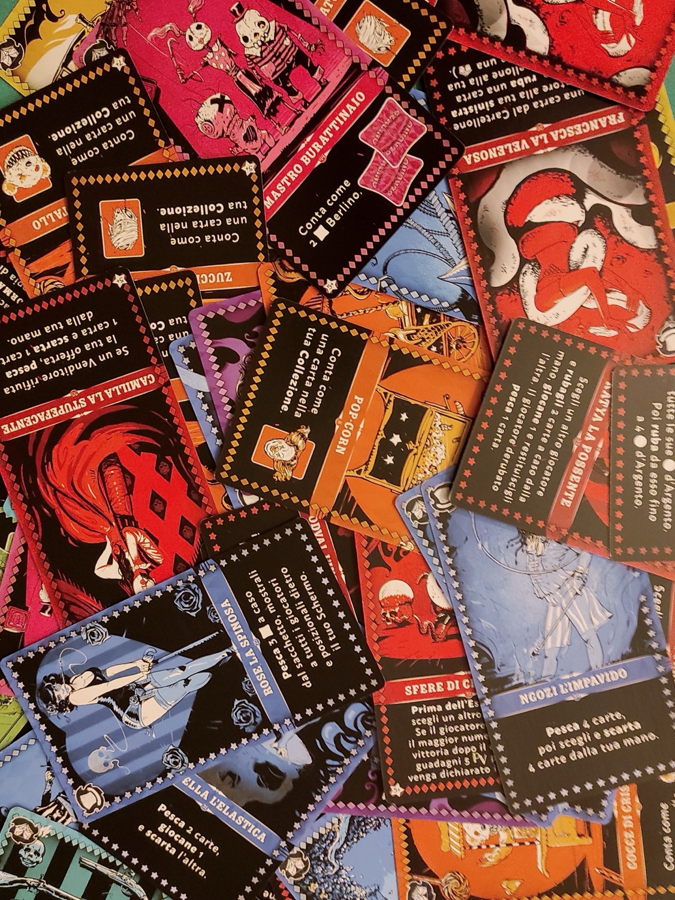
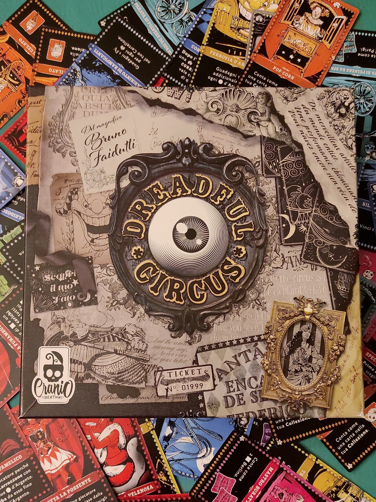
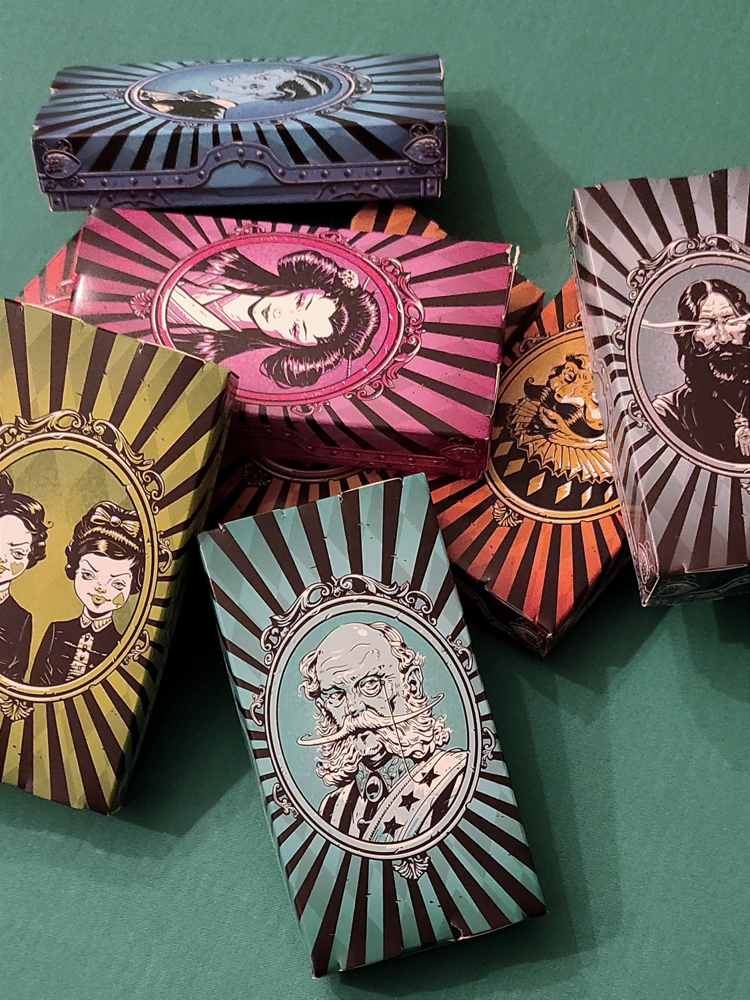

<Setting>

  Qualcosa di malvagio è arrivato in città. 
  Nel cuore della notte <strong>un circo sinistro</strong> ha messo le tende e un misto di paura ed eccitazione pervade l’animo dei cittadini. I giocatori assumeranno il ruolo di direttori di circo che avranno l’obiettivo di mettere in scena gli spettacoli più memorabili. Riuscirete ad accaparrarvi le attrazioni migliori e più accattivanti per poter vincere? 
  DREADFUL CIRCUS è un gioco di carte basato sulla meccanica di set-collection e bluff da 4 a 8 giocatori, con una durata complessiva di 30-45 minuti.

</Setting>

<Rules>

  Ogni giocatore sceglie un colore e il relativo schermo e carrozzone (una scatolina di cartone).  
  Abbiamo, inoltre, le Carte Circo (che si dividono in Attrazione – con il simbolo <em>tendone</em> – ed Esibizione – con il simbolo <em>cappello</em>), le Monete e i Contratti: questi ultimi verranno nascosti dietro lo schermo e serviranno per negoziare l’acquisto delle carte d’interesse da comprare dagli altri banditori. Infatti, le carte ricevute (variabili in base al numero dei giocatori) non potranno MAI essere giocate a proprio favore, ad eccezione del primo e dell’ultimo Round, durante i quali, ognuno potrà scegliere e posizionare davanti a sé (dalla propria mano) una carta Attrazione visibile agli altri giocatori. 
  Il gioco si svolge in diversi Round, ciascuno dei quali composto dai seguenti passi: 
  <ol>
    <li>Il Venditore mette in “vendita” una carta Circo dalla propria mano, al centro dell’area di Gioco. Nelle partite fino a 4 giocatori c’è un solo Venditore, nelle partite fino a 8, invece, ci saranno 2 Venditori.</li>
    <li>Ogni giocatore, segretamente, ovvero dietro il proprio schermo, collocherà un numero qualsiasi di Monete e/o Contratti nel proprio Carrozzone e lo offrirà per una delle carte messe in vendita. Il Venditore di turno non può proporre offerte per la propria carta.</li>
    <li>Quando tutte le offerte sono state fatte, il Venditore prende un Carrozzone a sua scelta e ne controlla l’offerta. Qualora decidesse di accettarla, mette il contenuto (senza farsi vedere) dietro il proprio schermo, mentre invece se rifiuta l’offerta restituisce il carrozzone al proprietario e continua scegliendo un altro Carrozzone.</li>
    <li>Una volta finite le Vendite si attiveranno le carte da parte di chi le ha acquistate. Queste ultime hanno vari colori ed effetti: alcune ci permetteranno di accumulare punti a fine partita, altre intralceranno gli avversari, per esempio, rubando loro carte/contratti/monete, altre ancora permetteranno ai giocatori di sostituire le carte che hanno in mano o pescare nuovi contratti.</li>
  </ol>
  La partita termina quando ad ogni giocatore rimangono in mano 3 carte Circo, se ne gioca una nel proprio Display e si passa al calcolo del Punteggio Finale dato dalle Monete, dai Set e Maggioranze di Contratti e dalle Carte.

</Rules>

<Feedback>

  <strong>Bruno Faidutti</strong> (<Link to='/reviews/citadels/'>Citadels</Link>, tra le sue opere più conosciute) porta un gioco di Bluff, contrattazione e sgambetti, dove l’importanza di <strong>comunicare</strong> è essenziale. Al tavolo <strong>si creerà l’atmosfera da vero mercato</strong>, ma saranno i compratori a dover convincere il Venditore! Il gioco dà sicuramente il meglio con gruppi affiatati (c’è forte interazione) . 
  Per quanto riguarda il regolamento, è molto chiaro e ricco di esempi. La componentistica è in linea con il prodotto; <strong>l’unico appunto</strong> va fatto alle scatoline, di cartoncino leggero, che saranno spesso maneggiate, aperte, chiuse, passate di mano e inevitabilmente tenderanno a logorarsi con il tempo. Le carte hanno illustrazioni molto evocative e colori sgargianti, e nonostante tutto <strong>non ci hanno fatto sentire molto l’ambientazione</strong>. Il gioco è veloce, non ci sono tempi morti e pensiamo che la configurazione con due venditori, quindi da 5 giocatori  in su, sia la migliore: in primo luogo perché, nel caso di un solo venditore, quest’ultimo non partecipa alle offerte; in secondo luogo, avendo due carte in vendita si ha la possibilità di scegliere la carta più congeniale ad un’eventuale strategia. È molto interessante il fatto che le carte che si hanno in mano saranno quelle che si venderanno agli altri giocatori, quindi si dovrà riuscire ad allettare gli altri vendendo le carta al momento giusto per cercare di massimizzare il guadagno.  
  Tirando le somme, il gioco <strong>ci è piaciuto ma con qualche riserva</strong>. Adatto per le serate spensierate e caciarone, da intavolare con <strong>gruppi numerosi e disposti a mettersi in gioco</strong>; chi invece è avvezzo ai giochi da tavolo lo troverà poco interessante, a causa della poca profondità.

</Feedback>

