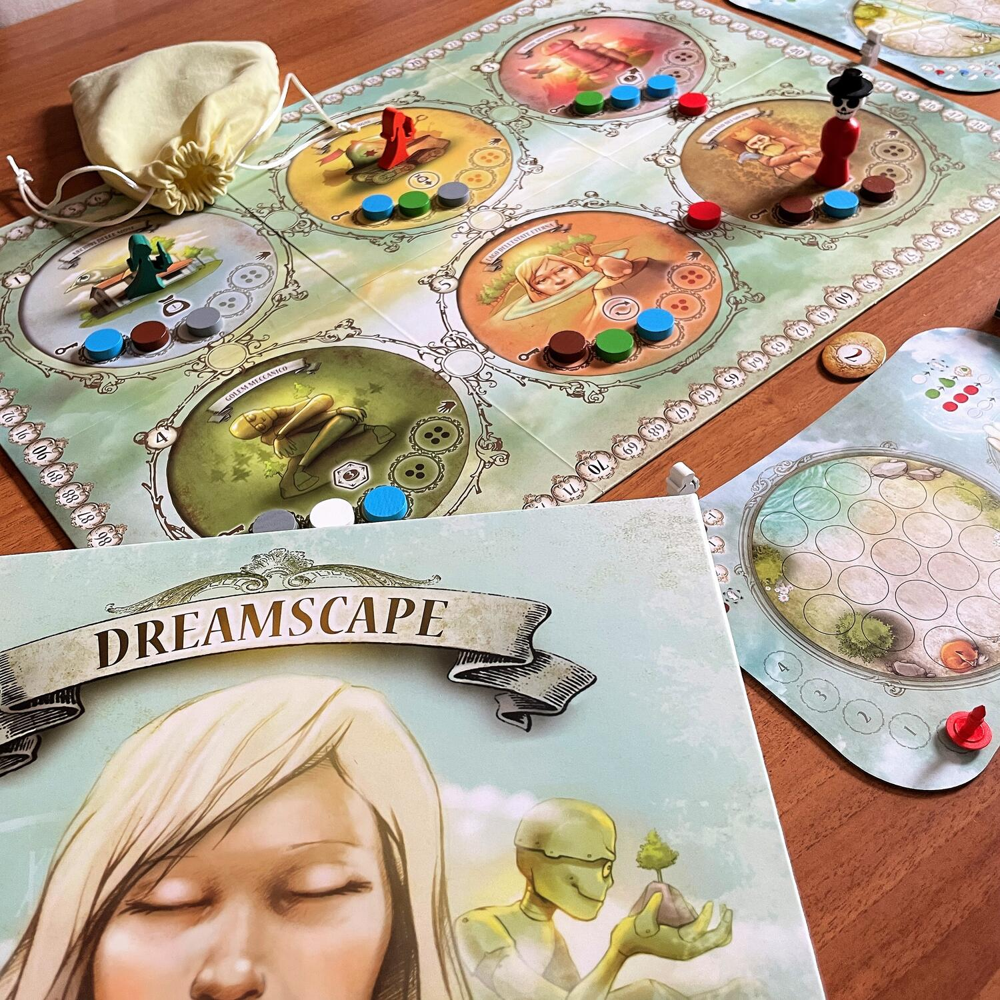
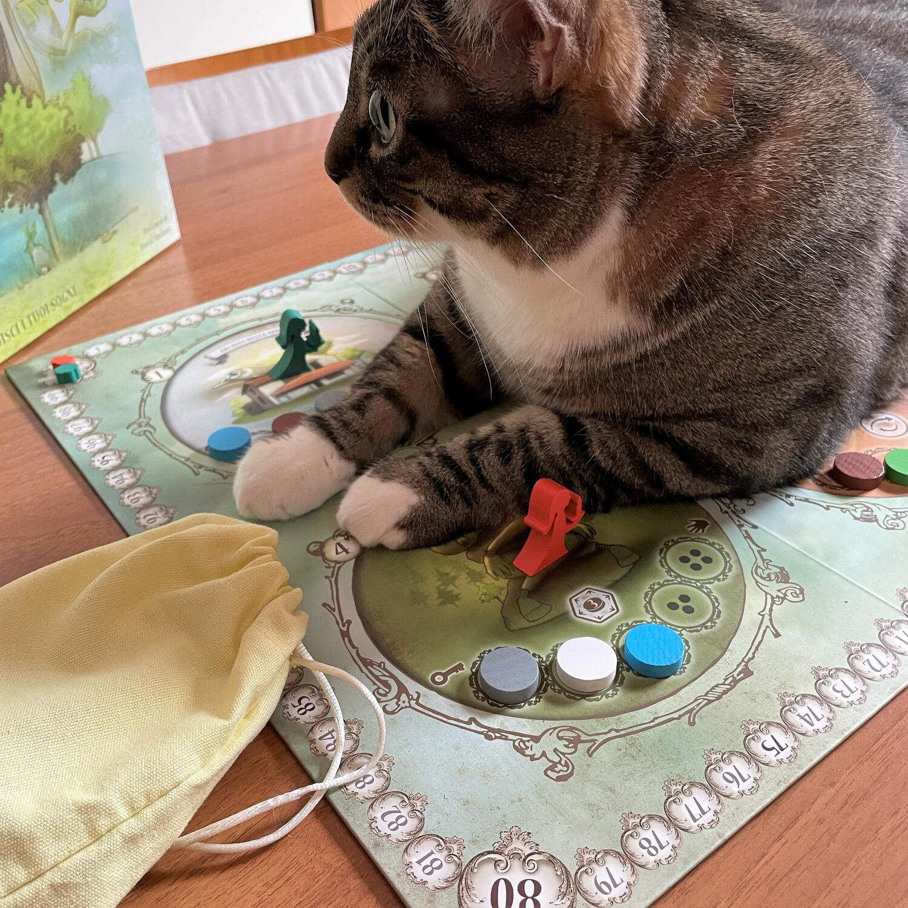

<Setting>

  In <em>Dreamscape </em>sarete dei “costruttori di sogni” e dovrete ricreare
  dei Paesaggi fantastici con i <em>Frammenti di Sogno</em> che rappresentano
  montagne da scalare, placidi ruscelli, folti alberi sotto cui riposare,
  isolette paradisiache e molto altro. Ma fate attenzione a Mr. Nightmare che
  disturberà i vostri sogni con i <em>Frammenti Incubo</em>. Un gioco strategico
  ma che alimenta la pace dei sensi.

</Setting>

<Rules>

  In <em>Dreamscape</em> farete punti completando{" "}
  <strong>    <em>Carte Sogno</em></strong>{" "}
  sulle quali è raffigurato il Paesaggio da ricreare sulla vostra plancia. Per
  fare questo, dovrete raccogliere una serie di <em>Frammenti di Sogno</em> che
  vengono collocati casualmente (estraendoli da un sacchetto) sul tabellone
  principale dei Luoghi.
   
  Una piccola sveglia scandirà i <em>6 Cicli</em> dei quali è composta una
  partita a Dreamscape.
   
  Ogni Ciclo è suddiviso in <em>3 fasi </em>da svolgere in ordine:
   
  <ol>
    <li>      <strong>Ripristino </strong><em>- per preparare il Mondo dei Sogni</em>: a partire dal secondo Ciclo, vengono predisposti una serie di aggiustamenti allo stato del gioco, come ad esempio vengono riempiti gli spazi vuoti sul tabellone principale con nuovi Frammenti.</li>
    <li>      <strong>        <em>Viaggio</em></strong>{" "}- per raccogliere i Frammenti di Sogno: si possono spendere fino a 4 punti azione per muoversi da un Luogo dei Sogni ad uno adiacente, oppure per raccogliere un Frammento di Sogno.</li>
    <li>      <strong>Creazione </strong><em>- per costruire il proprio sogno con i Frammenti raccolti</em>: con i Frammenti raccolti si deve ricreare il Paesaggio rappresentato sulle Carte Sogno, rispettando particolari regole di piazzamento (oltre alle carte di inizio partita, si potrà scegliere una nuova carta ogni volta che si completa la precedente oppure utilizzando il particolare bonus di uno dei Luoghi dei Sogni).</li>
  </ol>
  Dopo aver preso confidenza con il gioco, è possibile introdurre anche <em>    Mr. Nightmare</em> (che bloccherà le abilità speciali dei Luoghi) e i suoi i Frammenti Incubo,
  che intralceranno la creazione del vostro Sogno.
   
  Dopo che tutti i giocatori hanno completato la fase Creazione, il Ciclo termina
  e se ne inizia uno nuovo partendo dalla fase di Ripristino. Al termine del sesto
  Ciclo, la partita si conclude e si procede al calcolo del punteggio finale, dato
  dalle Carte Sogno completate nel corso della partita e dall’eventuale completamento
  delle Tessere Obiettivo del Sogno (comuni a tutti i giocatori). Eventuali Carte
  Sogno non completate, o la presenza di Frammenti Incubo sulla propria plancia,
  fa perdere punti.

</Rules>

<Feedback>

  Siamo abituati a giochi in cui ci viene assegnato un obiettivo che molto
  spesso implica una collezione di materiali sulla propria plancia, ma questo
  non ci basta più! Il materiale che raccogliamo in Dreamscape non viene
  banalmente accatastato in un angolo del tavolo, ma deve essere posizionato in
  un determinato modo e questo per me dà un valore aggiunto al classico “
  <strong>    <Link to="/mechanisms/collezione-set/"> collezione set </Link>{" "}</strong>
  ”.
   
  La grafica e l’ambientazione trasmettono calma e serenità, quindi è il gioco perfetto
  da intavolare dopo una giornata di stress in cui si ha solo voglia di un po’ di
  relax. Lo stesso rinomato BGG afferma “Dreamscape offre un'esperienza di gioco
  che non può essere paragonata a nessun altro gioco […]. Alla fine, i meravigliosi
  paesaggi onirici che creerai ti lasceranno una sensazione magica, costantemente
  rinnovata”; personalmente condivido appieno questa sensazione.
   
  Dreamscape è un gioco piacevole, strategico ma non cervellotico e adatto a tutti,
  anche grazie al regolamento ben fatto che spiega in modo ordinato e chiaro ogni
  sotto-regola per carte, frammenti, obiettivi ecc..
   
  Se tutto questo non bastasse, esistono anche 4 piccole espansioni che rendono ancora
  più magiche le atmosfere che si creano al tavolo; in conclusione ritengo ogni partita
  davvero <strong>una bellissima esperienza per i sensi</strong> (a volte mi perdo
  talmente tanto nella grafica e nel paesaggio che sto creando con i frammenti, che
  ignoro il punteggio della carta).

</Feedback>

