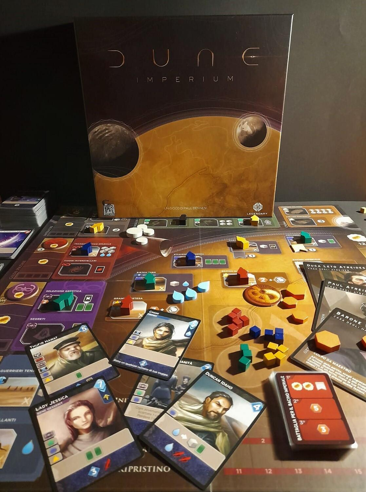
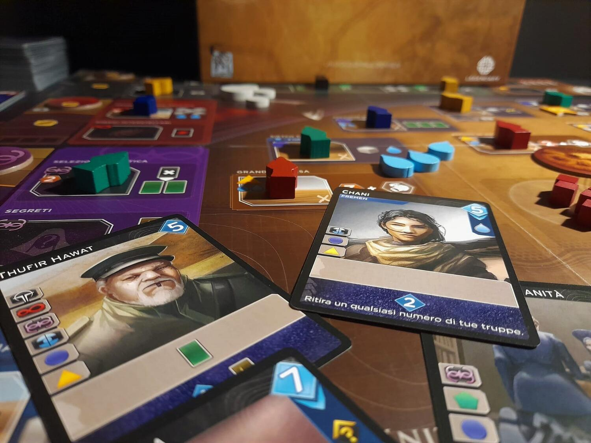

<Setting>

  Solo su Arrakis è presente “la spezia”, quella sostanza unica che permette il
  viaggio interstellare e mistiche visioni del futuro. La sua raccolta non è
  semplice, non solo a causa delle temperature estreme e della quasi totale
  assenza d'acqua, vegetazione e di zone urbanizzate, ma anche per la presenza
  di enormi vermi delle sabbie, pronti a far piazza pulita di uomini e
  attrezzature, e dei Fremen, abitanti indigeni del pianeta, in perenne lotta
  per la libertà di Arrakis.
   
  La risorsa è però talmente importante che tutte le grandi potenze dell'impero
  se la contendono: le nobili casate del Landsraad, l'imperatore stesso, la
  Gilda Spaziale e quella dei mercanti, fino all'oscura e temuta setta delle
  Bene Gesserit.
   
  La spezia, tuttavia, non è che un mero strumento verso qualcosa di assai più
  interessante: il potere, il predominio sulle altre casate e infine il
  controllo della galassia!

</Setting>

<Rules>

  Ogni giocatore controlla uno dei leader delle quattro principali casate
  nobiliari del mondo di Dune, 2 agenti iniziali e un mazzo di 10 carte identico
  tra tutti i giocatori. L'obiettivo? Avere il maggior numero di punti vittoria
  alla fine della partita.
   
  Il gioco si sviluppa in turni di 2 tipi: dell'agente o di rivelazione. Nel
  primo, i giocatori, uno alla volta, inviano i propri agenti nei luoghi della
  plancia di gioco, alcuni dei quali possono garantire loro influenza presso le
  4 grandi fazioni: Fremen, Bene Gesserit, Gilda Spaziale e l'imperatore Shaddam
  IV, facendo ottenere bonus e punti vittoria. Sono le carte della nostra mano a
  dirci dove poter inviare gli agenti, tramite una chiara simbologia.
   
  Esauriti i meeple si rivelano le carte avanzate (la mano è di 5) e con i punti
  influenza mostrati in basso se ne acquistano altre, potenziando così il
  proprio mazzo. Conclusi i turni di rivelazione, i guerrieri fuori dalle
  guarnigioni inizieranno a darsele di santa ragione. Il giocatore con più forza
  vince la battaglia e ottiene la prima ricompensa della carta conflitto, il
  secondo la seconda e così via. Durante il proprio turno o durante il conflitto
  i giocatori possono inoltre giocare carte intrigo con effetti variabili che
  potrebbero, in certi casi, capovolgere una situazione in favore di un
  giocatore inizialmente in svantaggio.
   
  Il gioco prosegue così fino a che qualcuno non raggiunge 10 punti vittoria:
  alla fine di quel round la partita si conclude e il giocatore con più punti
  sarà dichiarato il vincitore.

</Rules>

<Feedback>

  Diciamolo subito, il gioco è un piazzamento lavoratori/deck building: carte,
  qualche pupetto in legno e qualche segnalino in cartone. Superato il primo
  approccio al gioco quindi, l'ambientazione passerà rapidamente in secondo
  piano rispetto alla ricerca dell'ottimizzazione delle mosse. D'altra parte, il
  connubio delle meccaniche è sicuramente vincente: da un lato la scelta
  accurata di quali caselle occupare in base alle nostre possibilità ed
  esigenze, dall'altro la gestione di un mazzo che sarà il nostro motore di
  gioco, sia con i bonus delle carte che per il semplice fatto che sono le carte
  a permetterci di accedere a questo o quello spazio.
   
  Il conflitto è la ciliegina sulla torta: sebbene, di fatto, sia una semplice
  maggioranza, la tensione che si crea ogni turno per capire quanto investire
  nel conflitto attuale o se aspettare e conservare le truppe per quello
  successivo, è impagabile e si amalgama alla perfezione al resto
  dell'esperienza di gioco.
   
  Le regole, poche e semplici, permettono anche ai non esperti di godersi il
  gioco fin dalla prima partita. I materiali sono curati ed ergonomici: non
  dettagliate miniature, ma solidi e funzionali cubetti e meeple in legno. Le
  carte poi sono molto chiare nella simbologia e presentano un'estetica che
  richiama il recente film, con l'apprezzatissima scelta, però, di disegnare
  ogni personaggio, luogo o oggetto, e non limitarsi a fare un copia e incolla
  da scene del lungometraggio.
   
  In conclusione, un gioco che potrebbe soddisfare gli appassionati del tema,
  delle meccaniche, e di un bel gioco teso, di media durata e dove le scelte
  fatte pesano.

</Feedback>

