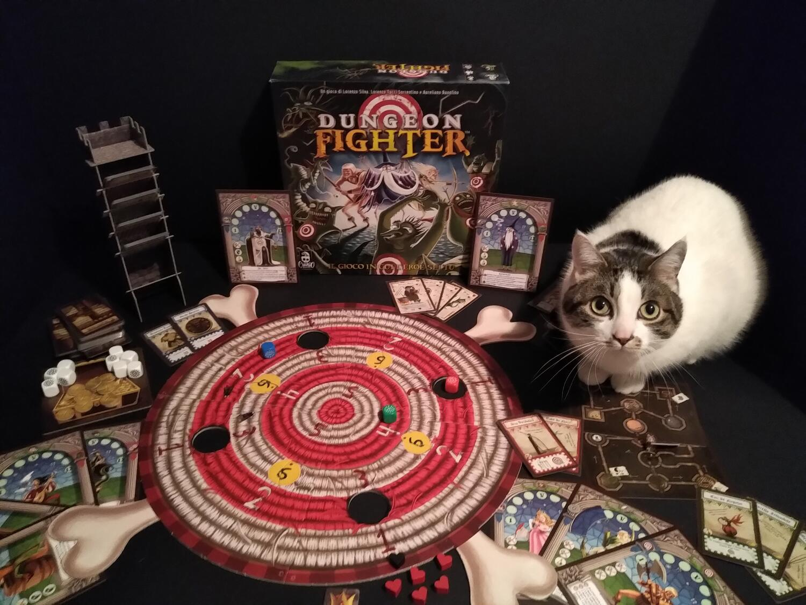
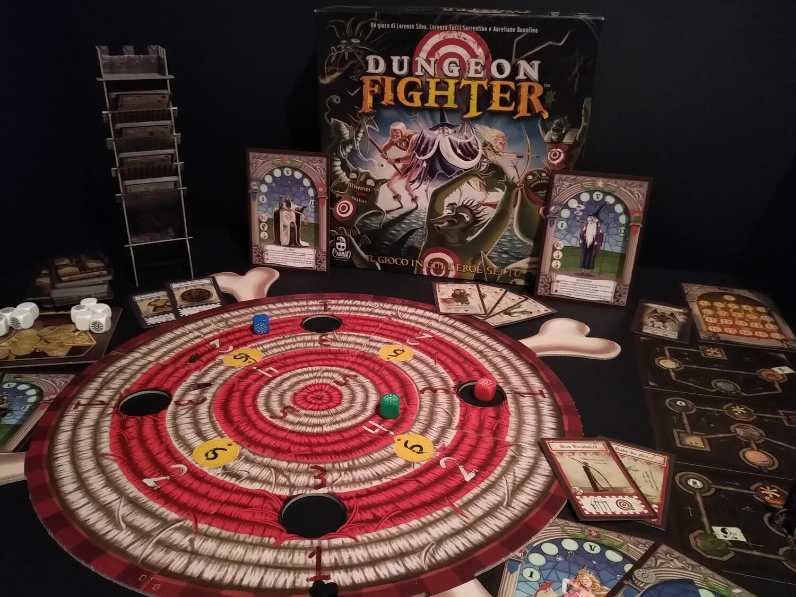

<Setting>

  Chi non ha mai desiderato di far parte di un gruppo di valorosi avventurieri
  che intraprendono viaggi pericolosi alla volta di terre sconfinate e lontane,
  pronti a fronteggiare qualsiasi pericolo in nome della giustizia, della gloria
  o della conoscenza? In Dungeon Fighter avrete la possibilità di incarnare
  l'eroe che avete sempre desiderato...o quasi. Perché qui gli eroi non sono
  proprio senza macchia e senza paura…

</Setting>

<Rules>

  Dungeon Fighter, copia parodistica dei giochi di esplorazione di dungeon che
  trasporta l'atmosfera di un gioco di ruolo in una meccanica originale, è un
  collaborativo dove ogni giocatore interpreta un eroe fantasy.
   
  Già, e il dungeon? Se ne crea uno ogni volta che si gioca, scegliendo 3 delle
  6 tessere fronte-retro disponibili. Il dungeon è caratterizzato da una serie
  di stanze collegate da corridoi che formano percorsi alternativi. Ogni stanza
  contiene un mostro, determinato pescando una carta avventura: prima si pescano
  le carte col dorso verde, poi giallo, poi blu e infine rosso. La difficoltà è
  crescente. Altra conseguenza: se scegliamo un itinerario più lungo (con più
  stanze) troveremo forse bonus o oggetti, ma alla fine dovremo anche pescare
  una carta avventura in più…
   
  Il dungeon è composto in tutto da tre tessere, a cui si aggiunge la stanza del
  tesoro finale (contenente il “boss finale”). In ogni tessera del dungeon
  l'ultima stanza è il mercato: qui gli eroi possono spendere monete d'oro per
  acquistare oggetti. È anche possibile spendere denaro per guarire gli eroi o
  per acquistare dadi bonus che servono come attacchi “usa e getta” durante i
  combattimenti. Altre stanze contengono tesori, ovvero dadi bonus, oggetti o
  denaro extra, ma solitamente per poterne beneficiare dovremo seguire percorsi
  più lunghi o difficoltosi. Già, perché ci sono anche stanze dotate di
  trappole, che rendono il combattimento al loro interno più difficile. L'ultimo
  tipo di stanza è favorevole ai giocatori: le fontane della guarigione
  ripristinano gratuitamente tutti i punti vita dei personaggi.
   
  La preparazione è semplice e veloce: costruire il dungeon e scegliere il
  personaggio da interpretare. Nonostante il rapido set up, il gioco non si
  presta ad essere trasportato e giocato agevolmente: la scatola è leggera, ma
  il tabellone e lo spostamento dei giocatori intorno al tavolo per effettuare i
  tiri con i dadi necessitano di uno spazio adeguato.
   
  Procedendo lungo il dungeon, il gruppo incontra mostri che devono essere
  feriti lanciando dadi sul grosso bersaglio di cartone che sta al centro del
  tavolo: più ci si avvicina al centro, più il danno è alto.
   
  Il cuore del gioco sta qui. Nel proprio turno, il giocatore prende uno dei
  dadi e lo lancia, facendolo rimbalzare prima sul tavolo e quindi sul
  tabellone. A questo si aggiunge una variabile, scelta o imposta: la modalità
  di tiro, la quale cambierà ogni volta e lascerà impressi nella mente dei
  giocatori terribili ricordi!

</Rules>

<Feedback>

  Dungeon Fighter è un gioco originale, molto divertente e “casinaro”, alla
  stregua di un party game. Ci si rende ridicoli sbagliando un tiro facilissimo
  e ci si innalza a dèi colpendo il centro dopo una serie di gesti improbabili.
  Di certo non adatto a chi cerca un gioco serio (o anche solo un dungeon
  crawler “classico”), ma consigliatissimo per tutti gli altri. Se giocato in
  maniera spensierata, è adatto anche alle famiglie (la meccanica principale è
  infatti comprensibile anche per i più piccoli), ma non è esclusa anche una
  certa componente tattica e strategica per chi vuole a tutti i costi vincere
  contro il gioco.
   
  La consistente componente aleatoria, che spesso è vista di mal occhio dai
  giocatori esperti, si rivela in questo caso un ottimo stratagemma per
  avvicinare anche i neofiti o i più restii al tavolo: chiunque, infatti, verrà
  intrigato dalle curiose modalità di tiro dei dadi e anche il più riluttante
  vorrà cimentarsi almeno una volta nelle prove.
   
  Il gioco si presta ad essere rigiocato più volte, non solo per il divertimento
  sfrenato, ma anche per la possibilità di intraprendere percorsi diversi,
  scegliendo personaggi con abilità differenti e selezionando il grado di
  difficoltà desiderato.
   
  Anche la componentistica non vi deluderà: sin dall'inizio il tono leggero del
  gioco è suggerito da un regolamento spiritoso e perfettamente in sintonia con
  l'atmosfera irriverente proposta dalla grafica. Molto gradevoli i dadi
  colorati e la torre di cartone da costruire (una volta costruita sta dentro
  alla scatola senza bisogno di smontarla).

</Feedback>

