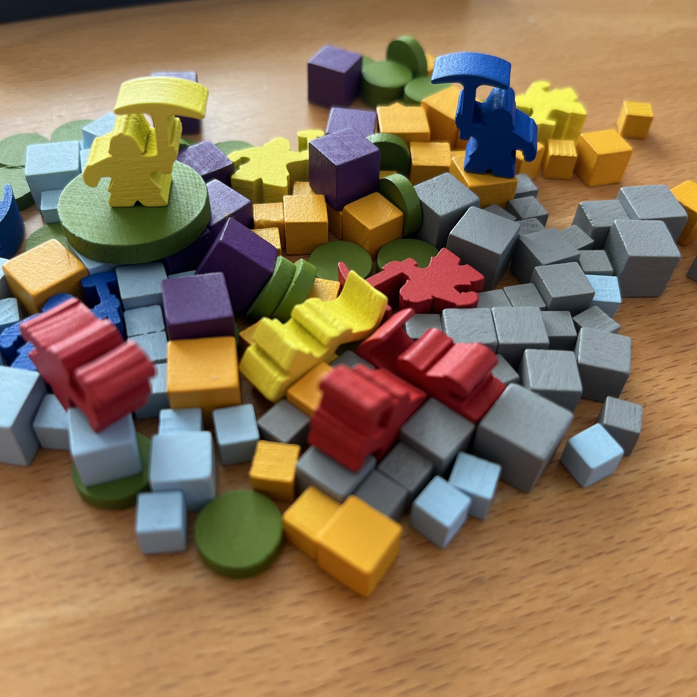
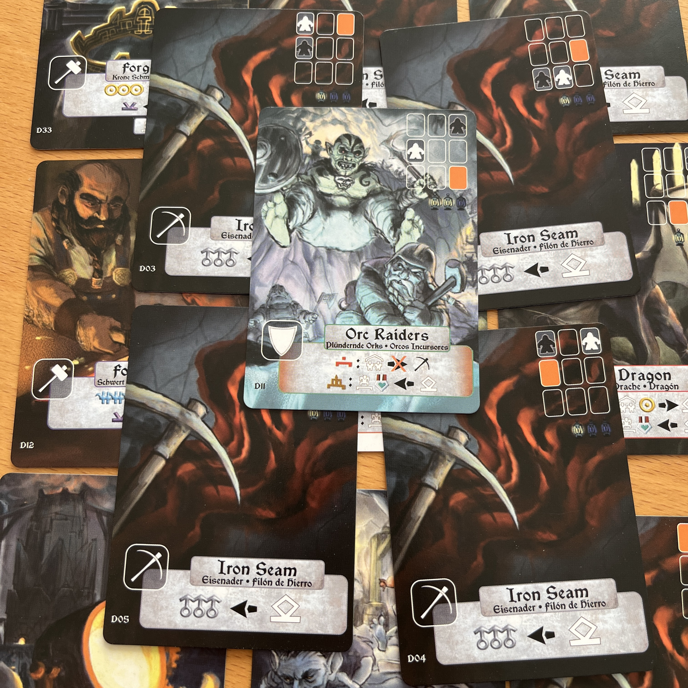
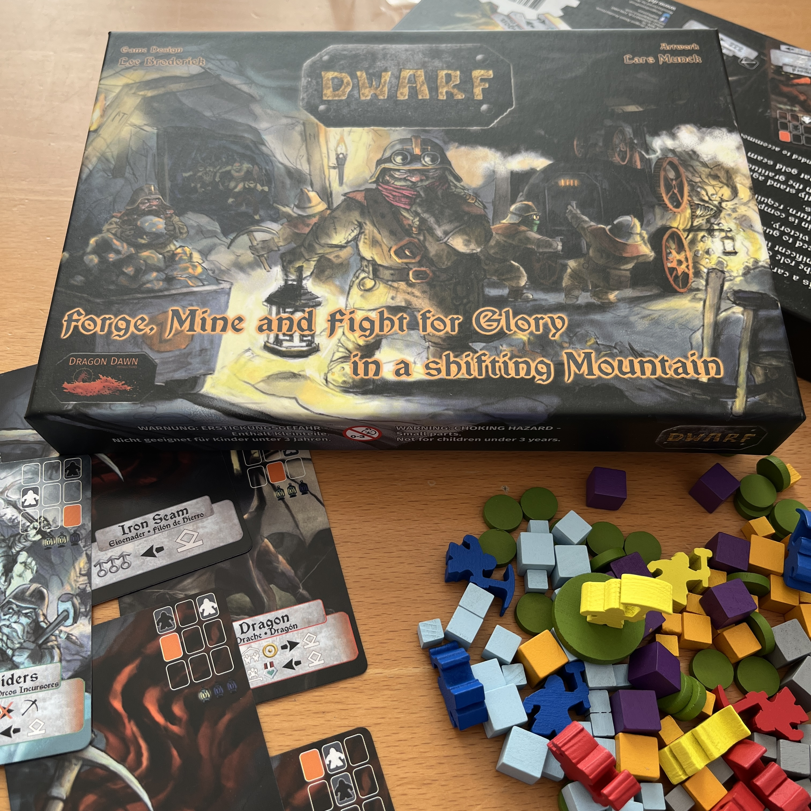

<Setting>

  Sei orgoglioso di essere nato in queste miniere.  
  Ancora di più per non essere mai partito: dopotutto, se ci fossero cose migliori al di fuori di esse, perché così tanti
  vorrebbero <strong>entrarci</strong>?  È vero, sei disposto a tutto per <strong>difendere</strong> la tua casa… Indubbiamente…
  La tua vocazione però è decisamente una: <strong>l’artigianato</strong>. Sei o no un nano in fondo? Pronto ad affrontare
  la tua vita in miniera?

</Setting>

<Rules>

  Costruite una griglia 3x3 di carte iniziali, ognuna rappresentante un'area diversa della Montagna. Le altre carte,
  invece, verranno mescolate nei relativi mazzi. Ogni giocatore ottiene due meeple, delle risorse (grigio per il ferro,
  giallo per l'oro, blu per l'acciaio, viola per l'equipaggiamento e dischi verdi per le medaglie). In modalità
  solitario, ci si confronterà con un avversario con diversi poteri e più o meno difficile da affrontare.  
  L’obiettivo del gioco è quello di ottenere più ferro, oro e oggetti degli altri giocatori. La partita si svolgerà in più
  round, fino a quando un giocatore non otterrà il suo quarto oggetto o non si potranno più pescare carte dal mazzo montagna.
  Durante il round si dovranno gestire i propri <Link to="/mechanisms/piazzamento-lavoratori">lavoratori</Link> per eseguire
  le azioni del gioco e, ovviamente, si dovranno ottenere più risorse possibili, ma sarà importante anche assicurarsi di
  riuscire a difenderle dagli attacchi dei vari mostri!

</Rules>

<Feedback>

  Via la zanna del drago: ci sono poche carte e la fortuna è sicuramente un fattore da tenere in considerazione.
  Inoltre, il regolamento non è dei migliori. Si perde su alcuni concetti chiave rendendo le prime partite un po’
  difficoltose.  
  Eppure, a conti fatti, siamo di fronte ad un piccolo gioiellino. Un titolo che fa della sua velocità di preparazione e
  di gioco i suoi punti forti. E il solitario? Davvero molto bello con i nani cattivi tutti molto interessanti!  
  Un gioco che, per quanto non brillante in tutti gli aspetti, è decisamente consigliato. Non finirà mai una partita
  senza che vi siate divertiti e senza che il nano artigiano che è in voi non vi <em>costringerà</em> a giocare ancora.

</Feedback>

