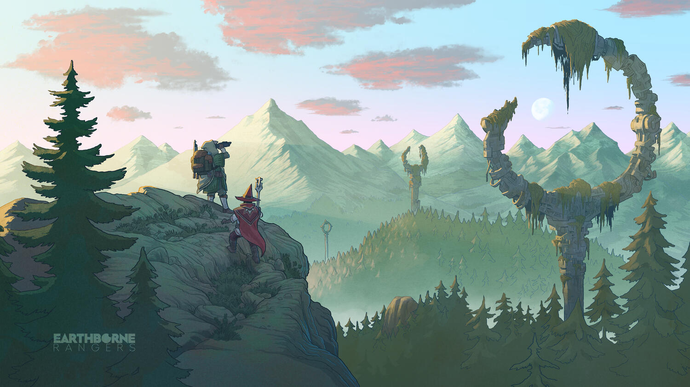
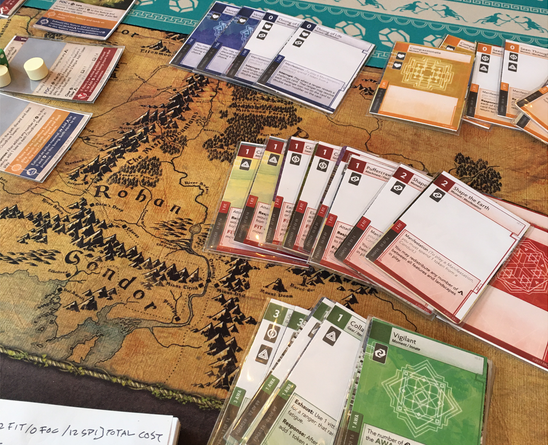

<Setting>

  Anno 4441. L'umanità ha spinto la Terra fino al disastro ecologico, ed è stato
  necessario un radicale cambio di mentalità per sopravvivere. I vecchi
  conflitti e interessi sono stati messi da parte. La priorità per tutti è una
  sola: ripristinare l'equilibrio ambientale. A questo scopo vengono sviluppate
  tecnologie avanzatissime e biocompatibili, il cui scopo è integrarsi
  nell'ecosistema per portarlo gradualmente a una nuova armonia. L'umanità
  sopravvissuta si isola in <strong>Arcologie</strong>, enormi strutture
  completamente autosufficienti, in attesa che il mondo guarisca.
    La natura ha preso il sopravvento, flora e fauna si sono espanse ed evolute,
  non solo creando nuove specie di esseri viventi, ma anche integrandosi con la tecnologia
  umana. Fuori dalle Arcologie si stagliano valli e montagne coperte di vegetazione,
  abitate da creature mai viste prima. Per Earthborne Rangers,<strong>    Andrew Navaro</strong> prende spunto a piene mani da The Book of the New Sun di Gene Wolfe,
  dove una Terra completamente mutata da cambiamenti climatici catastrofici fa spazio
  a scenari di verdeggianti foreste e una fauna evoluta. Un misto di fantasy e sci-fi,
  dove animali e piante hanno creato un legame simbiotico con le tecnologie delle
  vecchie civiltà.

</Setting>

<Rules>

  Earthborne Rangers è un gioco Open World tutto da esplorare. Potrete andare
  liberamente alla scoperta di luoghi e scenari nuovi, incontrando personaggi e
  creature di ogni genere. Ma l'avventura inizia già con la creazione del
  Personaggio. In Earthborne Rangers costruiremo nel dettaglio e liberamente il
  nostro Ranger, non solo scegliendo il suo Ruolo nel party e la
  Specializzazione per la quale si è così tanto addestrato, ma anche le sue
  Inclinazioni e il suo Background.   Riunito il gruppo di Rangers, dovrete
  a questo punto decidere quale luogo esplorare nella <strong>Valle</strong>.
  L'esplorazione avviene muovendosi in sentieri battuti o inesplorati. L'area di
  gioco è ampia e ben caratterizzata: ogni Luogo importante ha una carta
  specifica e un set di carte Sentiero che vanno a formare la base degli
  incontri possibili nella zona. Le diverse Carte Sentiero in gioco, così come
  le carte nei “Surroundings" prevedono di solito delle azioni, descritte nel
  dettaglio, che se portate a termine possono avere conseguenze sia meccaniche
  che narrative. Interagire con una di queste carte (o compiere una delle azioni
  universali “generiche” sempre a disposizione) richiede pure che vengano spese
  Energie del tipo appropriato, ma sarà possibile anche investire carte dalla
  propria mano per aumentare il proprio punteggio.  
  Questo aspetto è determinante, considerando che ogni prova è mediata dalla presenza
  di un Mazzo delle Sfide, ossia una pila di carte (una versione alternativa del
  famoso <strong>“sacchetto”</strong> di Arkham Horror), che possono influire (nel
  bene o nel male) sull'azione che si vuole compiere. Se il risultato è uguale o
  superiore al livello di Sfida di quell'Azione, il giocatore l'avrà completata con
  successo.
   
  Ultime ma non meno importanti le Ferite e la Fatica. Le <strong>    Ferite</strong> potranno essere accumulate nel corso della partita; raggiunto il limite
  massimo, il Ranger sarà costretto ad accamparsi e terminare la giornata, ossia
  la partita stessa. La <strong>Fatica</strong> è invece misurata sul numero di carte
  nel mazzo: subire una fatica significa spostare una carta dal mazzo ad un'apposita
  pila degli scarti. Un giocatore troppo affaticato dovrà terminare la giornata ed
  accamparsi.

</Rules>

<Feedback>

  Un piccolo grande mondo si sta aprendo davanti ai nostri occhi, dispiegando un
  ventaglio di avventure da affrontare. <strong>Earthborne Rangers</strong>,
  farà sicuramente parlare di sé: con un sistema semplice e lineare, basato più
  sull'esperienza di gioco che sulla ricerca delle migliaia di regole che
  caratterizzano gli altri giochi di carte creati dagli autori; con una
  complessa e profonda caratterizzazione del personaggio, combinata ad una
  vastità di Luoghi e Personaggi da incontrare. Con un orecchio attento ai
  desideri della community di appassionati, questo titolo, a mio avviso,
  rappresenta il coronamento di anni di esperienza.

</Feedback>
