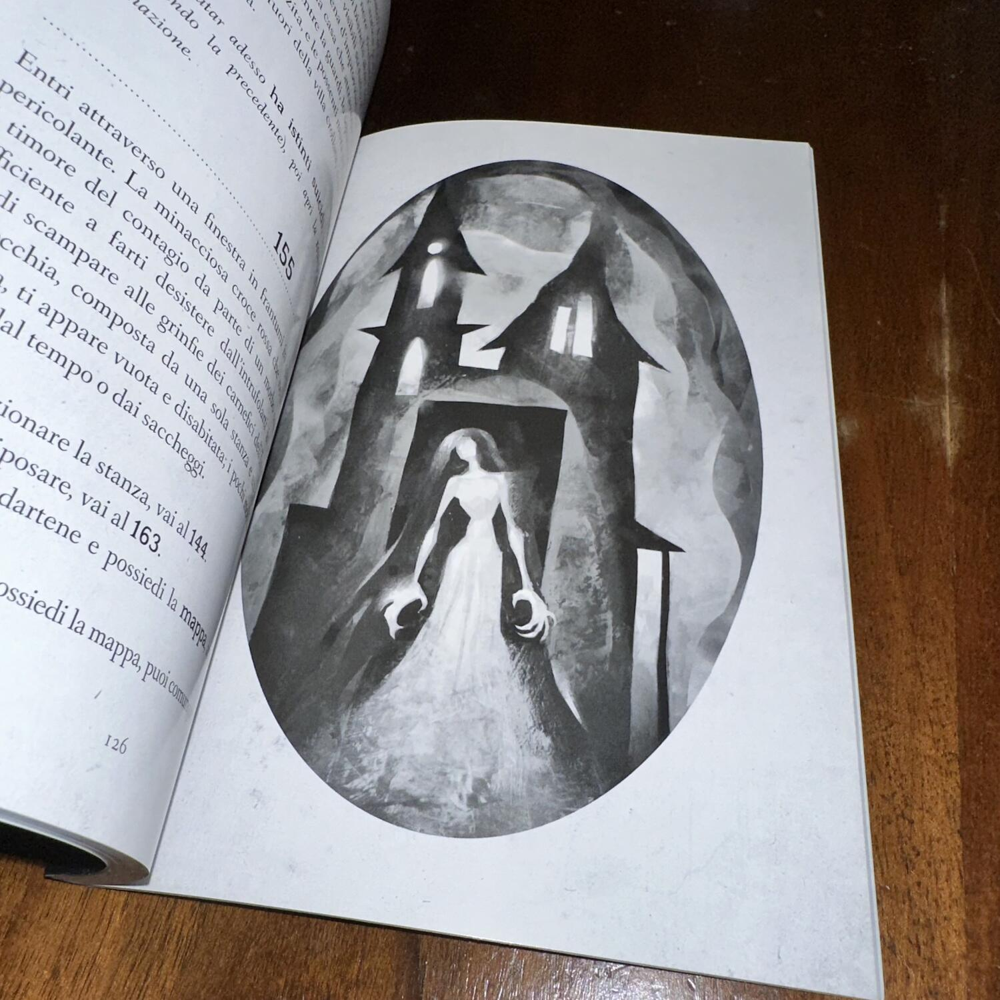
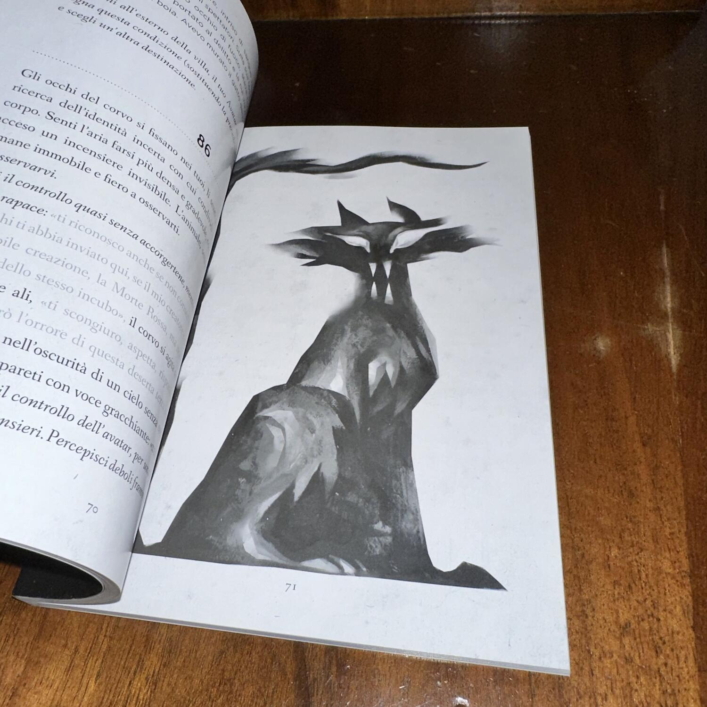

<Setting>

  Vi ritrovate in un luogo buio, non sapete chi vi ci abbia portato o il perchè
  vi troviate li ma sapete che l'unico vostro obiettivo è quello di uscire.
  L'esplorazione del posto è difficoltosa, riuscite a stento a trovare qualcosa
  ma quel qualcosa segnerà in modo irreparabile la vostra avventura. Un enorme
  pozzo, dove erroneamente cadete per finire senza vita sul fondale.
  Inspiegabilmente vi risvegliate al punto di partenza come se nulla fosse.
  Ripercorrete i passi già fatti ma in modo inconsapevole, anche se avete già
  visto quelle cose, per voi è come se fosse la prima volta, fino a che non
  arrivate, di nuovo, al Pozzo. Stavolta però il pozzo non sembra più vuoto e
  profondo, sbadatamente ci cadete dentro e per un po' pensate che quella
  sarebbe stata la vostra fine ma non è così. Atterrate su qualcosa, che
  attutisce la vostra caduta e vi permette di uscire indenni da quella trappola,
  guardando meglio, nella penombra dell'oscurità, vedete dei corpi. Gente caduta
  nel pozzo, quei corpi però hanno una peculiarità che vi lascia senza fiato:
  Sono i vostri corpi. All'interno di questo libro vedremo prendere vita i
  racconti del famoso poeta gotico Edgar Allan Poe. I personaggi, le scene e i
  luoghi descritti dal Poeta americano vivono all'interno dell'ambientazione
  inedita creata da Valentino Sergi. Incontreremo Re Peste, il Corvo, il Gatto
  nero; rivivremo alcuni momenti de "Il pozzo e il Pendolo" e anche de "Il Cuore
  rivelatore" all'interno di un villaggio condannato dal morbo della Morte
  Rossa, tutto sotto gli occhi vigili del Principe Poeta.

</Setting>

<Rules>

  Non ci sono molte regole all'interno del libro, non abbiamo una scheda
  personaggio, non ci sono combattimenti. Semplicemente teniamo conto di alcuni
  punti chiave dell'avventura e degli oggetti trovati. Tutto verrà determinato
  dalle nostre scelte. La peculiarità principale di questo libro è la perfetta
  rottura della quarta parete. Il libro in alcuni punti parla direttamente a noi
  lettore, non al nostro personaggio ma a noi che leggiamo e che stiamo
  "governando" quel personaggio. Questo lo fa con un inteliggente cambio di font
  nello scritto, quando troveremo un font in corsivo (come questo) il libro sta
  comunicando a noi. Non solo il libro, nei panni del narratore, compie questa
  rottura della quarta parete ma anche alcuni personaggi, scritti veramente bene
  da Valentino Sergi, comunicano direttamente con noi, spostando letteralmente
  il narratore e prendendo possesso della narrazione della storia, primo su
  tutti Re Peste. Il nostro personaggio, che il libro chiama non casualmente
  Avatar, avrà un rapporto con noi lettori determinato da degli status che
  otterrà durante l'avventura e che andranno ad influenzare le scelte che
  dovremo fare. All'interno del libro troveremo anche degli enigmi più o meno
  difficili che andranno a tenere impegnato il vostro intelletto.

</Rules>

<Feedback>

  Edgar Allan Poe: The Horror Gamebook è probabilmente il miglior librogame che
  ho letto/giocato fin'ora. Tutto in questo libro mi ha affascinato ed esaltato:
  L'ambientazione, in perfetta linea con i racconti del famoso poeta americano;
  le poche meccaniche di gioco: gli enigmi e gli status che vanno a creare un
  rapporto stretto con l'avatar che comandiamo ma allo stesso tempo ci fanno
  capire quanto il suddetto avatar sia solo uno strumento di passaggio per poter
  proseguire la nostra avventura da lettori; i personaggi che sono presi da
  quelli di Allan Poe ma riscritti in modo egreggio da Valentino Sergi, mi
  ritrovo a nomino di nuovo Re Peste, che probabilmente è il personaggio
  migliore di quest'opera; ma soprattutto la rottura della quarta parete che
  fino alla fine accompagna il lettore fancendolo sentire veramente il
  protagonista e mettendolo davanti non alla lettura di un libro ma ad un vero e
  proprio dialogo con il libro. Come se questo ultimo fosse un essere senziente
  che, forse, necessita veramente del nostro aiuto per essere portato a termine
  all'interno di questo regno dominato dal terrore.

</Feedback>

