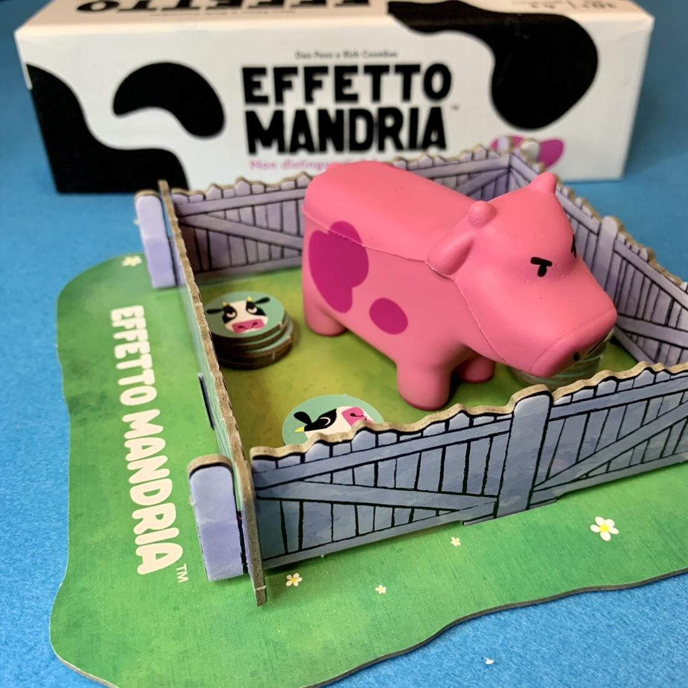
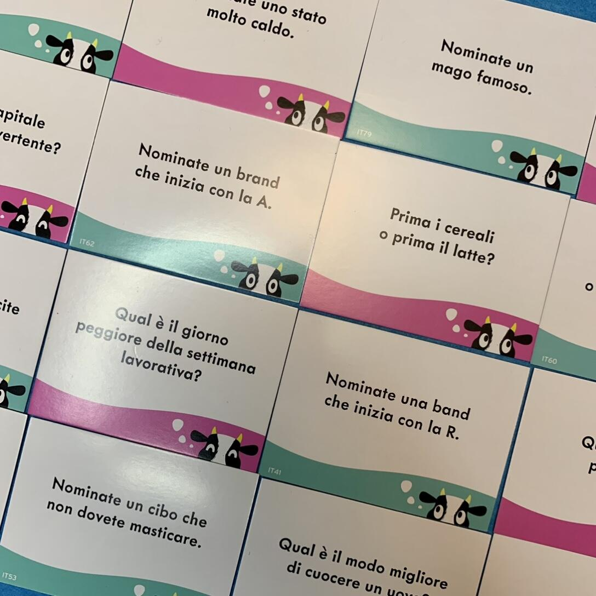
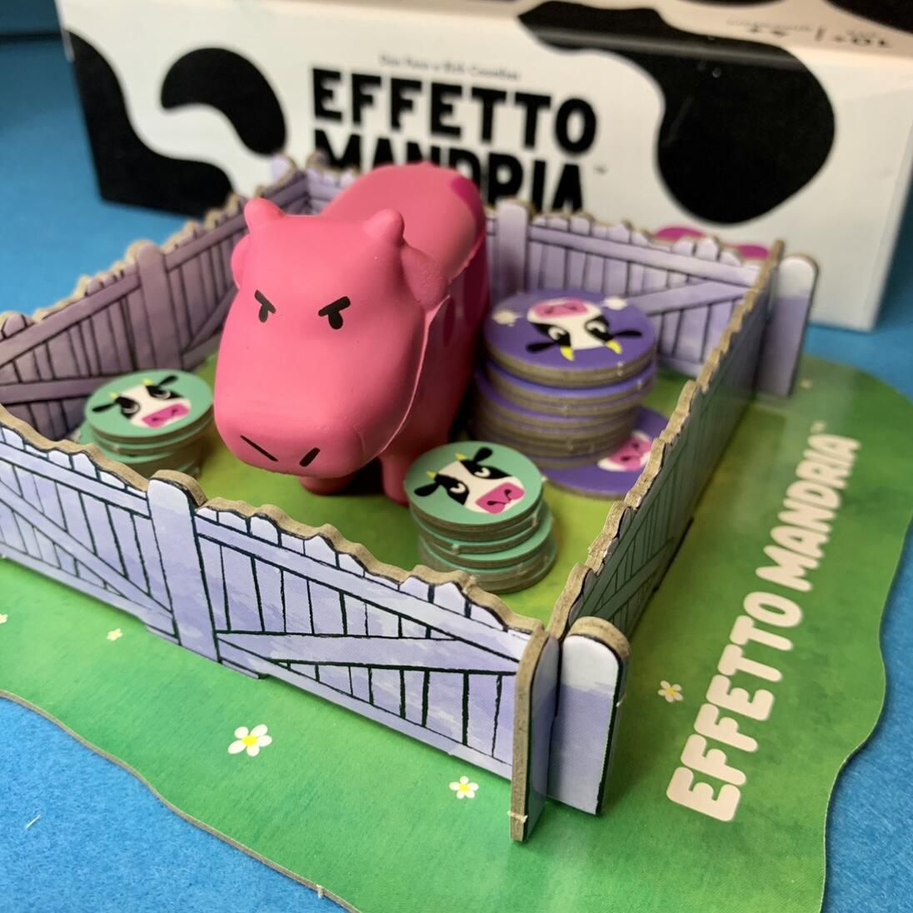

<Setting>

  L’obiettivo del gioco è essere il <strong>primo giocatore ad ottenere 8 mucche</strong>. Per farlo, dovete pensare come la massa e quindi cercare di <strong>dare la stessa risposta degli altri</strong>. 
Costruite il recinto, raggruppate i segnalini Mucca e scegliete il Mandriano che avrà il compito di leggere le carte domanda e distribuirà le mucche. 

</Setting>

<Rules>

 Il Mandriano<strong> pesca una carta domanda e la legge ad alta voce</strong>. Tutti dovranno <em>scrivere la risposta in segreto</em> sul foglietto. Una volta che un giocatore ha scritto la propria risposta può iniziare a muggire (sì, letteralmente, hai letto bene) per mettere pressione agli altri giocatori.  
A questo punto tutti i giocatori dovranno<strong> leggere la loro risposta</strong>. Si individua quindi quale risposta è stata data dal maggior numero di giocatori: questi prenderanno 1 segnalino Mucca dal recinto. 
Se un giocatore è stato l’unico a <em>dare una risposta diversa da chiunque altro<strong>, quel giocatore diventa l’Eccezione</strong></em>: gli viene quindi assegnata la Mucca Rosa. Quest’ultima non impedisce di fare punti, ma chi la possiede non potrà vincere la partita. L’unico modo per sbarazzarsene è che un altro giocatore diventi l’Eccezione. 
Il primo giocatore ad avere una mandria formata da 8 Mucche è il vincitore! 

</Rules>

<Feedback>

  Effetto Mandria è un gioco estremamente semplice e altrettanto interessante, perché{" "}
  <strong>chiede al giocatore di provare a pensare a quello che penserebbero tutti gli altri seduti al tavolo</strong>.{" "}
   
  La scatola è bellissima simula il manto a macchie nere di una mucca con un effetto vellutato.
   
  Nel complesso è un titolo godibilissimo che porterà leggerezza al tavolo di gioco. Sarà molto divertente sentire le risposte,
  a volte assurde, dei vostri amici. O ancora, a volte crederete di aver scritto la risposta più ovvia, e invece vi troverete
  ad essere voi in minoranza o, peggio, l'Eccezione!
   
  Se vi piacciono i party game caciaroni e divertenti, facili da spiegare e in grado di coinvolgere chiunque, Effetto Mandria
  è il titolo che potrebbe fare al caso vostro.

</Feedback>

