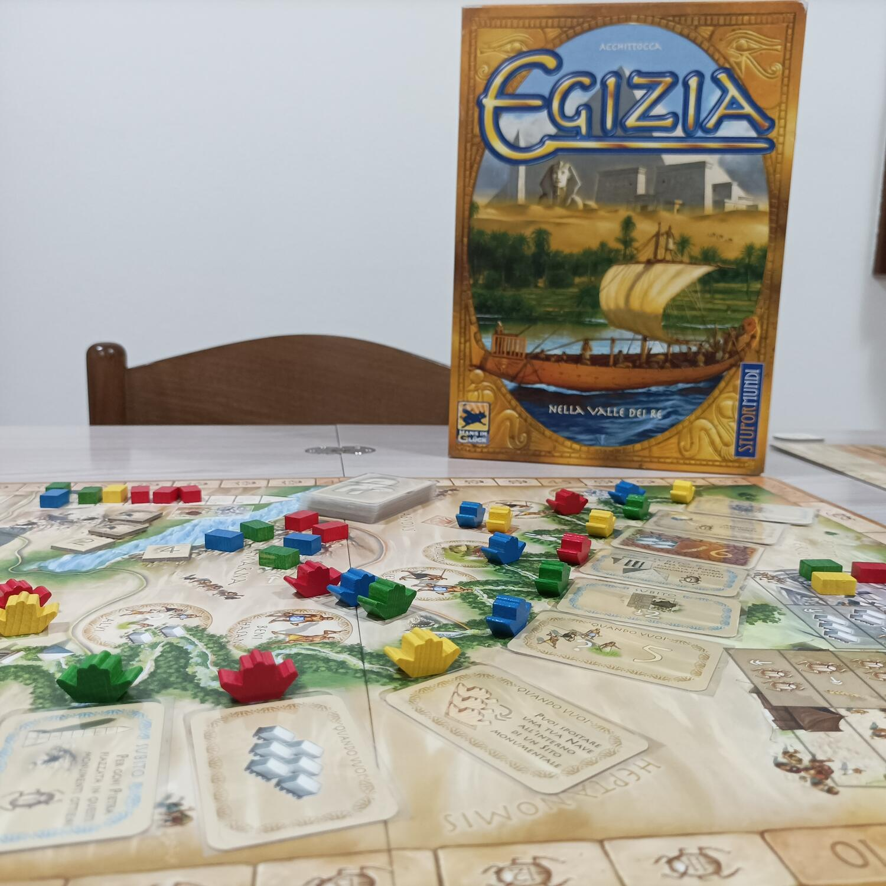
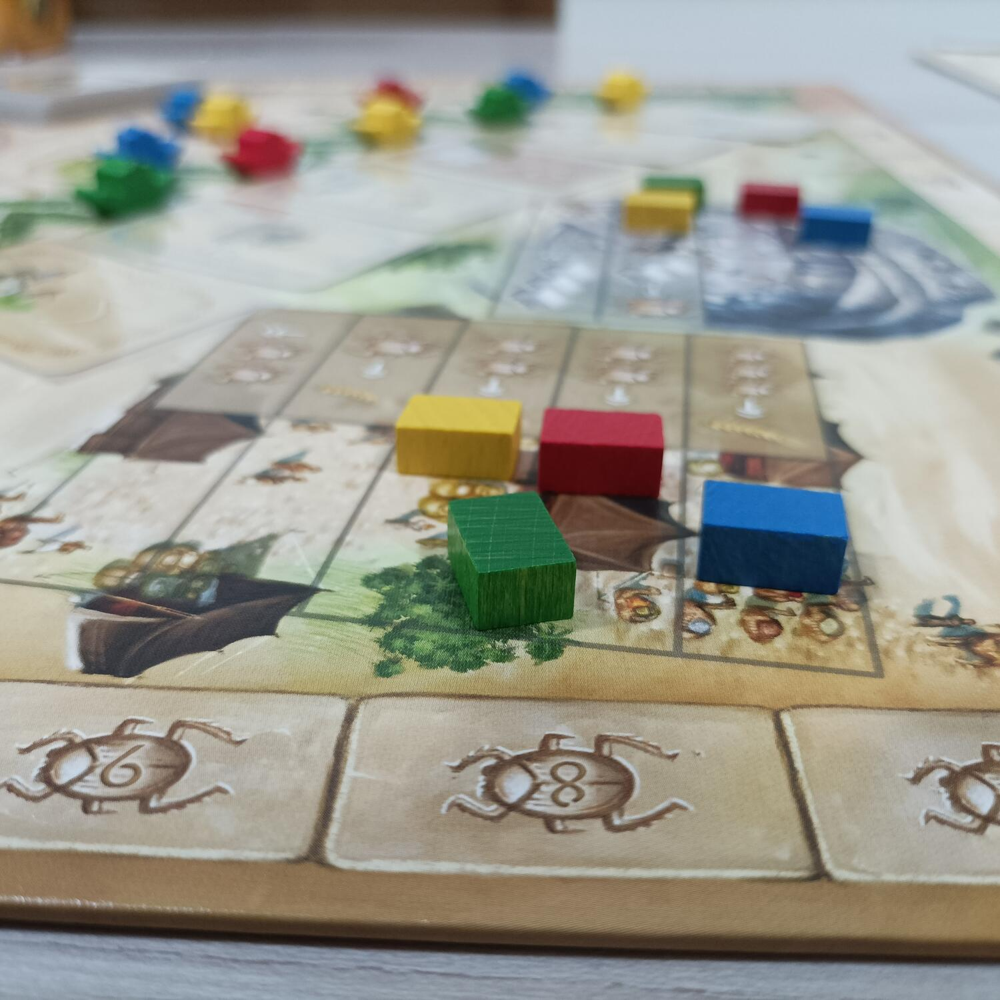

<Setting>

  Corre l’anno 2707 a.C., agli albori dell’Antico Regno in Egitto. Sei uno degli
  influenti commercianti e costruttori che si aggirano sulle rive del fiume Nilo
  reclutando lavoratori per adoperarli nelle cave di pietra e nella costruzione
  di importanti siti monumentali dell'antichità quali la Sfinge, le Piramidi,
  gli Obelischi e le Tombe Dei Re.  
  Dovrai coltivare campi per sfamare i lavoratori che hai assoldato, raccogliere
  pietra da impiegare per costruire il monumento più bello e conquistare così il
  rispetto del Faraone. Tutti i tuoi sforzi saranno ricompensati con fama e gloria,
  ma solo se saprai amministrare bene le tue risorse.
   
  Mentre sarai intento a fare tutto questo, altri abili commercianti e costruttori
  faranno lo stesso nella corsa al favore del Faraone: solo il più abile mecenate
  d’Egitto saprà porsi alla guida del gruppo di lavoratori e artisti scultori di
  grandi monumenti che rimarranno imperturbati per secoli e secoli nella storia della
  civiltà.

</Setting>

<Rules>

  Egizia si articola in 5 turni: in ciascuno di essi si susseguono 7 fasi
  prestabilite, al termine delle quali si resetta il nuovo turno e si riparte
  con la prima fase.
   
  Nella prima fase si piazzano 10 CARTE NILO lungo il percorso del fiume,
  partendo dalla casella più in alto, negli appositi spazi segnati sul tabellone
  di gioco.
   
  Nella seconda fase i giocatori, a turno, piazzano le proprie NAVI su un’ansa
  del NILO a scelta, rispettando il parametro della discesa sul fiume secondo il
  quale uno stesso giocatore deve piazzare la prossima Nave più a valle
  dell’ultima che ha piazzato.
   
  Ci sono 3 diversi tipi di anse, che corrispondono ad altrettante azioni: nelle
  anse con le Carte Nilo il giocatore, dopo aver piazzato la propria nave,
  prende la carta Nilo, ne esegue l’azione e/o la colloca davanti a sé. Sul
  campo di lavoro esegue l’azione corrispondente al tipo di Campo di Lavoro. Nel
  Sito Monumentale, invece, il giocatore che ha piazzato la propria nave prenota
  la costruzione di parte di un monumento per la quinta fase.
   
  Nella terza fase ogni giocatore deve NUTRIRE i propri lavoratori e, per farlo,
  ne controlla il bisogno di grano e lo compara con la propria produzione; se
  sono sfamati tutti i lavoratori non accade nulla, mentre per ogni lavoratore
  non sfamato, il giocatore perde punti vittoria. La quarta fase di PRODUZIONE
  PIETRE è semplice gestione risorse sulla propria tabella personale e sulle
  Carta Nilo collezionate.  
  La quinta fase riguarda la COSTRUZIONE dei Siti Monumentali, cosa che conferisce
  punti vittoria ai giocatori. Per costruire un Sito Monumentale il giocatore piazza
  una delle pietre del proprio colore sulla casella del sito monumentale che vuole
  costruire e per il quale si è prenotato nella fase di piazzamento delle navi; fa
  eccezione la Sfinge, per la quale non si piazzano pietre, ma si pescano carte sfinge
  che sono obiettivi di fine partita e quindi punti bonus, se raggiunti.
   
  Nella sesta fase si assegnano PUNTI BONUS per la partecipazione alle costruzioni
  dei siti monumentali ad ogni giocatore che vi ha partecipato.
   
  Nella settima ed ultima fase, infine, si aggiorna l’ORDINE DI TURNO per il turno
  successivo e poi si riparte con un nuovo turno dalla prima fase.
   
  Vince chi ha più punti vittoria al termine del quinto turno.
   

</Rules>

<Feedback>

Egizia è un German con regole semplici, chiare ed intuitive. 
Diverse sono le strategie che possono portare alla vittoria ed ognuna di esse è ugualmente valida e divertente da giocare, che sia costruire più pietre nei siti monumentali o collezionare più carte sfinge.  
I vari tipi di campi coltivabili aiutano a creare strategia contro gli avversari; saperli coltivare e ruotare al momento giusto potrebbe risultare determinante per ostacolare gli avversari e diminuire il loro ammontare di punti vittoria in qualsiasi momento. 
Sul fronte dei materiali, nulla che faccia gridare al miracolo: per lo più incontriamo carte e meeple di legno a forma di barca, ma comunque ben realizzati. Nota di merito al tabellone di gioco che, oltre ad essere bello alla vista con il fiume Nilo e tutte le sue anse che scorrono verso il mare, è caratterizzante per l’ambientazione con i monumenti disegnati molto bene.
Anche se Egizia è un gioco abbastanza vecchio nel suo genere (parliamo infatti del 2009 come data di uscita) ancora oggi offre un'esperienza di gioco rilassante che lascia spazio anche ad alcune chiacchiere al tavolo e che è possibile affrontare in massimo un paio d’ore con tutta la calma del mondo… nulla a che vedere con i moderni German (vedi Food Chain, Ark Nova ed altri) i quali necessitano di strategie cervellotiche e impongono di rimanere sempre incollati al tavolo con la mente fissa sul gioco. 
Egizia, dunque, più che proporsi come un eurogame rivolto ad appassionati del genere, si presenta come un entry level per neofiti che hanno intenzione di sperimentare diversi tipi di gioco e di meccaniche, prima di decidere quale “settore ludico” sposare.

</Feedback>

