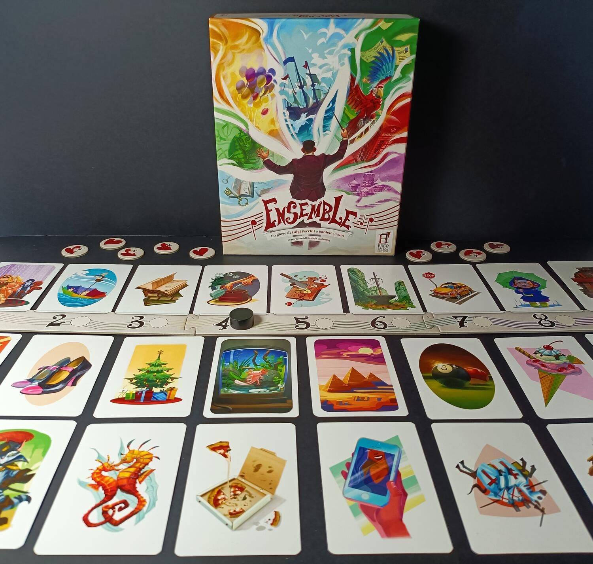
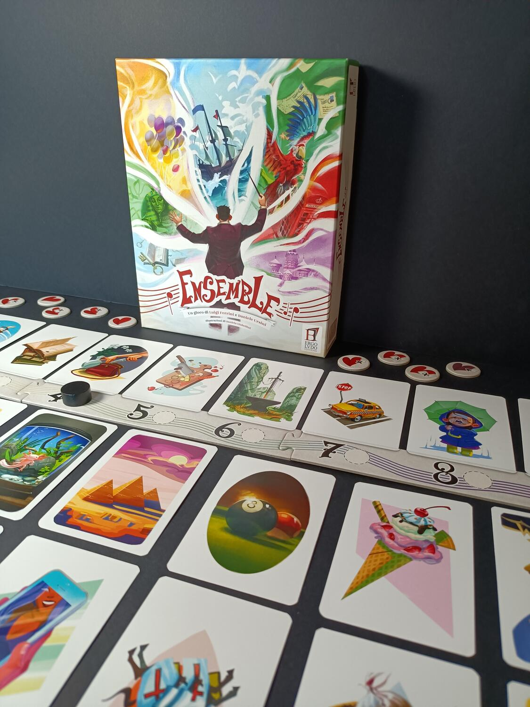

<Setting>

  In Ensemble impersonerete un gruppo di musicisti che attraverso la libera
  associazione di immagini dovranno cercare di arrivare alla perfetta
  coordinazione, cioè <strong>l'ensemble</strong>.

</Setting>

<Rules>

  Ad inizio partita ogni giocatore riceverà delle carte numerate da 1 a 9, le
  quali dovranno essere usate per votare la carta scelta durante il turno.
  Inoltre, una volta messo il tabellone, si andranno a posizionare due carte
  nella parte superiore, legate direttamente ad un numero. Queste sono dette le
  carte <strong>Ricordo</strong>. Sarà poi posizionata una carta al di sotto,
  questa sarà la carta <strong>Sfida</strong>.
   
  Durante il turno, i giocatori dovranno scegliere una carta Ricordo che più si
  lega alla carta Sfida, e giocare poi, di nascosto, la carta numerata
  associata. Se tutti i giocatori avranno scelto lo stesso numero ci sarà{" "}
  <strong>ensemble</strong>, che permetterà di superare così il livello. A
  questo punto la carta Sfida sarà scartata e la carta Ricordo scelta diventerà
  la nuova carta Sfida. Per poter vincere la partita bisognerà completare il
  nono livello.
   
  In base al numero di giocatori, si avrà una quantità simile di punti vita. La{" "}
  <strong>tolleranza</strong>, invece, permetterà di passare comunque il
  livello, anche se uno o più giocatori non avranno scelto la stessa carta: in
  questo modo, però, non si ottiene l'ensemble. Se non si riuscirà ad arrivare
  ad una coordinazione tale da superare il livello si perderà un punto vita. La
  partita sarà persa ovviamente se tutti i punti vita finiranno; ma non
  disperate, perché se riuscirete ad ottenere un ensemble durante un turno
  potrete <strong>riottenere un punto vita</strong>.

</Rules>

<Feedback>

  Ensemble è un divertente titolo, che permette di portare al tavolo e tenere
  incollati alle sedie gruppi numerosi di giocatori. Grazie alla possibilità di
  poter giocare fino a dieci, si riusciranno a creare sfide e partite sempre
  divertenti e simpatiche, ottime per il fine serata o le cene in famiglia. Il
  regolamento è semplice ed immediato, quindi approcciabile anche da chi è poco
  avvezzo ai giochi da tavolo. Le partite scorrono veloci, senza tempi morti,
  anche se confrontarsi per eventuali associazioni un po' particolari è sempre
  uno spasso, e, a mio avviso, il vero fulcro del gioco. La longevità non è ai
  massimi livelli a causa del ridotto numero di carte, cosa che rende alcune
  partite un po' ripetitive. Questo aspetto però è leggermente limato dalla
  presenza di <strong>tre sfide</strong> aggiuntive abbastanza difficili, che
  metteranno a dura prova il vostro gruppo.
   
  In conclusione, Ensemble è un party game che mi ha stupito. Semplice e veloce,{" "}
  <strong>    estremamente utile nelle serate con parenti non abituati ai giochi da tavolo</strong>
  . 
  Ringrazio Boardgame italia per questa copia, potrete leggere la mia recensione
  anche sul loro sito:{" "}
  <a href="https://www.boardgameitalia.it/">https://www.boardgameitalia.it/</a>.

</Feedback>

