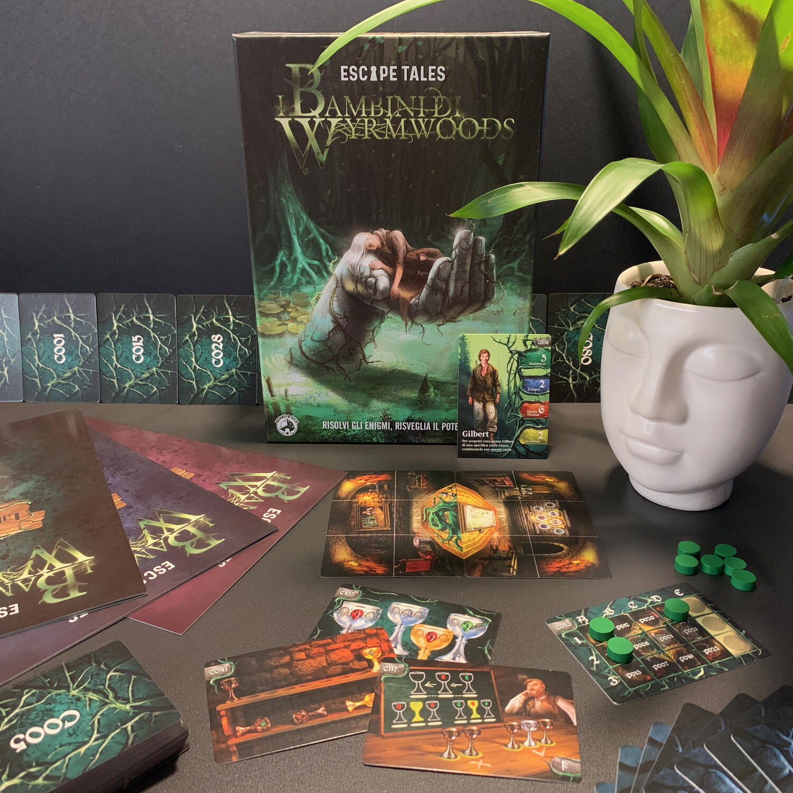
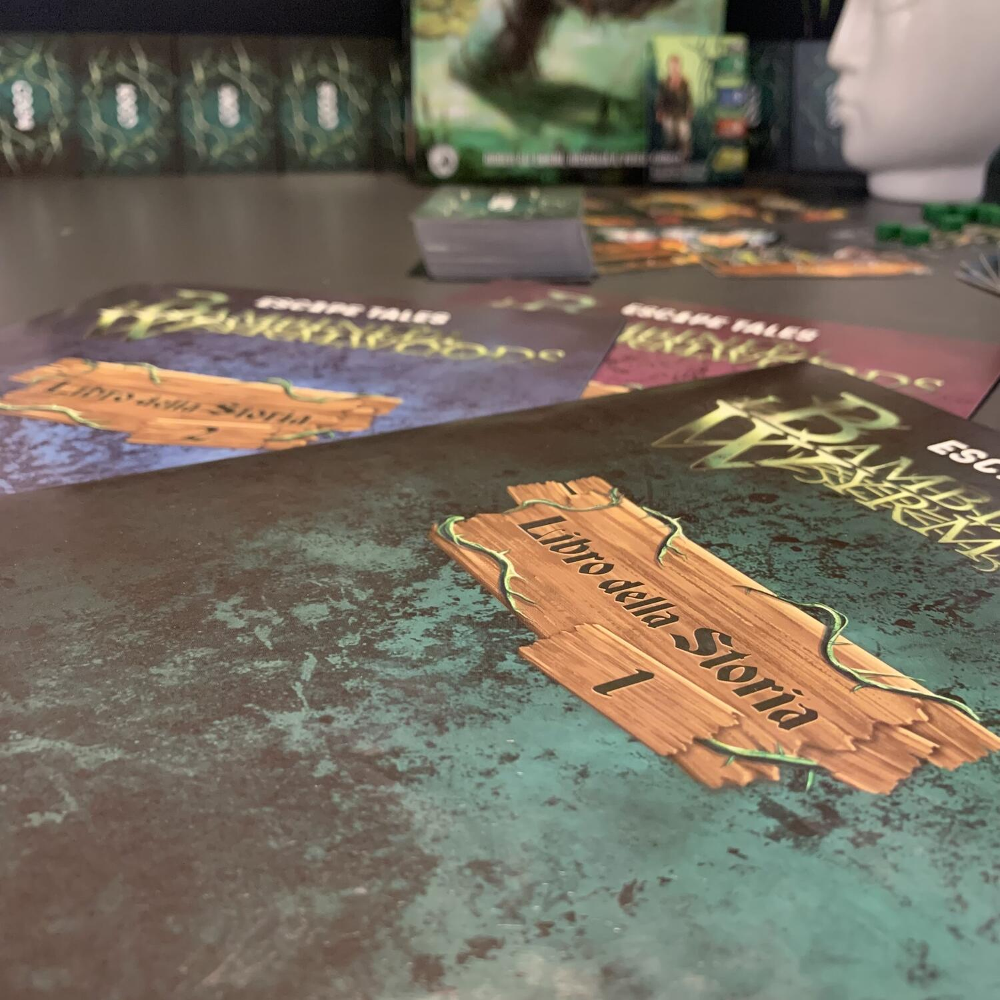

<Setting>

  Il tuo nome è Gilbert. Vivi in un piccolo paese circondato da alte mura oltre
  le quali, nel fitto della foresta, abitano i Serpicanti: letali abomini creati
  da un'antica stregoneria, nati dalla fusione tra piante e animali. Il paese,
  per il momento, è sicuro. Tuttavia non sei felice, non hai né famiglia né
  casa, fatichi a trovare un senso alla tua vita e vivi come un vagabondo.
  L'unica fonte di gioia nella tua misera esistenza è Sibilla, con la quale
  condividi un amore segreto. Eppure, un antico potere sta tramando nell'ombra
  per privarti anche dell'ultima scintilla di speranza; ciò che vive al di là
  delle mura ha bisogno di te e farà tutto quello che è in suo potere per far
  incrociare i vostri destini. Il tempo è giunto, l'avventura sta per iniziare e
  tu… sei pronto?

</Setting>

<Rules>

  I Bambini di Wyrmwoods è un'escape room da tavolo narrativa: una specie di
  libro game dove, per poter avanzare nella lettura, bisognerà prendere
  decisioni e risolvere degli enigmi.
   
  Dopo aver letto il paragrafo iniziale, l'incipit della storia, si verrà
  catapultati a Wyrmwoods e bisognerà affinare occhi e cervello per capire il
  marcio che circonda quel luogo, quelle credenze e quelle dicerie.
   
  Sarete voi a dover interpretare Gilbert e ad aiutarlo nella sua missione,
  abbinando oggetti e risolvendo enigmi. Una pratica applicazione web vi guiderà
  in questi compiti e vi aiuterà nel caso in cui vi foste bloccati.
   
  L'avventura si svolge in molteplici luoghi, ognuno dei quali è composto da una
  o più "carte formato dixit". Queste carte sono suddivise da una griglia e ogni
  sezione è esplorabile. Si posizionerà un token su quella parte che si intende
  esplorare, si leggerà il codice e si darà lettura del relativo paragrafo sul
  libro dell'avventura, addentrandosi così nella storia, ottenendo ulteriori
  oggetti ed affrontando nuovi enigmi.
   
  Una volta trovata la soluzione all'enigma, si inserirà il relativo codice
  nell'applicazione e si proseguirà con la lettura del paragrafo indicato.
   
  Tenete a mente che il numero di azioni che Gilbert ha a disposizione è
  limitato dai token azione. E quando questi finiscono? Gilbert avrà necessità
  di riposare o di concentrarsi ulteriormente. Questa azione vi darà ulteriori
  token a discapito di qualcosa, come scoprirete sulla vostra pelle.

</Rules>

<Feedback>

  I Bambini di Wyrmwoods è un'esperienza lunga e coinvolgente che offre molti
  più temi rispetto a una tradizionale escape room da tavolo.
   
  La qualità degli enigmi è variabile, per lo più buona, e la loro complessità
  copre l'intera gamma di difficoltà: alcuni sono abbastanza semplici e possono
  essere risolti senza troppa fatica, mentre altri richiedono un buon pensiero
  laterale (e forse un suggerimento o due).
   
  Il gioco non è (fortunatamente) cortissimo ma prevede un modo per salvare la
  partita, riponendo il tutto nella scatola, per poterlo intavolare di nuovo in
  un secondo momento.
   
  Nel corso della storia saranno presenti delle scelte "etiche" che vi
  porteranno a prendere una strada narrativa piuttosto che un'altra. Questo, nel
  susseguirsi della partita, scelta dopo scelta, vi porterà a oltre 60 finali
  diversi, alcuni davvero belli, altri... che male!
   
  Se vogliamo trovarci il pelo nell'uovo, l'app è abbastanza convenzionale; non
  aspettatevi niente di simile agli unlock: niente realtà aumentata, niente
  easter eggs, solamente inserimenti di codici e ottenimento dei relativi
  risultati.
   
  App a parte, era tanto tempo che non giocavo un'escape room che mi lasciasse
  così divertito e che mi spingesse a ordinare anche le altre due avventure
  della stessa collana.
   
  Davvero consigliata.

</Feedback>

