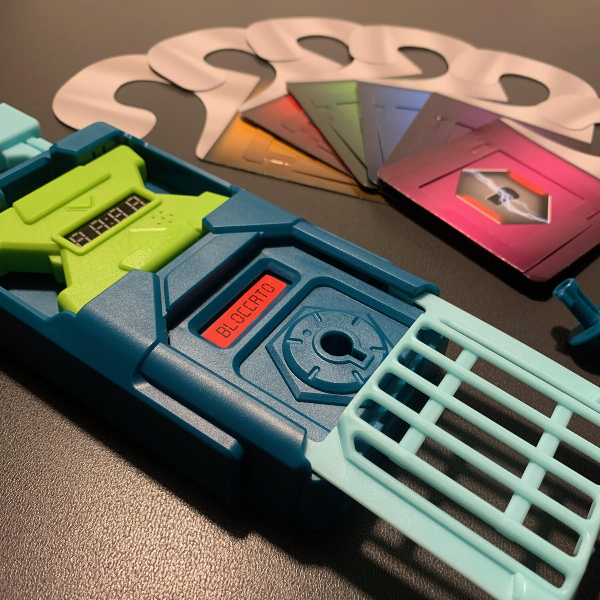
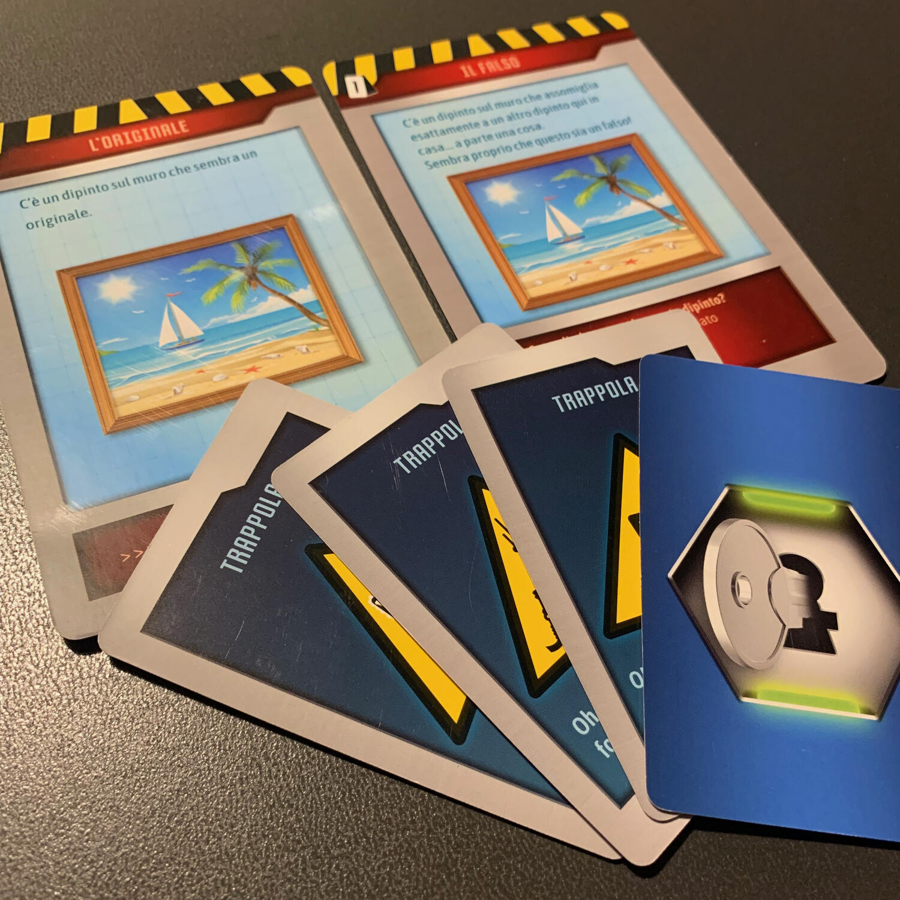

<Setting>

  <em>    La Squadra Super Segreta di Spionaggio (SSSS) è un’organizzazione che
    protegge il mondo dai pericoli. Una delle caratteristiche principali delle
    spie è passare inosservate. E cosa c’è di meno appariscente di una dolce
    famiglia innocente o di un gruppo di amici entusiasti? Questo è esattamente
    il motivo per cui la SSSS sta cercando persone come voi!</em>   
   
  Dimostrate di essere le migliori spie sul mercato e avrete un futuro emozionante.
  Prendetelo per certo.

</Setting>

<Rules>

  Il gioco è composto da <strong>6 missioni</strong>, da affrontare
  consecutivamente.  
  Ogni missione sarà diversa dalle altre e avrà il solo scopo di farvi scappare…
  da casa vostra! Avete 15 minuti per risolvere tutti gli enigmi, aprire tutte le
  stanze e scappare prima che sia troppo tardi.
   
  Iniziate dalla prima missione, cercate nella scatola il necessario e posizionatelo
  in giro per casa come spiegato sulla carta di setup.  
  <strong>Ogni missione sarà composta da 10 stanze</strong>: se avete una casa
  grande, ogni stanza reale potrà diventare una stanza dell'escape, altrimenti,
  non temete, potete inventarvi delle stanze come, ad esempio, il forno o la
  gabbietta del criceto.  
  Alcune stanze (o il forno) saranno bloccate da un lucchetto che vi impedirà di
  entrare finché la relativa chiave non verrà trovata risolvendo altri enigmi. Per
  risolvere questi enigmi, avrete bisogno di una o più carte (disposte in stanze
  diverse) che dovranno essere analizzate insieme per capirne la chiave di lettura
  e trovarne, si spera, la soluzione.  
  Facile no? Il bello arriva adesso:{" "}
  <strong>le carte non possono mai abbandonare la stanza</strong> nella quale
  sono state trovate… quindi se un indizio è stato trovato in bagno e l'altro in
  cucina, e se tra queste due c'è un corridoio interminabile… beh, dovrete
  alzare la voce e cercare di farvi capire.
   
  Una volta capita la soluzione, bisogna rivelare la carta associata alla
  risposta corrispondente. Nel caso in cui sia corretta, troverete una carta
  chiave che vi darà accesso, appunto, a un'altra stanza!
   
  Soluzione dopo soluzione, enigma dopo enigma, si arriverà all'ultimo
  indovinello che vi darà accesso all'unica chiave fisica per aprire l'ultimo
  lucchetto. Una volta inserita nella toppa,{" "}
  <strong>si bloccherà il timer</strong> e il{" "}
  <strong>lucchetto si aprirà</strong> davanti ai vostri occhi. La porta è
  aperta. Scappate.

</Rules>

<Feedback>

  Escape your house è un gioco che <strong>trasformerà casa vostra</strong> in
  un'escape room.  
  Dimenticatevi di stare seduti al tavolo, di dover cercare carte in un mazzo o di
  dovervi spremere le meningi per risolvere enigmi matematici troppo difficili per
  un venerdì sera. Vivrete l'ansia del tempo che scorre, delle informazioni disperse
  nella vostra casa e dell'impossibilità di averle tutte sottocchio. Dovrete <strong>    essere in grado di comunicare</strong> con i vostri amici, di <strong>    spiegare cosa vedere sulle carte</strong> e di percepire i dettagli della loro spiegazione.  A livello materico,
  il gioco è davvero fatto bene: <strong>il lucchetto finale</strong>, che potete
  ammirare in foto, è un miracolo dell'ingegneria moderna: inserire la chiave, girarla
  e vedere il timer fermarsi e il lucchetto aprirsi è davvero soddisfacente.
   
  La difficoltà degli <strong>enigmi è molto semplice</strong>, niente che un bambino
  di 10 anni non saprebbe fare, ma il gioco non punta a quel genere di difficoltà,
  bensì al saper comunicare.
   
  L'ambientazione e la tipologia di difficoltà che affronterete rendono il <strong>    gioco perfetto per una serata in compagnia di marmocchi pre-adolescenti</strong>: il gioco diventerà così il mezzo per insegnare a comunicare e a lavorare
  in team, divertendosi.

</Feedback>

