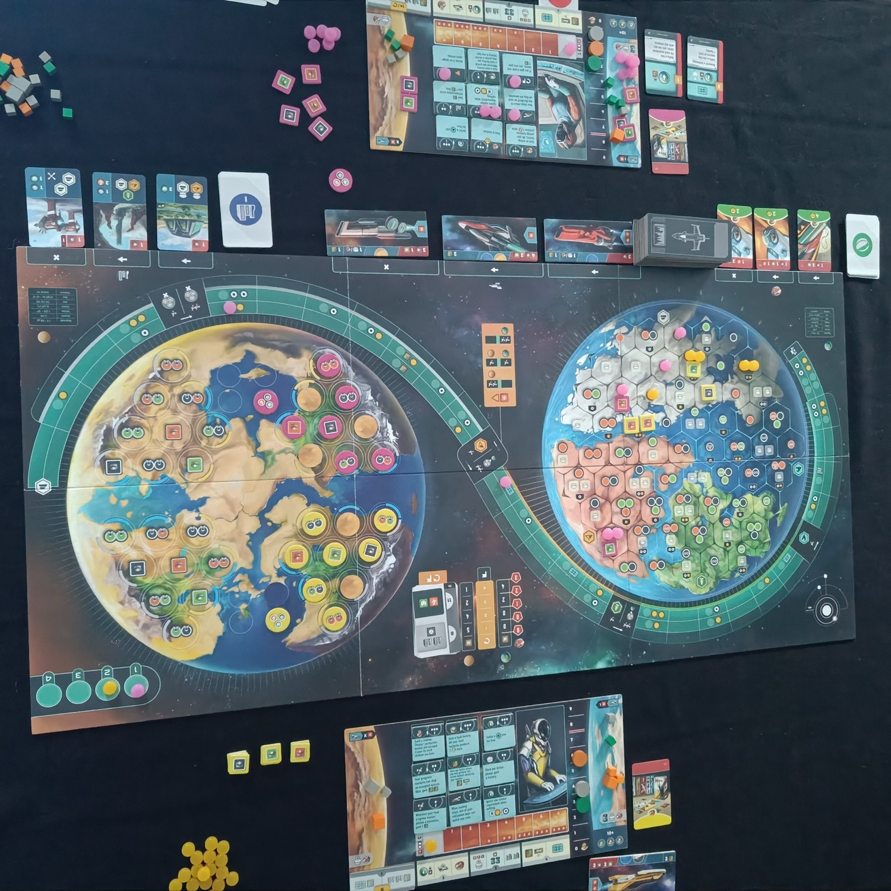
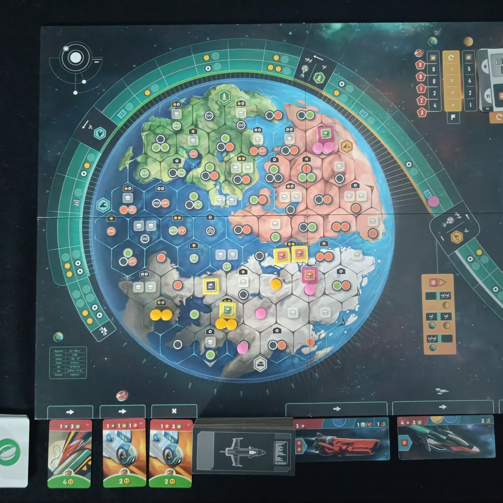
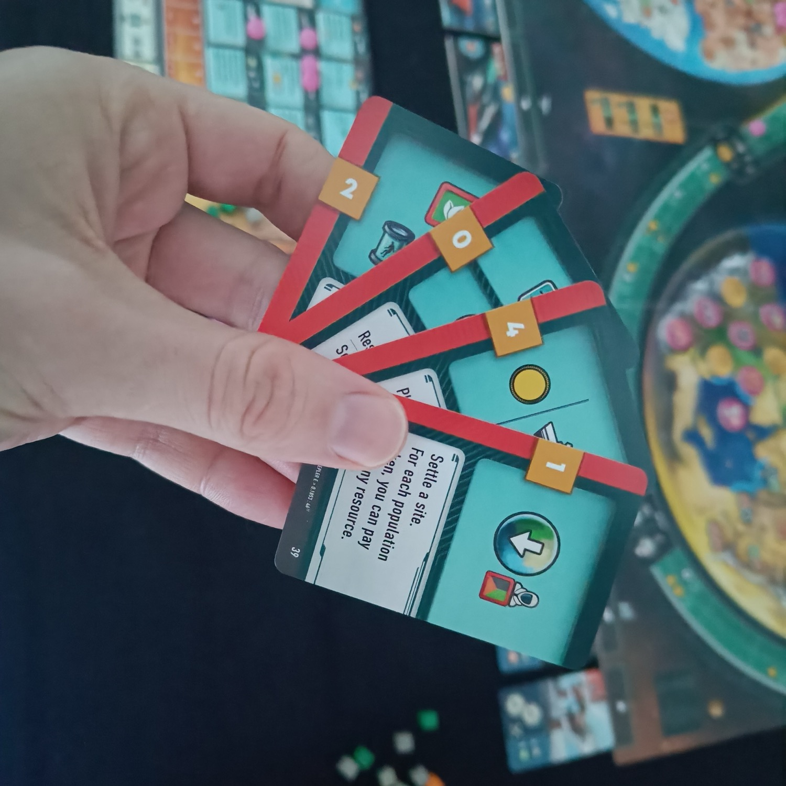

<Setting>

   Lo sentite anche voi questo caldo? Un po’ forte per non essere ancora in primavera vero?  
  Ma da quand’è che fa così caldo? E perché quelle foreste bruciano? Perché mi sembra che l'atmosfera non ci protegga più dai raggi ultravioletti?  
  Oh m***a, la fine del mondo è arrivata!!! Il nostro caro pianeta è oramai al collasso, e dobbiamo scappare prima che sia troppo tardi. L’atmosfera che per milioni di anni (anzi miliardi) ci ha protetto si sta dissolvendo, le radiazioni solari stanno incenerendo tutto e a noi non resta altro che scappare via: abbiamo solo pochi anni per farlo! Dobbiamo costruire delle astronavi e trasferirci su un nuovo mondo abitabile da poco scoperto, e lì insediarci per dare avvio ad una nuova fase dell’umanità: ce la faremo?

</Setting>

<Rules>

   Evacuation (Hexodus nella versione italiana pubblicata da Tesla Games) è un gioco competitivo per 1-4 giocatori incentrato sulla gestione risorse.   
  L’obiettivo di gioco è quello di trasferire il più velocemente ed efficacemente possibile le proprie infrastrutture e la propria popolazione dal “vecchio” al “nuovo mondo”, rappresentati entrambi sulla plancia principale di gioco.   
  All’inizio della partita ciascun giocatore prenderà in gestione un sistema di fabbriche e lavoratori già attivi sul vecchio pianeta, che produrranno un notevole numero di risorse. Il problema sarà come far evacuare e ricostruire tutto questo sul nuovo pianeta prima della fine del gioco, soprattutto in considerazione del fatto che ciascuna risorsa non sarà sempre a disposizione, ma potrà essere sfruttata solamente sul pianeta dove questa è presente in quel momento: potreste avere ad esempio anche un numero molto alto di risorse, ma se non saranno posizionate sul pianeta giusto al momento opportuno diverranno inutilizzabili.   
  Durante ciascun turno (nel gioco “anno”), dopo una prima fase di produzione di risorse e soddisfacimento dei bisogni di cibo e di svago (ovvero di stadi) per la popolazione, ogni giocatore potrà svolgere alcune azioni per costruire fabbriche o stadi sul nuovo pianeta, realizzare astronavi (utili per il trasferimento delle strutture, della popolazione e delle risorse tra un pianeta all’altro), sviluppare una tecnologia (ciascuna delle quali fornirà dei potenziamenti passivi), stabilire delle infrastrutture sul nuovo pianeta, oppure semplicemente ottenere e/o scambiare risorse da una tipologia ad un'altra. Nella versione base del gioco queste azioni saranno uguali per tutti, mentre, con la variante delle azioni avanzate, ciascuno potrà giocare delle carte che permetteranno di svolgere e combinare le azioni in maniera ogni volta differente.  
  Dopo due azioni, ciascuna di queste richiederà anche di spendere un ammontare di energia sempre crescente e, quando un giocatore deciderà di passare (per sua scelta o perché non ha più energia a disposizione per svolgere azioni), si andrà alla fase successiva, in cui far viaggiare le proprie astronavi per trasportare popolazione, risorse, fabbriche o stadi nel nuovo mondo, preparandosi per il turno successivo.  
  Infine, si determinerà il proprio “power level” (sulla base delle azioni precedentemente giocate), attraverso il quale muovere i satelliti, utili per ottenere nuove risorse e/o la possibilità di colonizzare ulteriori territori sul nuovo pianeta.  
  Ad Evacuation si può giocare con due modalità principali (a loro volta combinabili con più moduli e varianti, che determinano anche le condizioni di vittoria):   
  <ul>
    <li>La modalità corsa: vince il giocatore che, entro un massimo di 4 turni, arriva ad un livello di produzione di 8 per ciascuna delle tre risorse del gioco e che costruisce tre stadi. Dopo il quarto turno, se ancora non vi è stato un vincitore, si determinerà chi ha vinto tramite punteggio. </li>
    <li>La modalità a punti: vince il giocatore che raggiunge il punteggio maggiore al termine del quarto anno, tramite il soddisfacimento di obiettivi personali ed eventualmente obiettivi comuni.</li>
  </ul>

</Rules>

<Feedback>

   Inutile girarci attorno: Vladimír Suchý è un game designer oramai molto rinomato (qualcuno ha parlato di Underwater Cities o di Pulsar 2849?), e questa fama è ben motivata osservando la qualità delle sue creazioni, come Evacuation.  
  Il gioco parte da una situazione quasi invertita rispetto ad un classico german: invece di creare un motore, qui saremo chiamati a smantellare un sistema già perfettamente funzionante, nell’intento di ricrearlo altrove. La modalità attraverso cui ciò si verifica è tecnicamente ottima: nonostante un regolamento per nulla semplice, il gioco scorre molto bene in tutte le sue diverse modalità. Siamo di fronte a un eurogame “duro e puro”, nel quale la capacità di pianificazione diventa fondamentale: Evacuation è punitivo e non perdona nulla, in quanto basterà poco per “incepparsi” durante la partita, ad esempio non svolgendo un’azione per la semplice mancanza di una risorsa Energia, oppure non programmando bene i viaggi spaziali delle proprie astronavi. Le variabili da tenere in considerazione sono molte (i fabbisogni di cibo, l’avanzamento lungo il tracciato dei satelliti, la produzione di energia nel nuovo mondo da metà partita in poi, l’evacuazione di tutta la popolazione dal vecchio pianeta), e tralasciare anche uno solo di questi aspetti potrebbe penalizzare in maniera molto forte a fine partita.  
  Insomma, Evacuation è un gioco dal regolamento impegnativo (per quanto non estremo) e con un grado di complessità del gameplay molto alto e sfidante.   
  A nostro avviso, l’unico punto debole è dato dalla scarsa interazione: di fatto siamo di fronte ad un multi-solitario e questo potrebbe incidere negativamente sulla longevità del titolo, specie mancando l’aspetto più tattico di ogni partita e potendo trascurare quasi totalmente il gioco dei nostri avversari.  
  La scalabilità (anche nella sua modalità in solitario) è ottima, ma il meglio si ha in 2 e 3 giocatori, mentre la variabilità dei moduli aggiuntivi e delle due modalità di gioco non sembra così rilevante: probabilmente, dopo qualche partita esplorativa,  alla fine ogni gruppo di gioco arriverà ad individuare una combinazione “preferita”, giocando da quel momento in poi quasi sempre con quella.  
  Cosa manca ad Evacuation per essere un capolavoro? È difficile da spiegare. Nonostante le qualità che non si possono oggettivamente non riconoscere e un gameplay tecnicamente ottimo sotto molti punti di vista (fluidità di gioco, rapporto complessità del regolamento e profondità di gioco, scalabilità, etc), alla fine l’esperienza a noi è risultata un po’ “fredda” e incapace di catturarci completamente. Ma questo è un giudizio molto soggettivo e dato da sensibilità forse troppo personali: non possiamo che consigliarvi di provarlo di persona, perché siamo sicuramente di fronte ad uno tra i migliori eurogame (se non il migliore in assoluto) del 2023.

</Feedback>

