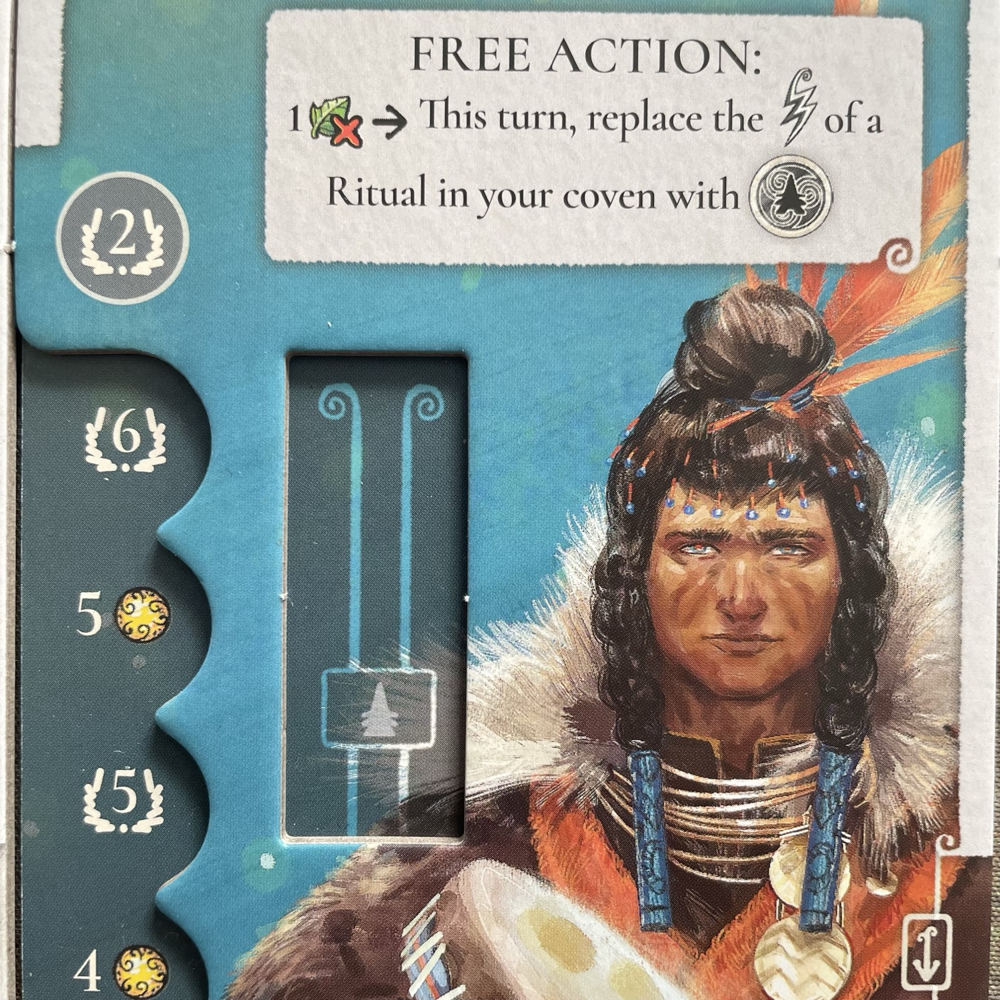
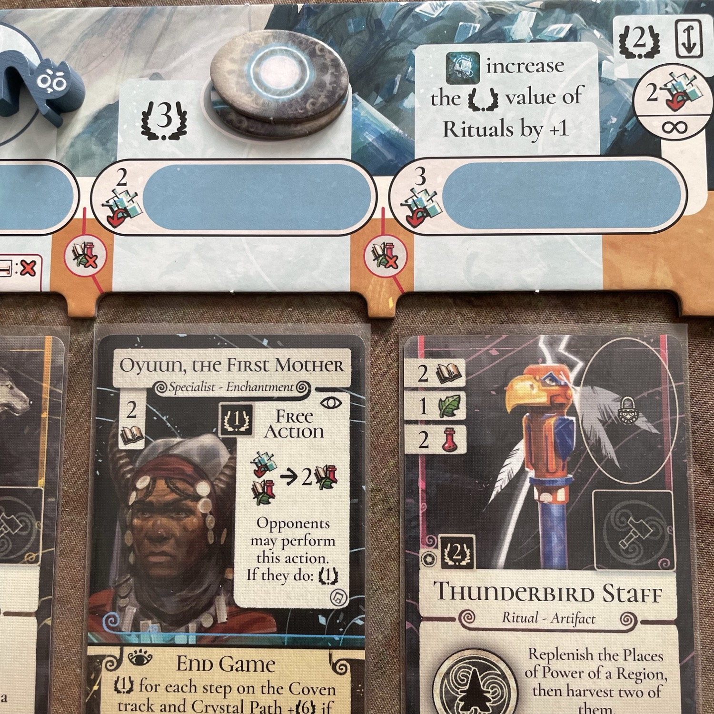

<OriginalReviewLink slug="evenfall" />

<Panoramic>

  Sono <strong>due</strong> i <strong>grandi protagonisti</strong> di questa prima (non si sa mai!) espansione di Evenfall: il <strong>Sentiero di Cristallo</strong> e i <strong>due Nuovi Clan</strong>, l’Onda (<em>The Wave</em>) e il Corno (<em>The Horn</em>), rispettivamente di media e alta difficoltà. Parliamo innanzitutto di queste nuove fazioni: la prima introduce un’azione gratuita che, al prezzo di un’erba, rende i rituali con effetto istantaneo riutilizzabili tramite un’azione principale; la seconda ruota attorno a una carta speciale, il Demone del Trono (<em>The Throne Demon</em>), che duplica il potere di uno specialista ad esso agganciato ogni volta che quest’ultimo si attiva, salvo poi a fine round eliminarlo dal gioco. 
Inoltre, The Crystal Path introduce nuovi bonus regionali, <strong>nuove carte Rituale</strong>, <strong>Specialista</strong> e <strong>Luogo di Potere</strong>, che si combinano agli effetti di un <strong>ulteriore Catalizzatore: il Cristallo</strong>. Attivare questo catalizzatore sui vostri rituali tramite l’invio di una Strega o di un Anziano vi consentirà di accedere al Sentiero del Cristallo, dove potrete ottenere bonus crescenti e carte del Mazzo Principale appositamente allocate in 4 slot sottostanti il tracciato. Avanzare sul tracciato renderà meno costoso l’accesso a tali Carte e vi consentirà di procurarvi vantaggi come Pietre del Potere e <strong>GattiMeeple</strong> che, sinuosamente inarcati sui cappelli delle streghe, incrementeranno il loro potere. 
Insomma, in Evenfall: The Crystal Path c’è quanto basta per far sì che d’ora in poi <strong>una bella varietà</strong> caratterizzi le vostre partite.

</Panoramic>

<Feedback>

  Dimenticate la “linearità” dei quattro clan del gioco base: le due nuove, tostissime fazioni porteranno scompiglio e chiederanno un supplemento di materia grigia per la pianificazione. Il clan The Horn, con la sua simulazione di una sorta di patto faustiano tra il Demone e gli Specialisti, è certamente il più sofisticato dei due e non dovrebbe essere messo a cuor leggero in mano a chi non abbia mai giocato a Evenfall. In ogni caso, <strong>il gioco si fa duro</strong> e <strong>l’albero delle decisioni andrà sfrondato e potato</strong> per garantire un flusso di concatenazioni pulito ed efficace. Le prime partite, superare i 100 punti sarà la vera sfida (soprattutto in meno giocatori). 
La vera chiave di volta di questa espansione è <strong>il Sentiero del Cristallo</strong>, che <strong>va battuto prima possibile</strong>, attivando i Cristalli Catalizzatori costruiti sui Rituali per ascendere ai suoi livelli avanzati, dove ottenere i bonus. Il rischio di non battere il Sentiero del Cristallo è quello di vedersi scivolare via le opportunità (e le carte disponibili nei suoi 4 slot) che consentirebbero di incrementare il proprio motore. <strong>Mai come con questa espansione ci si sente in ritardo già dal primo round</strong>, quando la limitatezza imposta da un motore ancora in formazione vi farà disperare almeno tanto quanto vi sorprenderà, poi, la crescita esponenziale delle sue prestazioni già dal secondo (e penultimo!) round. 
<strong>In 2 giocatori</strong>, questa espansione (che, nonostante l’integrabilità modulare, ha tutta l’aria di essere diventata indivisibile dal gioco base) sfodera già tutte le sue potenzialità: una più sofisticata pianificazione, decisioni ancora più sofferte, tante carte nuove da imparare a gestire e inedite sinergie da scoprire. Nonostante il supplemento di “spremimeningità” richiesto, poi, <strong>in 4 giocatori</strong> al limite vedrei bene giocare a Evenfall anche casual gamers: mi terrei invece alla larga dal trovarmi al cospetto di tanti esperti allo stesso tavolo, magari anche tutti storici giocatori di Magic e ansiosi di ponderare ogni singola scelta e ogni possibile alternativa. Forse con The Crystal Path vivrei meglio l’esperienza di gioco <strong>in 3 giocatori</strong>, che, per i miei gusti, si configura attualmente come il numero più rotondo e soddisfacente per una partita ad Evenfall. 
A fronte di queste interessanti novità ci sono ovviamente delle <strong>contropartite</strong>, per quanto dal mio punto di vista trascurabili: con The Crystal Path il gioco diventa davvero esigente e vira nettamente in direzione di un pubblico di nicchia (fatto di per sé non disdicevole). Inoltre, quest’espansione potrebbe portare con sé qualche dispiacere per i puristi dell’estetica, dato che le carte imbustate non si incastrano esattamente negli appositi spazi sotto il Sentiero di Cristallo e il cubetto segna-round faticherà a incastrarsi a dovere. 
Ma, alla fine, <strong>i pregi sono davvero più significativi delle mancanze</strong>. Dopo The Crystal Path, Evenfall è ancor più quel <strong>titolo adulto, ben piantato e ispirato</strong> a un preciso canone ludico: parla al suo pubblico senza fronzoli e senza ricorrere a un’ibridazione di meccaniche pur di risultare gradito a tutti. Una <strong>scelta coraggiosa e consapevolmente anticonformista</strong> rispetto alle convolute logiche del “ludocapitalismo”. 
Nota di merito anche agli <strong>evocativi disegni di Martin Mottet</strong>, il quale con il suo stile ci consente di calarci visivamente nel gioco, con i suoi colori spenti e terrosi, spalmati su ambientazioni desertiche e solitarie, paesaggi fantastici, ma senza vita, pronti ad essere plasmati dalla magia: un mondo alterato e vuoto, insomma, che attende di essere riempito da rituali. 
<strong>Grandi soddisfazioni, perciò, con questa espansione</strong>, di cui <strong>difficilmente si potrà fare a meno</strong> d’ora in poi, portando Evenfall a un livello superiore.  
Preparate la vostra Congrega e, con l’Evenfall in arrivo, non fatevi scappare The Crystal Path!

</Feedback>

