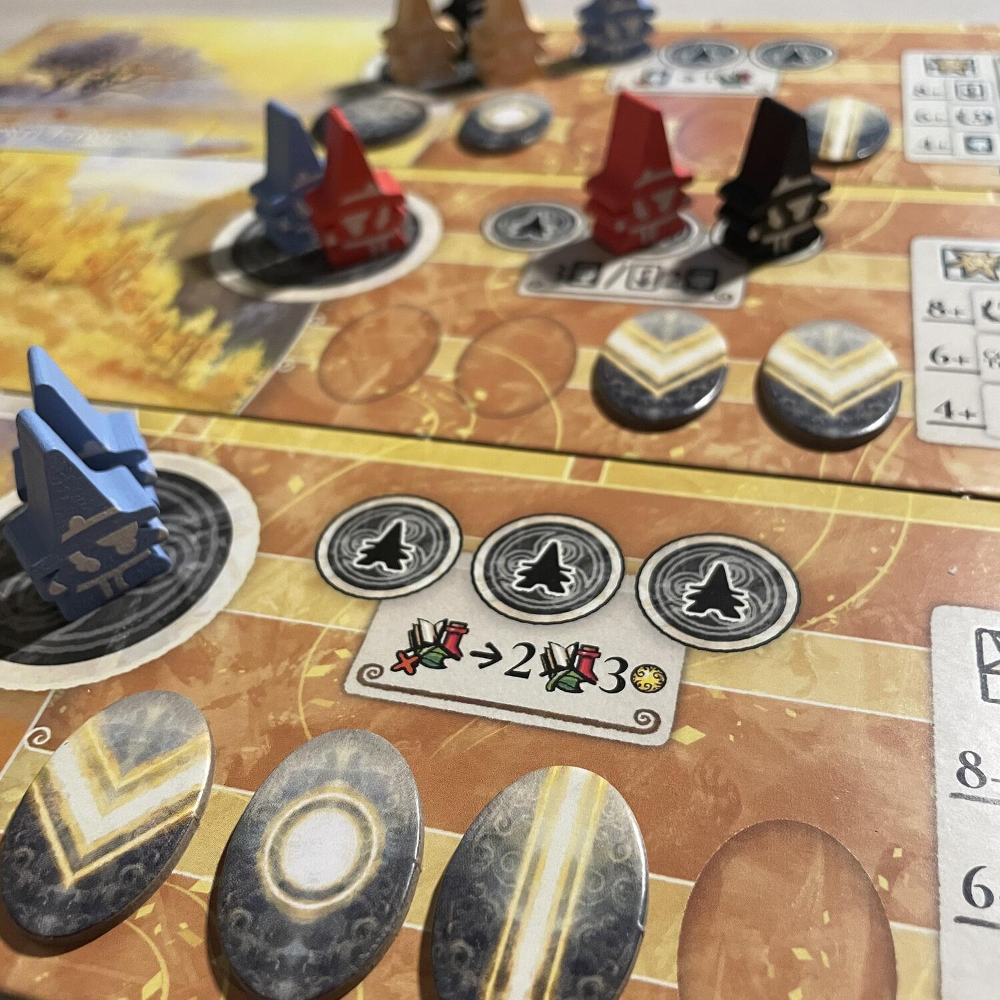
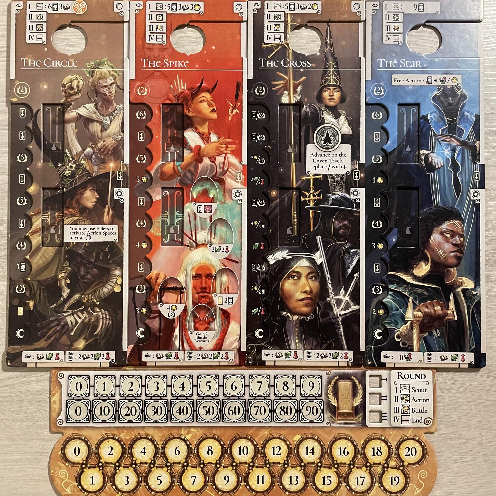
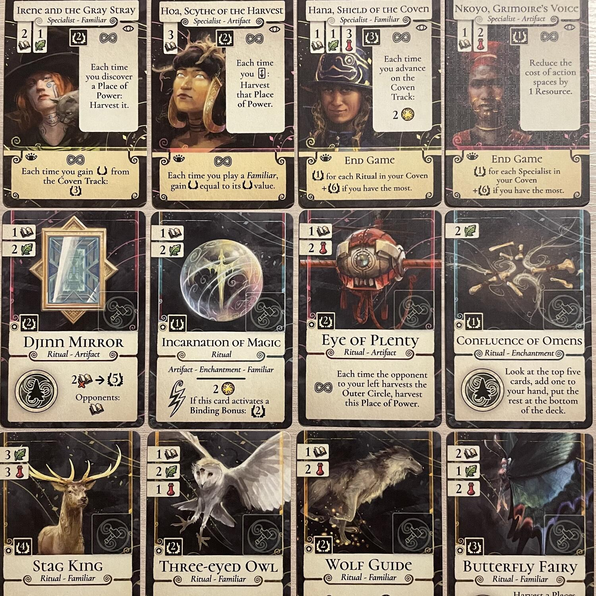

<Setting>

  L'Evenfall si avvicina e i Clan della Magia si preparano per la nuova era. Ma
  questa è una fase di disordini, durante la quale i confini della realtà si
  assottigliano e il soprannaturale si risveglia. L'Albero dei Mondi spalanca le
  proprie porte verso Regioni remote. Clan di Streghe scopriranno nuovi Luoghi
  di Potere e li useranno per compiere potenti Rituali e combattere per il
  controllo delle Pietre Magiche. Solo uno dei Clan potrà però sedersi sul Trono
  Incantato e guidare il mondo verso una nuova era!

</Setting>

<Rules>

  A seconda del numero dei giocatori e della asimmetria che si vuole avere nella
  partita, i giocatori predispongono le 2 o 3 Regioni, ciascuna con i relativi 3
  o 4 Luoghi di Potere e le 4 Pietre del Potere; prendono le Plance, i Meeple e
  gli altri item personali; ottengono 3 Erbe e 3 Pozioni come risorse iniziali.
  Quindi, si può cominciare.
   
  Una partita dura tre round, ciascuno dei quali diviso in 4 fasi:
  <ol>
    <li>      <strong>Fase di Ricognizione:</strong> i giocatori ottengono risorse
      (dalla riserva principale), mana (indicandolo sul relativo tracciato) e
      carte (dal Mazzo Principale), sulla base di quanto indicato in cima alla
      Plancia del loro Clan.</li>
    <li>      <strong>Fase Azione:</strong> in senso orario, ogni giocatore svolge
      un’Azione Principale e quante Azioni Gratuite vuole (per Azione Gratuita
      si intende sia scartare due carte per ottenere in cambio una risorsa a
      scelta tra Erbe, Pozioni e Conoscenza, sia attivare un’azione presente su
      una Carta nella propria area di gioco). Quando un giocatore non vuole o
      non può più svolgere almeno un’Azione Principale nel proprio turno, deve
      passare.</li>
    <li>      <strong>Fase delle Battaglie:</strong> in ogni Regione (in ordine da
      quella collocata più in alto – che determinerà anche il Primo Giocatore
      del turno successivo – a quella più in basso) avrà luogo una Battaglia. La
      forza dei giocatori dipenderà dal numero di Streghe e Anziani presenti
      nella Regione, a cui si aggiungerà il Mana speso durante un’asta nascosta.
      Tutti i partecipanti allo scontro otterranno Bonus proporzionati alla
      Forza spesa, ma solo il vincitore otterrà una Pietra del Potere.</li>
    <li>      <strong>Fine Round:</strong> si prepara il round successivo o (se si
      tratta della fine del terzo round) si procede con il conteggio finale.</li>
  </ol>
  Il cuore del turno è costituito dalla Fase Azioni. Le Azioni Principali sono:
  <ul>
    <li>      <strong>Scoprire un Luogo di Potere:</strong> il luogo costa un certo
      numero di Streghe (gli Anziani non possono scoprirli, salvo diversamente
      indicato sulle carte), indicato dalla carta; esse vanno collocate sullo
      spazio circolare della Regione; poi, si aggiunge il Luogo al proprio
      Circolo Esterno – ovvero sulla zona in alto a destra della Plancia del
      proprio Clan. Finché non verranno spostati nel Circolo Interno – ovvero la
      zona in basso a destra della Plancia personale –, i Luoghi di Potere
      potranno produrre (cfr. azione successiva) e vi si potranno anche giocare
      potenti Rituali.</li>
    <li>      <strong>Attivare il Token del Clan:</strong> una volta per Round si può
      dichiarare di voler attivare il Token del proprio Clan e capovolgerlo, per
      beneficiare del relativo effetto, ovvero far produrre Risorse, Mana e/o
      Punti Vittoria a tutti i Luoghi di Potere collocati nel Circolo Esterno.</li>
    <li>      <strong>Giocare una Carta:</strong> nello specifico, una Carta Rituale
      (posta a coprire parzialmente un Luogo del Potere del proprio Circolo
      Esterno, che potrà innescare eventuali effetti di Legame), una Carta
      Specialista (pagando il costo indicato e ponendola alla sinistra della
      propria Plancia) o una Carta Membro del Consiglio (pagandone il costo
      indicato in basso sulla propria Plancia, a seconda che sia il primo Membro
      del Consiglio giocato o uno qualunque dopo il primo).</li>
    <li>      <strong>Usare uno Spazio Azione:</strong> collocare una Strega sullo
      spazio azione di una Carta (un Anziano può normalmente attivare solo
      Rituali localizzati nel Circolo Interno) ed eseguire l’azione.</li>
    <li>      <strong>Costruire Catalizzatori:</strong> al prezzo indicato, un giocatore
      può costruire un Falcetto o un Orbe, collocandoli in un apposito spazio
      vuoto di un Rituale, rispettivamente per raddoppiare il bonus di raccolta
      del relativo Luogo di Potere o per Avanzare di una casella sul Tracciato
      Congrega della propria Plancia.</li>
  </ul>
  <strong>Alla fine del terzo round di gioco</strong>, scartate tutte le Carte e
  le Risorse rimanenti, si procede al calcolo del punteggio: prima di tutto, per
  raddoppiare i Punti derivanti dai Rituali a fine partita, ogni giocatore può
  piazzare le Pietre del Potere che ha guadagnato durante le Battaglie nei
  Luoghi che sono nel proprio Circolo Interno, avendo cura di far corrispondere
  i rispettivi simboli e di piazzare non più di una Pietra per ogni Luogo.
  Quindi, aggiunge a questi Punti quelli derivanti dagli Specialisti del proprio
  Clan in gioco e dai Membri del Consiglio con Effetti di Fine Partita. Chi ha
  più punti vince, con eventuali pareggi risolti in vantaggio di chi ha più
  Mana.

</Rules>

<Feedback>

  Evenfall è un gioco il cui punto di forza consiste nella volontà di offrire
  l’esplorazione di una gran quantità di sinergie tra le carte agli amanti del
  genere, sullo stile di <Link to="/reviews/seasons">Seasons</Link>, il che lo
  rende un titolo da tenere in attenta considerazione tra i cacciatori di combo
  e gli amanti dell’inesauribile potenziale sommerso delle combinazioni di
  carte. Eppure, Evenfall è più di tutto questo: il gioco offre anche la
  possibilità di esplorare una gran quantità di sinergie tra le varie meccaniche
  che intreccia sul campo, aprendosi in generale a un pubblico più ampio
  possibile… E ci riesce: per quanto si tratti dell’<strong>opera prima</strong>{" "}
  di Stefano Di Silvio, siamo di fronte a un gioco già adulto che, se da una
  parte riflette una profonda comprensione delle principali meccaniche in
  circolazione, dall’altra rivela una notevole capacità di rinnovarle e
  combinarle in modo originale.
   
  Anche se esiste una versione “alleggerita” che consente un inizio soft, le
  peculiarità dei Clan e il loro impatto sul flusso di gioco meriterebbero di
  essere apprezzate sin dalla prima partita: per questo motivo, consigliamo
  Evenfall principalmente a gruppi che siano già appassionati del genere e ne
  abbiano una certa dimestichezza. Per lo stesso motivo, ci sembra opportuno
  consigliare di seguire sin dalla prima partita le indicazioni per esperti, per
  poterne apprezzare al meglio le ampie possibilità strategiche, altrimenti più
  difficili da cogliere. Certo, non si può dire che, a causa della sua migliore
  giocabilità al pieno delle sue potenzialità, Evenfall si ponga
  aristocraticamente fuori dalla portata di giocatori meno esperti. Anzi: la
  simbologia di semplice comprensione (alla Res Arcana), il crescente e quasi
  spontaneo potenziamento della strategia di fondo, individuabile sin dalle
  prime azioni, e infine il sistema dell’asta nascosta nelle battaglie, già
  visto in giochi come <Link to="/reviews/rising-sun">Rising Sun</Link> ma qui
  estremamente semplificato, sono tutte scelte che, pur facendo di Evenfall un
  titolo di una certa complessità, non lo pongono in una dimensione di
  isolamento rispetto a un pubblico non specialista.
   
  Per quanto riguarda la scalabilità, precisiamo innanzitutto che è prevista
  un’agevole modalità “Automa” per partite in solitaria, che richiede un setup a
  parte con un’apposita plancia. Quanto al resto, se già una partita in 2 darà
  grande soddisfazione (pur con combattimenti di minore impatto), e in 3
  apprezzerete meglio il sistema delle battaglie, in 4 ne godrete senz’altro il
  pieno potenziale, rischiando forse rallentamenti da paralisi da analisi,
  laddove al tavolo si trovassero forti pensatori. Neanche di fronte a possibili
  rallentamenti del flusso di gioco, tuttavia, Evenfall perderà il proprio
  fascino, particolarmente visibile in scelte come quella di mettere a
  disposizione dei giocatori due tipi diversi di lavoratori, una gran quantità
  di azioni da svolgere ogni turno, la ricca varietà di ogni partita e delle
  possibili combinazioni tra gli effetti di gioco.
   
  Tutto ciò premesso, è proprio il caso di osservare come Evenfall, in fondo,
  sia un finto peso leggero. Questo non soltanto perché può essere difficile
  (ovvero più difficile del solito) ricordare l’ordine di innesco di certe
  combo, ma soprattutto perché le carte si presentano alquanto dense di
  informazioni, imponendo sin dal primo turno (quando un giocatore può
  ritrovarsene in mano anche una decina) una forte concentrazione. Il vincitore
  sarà quindi, per forza di cose, non solo chi avrà avuto la capacità di
  intravedere le migliori combinazioni per massimizzare i propri punti vittoria
  sia in itinere che alla fine della partita, ma soprattutto chi a colpo
  d’occhio sarà stato in grado di individuare la strategia più praticabile e
  fruttuosa per il proprio Clan fin dai primissimi passi. Questo aspetto rende
  il titolo particolarmente immersivo, non favorendo l’interazione tra i
  giocatori al di fuori del gioco e impedendo momenti di divagazione mentale:
  chi cercasse questi specifici elementi di socialità, dovrebbe rivolgersi
  altrove. Al tempo stesso, l’insalata di punti e di meccaniche, che noi abbiamo
  ampiamente apprezzato, potrà risultare sgradita ad alcuni puristi del genere.
  Anche sul fronte dell’interazione, infine, dichiarata e valorizzata come
  indiretta, ci si renderà presto conto del fatto che selezionare certi spazi
  azione delle Regioni prima degli altri giocatori sarà cruciale per fare in
  modo che la propria strategia non si inceppi, e che le Azioni Gratuite
  potranno avere un potere snervante su alcuni.
   
  Ma alla fine, i pregi sono senz’altro più significativi dei difetti. L’unico
  motivo per cui al momento preferiamo non dare una valutazione più elevata a
  questo gioco, di cui abbiamo finora potuto apprezzare solo il prototipo (che,
  per quanto splendidamente illustrato da Martin Mottet e validamente attrezzato
  sul fronte dei componenti, non era del tutto esente da difetti estetici
  formali), è che aspettiamo di giocare la versione definitiva. Ci riserviamo
  pertanto di tornare sul pezzo per potervi dare in futuro ulteriori riscontri
  su questo titolo estremamente promettente!

</Feedback>

