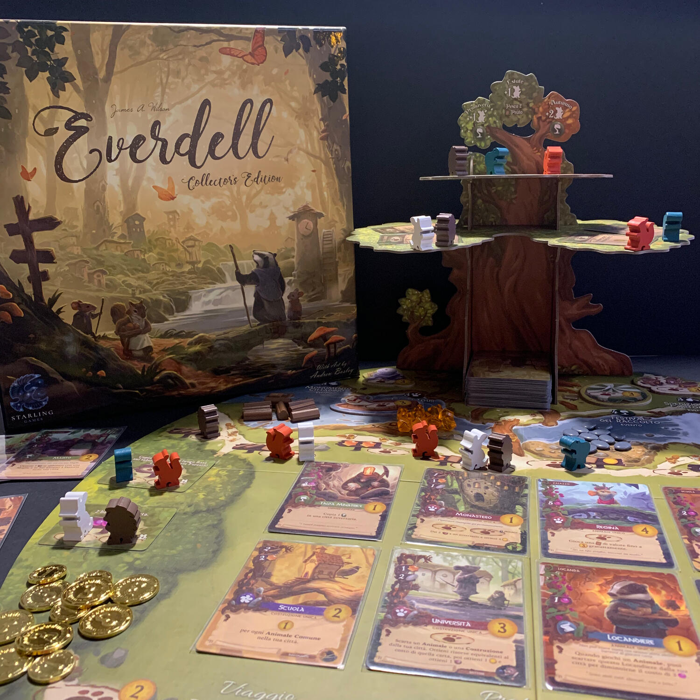
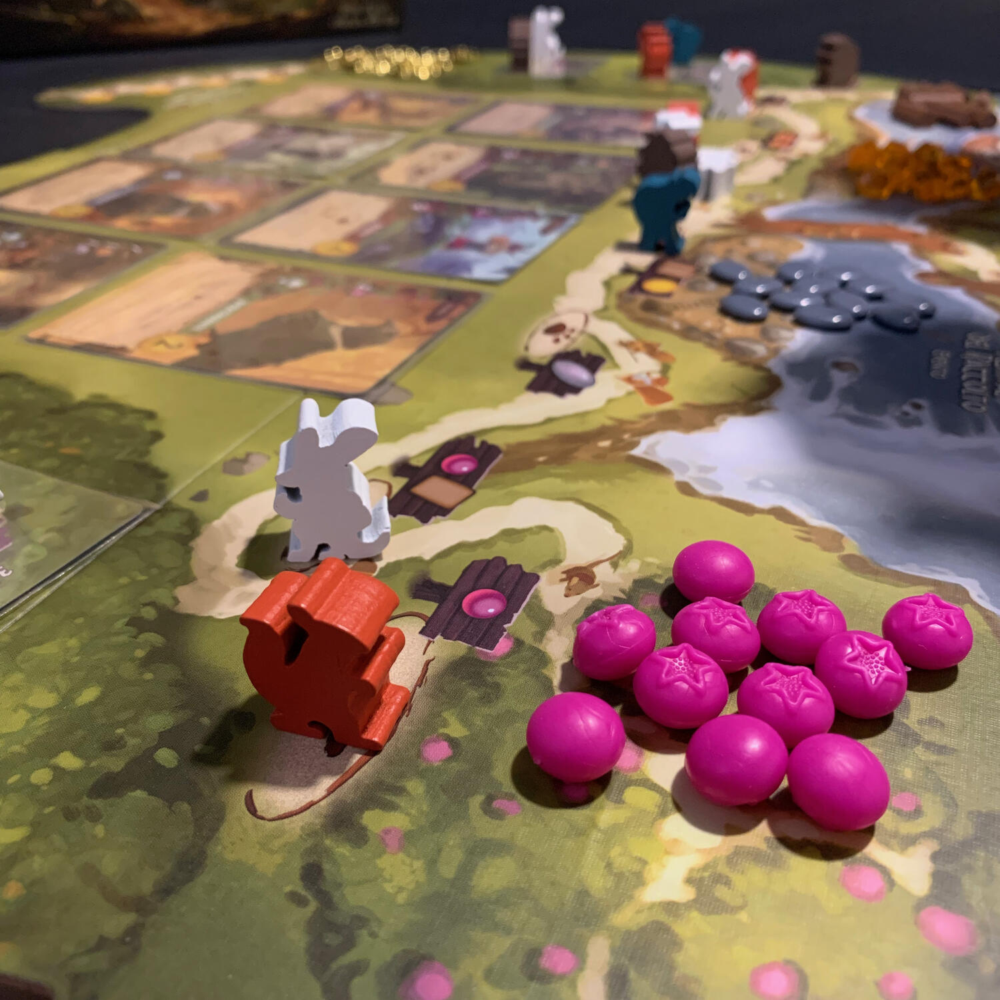

<Setting>

  All'interno dell'affascinante valle di Everdell, sotto i rami di alberi torreggianti, tra ruscelli tortuosi e cavità
  coperte di muschio, una fiorente civiltà di creature è in espansione. Da quando Corrin Evertail, il famoso
  avventuriero, ha scoperto il regno nascosto, i cittadini hanno prosperato sotto il riparo dell'Albero Eterno. Da
  Everfrost a Bellsong, molti anni sono passati, ma è finalmente giunto il momento di esplorare nuovi territori e
  costruire nuove città.
   
  Sarai il leader di un gruppo di creature intente proprio ad un simile compito. Ci sono edifici da costruire,
  personaggi vivaci da incontrare ed eventi da ospitare: sarà un anno impegnativo!

</Setting>

<Rules>

  Everdell è un gioco di tableau building (parolone per dire che userete delle carte per costruire la vostra città) e di
  piazzamento animaletti che vi porterà a gestire un gruppo di mammiferi per 4 stagioni, durante le quali dovrete
  costruire la città migliore del tavolo: un insieme di massimo 15 carte che, auspicabilmente, saranno sinergiche tra
  loro.  
  Ogni turno vi troverete a scegliere una mossa fra le tre disponibili: posizionare un animaletto, giocare una carta o prepararsi
  per la stagione successiva (passare).  
  La prima azione consiste nell'usare uno dei propri meeple disponibili, che andranno ad aumentare con il passare delle
  stagioni, in uno degli spazi liberi per ottenere risorse, pescare carte od ospitare eventi (quest).  
  La seconda azione, che di fatto è il cuore pulsante del gioco, consiste nel giocare carte dalla propria mano o dal prato,
  la zona in comune, pagandone il costo in risorse: gli animaletti sono ghiotti di bacche, mentre per gli edifici sono necessari
  ciottoli, legno e resina. Ad ogni carta edificio è collegata una carta animaletto che potrà essere giocata gratuitamente
  dalla propria mano nei turni successivi.  
  Ci sono diversi tipi di carte, quelle verdi orientate alla produzione, quindi alla creazione di un motore in grado di
  darvi risorse o carte, quelle blu capaci di assicurarvi abilità passive per il resto della partita, quelle rosse volte
  a creare nuovi luoghi dove mandare i vostri animaletti, quelle marroncine per effetti singoli ed infine quelle viola
  che sfrutteranno i criteri di costruzione della vostra città per darvi ancora più punti.  
  Prepararsi per la stagione successiva è, appunto, l'ultima azione possibile: si ottengono altri lavoratori e, in alcuni
  casi, si scatena la produzione delle carte verdi presenti in città.  
  Alla fine della quarta stagione, la partita termina e non resta che contare i punti.

</Rules>

<Feedback>

  Everdell è un gioco che non può mancare nella collezione di nessuno. Bellissimo dal punto di vista dei materiali e
  delle emozioni che genera giocare una carta per vederla incastrarsi in perfette combo con le altre.  
  Le bacche sono gommose, la resina trasparente e le carte hanno delle illustrazioni degne di quadri appesi in un museo.{" "}
   
  Se vogliamo trovare un punto negativo è sicuramente l'albero, inutile come poche cose al mondo, ma tanto bello da non
  poter fare senza.  
  Come avete potuto leggere, le regole sono davvero poche e facili da gestire, ma non per questo banali. Scegliere l'azione
  giusta al momento giusto potrebbe darvi una spinta pazzesca e, al contempo, impedire ai vostri avversari di portare a termine
  il loro piano. Inoltre, il fatto che in città ci possono essere al massimo 15 carte rende interessante ogni scelta di costruzione:
  meglio avere una costruzione in più e godere immediatamente del bonus o rischiare tenendo uno spazio vuoto nel caso si
  pescasse la carta giusta? Non c'è una risposta corretta, non si può rispondere a freddo, bisogna valutare partita per partita,
  azione per azione fino alla, si spera, agognata vittoria.

</Feedback>

