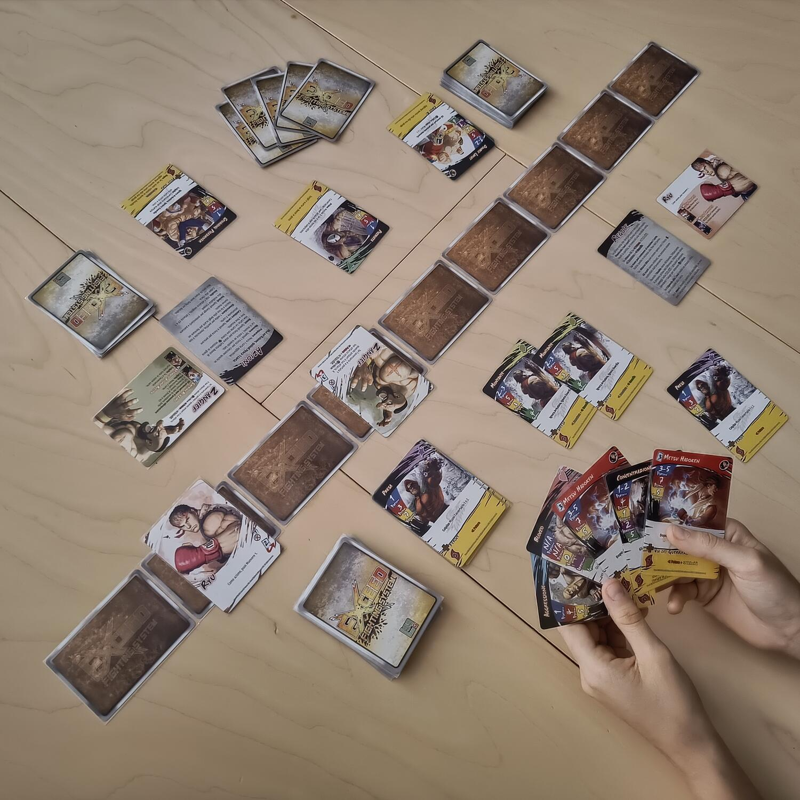
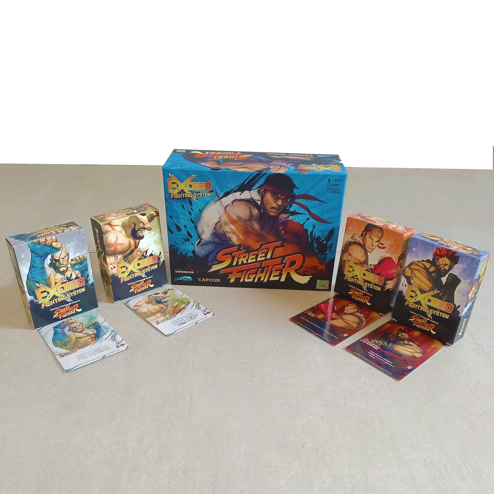

<Setting>

  Solo a sentire il nome, “Street Fighter”, è stato per me un tuffo nel passato:
  un viaggio attraverso i ricordi, quando da bambino andavo al bar dell’oratorio
  o alle sale giochi “arcade” dei centri commerciali a spendere ore del mio
  pomeriggio a sfidare i miei amici ai più disparati giochi, da “Metal slug” a
  “1941: Counter attack” fino al classicissimo flipper. Una partita a “Street
  fighter”, il “picchiatutto” per eccellenza, non mancava mai: “insert coin” e
  poi via, pugni, calci e botte da orbi, con Ryu (ma quanto forte era?), Zangief
  e tutti gli altri a sfidarsi fino a quando uno dei due non cadeva e la voce
  automatica non proclamava “You win!”. Dopo il successo non mancava mai
  l’esultanza da vittoria del Mondiale di calcio, così come dopo la sconfitta ci
  si lamentava sempre del bottone che dai, lo hanno visto tutti, lo premevo ma
  proprio non andava come doveva, sennò avrei vinto io.
   
  20 anni dopo, le sale giochi “arcade” sono state, divorate dall’avvento delle
  console domestiche insieme ai videogiochi pixelati (anche se nella Retromania
  che ci assale, vedo pubblicare sempre più videogiochi con la scelta precisa di
  questa grafica e stile). Ma il nome di Street Fighter è ancora più vivo che
  mai, a tal punto che la Level99 lo ha voluto riproporre come gioco di carte
  all’interno del suo Exceed Fighting System (del quale fanno parte altri
  titoli, come BATTLECon o Red Horizon). Questo è stato poi localizzato in
  italiano dallo <Link to="/publishers/studio-supernova">Studio SuperNova</Link>
  .

</Setting>

<Rules>

  Exceed: Street Fighter è un gioco di carte competitivo nel quale due sfidanti
  controllano due personaggi che si combattono fino a quando uno non perde tutti
  i suoi punti vita.
   
  Ciascun giocatore sceglie un personaggio fra i quattro disponibili nella
  scatola base (Ryu, Zangief, Akuma e Sagat) e il relativo mazzo di carte,
  formato da attacchi comuni fra tutti i combattenti, e attacchi normali o
  “ultra” specifici del personaggio, per un totale di 30 carte. Tutte le carte
  descrivono in una parte un attacco e in un’altra un “boost”, un potenziamento
  che può essere istantaneo o continuativo.
   
  Ogni giocatore partirà con 5 carte in mano e, durante la partita, non potrà
  mai averne più di 7.
   
  Vi sono inoltre 9 carte arena disposte sul tavolo in una linea, all’interno
  della quale i due combattenti (rappresentati da una carta) si muovono.
   
  Durante il proprio turno, ogni giocatore esegue una delle 7 azioni
  disponibili, che consentono di pescare una carta, di scartarne per pescarne
  altrettante, di muoversi di altrettante posizioni all’interno dell’arena, di
  giocare una carta come boost oppure di attaccare l’avversario.
   
  L’assalto verrà svolto giocando segretamente una carta dalla propria mano (o
  due uguali nel caso di un attacco EX, ovvero potenziato) simultaneamente
  all’avversario. Le carte verranno poi rivelate, confrontando i diversi valori
  di velocità (ovvero chi attacca per primo), portata (quanto vicino o distante
  devi essere rispetto all’altro combattente), armatura (resistenza ai danni),
  guardia (soglia limite di danni subiti per poter contrattaccare) e potere
  (danni da infliggere all’avversario).
   
  Quando un assalto viene eseguito con successo, questo viene convertito in
  “gauge”, una riserva che può essere spesa quando si vuole convertire il
  proprio personaggio in forma Exceed (guadagnando quindi alcuni poteri
  speciali) oppure per giocare attacchi ultra, altrimenti non eseguibili.
   
  La partita finisce non appena un giocatore ha esaurito i suoi 30 punti vita
  iniziali oppure quando ha terminato per due volte il suo mazzo di pesca.

</Rules>

<Feedback>

  Se hai voglia di “menare le mani” e di rifarti sul tuo amico che ancora non ti
  ha ridato i 20€ dell’ultima pizzata, Street Fighter può rappresentare un
  adeguato sfogo alla vostra ira funesta.
   
  Scherzi a parte, il gioco riesce a riprodurre fedelmente l’atmosfera e le
  dinamiche del famoso videogame: le partite sono veloci e improntate su un
  continuo scambio di mazzate e diverse mosse di combattimento. Sembra
  effettivamente di ritrovarsi davanti alla macchinetta in sala giochi, muovendo
  il proprio personaggio avanti e indietro lungo l’arena e cercando di sferrare
  il proprio assalto al momento giusto e di battere l’avversario sul tempo. La
  risoluzione degli assalti (dove entrambi i giocatori giocano in segreto le
  proprie carte, risolvendo poi la priorità in base alla velocità) ricrea la
  simultaneità del combattimento, proprio come nel videogame. Inoltre,
  nonostante l’obiettivo sia sempre solo colpire l’avversario, le diverse carte
  a disposizione con valori differenti richiedono un minimo di strategia e il
  giusto tempismo per essere giocate, magari preparandosi prima con alcuni
  boost.
   
  Le regole sono semplici, anche se il regolamento è scritto in maniera un po’
  farraginosa. I materiali sono buoni: la grafica è ben fatta e ha uno stile che
  richiama perfettamente il gioco originale. La scatola base è molto più grande
  rispetto al contenuto (probabilmente per contenere future espansioni), e ogni
  mazzetto viene fornito all’interno di una scatolina specifica per personaggio.
  Purtroppo non è presente un segnapunti, e questa assenza si sente durante le
  partite.
   
  In sintesi, Exceed Street Fighter è un gioco ottimo per partite veloci e poco
  impegnative, accessibile anche a giocatori neofiti, e che assicura
  divertimento e sfide avvincenti.

</Feedback>

