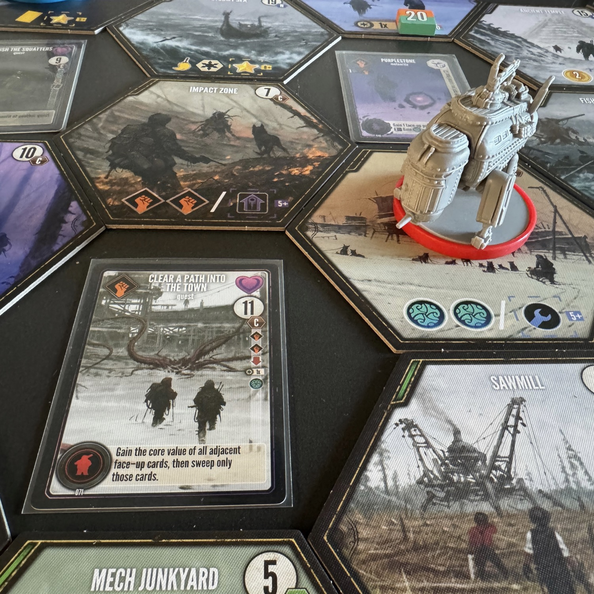
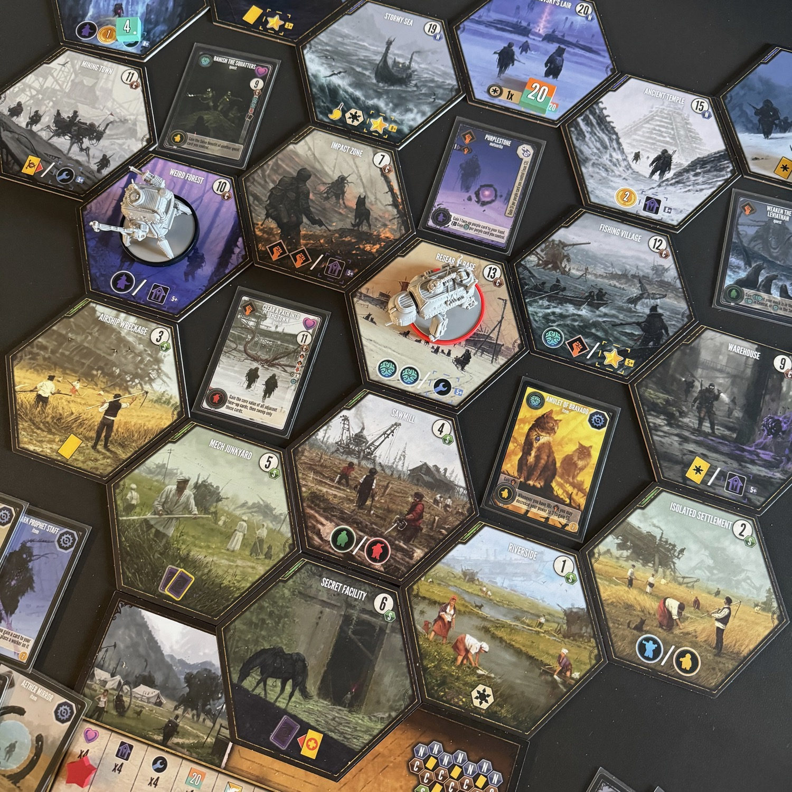
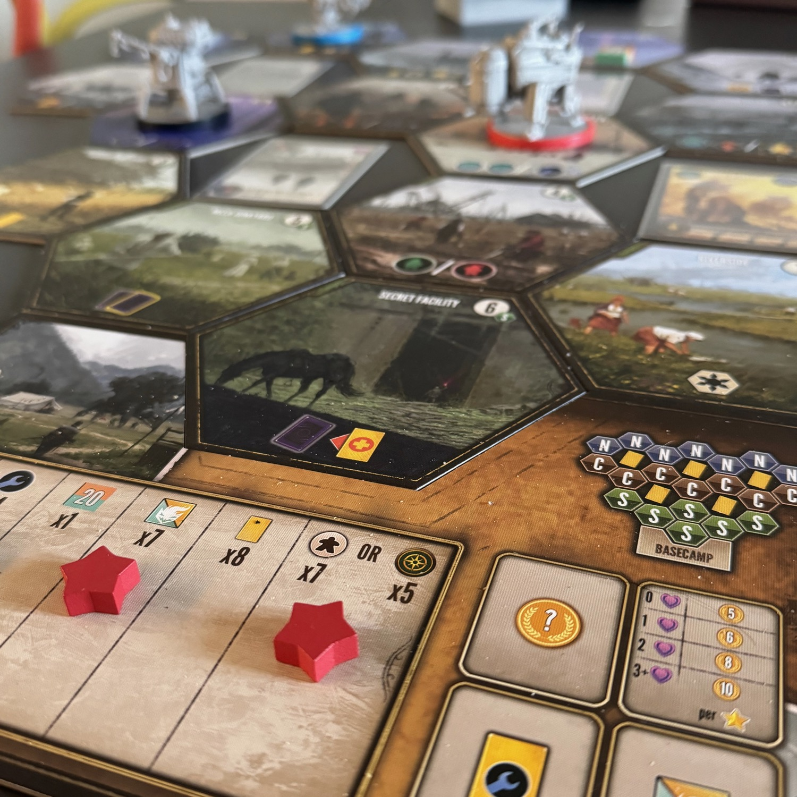

<Setting>

  Siberia. Un enorme meteorite si è schiantato vicino al fiume Tunguska, risvegliando <strong>un'antica corruzione</strong>. Una spedizione guidata dal dottor Tarkovsky si avventura nella taiga per studiare il meteorite e il suo impatto sulla terra. In cerca di avventure, i signori della guerra finanziano privatamente le proprie spedizioni in Siberia, sperando di trovare artefatti, superare sfide e, infine, ottenere la gloria.  

</Setting>

<Rules>

  Ogni giocatore guida un Mech che, a sua volta, è pilotato dal vostro eroe e dal vostro fedele amico a 4 zampe. <strong>Ogni turno inizia con la scelta delle azioni che svolgerete</strong>, a patto che esse non siano esattamente le stesse scelte nel turno precedente, tenendo viva la tradizione di <Link to="/reviews/scythe/">Scythe</Link>. Queste azioni sono: 
  <ul>
    <li><strong>muovere</strong>: si muove il Mech da 1 a 3 spazi sulla mappa;</li>
    <li><strong>giocare</strong>: si gioca una carta dalla propria mano per ottenere il bonus indicato. Inoltre, è possibile rafforzare l'azione giocandoci sopra anche il lavoratore richiesto.</li>
    <li><strong>raccogliere</strong>: si ottiene il bonus indicato sulla tessera dove è posto il Mech, come, ad esempio, pescare carte, ottenere lavoratori, completare missioni, migliorare il proprio Mech e molto, molto altro.</li>
  </ul>
  <strong>Invece di scegliere 2 di queste 3 azioni è possibile scegliere di ripristinare.</strong> Questa azione farà tornare le carte giocate nella mano (che è pubblica) e i lavoratori sulla vostra plancia, ma vi obbligherà immediatamente a passare. La contropartita è che potrete svolgere tutte e tre le azioni il turno successivo! 
  Ogni volta che ci si muove su un esagono ancora coperto, questo <strong>viene scoperto</strong> immediatamente e vi si posizionano sopra dei segnalini corruzione: questi bloccano la possibilità di svolgere alcune azioni. Per poterli togliere, bisognerà spendere potere e astuzia ottenuta precedentemente attraverso le carte giocate oppure raccolta dagli altri luoghi. 
  Le carte che giocherete sono principalmente di 3 tipologie: <strong>missione, oggetto e meteorite</strong>. Queste carte, attraverso alcune azioni presenti su altre carte oppure, più facilmente, attraverso l'azione di raccolta, potranno essere giocate per completare obiettivi (carte missione) oppure utilizzate per <strong>migliorare il proprio Mech</strong> (carte oggetto e meteorite). Le carte oggetto sono come i potenziamenti sotto i Mech di Scythe… solo che sarete voi a decidere come migliorare il Mech, scegliendo tra le <strong>25 carte oggetto disponibili</strong>. I meteoriti, invece, sono delle carte che renderanno le altre carte meteorite sempre più forti. 
  Similmente a Scythe, <strong>la partita termina</strong> quando un giocatore riesce a mettere <strong>4 token gloria</strong> (le stelle insomma) sulla plancia comune: queste vengono posizionate con gli stessi criteri del fratellone, come, ad esempio, dopo aver eseguito 4 potenziamenti, dopo aver fuso 4 meteoriti oppure dopo aver completato 4 missioni. 
  Si contano i punti considerando i token gloria e le missioni completate, gli oggetti costruiti, i segnalini corruzione rimossi e le altre monete collezionate nel corso della partita: chi ha più soldi è il vincitore!

</Rules>

<Feedback>

  <strong>Expeditions e Scythe hanno ben poco in comune</strong>, se non la firma di <Link to="/designers/jamey-stegmaier">Jamey</Link> e lo strepitoso art Jakub Rozalski: sono due giochi diversissimi e, soprattutto, <strong>se amate uno non è assolutamente detto che vi piacerà anche l’altro</strong>.  
  Di per sé, il gioco gira, è avvincente e vi chiederà, come sempre, <strong>di pensare a medio-lungo termine</strong>, di pensare dove volete arrivare, di ordinare mentalmente le vostre azioni e di svolgerle man mano che la partita prosegue.  
  Ho avuto l'occasione di giocare questo titolo <strong>in solitario e in 3</strong>: il feeling al tavolo è totalmente diverso. Anche per questo titolo della Stonemaier, <strong>l'automa di Automa Factory è semplicemente divino</strong>, quasi trasparente, impercettibile e perfetto per farvi conoscere il gioco e farvi crescere assieme alla difficoltà scelta. <strong>In 3 giocatori, invece, ci si trova davanti a un titolo totalmente diverso, molto stretto e, nei primi turni, odioso.</strong> Nel primo turno, è pressoché fondamentale ottenere un lavoratore di uno specifico colore attraverso l'azione di raccolta presente in alcuni esagoni; il problema è che lo stesso luogo permette di ottenere lavoratori di colori diversi e che uno stesso esagono può essere occupato da un solo Mech alla volta. Il primo che arriva ha il worker, il secondo no: se parti come ultimo giocatore hai una probabilità abbastanza alta di soffrire per questo e di sprecare un turno.  
  Tralasciando questo <strong>bug</strong> (perché sì, è un bug!) e superati i primi turni, il gioco gira liscio. Anche in questo titolo, i primi due terzi di partita servono come preparazione per l'ultimo terzo, <strong>dove si sbrodola tutta la boria collezionata e si portano a casa token gloria in tempi record.</strong> 
  Una differenza con il fratellone è che, per posizionare le stelline, bisogna svolgere l'azione corrispondente, non vengono messe in automatico! 
  Una similitudine con Scythe, e credo la mia caratteristica preferita del titolo, è che Expedition non ti richiede di fare benissimo il compitino, di fondere tutti i meteoriti, di completare tutte le missioni, bensì <strong>ti obbliga a capire quando sei in vantaggio e chiudere la partita</strong>. Citando i saggi del passato, "non importa se vinci di un centimetro o di un chilometro. L'importante è vincere". 
  Quindi Expeditions vale la pena? Sì, ma non aspettatevi Scythe. 
  PS: Su <a href="https://boardgamegeek.com/thread/3186355/unknown-fan-expansion" target="_blank">bgg</a> è presente un'espansione home made che rende il gioco un po' più aggressivo utilizzando le carte gialle di Scythe. Non provarla è un peccato!

</Feedback>

