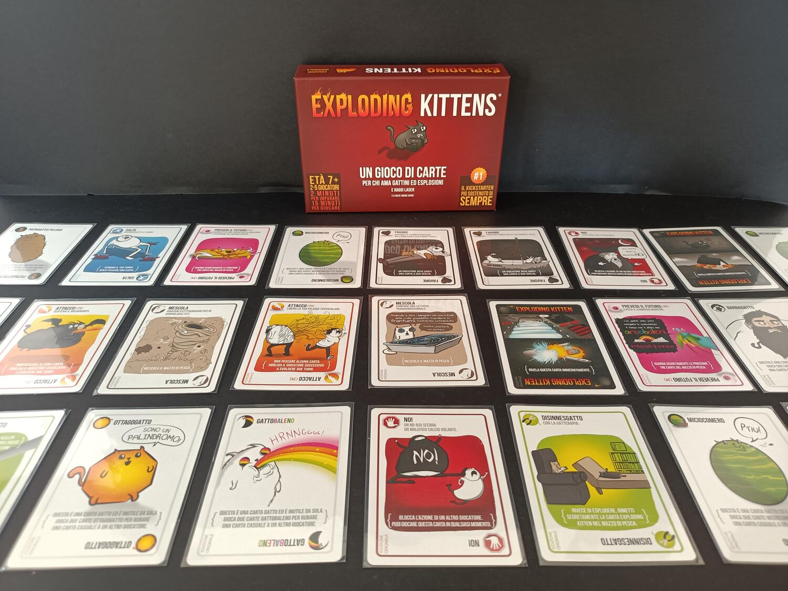
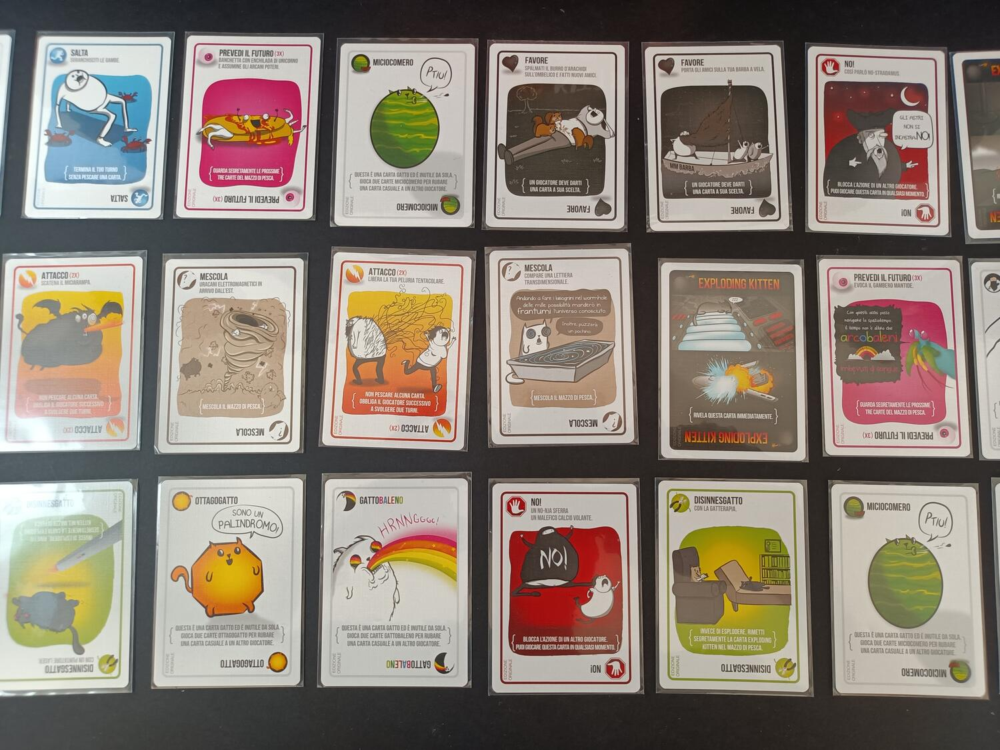

<Setting>

  Gattini, tanti, tantissimi gattini esplosivi. Nulla di più, nulla di meno.
  Cercate di non pescarli, o esploderanno ad ogni minimo movimento.{" "}
  <strong>Prevedete il futuro</strong> con una capra, usate un{" "}
  <strong>Barbagatto</strong> o un <strong>Patatagatto peloso</strong>,
  attaccate con un <strong>Orsodattilo</strong>; ma vi prego, vi prego, non
  pescate quei maledetti gattini.

</Setting>

<Rules>

  Exploding kittens è un gioco di carte semplicissimo. Come dice la confezione:
  “2 minuti per impararlo e 15 per giocarlo”.  
  In Exploding kittens inizieremo con otto carte, compresa la fantasmagorica carta{" "}
  <strong>Disinnesgatto</strong>: l'unica carta in grado di salvarvi da un gattino
  esplosivo. All'interno del mazzo di carte saranno presenti tanti Exploding kittens
  quanti i giocatori meno uno, quindi, ne rimarrà solo uno di voi!  
  Ad ogni turno un giocatore potrà giocare quante carte vuole dalla sua mano,
  come ad esempio: un Salta, un Prevedi un Futuro o un Attacco. In qualsiasi
  momento il giocatore può scartare due carte uguali per prendere una carta
  casuale da un giocatore, oppure, scartarne tre per chiederne una a sua scelta,
  ma in ogni caso...{" "}
  <strong>prendete quei maledetti Disinnesgatto o sarete spacciati!</strong>
   
  Con le regole avanzate potrete anche scartare cinque carte qualsiasi per
  pescare una carta dalla pila degli scarti, ma occhio ai <strong>NO!</strong>,
  sono <strong>mici</strong>-diali.
   
  Una volta giocate le carte, il giocatore dovrà pescare una carta dalla cima
  del mazzo: se è una carta normale la potrà aggiungere alla sua mano e passare
  al prossimo giocatore, ma se è un Exploding kittens dovrà giocare un
  Disinnesgatto o esploderà, uscendo dalla partita. Se usate il Disinnesgatto
  potrete posizionare il malefico gattino dove volete nel mazzo, in qualsiasi
  posizione, quindi, sbizzarritevi per cercare di far detonare i vostri
  avversari.  
  L'ultimo giocatore a sopravvivere sarà dichiarato il vincitore!

</Rules>

<Feedback>

  Exploding kittens prima di prenderlo non mi convinceva. Sembrava un altro di
  quei party game caciari che troviamo su tutti gli scaffali che probabilmente
  ha venduto tante copie solo grazie a qualche battutina carina sulle carte, e
  qualche immagine carina.
   
  Ma mi sono dovuto subito ricredere dopo la prima partita. Posso solo dirvi che
  ne abbiamo fatte poi altre <strong>dodici</strong> in quella serata. Exploding
  kittens è divertente, tanto divertente. Un mix di emozioni che vi faranno
  stare incollati alla sedia partita dopo partita con l'ansia di esplodere alla
  prossima carta. L'interazione è davvero ai massimi livelli, con tradimenti,
  bluff e colpi alle spalle; qui non vince sicuramente il più gentile. Inoltre,
  può essere giocato davvero con ogni tipo di giocatore; diciamo un party game
  un po' per tutti. Grazie alle regole davvero immediate può essere approcciato
  anche dai neofiti e dai giocatori alle prime armi. Inoltre le vignette e i
  disegni vi faranno ridere più di una volta durante le prime partite.
  Ovviamente rimane sempre e comunque un <strong>party game</strong>. Un gioco
  da fine serata da cui i giocatori avvezzi al german o a giochi più competitivi
  dovrebbero tenersi alla larga. La botta di cu*o è sempre dietro l'angolo e la
  fortuna fa da padrona in questo gioco. Ovvio, potrete gestire bene le vostre
  risorse ma in alcuni casi non servirà a nulla contro quei gattini.
   A mio avviso, <strong>Exploding kittens merita</strong>. Un titolo simpatico
  e divertente, per qualsiasi gruppo di giocatori, per serate davvero explosive.

</Feedback>

