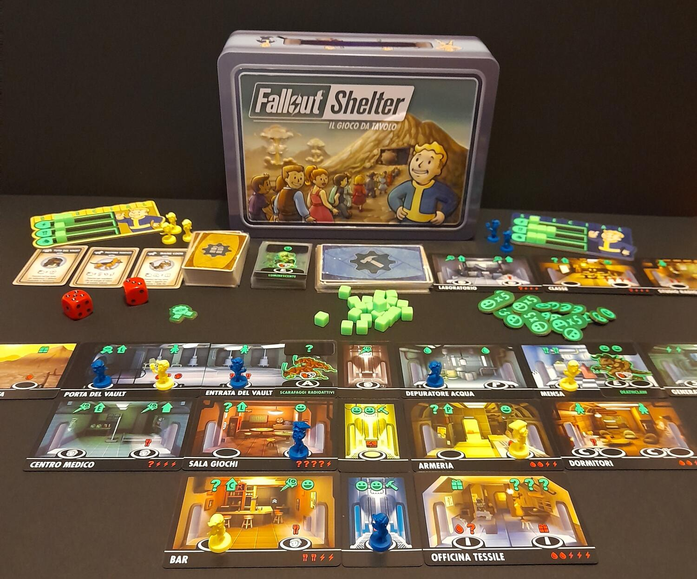
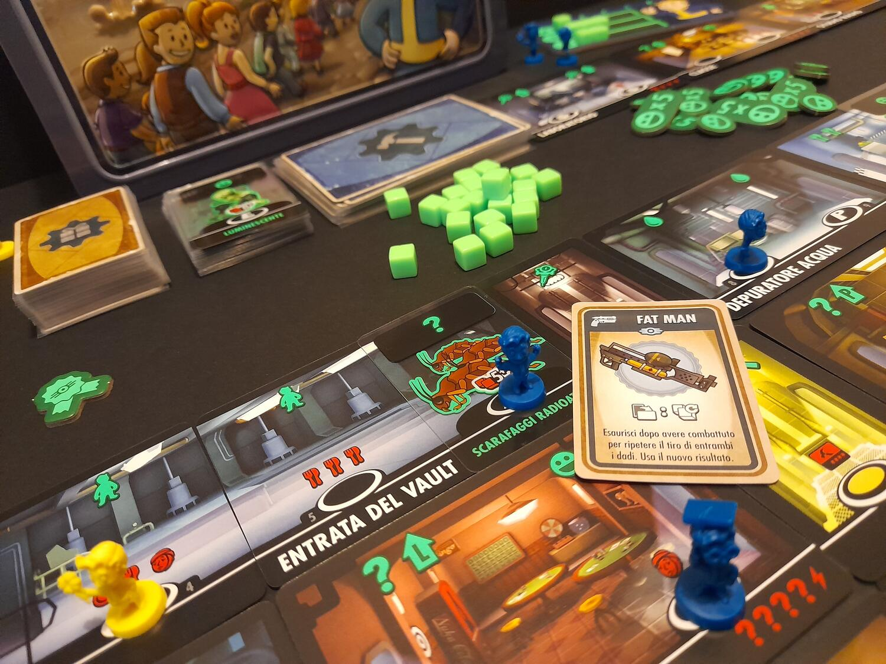

<Setting>

  Guerra fredda, bombe atomiche, morte e radiazioni. Fortunatamente, la VaultTec
  ha già pensato a tutto! Eccoci quindi in un bel bunker confortevole, in una
  splendida cittadina sotterranea sotto il fiducioso e benevolo sguardo del
  soprintendente del vault… Accidenti, è morto! Aspetta, cosa dice il manuale?
  Ah sì, appendice 8 comma 7D, “…deve essere eletto tra la popolazione del
  bunker…”.  
  Fallout Shelter: The Board Game deriva direttamente dal mondo di Fallout e dal
  videogioco mobile! In questo caso però mandare avanti il bunker non sarà abbastanza,
  perché a fine partita uno dei giocatori verrà eletto soprintendente, vincendo la
  partita. Scopriamo come!

</Setting>

<Rules>

  Lo scopo del gioco è possedere il maggior numero di punti felicità a fine
  partita. Questi si possono ottenere costruendo stanze, da alcune ricompense di
  queste, dall'eliminazione di alcune minacce e dai bonus degli oggetti.
   
  Il gioco si svolge in round in cui ogni giocatore può svolgere un turno,
  utilizzando un abitante, o passare. Utilizzare un abitante significa mandarlo
  a “lavorare” in una stanza, riscuotendone i benefici e pagandone i costi. In
  questo modo si ottengono risorse, nuove stanze, punti, oggetti o nuovi
  abitanti.  
  Quando tutti i giocatori hanno passato, vengono generate casualmente delle minacce
  (insetti giganti, predoni e avarie di varia natura: tutto nella norma per un bunker
  da post-apocalisse nucleare), che disattiveranno certe stanze. Nei round successivi
  sarà possibile mandare un abitante a risolvere (il che, il più delle volte, equivale
  a dire combattere) la minaccia con lanci di dadi ed eventuali oggetti.  
  Terminata anche questa fase ne segue una di ripristino, in cui si riattivano
  gli oggetti e si recuperano gli abitanti.  
  Il gioco prosegue così fino a che un giocatore non costruisce la sua sesta stanza
  o il mazzo delle minacce non si esaurisce.

</Rules>

<Feedback>

  Chi ha giocato alla versione videoludica riconoscerà fin dal primo sguardo i
  disegni di stanze, personaggi, oggetti e quant'altro. La scelta è stata fatta
  oculatamente per traghettare gli utenti del primo sul secondo. Oltre al
  comparto artistico, però, i 2 giochi hanno poco in comune: ci troviamo infatti
  di fronte ad un leggero piazzamento lavoratori, dove l'interazione si limita
  quasi unicamente al rubarsi spazi e oggetti vicendevolmente e dove, più che di
  strategia, possiamo parlare di tattica. L'uscita casuale di minacce, oggetti e
  stanze, infatti, renderà difficile panificare sul lungo periodo, ma obbligherà
  ad adattarsi di turno in turno in base alla situazione, ed è ovviamente questo
  il bello del gioco.  
  I materiali non sono molti, ma fanno il loro dovere (carte, cubetti di plastica,
  gettoni e plance in cartone). Tra questi spiccano le miniature degli abitanti,
  identiche ad alcune bobbleheads dei vault boy di Fallout 4, e la scatola in metallo
  simile ad un vecchio lunch box.  
  Poco più di un filler da pre o post serata giochi o un introduttivo per
  qualcuno che magari conosce il tema, Fallout Shelter risulta sempre godibile e
  divertente. Quindi… chi di voi sarà il prossimo soprintendente?

</Feedback>

