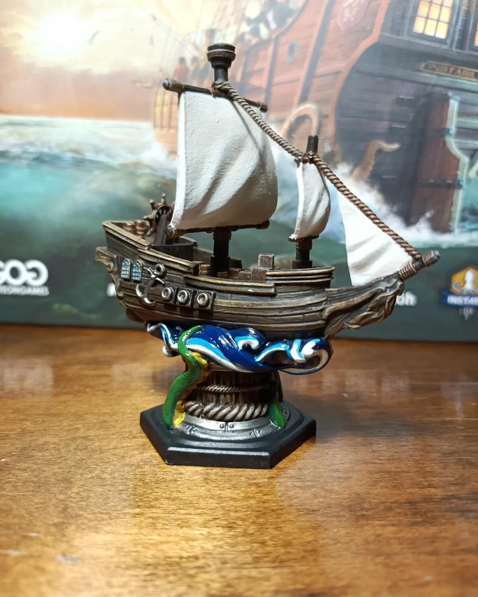
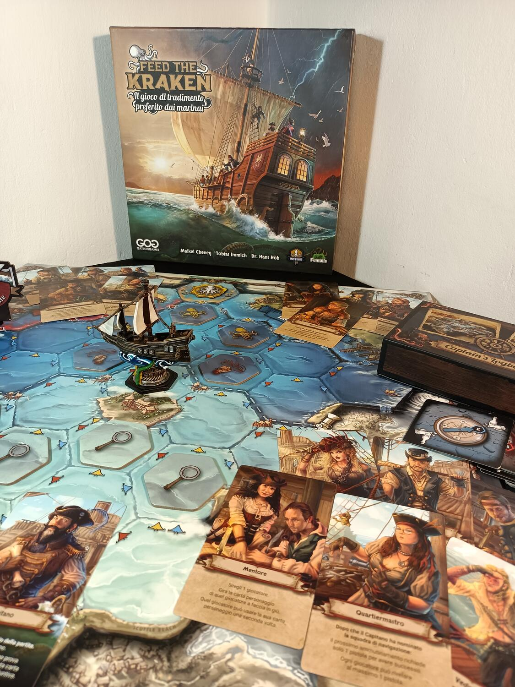

<Setting>

  Ciurma! Terra in vista!
   
  Il capitano di un vascello è approdato sulle spiagge di Crab Island e sta
  cercando un nuovo equipaggio per imbarcarsi in un viaggio senza ritorno. Non
  solo marinai saliranno sulla sua barca, ma anche pirati e pericolosissimi
  fanatici, dediti al culto dell’antico Kraken. Il viaggio sarà lungo e pieno di
  imprevisti, e la lealtà degli uomini non sarà sempre assicurata. Riuscirai ad
  arrivare sulle spiagge sicure o sarai dato in pasto alle fauci del Kraken?

</Setting>

<Rules>

  Feed the Kraken è un party game che prende a piene mani le basi e le
  meccaniche di giochi di bluff e ruoli nascosti come Lupus in tabula.
  Ovviamente, questo titolo presenta nuove piccole aggiunte, oltre ad
  un’ambientazione sempreverde come quella dei pirati.
   
  In Feed the Kraken vestiremo i panni di uno dei membri delle tre fazioni che
  compongono l’equipaggio della nave: Marinai, Pirati e Membri del culto del
  Kraken. Ognuna di queste fazioni avrà un obiettivo diverso per vincere la
  partita, ma a parte i Pirati, nessuno conosce la vera natura degli altri
  giocatori. Ad inizio partita ogni giocatore riceve: una carta Personaggio, che
  avrà un’abilità attivabile durante la partita; una carta ruolo; tre segnalini
  pistola. Inoltre, casualmente verrà scelto un Capitano. A questo punto il
  viaggio ha inizio.  
  All’inizio di ogni turno, il Capitano dovrà scegliere un Luogotenente e un Navigatore.
  A questo punto, la ciurma deciderà se dare fiducia al Capitano e assecondare la
  sua scelta, oppure se ammutinarsi. Tutto ciò viene fatto a suon di pistole. Se
  le pistole utilizzate totali sono sufficienti, il capitano viene deposto e il giocatore
  che ne ha usate di più prenderà il comando, scegliendo un nuovo Luogotenente e
  Navigatore, richiedendo la fiducia alla sua ciurma.  
  Se la ciurma è d’accordo, si dovrà scegliere una rotta da navigare. Il
  Capitano e il Luogotenente pescheranno due carte di navigazione ciascuno, ne
  sceglieranno una e la porranno all'interno dello scrigno di navigazione. Sarà
  poi il Navigatore, dopo averle mescolate, ad avere l’ultima parola sulla rotta
  da percorrere. Le possibilità sono semplicemente tre: sinistra, destra o
  centro. In alcuni casi ci saranno alcuni eventi dati dalle carte, o persino
  eventi dovuti al luogo in cui la nave è giunta. Dopo questa fase, il
  Luogotenente e il Navigatore diventeranno fuori servizio, e non potranno
  essere richiamati nel turno successivo.  
  Nel corso della navigazione, inoltre, i tentacoli del Culto potranno estendersi
  e convertire i membri della ciurma, portando più persone dalla loro parte. Ogni
  volta che la nave proseguirà dritta, il culto del Kraken avrà la possibilità di
  preparare un rituale, per avvantaggiarsi rispetto alle altre squadre. In base a
  dove la nave approderà a fine partita ci saranno epiloghi e vincitori diversi.
  La squadra dei Marinai vincerà se riuscirà ad arrivare sulle spiagge di Bluewater
  bay, sulla sinistra; i Pirati se arrivano a Crimson Cove, sulla destra; ed infine
  i Cultisti se riescono ad arrivare al centro della mappa o a dare in pasto il loro
  Leader al Kraken.

</Rules>

<Feedback>

  Feed the Kraken è stata una scoperta. Cercavo da tanto un gioco da tavolo da
  poter intavolare nelle serate con gruppi numerosi di giocatori, spesso anche
  poco esperti, e finalmente l’ho trovato. Nel corso del tempo si è fatto largo
  tra i miei party game preferiti, grazie anche al fatto che può ospitare fino a
  ben 11 giocatori al tavolo. Se ne avete abbastanza del classico Lupus in
  tabula, e cercate qualcosa di più eccitante e intrigante, Feed the kraken è il
  gioco che state cercando.  
  È semplice da imparare, anche se la spiegazione del regolamento non è proprio immediata
  a primo impatto, a causa dei numerosi eventi che possono avvenire durante la partita.
  Ma questo scoglio viene superato già dopo i primi turni, poiché i passaggi da fare
  sono abbastanza lineari e ripetitivi.  
  I componenti sono spettacolari: dalla mappa, ricca di dettagli e colori, alla
  miniatura del vascello davvero ben realizzata. Le illustrazioni delle carte,
  la presenza dei segnalini pistola, come dei segnalini Luogotenente e
  Navigatore, permettono di creare un’atmosfera immersiva e coinvolgente.
  Consiglio vivamente di mettere una musica piratesca di sottofondo, come
  ciliegina sulla torta.  
  La rigiocabilità è davvero alta, grazie al fatto che il fulcro del gioco è l’interazione
  dei giocatori al tavolo, il che crea situazioni sempre diverse in base al ruolo
  e all’esperienza dei giocatori. Anche i numerosi eventi che possono manifestarsi
  durante la partita, come l’ammutinamento, il potersi gettare al mare, il taglio
  della lingua o la fustigazione, garantiranno partite sempre varie ed eccitanti.{" "}
   
  Ho apprezzato la possibilità di affrontare la partita sia come viaggio corto,
  nel caso di meno giocatori, sia come viaggio lungo con gruppi più numerosi;
  tuttavia il gioco dà il meglio di sé con almeno sei o sette persone.  
  In conclusione, Feed the kraken è davvero un capolavoro del suo genere, un party
  game che esce dagli schemi introducendo piccole meccaniche e un’ambientazione davvero
  divertente, portando sui nostri tavoli una piccola perla dei mari.

</Feedback>

