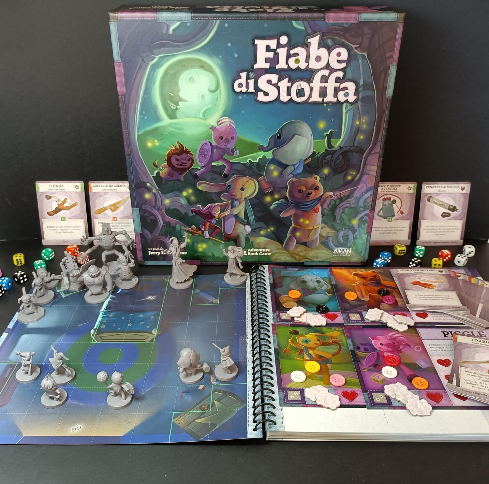
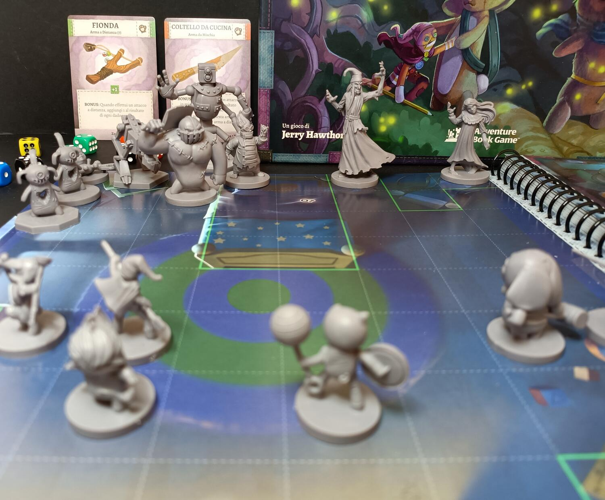

<Setting>

  Imbracciate le armi, preparate l'imbottitura e aggiustate i vostri bottoni:
  l'avventura è pronta ad iniziare. Immergetevi nel temibile{" "}
  <strong>Cadigiù</strong>, pronti a difendere la vostra padroncina dai mostri e
  dal malvagio <strong>Re degli incubi</strong>. Le sfide saranno tante e
  difficili: foreste incantate, camere tetre e buie e laboratori pieni di
  invenzioni pericolose. Solo con il potere dell'amicizia riuscirete a uscirne
  sani e salvi. Sei coraggiosi <strong>stoffini</strong> saranno nelle vostre
  mani: avrete la “stoffa” per proteggere la vostra amata padroncina?

</Setting>

<Rules>

  Fiabe di stoffa è un classico dungeon-crawler, ma con qualche chicca in più.
  La preparazione è davvero <strong>immediata</strong>: scegliete gli stoffini,
  distribuite l'imbottitura e gli equipaggiamenti, scegliete il livello, aprite
  il Libro delle storie e siete pronti ad immergervi nell'avventura.
   
  Essendo un titolo narrativo, gran parte del gioco sarà composto di storie da
  narrare e di scelte da prendere, che cambieranno completamente le sorti
  dell'avventura. Oltre a ciò, ovviamente, dovrete spostare i vostri personaggi
  sulla mappa, in questo caso costituita dalle pagine del libro, completare
  missioni e affrontare temibili nemici e boss.
   
  Tutto questo sarà gestito tramite la pesca di piccoli e carini dadi colorati.
  Ad ogni colore corrisponde una determinata azione, ad esempio con i dadi rossi
  si può attaccare con le armi da mischia e con quelli verdi a distanza. I dadi
  bianchi permettono di riottenere preziosa imbottitura, al contrario, quelli
  neri permetteranno di attivare i nemici, che si muoveranno e attaccheranno i
  poveri e sventurati stoffini. Ogni personaggio potrà equipaggiare varie
  tipologie di armi e oggetti, e avrà a sua disposizione potenti abilità. Le
  regole sono semplici e lineari, ma non sarà tutto qui, perché il vero fulcro
  del gioco sarà nella <strong>narrazione delle avventure</strong>, nei continui
  cambi di alcun regole e nelle missioni da superare, che vi terranno col fiato
  sospeso per molte ore di gioco.

</Rules>

<Feedback>

  Fiabe di stoffa è un simpatico dungeon-crawler, ricco di immagini e colori,
  che vi stupiranno di partita in partita. I componenti sono davvero ben fatti,
  carini e colorati, che danno un forte impatto all'ambientazione del gioco. Le
  miniature sono ben realizzate, i segnalini resistenti e il{" "}
  <strong>Libro delle storie</strong>, semplicemente spettacolare. Questo libro
  ad anelli, infatti, sarà il vero fulcro del gioco: fungerà da tabellone, da
  parte narrativa e in alcuni casi da regolamento.
   
  Le sfide di Fiabe di stoffa sono varie e simpatiche; ogni storia ha diverse
  missioni e regole da aggiungere al regolamento base che renderanno le partite
  sempre diverse. Il gioco è facile da imparare e da spiegare, adatto ad un
  ampio pubblico di giocatori. Infatti, le storie, sempre molto fiabesche, sono
  ottime per <strong>famiglie</strong> anche con bimbi ancora non pratici di
  giochi da tavolo troppo strategici e complessi. Ma passiamo ai difetti.
   
  Fiabe di stoffa è sì un gioco per tutti, ma alcuni tipi di giocatori
  potrebbero non apprezzarlo. La semplicità nelle regole e le storie spesso un
  po' troppo <strong>infantili</strong> rendono il gioco noioso per giocatori un
  po' più esperti. Il gioco risulta in alcuni casi ripetitivo nel gameplay, e la
  presenza di numerosi dadi aumenta la componente aleatoria di molto. La
  rigiocabilità è comunque a buoni livelli, ma la limitata varietà di nemici
  rende il gioco troppo ripetitivo, pur avendo storie o missioni molto ben
  strutturate e diverse. Ultimo, e non meno importante, difetto è la{" "}
  <strong>limitazione</strong> di dover giocare ogni partita sempre con quattro
  personaggi, rendendo il gioco, in alcuni casi, meno divertente con meno di
  quattro persone al tavolo.
   
  In conclusione, Fiabe di stoffa è un titolo comunque apprezzabile, con tanti
  punti forti, come la rapida preparazione, il Libro delle storie e i suoi
  bellissimi disegni, che lo rendono ottimo per un pubblico più giovane. Un
  titolo che consiglio fortemente alle famiglie con bambini, a neofiti o ad
  amanti della narrativa. Un gioco che vi sorprenderà per le bellissime
  illustrazioni e i componenti carini e colorati. Un'avventura davvero
  fantastica.

</Feedback>

