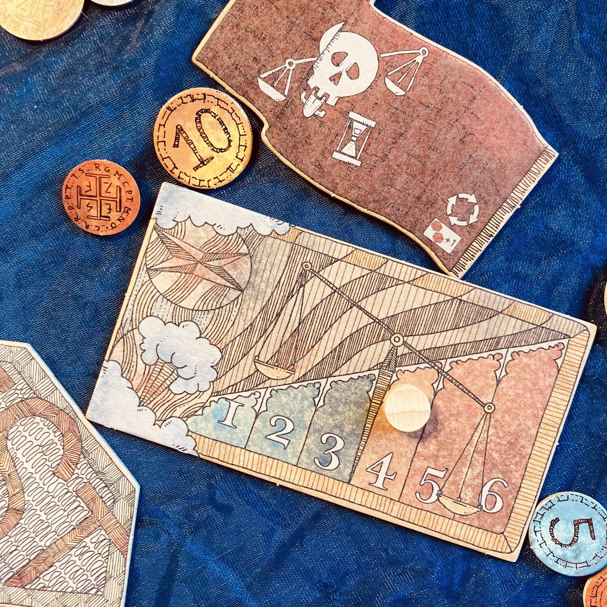

<Setting>

  Immaginate di lanciarvi in <strong>un'avventura marinaresca</strong> ai tempi
  d'oro dei Caraibi, ma in uno spazio marittimo ancora tutto da scoprire:
  partirete dall'<strong>Isola dei Venti</strong>, insieme ad altri{" "}
  <strong>nobili assetati di gloria</strong>, di <strong>denaro</strong> e di{" "}
  <strong>scoperte</strong>. Immaginate ora di avere anche una nave e un piccolo
  capitale da investire: <strong>mapperete</strong> i flutti intorno a voi,
  recuperando <strong>reperti</strong> da antichi relitti, raccogliendo{" "}
  <strong>naufraghi</strong> da isole deserte e riscattando{" "}
  <strong>tesori</strong> sepolti da tempo; trafficherete{" "}
  <strong>spezie</strong> e fonderete nuovi <strong>porti</strong>, sempre in
  cerca di ulteriori sbocchi commerciali. Ma attenti a non incrociare i temibili{" "}
  <strong>pirati</strong>, sempre ammesso che quei temibili pirati… non siate
  voi!
   

</Setting>

<Rules>

  Ogni giocatore parte con una <strong>plancia nave personale</strong>, con{" "}
  <strong>20 dobloni</strong>, distribuiti a piacimento tra le{" "}
  <strong>stive</strong> e la scorta esterna, e{" "}
  <strong>8 segnalini porto</strong>. Anche i pirati partono con una plancia
  nave, sebbene il loro segnalino nave inizialmente sia fuori dal gioco.
  Selezionato il numero di tessere mare in base al numero di giocatori, formato
  il <strong>mazzo meteo</strong> con la carta Finis Terrae in terzultima
  posizione e disposto il proprio porto di partenza su una spiaggia dell'Isola
  dei Venti, la partita può iniziare.
   
  Il gioco si sviluppa in 4 fasi:
   
  <ol>
    <li>      Nella <strong>Fase Cartografica</strong> ogni giocatore, a partire dal
      primo e poi in senso orario, pesca e posiziona 4 tessere mappa,
      rispettando le regole di posizionamento ed eseguendo eventuali azioni di
      set up legate al Covo Pirata, all'Isola del tesoro, al Relitto o all'Isola
      del naufrago.</li>
    <li>      Nella <strong>Fase di Preparazione</strong> si determinano (i) il meteo
      della giornata pescando la prima carta del mazzo meteo (Soleggiato,
      Pioggia o Tempesta - quest'ultima comporta il rischio di Naufragio), (ii)
      il valore base degli scambi e (iii) il valore di movimento comune.</li>
    <li>      Nella <strong>Fase di Navigazione</strong> ogni giocatore, a partire dal
      primo e poi in senso orario, prima muove il Galeone pirata, se lo
      controlla, poi muove la propria nave e poi, se può e vuole, esegue 1
      azione (stabilire un porto, salvare un naufrago, recuperare una risorsa,
      combattere i pirati, scambiare in un porto - rispettando sempre le norme
      di riempimento delle stive). Dopo l'azione, il giocatore ha la possibilità
      di riorganizzare le proprie stive gratuitamente, se si trova in un proprio
      porto.</li>
    <li>      A <strong>Fine Giornata</strong>, chi ha mosso per ultimo la propria nave
      sulla tessera più a est diventa il primo giocatore; se in gioco, la
      bandiera pirata rossa passa al giocatore seguente in senso orario, che
      controllerà il Galeone Nero il turno successivo.</li>
  </ol>
  La partita finisce alla fine della Fase di Navigazione del turno in cui la carta
  Finis Terrae è stata pescata la seconda volta (essendo stata già rimescolata insieme
  alle ultime due del mazzo meteo la prima volta che è stata pescata).
   I punti vittoria si assegnano sulla base delle imprese compiute dai
  giocatori sul fronte della <strong>Colonizzazione</strong> (Terreni, Isole,
  Isola più grande, Fari e Forti ove sia presente un porto del giocatore), del{" "}
  <strong>Commercio</strong> (Spezie possedute, Naufraghi, Reperti e Tesori
  riscattati, Monete tesaurizzate), dell'
  <strong>Esplorazione</strong> (Emisferi e Quadranti con porti del giocatore e il
  porto più lontano fondato). Si aggiungono <strong>Bonus e Malus</strong> per navi
  pirate affondate o per affondamenti/naufragi subiti.

</Rules>

<Feedback>

  Finis Terrae porta sul tavolo un'
  <strong>esperienza ludica non del tutto inedita</strong>: il posizionamento tessere
  prende in prestito da Carcassonne una storica modalità di composizione in itinere
  dello scenario, mentre l'esperienza mercantesca-piratesca si richiama evidentemente
  a <Link to="/reviews/corsari-dei-caraibi/">Corsari dei Caraibi</Link>… E <strong>    tuttavia</strong> la concentrazione di meccanismi non del tutto originali e già noti al
  pubblico non guasta l'esperienza di gioco: si può dire che, anzi, la rinnovi, combinando
  le esperienze dei predecessori, con il <strong>merito</strong> ulteriore <strong>    di alleggerirli e abbreviarne significativamente la durata</strong>.
   
  Finis Terrae ci riporta così allo scopo essenziale del gioco da tavolo: <strong>    divertire senza stufare</strong>. Perché non tutti, pur amando l'ambientazione epica di CdC, vorranno
  lanciarsi in un'esperienza piratesca da 4 ore, e non tutti, avendo provato un bellissimo
  gioco base come Carcassonne, vorranno cimentarsi nella dozzina delle sue espansioni.
   
  Diremo forse ora qualcosa in apparente antitesi con quanto visto fin qui, ma Finis
  Terrae <strong>sintetizza senza semplificare</strong>. In altre parole, mentre
  snellisce non perde né in termini di complessità né di profondità. Tanto che lo
  vedremmo bene giocato già da bambini sui 7-8 anni, anche per via del tema avventuroso.
   
  La <strong>pecca</strong>, se vogliamo trovarla, risiede probabilmente nel <strong>    regolamento</strong>, la cui stesura si sforza di essere lineare, ma in realtà costringe a
  una lettura continua di almeno un paio di volte, per garantire la comprensione,
  e le prime partite richiede che si salti da una parte all'altra per avere una comprensione
  completa del funzionamento di una fase (l'esempio più lampante è quello del movimento
  dei pirati che, lo si scopre solo a p. 21, agiscono prima del giocatore che li
  controlla). Qualche approfondimento regolistico, inoltre, pur volendo chiarificare,
  rischierà invece di appesantire, rallentando la curva di apprendimento in un modo
  che, tutto sommato, finisce per remare in senso contrario rispetto all'intenzione
  di fondo, appunto quella di semplificare.  
  <strong>Positiva</strong> è invece la presenza di dettagli come la differenza
  tra porti personali e degli avversari che, mentre impone ai giocatori un
  fattore di rischio legato alla scelta di cosa fare, soprattutto se intorno ci
  sono i pirati, garantisce la <strong>longevità</strong> e arricchisce le{" "}
  <strong>possibilità strategiche</strong> di un titolo che è{" "}
  <strong>piacevole intavolare</strong>. 
  <strong>Nel complesso</strong>, il <strong>giudizio</strong> non può che essere{" "}
  <strong>positivo</strong>. Prima di tutto perché nel panorama, sempre più spavaldo
  e ardito, dei giochi da tavolo, dove già non domina più l'inventiva autoriale ma
  il gusto del pubblico e dove, proprio per questo, molti titoli si fanno ugualmente
  strada grazie alla quantità di “plasticame” incluso, e non per la loro bellezza
  intrinseca, pubblicare un titolo come Finis Terrae è un gesto coraggioso: in primo
  luogo, perché sceglie meritoriamente di affidarsi a un <strong>    sistema di produzione ecologico e ispirato all'economia circolare</strong> come a un modello da seguire, e in secondo luogo perché <strong>    si rifiuta di aderire banalmente alle scelte di moda dettate dal mercato</strong>. 
  Noi di Dudexpress <strong>lo promuoviamo</strong>! E voi?
   

</Feedback>

