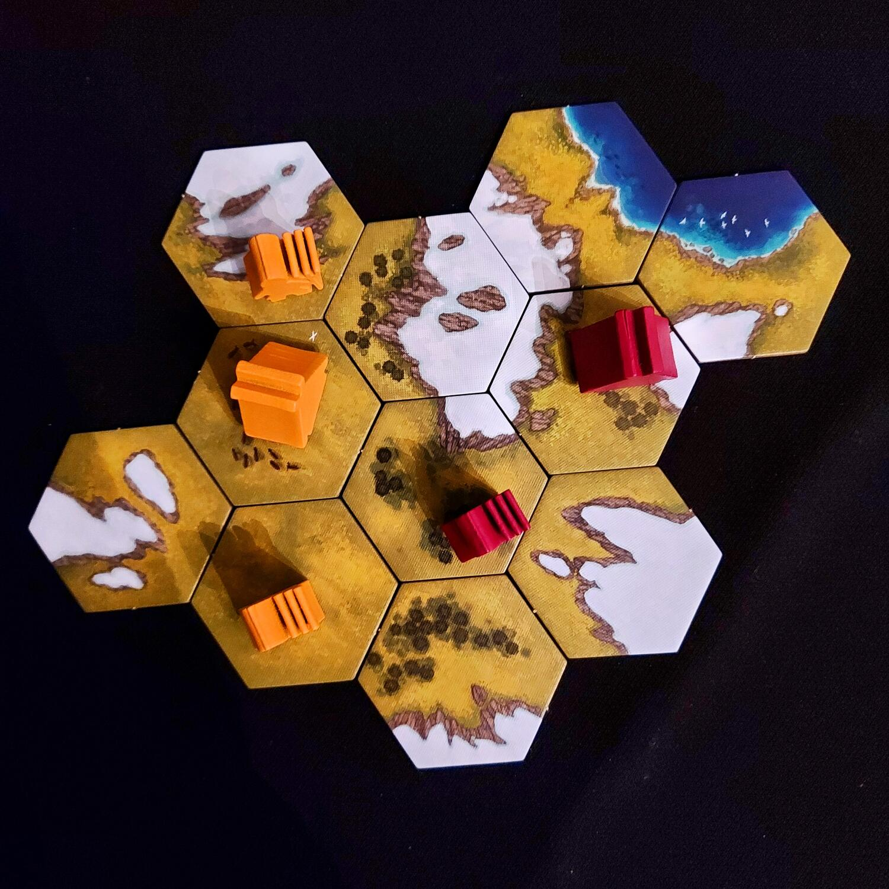
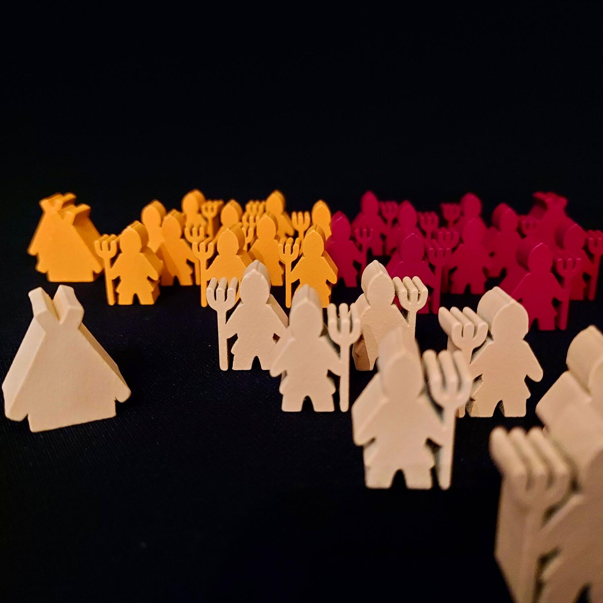
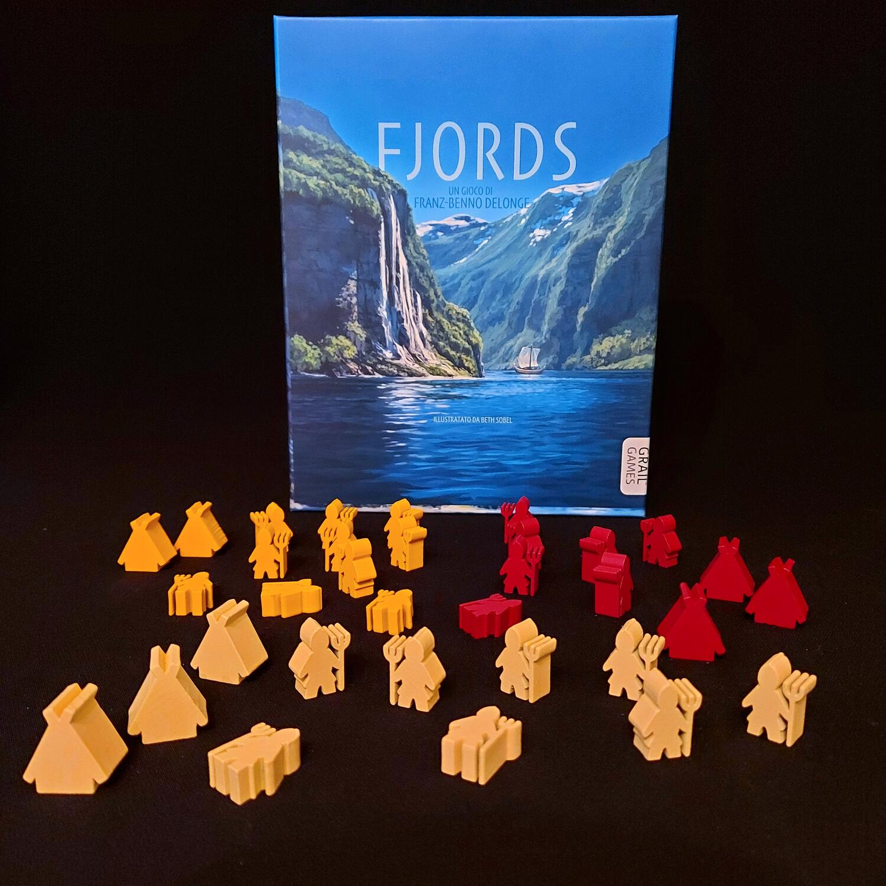

<Setting>

Nelle terre estreme del Nord, dove il mare diventa freddo e tumultuoso, un popolo guerriero attende. Giorni di razzia e conquista si profilano all'orizzonte, mentre le terre inesplorate devono essere conquistate. Guida la tua banda di valorosi vichinghi, e reclama il tuo diritto a regnare incontrastato. Solo i più coraggiosi ed abili potranno diventare i dominatori del Nord!

</Setting>

<Rules>

Una partita a Fjords si divide in due macro fasi: una di esplorazione e una successiva di insediamento. Durante la fase 1 il giocatore di turno sceglie una delle quattro tessere disponibili e deve piazzarla nell'area di gioco. Le regole di piazzamento prevedono che la tessera debba toccare almeno altre due tessere già presenti nell'area di gioco e che i territori debbano continuare con altri territori analoghi. Successivamente il giocatore di turno può scegliere di piazzare una delle sue quattro case lunghe sulla tessera appena posizionata nel terreno di gioco. Una volta finito il piazzamento delle tessere e delle case lunghe, inizia la fase 2 di insediamento, nella quale il giocatore di turno piazzerà un vichingo del proprio colore su una tessera adiacente ad una casa lunga o a un altro vichingo già piazzato, purché i territori siano collegati da pianure. La partita finisce quando i giocatori non possono più piazzare i loro vichinghi: a quel punto, chi avrà piazzato il maggior numero di Vichinghi sarà dichiarato il vincitore.

</Rules>

<Feedback>

La peculiarità del gioco è quella di avere due macrofasi ben distinte tra di loro: una fase che possiamo definire preparatoria e una di gioco vero e proprio. In realtà, a differenza di quanto si potrebbe pensare, la partita si gioca principalmente nella prima fase, durante la quale i giocatori saranno concentrati a piazzare le tessere, cercando di ostacolare i piani degli avversari, e le proprie case lunghe. La seconda fase, invece, è quasi una conseguenza della prima, ma se escludiamo l'eventualità che i giocatori siano due, anche questa fase sarà molto tattica e ognuno sarà sempre impegnato su più fronti a controllare le mosse degli avversari.
Solo in 2 giocatori Fjords risulta un po' “povero”, dando il meglio di sé in 3 o 4.
Sarebbe stato meglio realizzare le tessere in un cartoncino un po' più spesso e rigido: quelle presenti nel gioco sono alquanto “leggerine”, al contrario dei Vichinghi, realizzati in legno e ben caratterizzati.

</Feedback>

