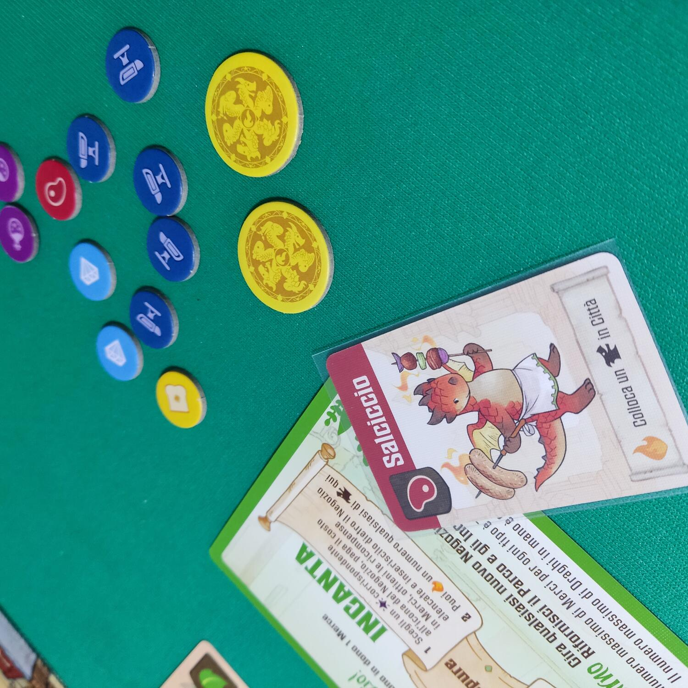
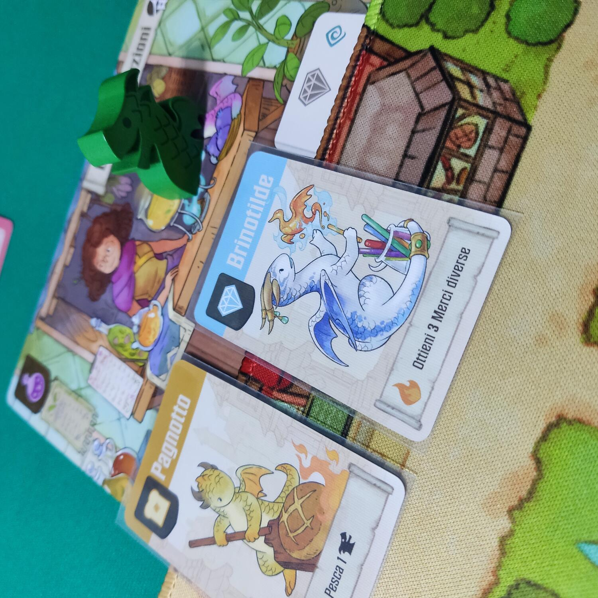
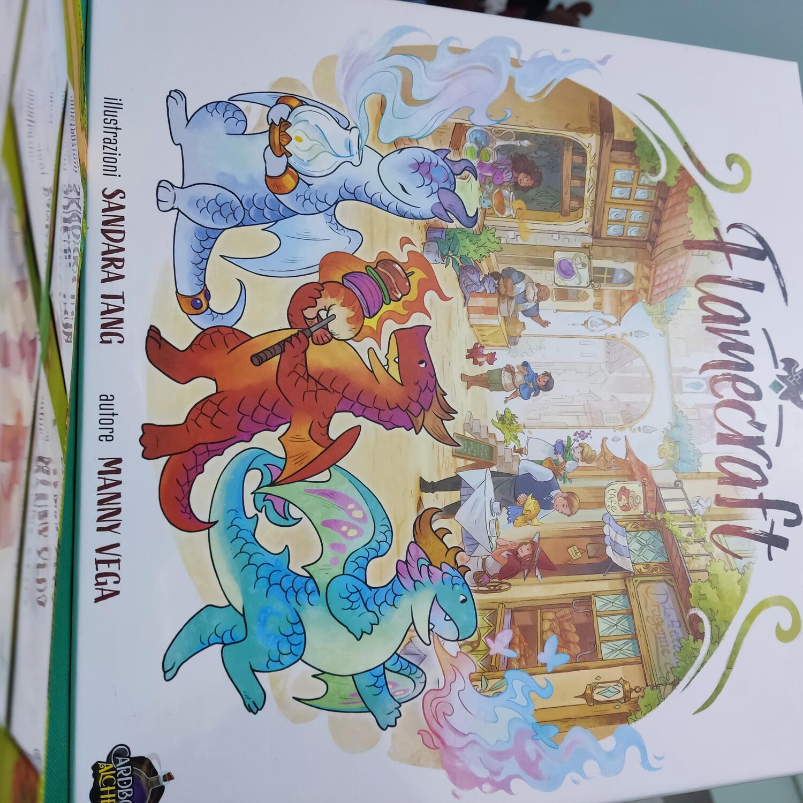

<Setting>

  I draghi sono piccoli forgiatori che, grazie alle loro fiamme, sono in grado di creare <strong>merci</strong> da
  vendere nei negozi della città. Noi saremo i <strong>Custodi dei Forgiafiamma</strong>, coloro che aiuteranno i nostri
  piccoli e colorati amici a forgiare tali merci, anche lanciando <strong>incantesimi</strong> sui negozi dove lavorano
  per aiutarli a creare cose meravigliose. La nostra <strong>reputazione</strong> crescerà sempre di più aiutando
  draghetti e negozianti: a fine partita il giocatore con la reputazione più alta sarà incoronato Re dei Forgiafiamma!

</Setting>

<Rules>

  A <strong>turno</strong>, in senso orario, ogni giocatore dovrà spostare la propria pedina drago dal negozio in cui è
  attualmente a un negozio differente, pagando eventuali draghi già presenti (fase: visitare un negozio); a seguire,
  deciderà quale tra<strong> 2 azioni</strong> svolgere:
  <ul>
    <li>      Raccogliere merci: ottenere tutte le merci corrispondenti all'icona negozio, agli eventuali incantesimi e ai
      draghi ivi presenti; inoltre, il giocatore può in questo momento collocare un proprio <em>drago</em> su uno spazio
      del negozio con il medesimo simbolo e, subito dopo, attivare le abilità di uno dei draghi presenti e/o quella del
      negozio;</li>
    <li>      Forgiare un <em>incantesimo</em>: si sceglie un incantesimo tra quelli presenti nella riserva con lo stesso
      simbolo del negozio che si vuole incantare e se ne paga il costo in merci. Come parte della stessa azione, si
      possono attivare tutte le abilità di tutti i draghi presenti nel negozio appena incantato</li>
  </ul>
  A fine turno il giocatore dovrà rivelare un nuovo negozio eventualmente già entrato in gioco a faccia in giù, scartare
  draghi e merci in eccesso, rifornire il parco dei draghi e la riserva incantesimi, (fasi: espandere la città, scartare
  draghi e merci, rifornire draghi e incantesimi).
   
  Quando viene esaurito il mazzo degli incantesimi oppure quello dei draghi artigiani, tutti i giocatori svolgono un
  ultimo turno e poi il gioco si conclude. Ogni giocatore, partendo dal punteggio fin lì ottenuto nel{" "}
  <strong>tracciato della vittoria</strong>, aggiungerà punti in base alle monete che ha e ad ogni drago elegante che ha
  in mano di cui ha soddisfatto gli obiettivi. Vincerà la partita il giocatore con più punti Reputazione.

</Rules>

<Feedback>

  Flamecraft si rivolge a un pubblico ampio: è un gioco perfetto per <strong>portare al tavolo neofiti</strong>, a patto
  che ci sia qualcuno più esperto a guidare le prime partite, in quanto un nuovo giocatore potrebbe essere disorientato
  nell'apprendere le tipiche meccaniche di un german; inoltre, può mettere anche giocatori più navigati di fronte a
  qualcosa di nuovo. Le meccaniche semplici e la relativa dipendenza dalla lingua concedono al titolo valore per essere
  apprezzato e giocato da chiunque; a ciò si aggiungono una durata contenuta e un rapporto{" "}
  <strong>qualità/prezzo eccezionale</strong>. La <strong>rigiocabilità</strong> è molto alta: ogni partita usa solo 12
  dei 34 negozi disponibili, garantendo ogni volta un'esperienza di gioco godibile che, unita alle illustrazioni curate
  e al playmat in neoprene, immergerà a fondo i Custodi dei Forgiafiamma nell'ambientazione, lasciandoli stregati. Nota
  di merito per la meravigliosa <strong>modalità in singolo giocatore</strong>, tramite il sapiente uso di bot e una
  scheda a parte con delle missioni: può regalare momenti di divertimento e sfida anche a chi ama le partite in
  solitario.

</Feedback>

