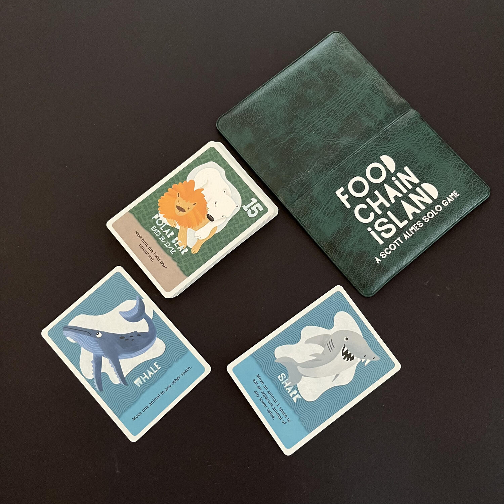

<Setting>

  Ahh… la cara vecchia natura. C'è un animale per ogni gusto. Ci sono i leoni…
  le linci… i ratti… le formiche… gli alligatori… E fino a un attimo fa c'era
  pure un procione. Chissà chi se lo sarà <strong>mangiato</strong>.  
  Questa frase riassume di fatto l'esperienza di gioco di Food Chain Island, in cui
  l'unico giocatore impersonerà la selezione naturale, in un gioco spietatissimo,
  ma decisamente puccioso. Guardate come sono belle le immagini!

</Setting>

<Rules>

  Food Chain Island è un gioco basato sul concetto di griglia. Di fatto può
  essere assimilabile ad un{" "}
  <Link to="/mechanisms/costruzione-rete/">Costruzione rete</Link> a livello di
  meccaniche. A conti fatti, invece, è un gioco diviso in round, in cui il
  giocatore dovrà scegliere quale animale verrà divorato e da chi. Ogni animale,
  infatti, ha un numero e un effetto speciale. L'effetto speciale gli garantisce
  spesso un'abilità dopo che si è mosso ortogonalmente e/o dopo che ha mangiato,
  mentre il numero indica a che livello è sulla piramide alimentare. Riuscite a
  indovinare chi c'è al primo posto?  
  Il gioco continuerà fino a che tutti gli animali saranno stati mangiati o quando
  gli animali rimasti non potranno più mangiare e moriranno di fame…  
  <strong>Ne rimarrà soltanto uno.</strong>

</Rules>

<Feedback>

  Food Chain Island è un piccolo e adorabile gioco di crudeltà e giustizia
  naturale. Alla fin fine, è assimilabile ad un puzzle e, come per tutti i
  puzzle, probabilmente con abbastanza partite alle spalle, un occhio attento ed
  esperto riconosce se una partita è vinta o persa già dal setup. Per fortuna,
  però, che per arrivare a questo punto deve passarne di acqua sotto i ponti…
  Detto ciò, che se vogliamo è l'unico aspetto negativo di Food Chain Island, se
  vorrete dare fiducia al gioco, come per{" "}
  <Link to="/reviews/sprawlopolis/">Sprawlopolis</Link> non ve ne pentirete,
  anzi: potrebbe essere il <Link to="/mechanisms/solitario/"> solitario</Link>{" "}
  dei vostri sogni, a meno che non abbiate problemi con la catena alimentare…

</Feedback>

