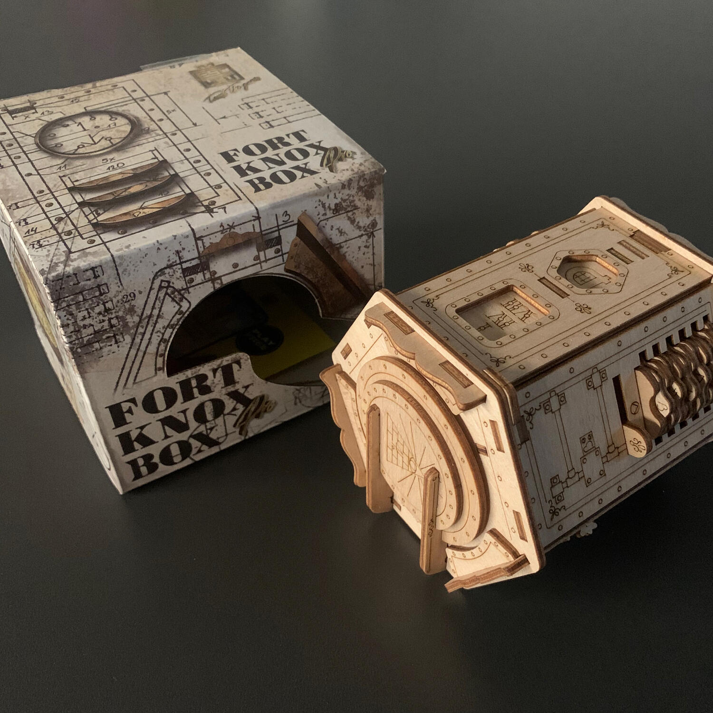
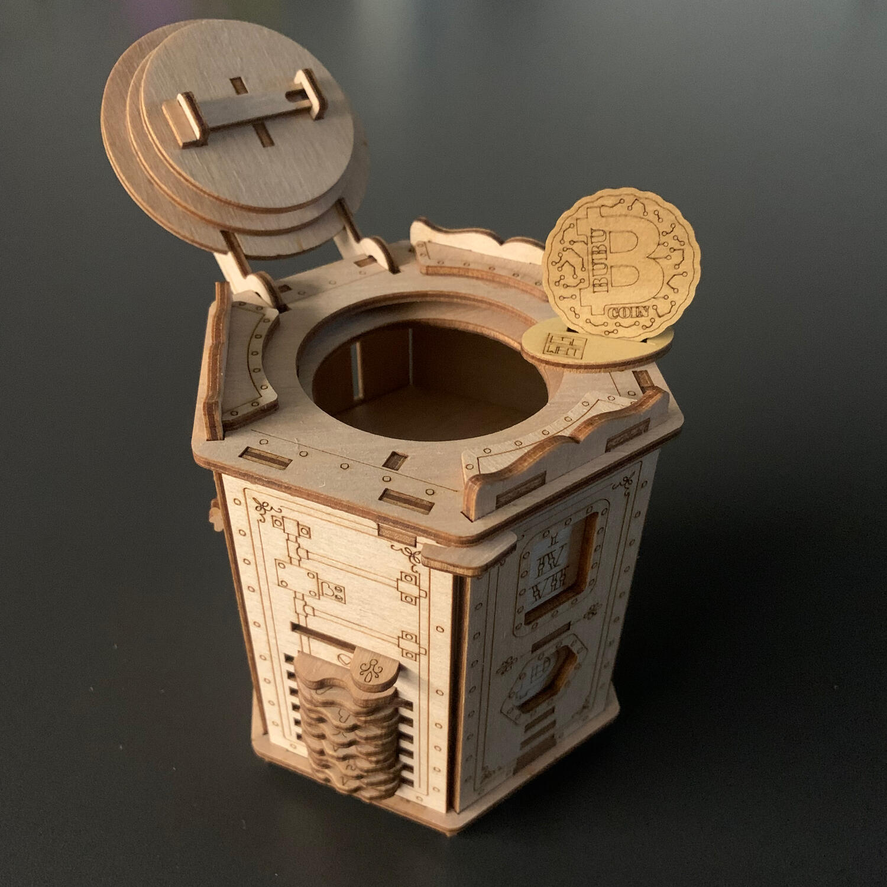

<Setting>

  Nel 1947, nel Kentucky, si verificò un evento che stravolse il mondo
  criminale: il leggendario ladro Al Capone riuscì ad entrare in uno dei caveau
  più sicuri degli Stati Uniti. La fortezza di Fort Knox.  
  Questo caveau era considerato il luogo più sicuro al mondo: le sue pareti di granito
  erano ricoperte da uno strato di cemento e una porta da 22 tonnellate ne proteggeva
  l'entrata; a sicurezza della porta, un codice d'accesso suddiviso tra più persone.{" "}
   
  Al Capone basò la sua fortuna su rapine e frodi, ma questa volta non si
  trattava di mero denaro... si trattava di un oggetto che aveva un grande
  valore sentimentale: una moneta che ricevette da suo padre da bambino e che
  conservò per tutta la sua vita. La moneta Bubu. Al voleva nasconderla in modo
  che nessuno potesse trovarla per secoli.
   
  Dove nascondere un albero se non vuoi che venga trovato? In una foresta!{" "}
   
  Al Capone si intrufolò a Fort Knox e vi depose la moneta, ponendola sotto chiave.{" "}
   
  Ora che la leggenda è confermata, l'intera malavita vuole la sua moneta.
   
  Hai quello che serve per rubarla prima degli altri?

</Setting>

<Rules>

  Per giocare a Fort Knox Pro non c'è bisogno di sapere niente, nessun
  regolamento da leggere e nessun dettaglio da imparare. Vi basta prendere la
  scatola (il nostro caveau) in mano, osservarla, capovolgerla, decifrarla con
  l'unico scopo di aprirla prima degli altri. Sulla scatola sono presenti 7
  enigmi, alcuni davvero molto semplici, altri che vi richiederanno di pensare
  un po' più fuori dagli schemi. Una volta riuscito a capire in che ordine
  risolverli, un solo codice vi farà entrare in questo caveau ligneo.  
  Tutto quello che vi serve è in bella mostra: riuscirete a carpirlo?

</Rules>

<Feedback>

  Prosegue l’avventura nella soluzione delle scatole di EscapeWelt: so che ci
  avete preso gusto ormai!  
  Dopo la prima versione di <Link to="https://dudexpress.it/reviews/fort-knox">
    Fort Knox
  </Link>, EscapeWelt ha rilasciato una nuova versione migliorata: Fort Knox Pro.
  In questa versione, alcuni enigmi sono rimasti invariati; altri, invece, sono stati
  leggermente complicati, col fine di rendere l'esperienza più sfidante. Avendo già
  giocato la prima versione, non ho provato la stessa ebbrezza nell'affontarla, anche
  perché, appunto, molti enigmi sono rimasti invariati: era come leggere l’edizione
  rivista di un libro già letto, o rivedere un film già visto.  
  Anche in questo caso, il livello di questa scatola è introduttivo, ottimo
  punto di partenza per questo genere di prodotti. Il flusso di gioco rimane
  chiaro, bisogna solo capire da dove iniziare: poi il resto vien da sé, non
  siate spaventati.  
  A livello di materiale e di meccanismi, invece, si nota un continuo miglioramento:
  l'escape si inceppa molto meno, al punto tale da meravigliarti quando realizzi
  che hai in mano un manufatto in legno.  
  Consiglio l'acquisto? dipende. Avete la prima versione? Allora sicuramente no,
  perché questo rifacimento non offre abbastanza novità per considerarla una
  vera a propria nuova avventura. Non l'avete e vi ho incuriosito? Allora vi
  consiglierei questa, la qualità è nettamente migliore.  È sicuramente
  un'esperienza diversa dal solito che vale la pena vivere.

</Feedback>
