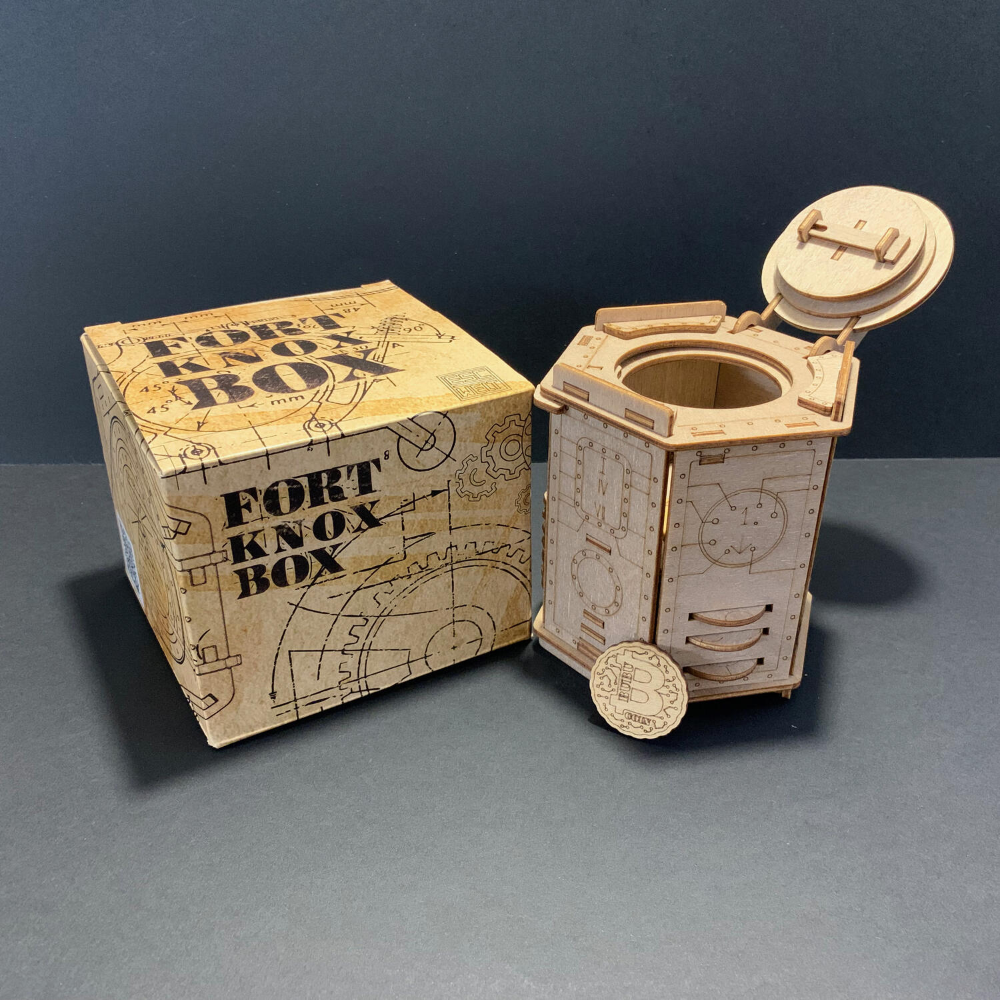
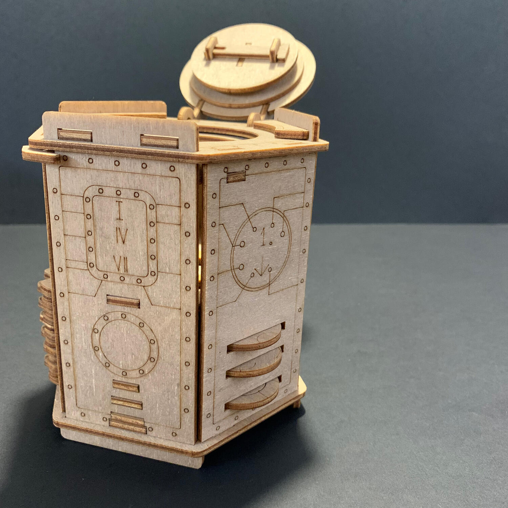

<Setting>

  Nel 1947, nel Kentucky, si verificò un evento che stravolse il mondo
  criminale: il leggendario ladro Al Capone riuscì ad entrare in uno dei caveau
  più sicuri degli Stati Uniti. La fortezza di Fort Knox.
   
  Questo caveau era considerato il luogo più sicuro al mondo: le sue pareti di
  granito erano ricoperte da uno strato di cemento e una porta di 22 tonnellate
  ne proteggeva l'entrata; a sicurezza della porta, un codice d'accesso
  suddiviso tra più persone.
   
  Al Capone basò la sua fortuna su rapine e frodi, ma questa intrusione non
  riguardava del mero denaro... ma un oggetto che aveva un grande valore
  sentimentale: una moneta che ricevette da suo padre da bambino e che conservò
  per tutta la sua vita. La moneta Bubu. Al voleva nasconderla in modo che
  nessuno potesse trovarla per secoli.
   
  Dove nascondere un albero se non vuoi che venga trovato? In una foresta!
   
  Al Capone si intrufolò a Fort Knox e vi depose la moneta, chiudendola a
  chiave.
   
  Ora che la leggenda è confermata, l'intera malavita vuole la sua moneta.
   
  Hai quello che serve per rubarla prima degli altri?

</Setting>

<Rules>

  Per giocare a Fort Knox non c'è bisogno di sapere niente, nessun regolamento
  da leggere e nessun dettaglio da imparare. Vi basta prendere la scatola (il
  nostro caveau) in mano, osservarla, capovolgerla, decifrarla con l'unico scopo
  di aprirla prima degli altri. Sulla scatola sono presenti 7 enigmi, alcuni
  davvero molto semplici, altri che vi richiederanno di pensare un po' più fuori
  dagli schemi. Una volta riusciti a capire in che ordine risolverli, un solo
  codice vi farà entrare in questo caveau ligneo.  
  Tutto quello che vi serve è in bella mostra: riuscirete a carpirlo?

</Rules>

<Feedback>

  Qualche tempo fa, Fort Knox, per le sue peculiari caratteristiche, non avrebbe
  avuto cittadinanza tra i giochi da tavolo ma la verità è che le escape room si
  sono ormai guadagnate un posto di tutto rispetto nel settore, ed io, amante
  della primissima ora di tutte le escape room (sia fisiche che in scatola), non
  potevo che gettarmici a capofitto.
   
  Il livello di questa specifica scatola, a mio avviso, è introduttivo, ma la
  soddisfazione data dall'impressione di aprire “per davvero” Fort Knox è
  impagabile.
   
  Ho fatto provare la scatola a molti amici per capire anche il loro giudizio e
  sono rimasti tutti impressionati dall'esperienza che regala. Il giudizio
  relativo alla qualità degli enigmi ed il tempo di risoluzione, invece,
  dipendevano fortemente da quanto il giocatore fosse solito "escape-are", con
  una forbice che va dai 15 minuti per i più esperti fino al tempo dichiarato di
  un'ora.
   
  Il flusso di gioco non lascia molto spazio all'incomprensione, quello che
  bisogna fare è chiaro... ma bisogna capirlo e farlo.
   
  Se vogliamo trovare un neo, questa scatola (dalla notevole finitura dei
  dettagli, peraltro), come le altre della famiglia, è realizzata in legno e,
  quindi, qualche meccanismo potrebbe risultare un po' inceppante, ma con un po'
  di pazienza e con qualche ovvio micro movimento, tutto torna a funzionare.
   
  Il dettaglio che ho davvero apprezzato di questa scatola è lo spazio interno:
  un bell'antro capace di ospitare dei piccoli oggetti, un biglietto o qualsiasi
  cosa si voglia nascondere. Fort Knox potrebbe essere un regalo perfetto per
  contenere un altro regalo. Vuoi regalare un biglietto per un concerto ma fare
  una busta ti puzza troppo da nonna? Hai organizzato un viaggio ma un biglietto
  ti sa triste? Ecco la soluzione... non del tutto economica, ma sicuramente di
  stile. Per alloggiare il contenuto all'interno senza impegnarti (oppure se il
  destinatario vi minaccia di "tirarci sopra una martellata" invece che
  utilizzare i propri neuroni), sul sito web dei produttori trovate i passi
  necessari per riuscirci.
   
  Questa esperienza mi è piaciuta a tal punto che temo leggerete altre
  recensioni sull'argomento nel futuro. Spero non vi dispiaccia. Stay tuned.

</Feedback>

