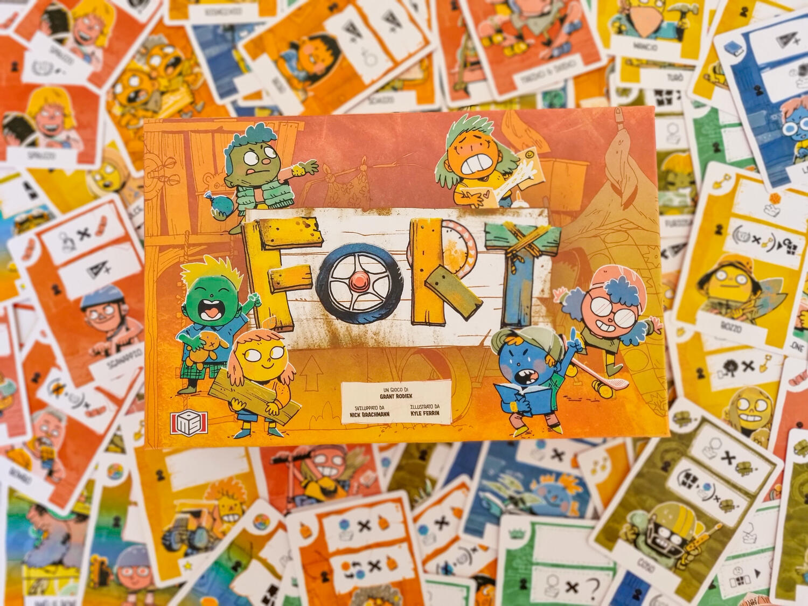
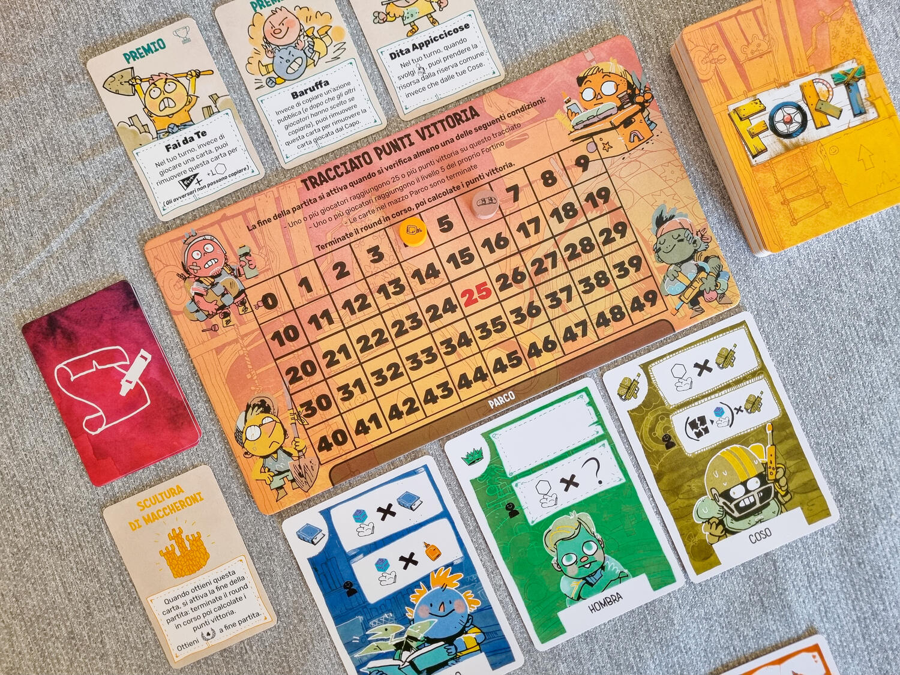

<Setting>

  I cortili di casa se ne vanno sempre troppo presto, lasciandoci
  inevitabilmente qualche cicatrice sulle ginocchia e i ricordi del rumore delle
  pallonate sul tettuccio di una Panda 4x4 rosso borgogna. È da memorie simili a
  queste che Nick Brachmann (Leder Games) deve aver attinto per denudare il
  seppur giovane SPQF di Grant Rodiek (2018) e rivestirlo da Fort (2020), in
  un'operazione nostalgia che ha trasformato un tema di civilizzazione e animali
  antropomorfi in un grazioso distillato della nostra infanzia.  
  Fort è un deck building caotico, un viaggio nel tempo in un pomeriggio qualunque
  di tanti anni fa, con un fortino da costruire, le amicizie fugaci del parco e del
  cortile, la pizza, gli zaini, i giocattoli, le regole inventate e le sculture di
  maccheroni. Ok, forse non tutti avranno eretto una scultura di maccheroni, ma insomma,
  col senno di poi, forse ne sarebbe valsa la pena.

</Setting>

<Rules>

  Una partita a Fort ha come obiettivo quello di totalizzare il maggior numero
  di punti vittoria, e si dipana nel corso di diversi round. Ognuno di questi
  vede i giocatori susseguirsi nell'effettuare un turno suddiviso in cinque
  fasi: Pulizia, Gioco, Reclutamento, Scarto, e Pesca. La prima fase (Pulizia)
  fa trasferire tutte le carte eventualmente rimaste nel Cortile del giocatore
  (l'area immediatamente sopra la sua plancia personale) nella sua pila degli
  scarti.
   
  La successiva, “Gioco”, è il cuore del titolo di Rodiek: il giocatore attivo
  potrà giocare una carta dalla propria mano e svolgere una o entrambe le sue
  azioni (pubbliche e private), seguito dagli altri, che potranno svolgere solo
  quella pubblica. Queste consentiranno ai giocatori di ottenere risorse,
  rimuovere o reclutare carte, ottenere punti vittoria o migliorare il Fortino.
   
  Nella terza fase, il Reclutamento, il giocatore potrà ottenere nuovi amici
  pescando una carta tra quelle coperte o scoperte disponibili e ponendola nella
  sua pila degli scarti. Infine si procede con la fase di Scarto: tutte le carte
  giocate verranno messe nella pila degli scarti, mentre eventuali ulteriori
  carte rimaste nella mano andranno collocate a faccia in su nel proprio
  Cortile, a disposizione per il Reclutamento degli altri giocatori. Si pescherà
  poi dal proprio mazzo fino a tornare a 5 carte, rimescolando eventualmente la
  pila degli scarti.
   
  Anatomia del turno a parte, tutti i giocatori avranno a disposizione sulla
  propria plancia personale un tracciato indicante il livello del proprio
  Fortino, aumentando il quale si potrà incrementare lo spazio a disposizione
  per accumulare risorse (pizza e giocattoli), potenziare il nascondiglio dove
  conservare carte (da usare come fonti di simboli permanenti), pescare
  condizioni di ottenimento di ulteriori punti vittoria (carte Regola Inventata)
  e potenti power up (carte Premio).
   
  La fine della partita può essere innescata qualora uno o più giocatori
  raggiungano 25 punti vittoria sul relativo tracciato, il livello 5 del proprio
  Fortino, o le carte nel mazzo Parco siano terminate.

</Rules>

<Feedback>

  Fort è una corsa frenetica e caotica. Costruire l'ultimo livello del Fortino è
  cruciale per vincere la partita, e farlo per primi assicurandosi la Scultura
  di Maccheroni è un salto di 11 punti verso una vittoria quasi assicurata.
   
  La partita corre veloce, proprio come per i bambini, tra poca strategia e
  tanta improvvisazione. Fra carte eliminate volontariamente e amici rubati
  dagli avversari, di deck building a lungo termine non rimane quasi l'ombra.
   
  Un gioco da e per pargoli? Neanche da lontano. Fort fa stridere un tantinello
  gli ingranaggi del cervello e può spaesare facilmente i non addetti ai lavori,
  tanto da far perdere il contatto con l'ambientazione, a meno di fare uno
  sforzo cognitivo per riportare la mente sulle splendide illustrazioni di Kyle
  Ferrin (Root, Oath) e sui buffi nomignoli di Pulce, Toppolo, Sandy Meteora e
  Smanetta.
   
  Fort diverte e scorre veloce, forse troppo veloce, ma cura i dettagli e
  giustifica le sue meccaniche elegantemente (copiare l'azione diventa Copiare
  il Capo, perché si sa, i bambini emulano i più tosti). Un buon gioco, non
  introduttivo, non borioso, non banale. Fa bene al sorriso, e fa bene al cuore.
  E poi con un'espansione piena di cani e gatti, c'è davvero altro da
  aggiungere?

</Feedback>

