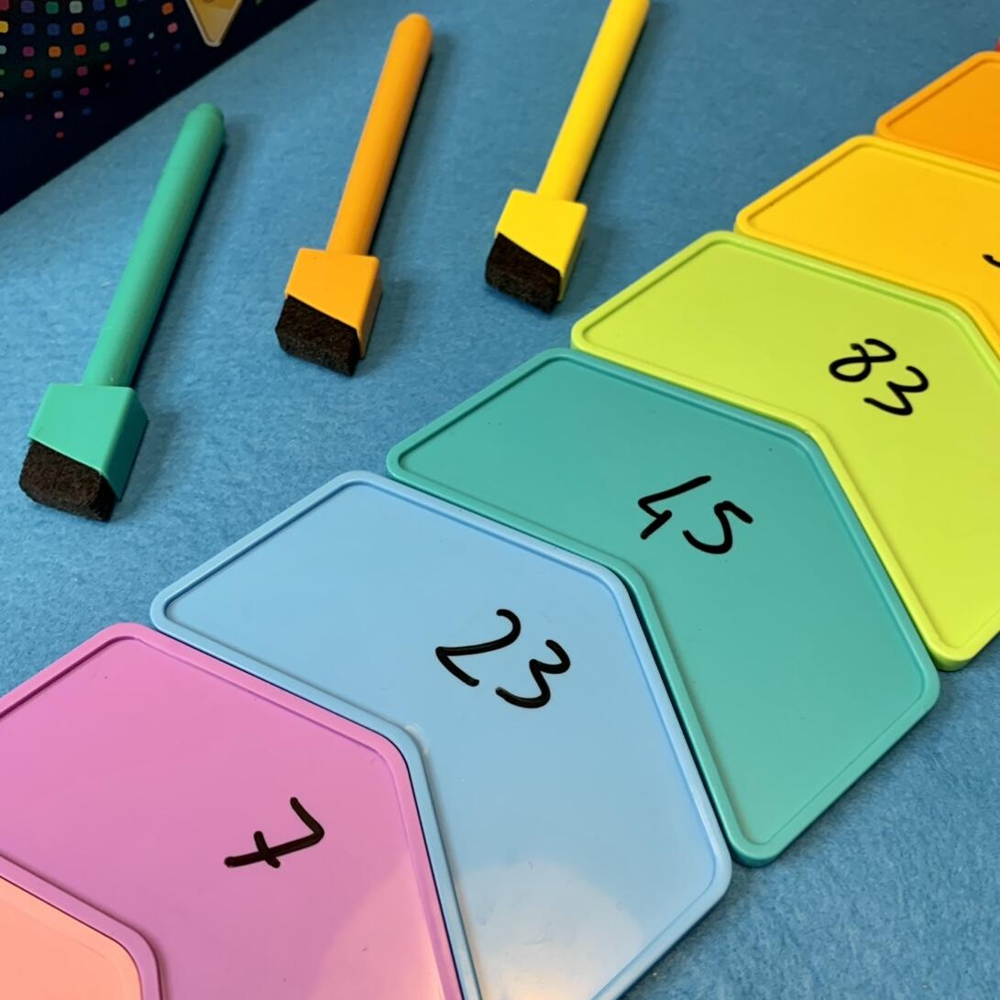
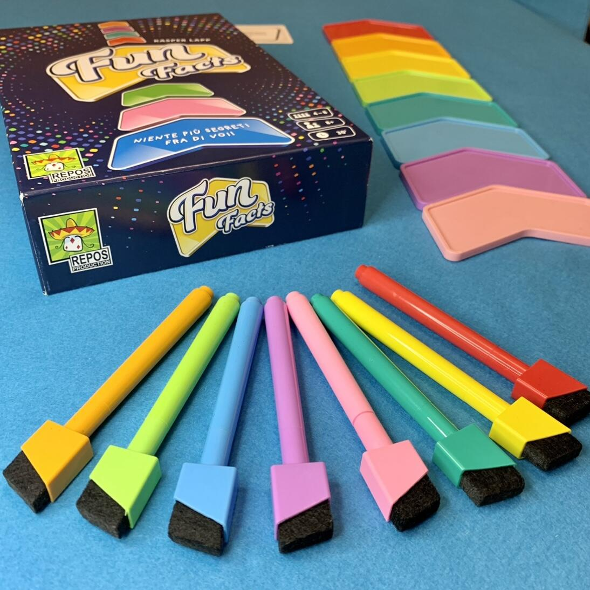
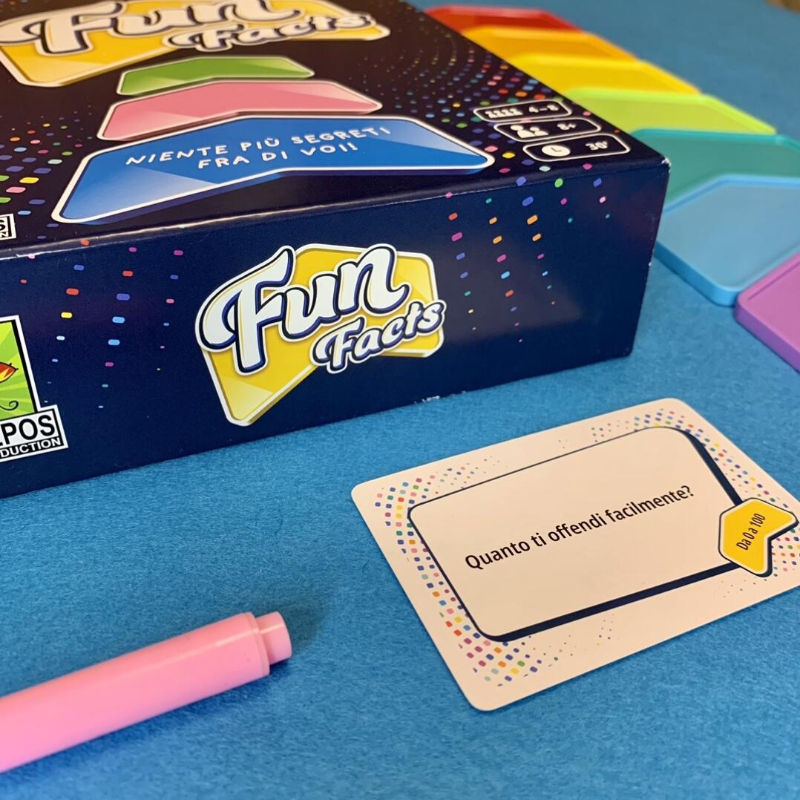

<Setting>

  Fun Facts è un <strong>gioco collaborativo</strong> che mette alla prova la
  vostra conoscenza degli altri giocatori.&nbsp;
   A turno, dovrete <strong>rispondere segretamente</strong>, dietro a
  delle coloratissime carte a forma di freccia, ad una <strong>domanda </strong>
  con un <strong>numero</strong>. I giocatori cercheranno di collocare le loro
  frecce in ordine crescente tentando di prevedere come risponderanno gli
  altri.&nbsp;&nbsp;&nbsp;
   

</Setting>

<Rules>

  La partita si svolge in <strong>8 turni</strong>, al termine dei quali,
  tramite una griglia, si potrà verificare il punteggio e scoprire quanto sia{" "}
  <strong>affiatato</strong> il vostro gruppo.&nbsp;
   
  Per iniziare, il primo giocatore{" "}
  <strong>prende una carta e la legge ad alta voce</strong>. Successivamente
  tutti i giocatori{" "}
  <strong>scrivono segretamente la risposta in forma numerica </strong>sul lato
  risposta della propria freccia.
   
  Finita questa fase, il primo giocatore{" "}
  <strong>colloca la propria freccia al centro del tavolo</strong>, con la
  risposta coperta. Poi, a partire dal giocatore alla sua sinistra,{" "}
  <strong>tutti collocano la propria freccia, sempre coperta, </strong>,
  cercando di prevedere la risposta degli altri.La collocheranno sopra, sotto o
  in mezzo alle altre frecce, in base a quello che presumono sia l’ordine
  crescente delle risposte.  
  Infine, si procede alla <strong>rivelazione dei risultati</strong>, partendo dalla
  freccia più in basso. Ogni freccia collocata correttamente vale <strong>    1 punto</strong>. 
  La partita si conclude quando tutti i giocatori avranno letto una domanda a
  testa.  

</Rules>

<Feedback>

  L’immediatezza delle regole è un punto a favore di questo titolo, poiché
  permette a chiunque di passare una serata in divertimento, anche in compagnia
  di bambini.&nbsp;
   
  Fun Facts rende meglio se non si punta ad avere un punteggio più alto, quanto
  piuttosto a passare un bel quarto d’ora in compagnia e “testando” la propria
  amicizia. Infatti a muovere il gruppo sarà la{" "}
  <strong>curiosità di scoprire le risposte</strong>, stupirsi e a volte
  prendersi anche in giro.&nbsp; Non ne risente neanche la{" "}
  <strong>rigiocabilità</strong>, perché la scatola contiene 195 carte e sarà
  improbabile che la stessa domanda salti fuori così spesso.&nbsp; Sono anche
  presenti alcune <strong>carte bianche</strong>, che permettono di
  personalizzare l’esperienza di gioco.&nbsp;
   
  Il <strong>set up velocissimo</strong> e le{" "}
  <strong>regole estremamente semplici </strong>lo rendono perfetto per riempire
  le serate tra un gioco e l’altro.&nbsp;&nbsp;
   

</Feedback>

