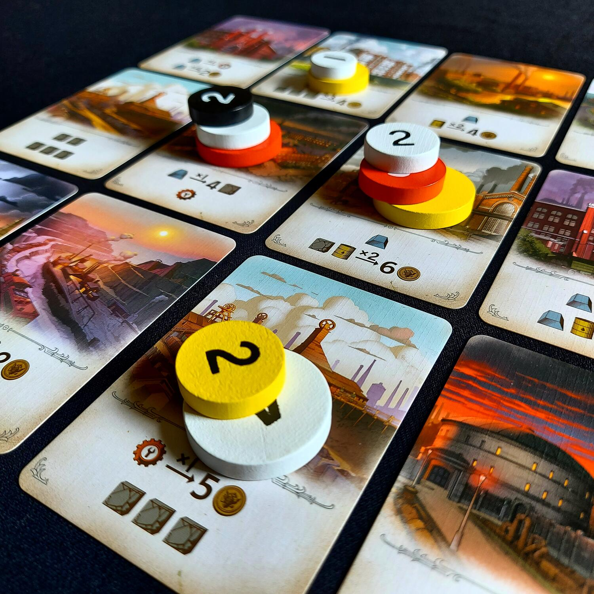
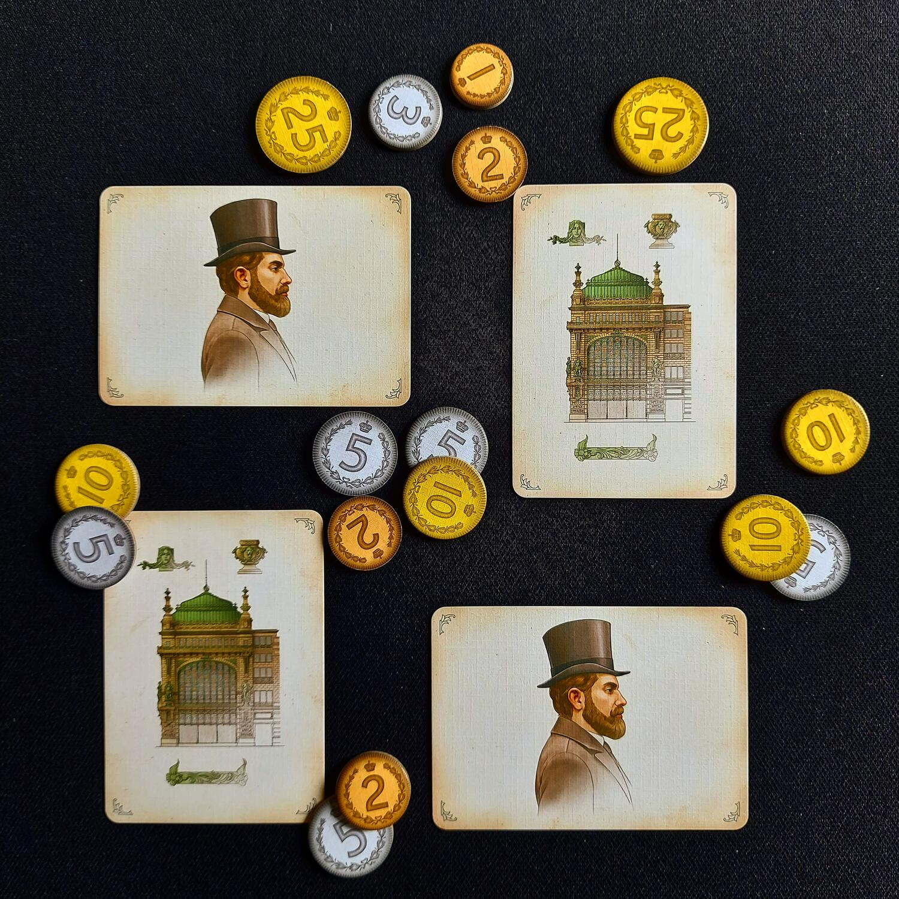

<Setting>

  Diventare un magnate dell'industria è sempre stato un tuo sogno? Scontrati con gli altri imprenditori alla casa
  d'aste, acquisisci nuovi stabilimenti, sfrutta i giacimenti e trasforma le materie prime. Investi nelle tue industrie
  ma, soprattutto, massimizza i profitti perché qui la sola cosa che conta è diventare il più ricco!

</Setting>

<Rules>

  Il gioco si sviluppa in quattro round, in ciascuno dei quali vengono messe all'asta da sei a otto carte a seconda del
  numero dei giocatori. La fase d'asta ha un meccanismo molto semplice; i giocatori infatti hanno a disposizione quattro
  token con valore crescente da 1 a 4 e al proprio turno ciascuno sceglierà una delle carte su cui puntarne uno, tenendo
  presente che:
  <ul>
    <li>      non può giocare <strong>mai 2 dei suoi token</strong> sulla stessa carta;</li>
    <li>      non può <strong>mai</strong> giocare <strong>un token di valore uguale ad uno già presente</strong> su quella
      carta.</li>
  </ul>
  La parte interessante dell'asta è data dal meccanismo della <strong>compensazione</strong>
  , che potrebbe rendere persino più interessante puntare su una carta meno di altri, piuttosto che cercare di guadagnarla:
  chi avrà fatto la puntata maggiore, infatti, si aggiudicherà la carta mentre tutti gli altri giocatori dovranno “accontentarsi”
  del bonus di compensazione riportato nella parte alta della carta stessa, moltiplicato per il valore del proprio token.
   
  Ciascun round prevede una seconda fase: la fase di produzione, durante la quale i giocatori attivano le carte guadagnate
  attraverso il meccanismo dell'asta nell'ordine che desiderano, cercando di realizzare le migliori “combo” utili a massimizzare
  il profitto. Occorre tenere presente che in questa seconda fase:
  <ul>
    <li>      ogni carta può essere attivata <strong>una sola volta</strong>;</li>
    <li>      su ogni carta <strong>l'ordine di risoluzione dei bonus è sempre dall'alto verso il basso</strong>.</li>
  </ul>
  Dopo aver risolto tutte le carte, si passa al round successivo. Alla fine del quarto round, il giocatore con il maggior
  numero di monete è il vincitore.

</Rules>

<Feedback>

  Furnace è un gioco compatto, veloce e abbastanza impegnativo, tanto che può essere proposto a giocatori neofiti che
  vogliano mettersi alla prova con qualcosa di più un filler o di un party game, ma è certamente adatto anche a
  giocatori esperti. I punti a favore di Furnace sono indubbiamente:
  <ul>
    <li>      il meccanismo dell'asta, relativamente semplice ma molto strategico, tenuto conto dei soli 4 token a disposizione
      e dell'interattività tra i giocatori, nonché delle regole di compensazione, che in certe situazioni vi
      obbligheranno a tener conto del fatto che “perdere” una carta all'asta potrebbe significare la vittoria;</li>
    <li>il criterio di conteggio dei punti vittoria: qui l'unica cosa che conta è il denaro!</li>
    <li>      quattro turni sono davvero pochi, il che rende il gioco anche molto tattico: ogni mossa deve essere ben
      programmata e ogni singola moneta guadagnata potrebbe essere determinante per il risultato finale.</li>
  </ul>
  Pochi davvero i contro. L'unico dubbio sorge in relazione alla modalità di gioco per due giocatori, nel quale un
  giocatore “virtuale” esegue le puntate in modalità random.
   
  La qualità delle carte è buona: tutto sommato non devono essere mescolate troppo spesso, però se credete di giocarci
  molto potrebbe essere consigliabile ricorrere alle bustine protettive.
   
  L'ambientazione è ottimamente illustrata sulle carte, davvero molto belle, ma in definitiva poco presente: di fatto il
  gioco consiste in un'asta e in una strategica combinazione delle migliori combo possibili.

</Feedback>

