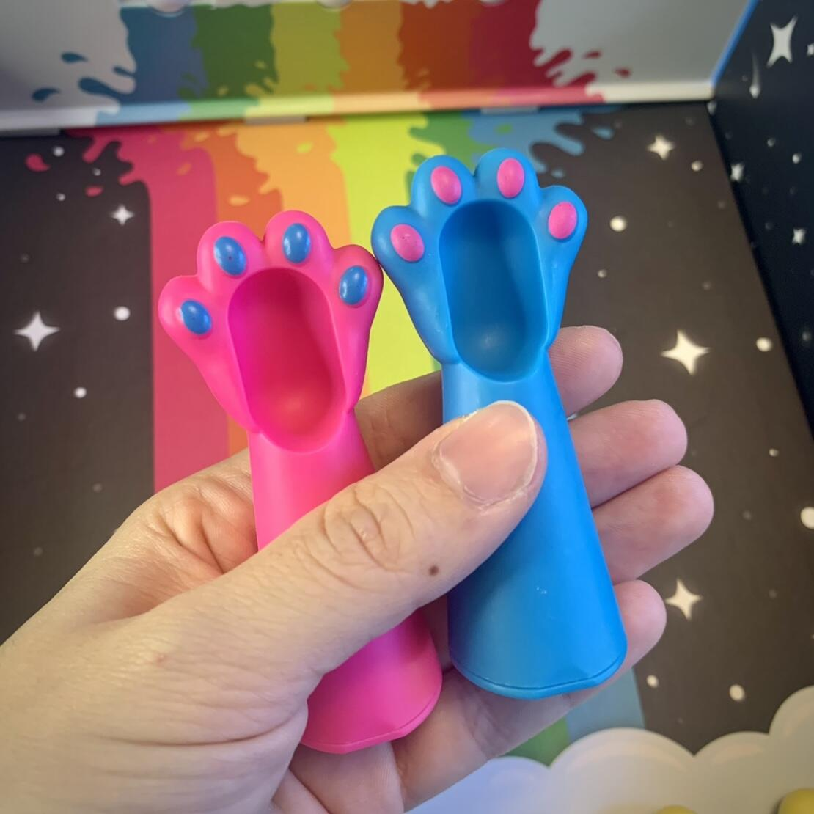
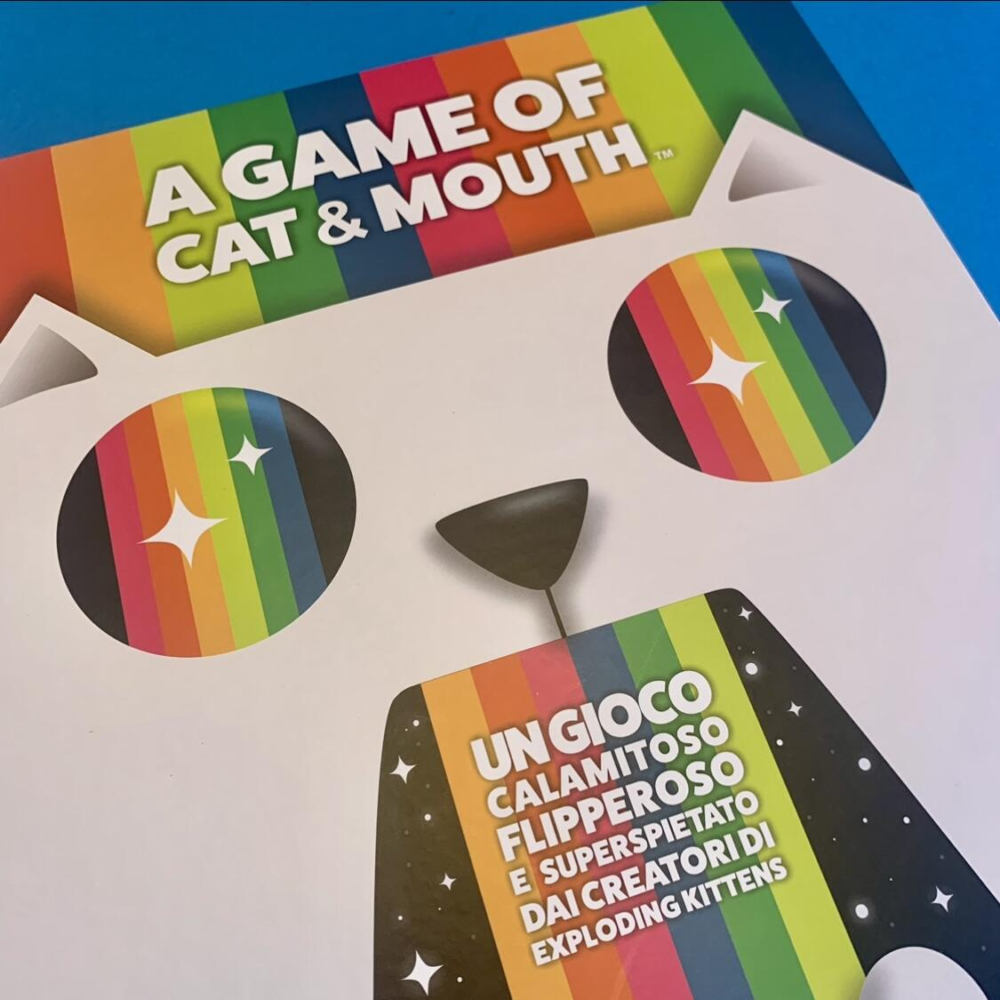

<Setting>

  <em>A Game of Cat &amp; Mouth</em> è uno degli ultimi giochi folli dei
  creatori di <em>Exploding Kittens</em>. In questo gioco super spietato,
  dovrete lanciare delle palline con delle fantastiche zampe-fionda!
   
  Il gioco è contenuto in una confezione coloratissima e bellissima e la scatola
  è anche la plancia di gioco, che una volta aperta darà accesso a tutti gli
  elementi per la partita.

</Setting>

<Rules>

  A ciascuno dei due giocatori verrà affidato un colore (blu o rosa) e 4 palline
  gialle. Lo scopo del gioco è far attraversare la bocca del gatto alle palline
  gialle, lanciandole grazie alle zampe dalla base magnetica. Ci sono anche
  altre palline di colori diversi: 1 pallina nera (il naso del gatto) e 3
  palline bianche (i suoi denti). Se un giocatore colpisce il naso e lo fa
  cadere nella parte dell’avversario vince immediatamente il round. Nel momento
  in cui un giocatore ha tutte le palline di uno stesso colore (oppure i 3
  denti) dal suo lato, il suo avversario fa un punto e le condizioni iniziali di
  gioco vengono resettate. Il primo giocatore che raggiunge 5 punti vince la
  partita.
   
  Per il resto non ci sono altre regole. Non esistono turni (si gioca in
  contemporanea) e se una pallina dovesse uscire al di fuori del campo di gioco,
  si può urlare "ZAMPE!" ed il gioco verrà fermato per poterla recuperare.
   
  &nbsp;Nel caso più giocatori vogliano partecipare, è possibile organizzare dei
  tornei grazie a questo
  <a href="https://ek.explodingkittens.com/cat-and-mouth-tournament/?_gl=1%2ai2718q%2a_ga%2aMjU0NDIwMDg0LjE2NDk1NzkwMjI.%2a_ga_9SD541B42K%2aMTY0OTU4MjQxMi4yLjAuMTY0OTU4MjQxMi42MA..&_ga=2.268240846.1328406317.1649579022-254420084.1649579022"><strong>sito</strong></a>.

</Rules>

<Feedback>

  A Game of Cat &amp; Mouth è un gioco di facilissima comprensione, adatto anche
  ai bambini.
   
  L'unica pecca è la scarsa rigiocabilità, poiché il gioco potrebbe risultare
  noioso dopo un paio di round. Questo discorso potrebbe non valere però per i
  bambini, che potrebbero passare ore ed ore a tirarsi dietro denti di gatto!
   
  Per quanto riguarda il prezzo, visti gli ottimi componenti di gioco, è
  veramente vantaggioso.
   
  È un gioco rapido, immediato e divertente, perfetto per Natale, così i bambini
  saranno distratti dalle palline e non verranno a toccare i vostri giochi con
  le mani piene di zucchero a velo.
   
  E poi avete visto la scatola? È una pratica valigetta, che una volta aperta
  diventa la plancia di gioco. Avete ancora dubbi?
   

</Feedback>

