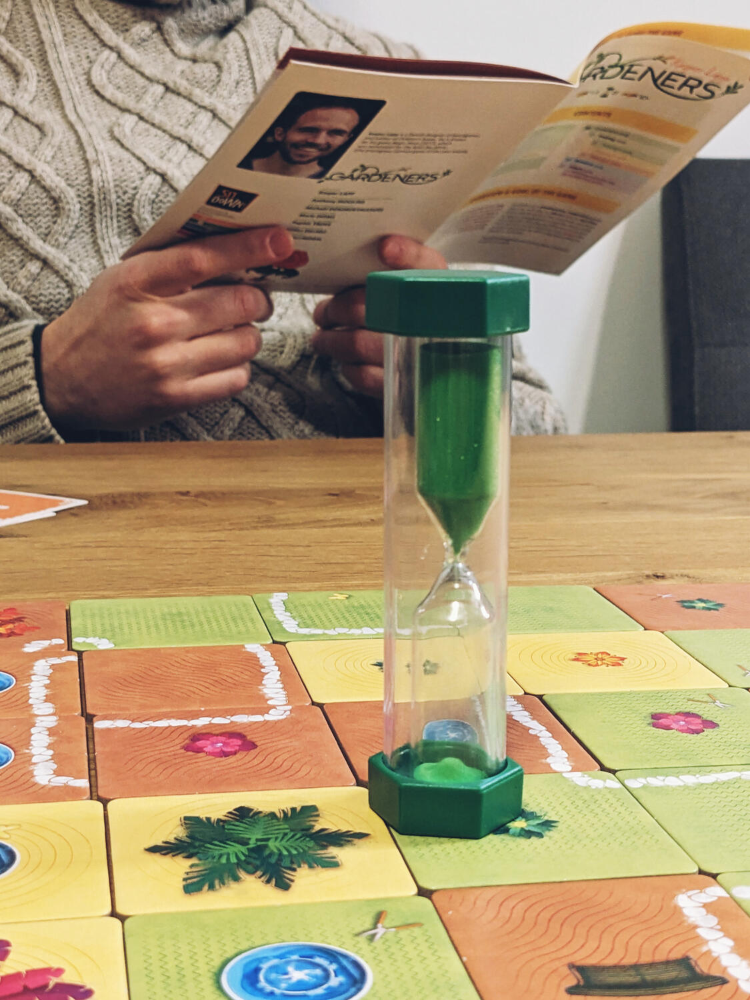
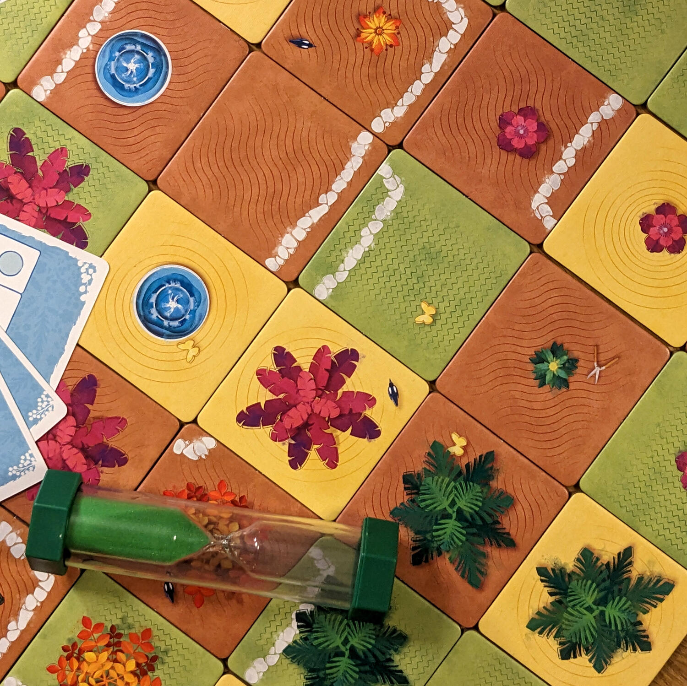
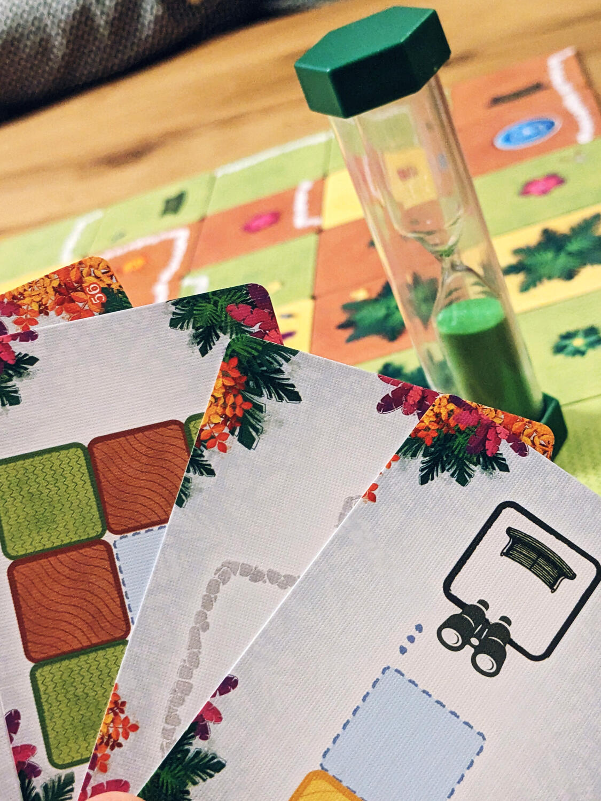

<Setting>

  Tanto tempo fa, in un regno lontano lontano, c'era un Re estremamente
  capriccioso che, nonostante tutti gli sforzi dei giardinieri reali, non
  riusciva a decidere come voleva che il suo giardino fosse arrangiato. In
  Gardeners, i giocatori assumeranno il ruolo dei giardinieri del Re, per il
  quale cercheranno di costruire un meraviglioso giardino. Ma il Re, purtroppo,
  sembra costantemente cambiare idea e inviare nuove disposizioni riguardo al
  layout di questo giardino. Riusciranno i nostri eroi a mettersi d'accordo e ad
  accomodare i desideri del Re?

</Setting>

<Rules>

  Gardeners è un gioco di deduzione cooperativo in cui, tutti insieme, si
  cercherà di posizionare 36 tessere in una griglia 6x6 in modo da soddisfare i
  requisiti di più carte obiettivo possibile. I giocatori, in silenzio e in
  tempo reale, durante la durata di una clessidra di 15 minuti, dovranno
  posizionare le tessere seguendo le disposizioni delle carte obiettivo:
  ciascuna di queste carte sarà nota ad un solo giocatore per volta in ogni dato
  momento.
   
  Quando una carta obiettivo viene soddisfatta, un altro giocatore ne pesca
  un'altra e così via, fino a un massimo di 3 carte contemporaneamente in gioco.
  In ogni turno, tutte le carte obiettivo in gioco dovranno essere soddisfatte
  e, in ciascuno di questi turni, ogni giocatore pescherà una carta nuova
  scartando la carta in gioco più vecchia, in un continuo ciclo che rinnova le
  carte in gioco.
   
  Ciascuna tessera presenta diverse illustrazioni, come diversi tipi di piante,
  panchine, sentieri, e tipi di terreno. Gli obiettivi daranno indicazione su
  come combinare queste illustrazioni, per esempio creare un sentiero lungo
  almeno 6 tessere, creare un pattern di 6 tessere con piante rosa e verdi, fare
  in modo che le panchine siano sempre rivolte verso i terreni gialli, e così
  via.
   
  L' obiettivo del gioco sarà quello di soddisfare più carte obiettivo possibile
  entro la fine della clessidra. Se si riuscirà a soddisfarne almeno 12, i
  giocatori avranno l'onore di aprire un pacchetto di carte addizionali che
  aggiungeranno nuovi obiettivi e vincoli, rendendo l'esperienza più avvincente
  per i giardinieri più esperti.

</Rules>

<Feedback>

  Gardeners è un gioco che si differenzia da tutti gli altri grazie alla
  combinazione di meccaniche che non si trovano associate molto spesso, come il
  Tempo reale, la Deduzione, e la Comunicazione limitata. Il risultato è un
  cocktail che, a sorpresa, funziona incredibilmente bene! Dal primo momento e
  dalla prima partita si può notare come la deduzione sia estremamente
  complessa, e questo è principalmente dovuto al fatto che i giocatori non hanno
  il permesso di comunicare tra di loro, ma anche al fatto che l'unico mezzo che
  hanno è quello di poter rimuovere le Tessere che gli altri giardinieri stanno
  piazzando, facendo così capire che qualcosa nel piazzamento delle Tessere in
  quell'area non rispetta i requisiti di una carta in gioco. Il fatto che ci
  siano sempre 3 carte attive, fa sì che i giardinieri si mettano
  involontariamente i bastoni tra le ruote a vicenda, originando momenti di pura
  frustrazione associata a ilarità.
   
  Un valore aggiunto lo dà il piccolo elemento legacy, dato dal fatto che se si
  raggiunge un determinato numero di carte obiettivo soddisfatte si avrà la
  possibilità di aggiungere al deck di carte degli obiettivi ulteriori, che
  renderanno il gioco più complesso e aumenteranno la rigiocabilità (già di per
  sé alta).
   
  Insomma, Gardeners è un titolo diverso e particolare che piacerà a chiunque
  cerchi nuove sfide o qualcosa di nuovo e inaspettato!

</Feedback>

