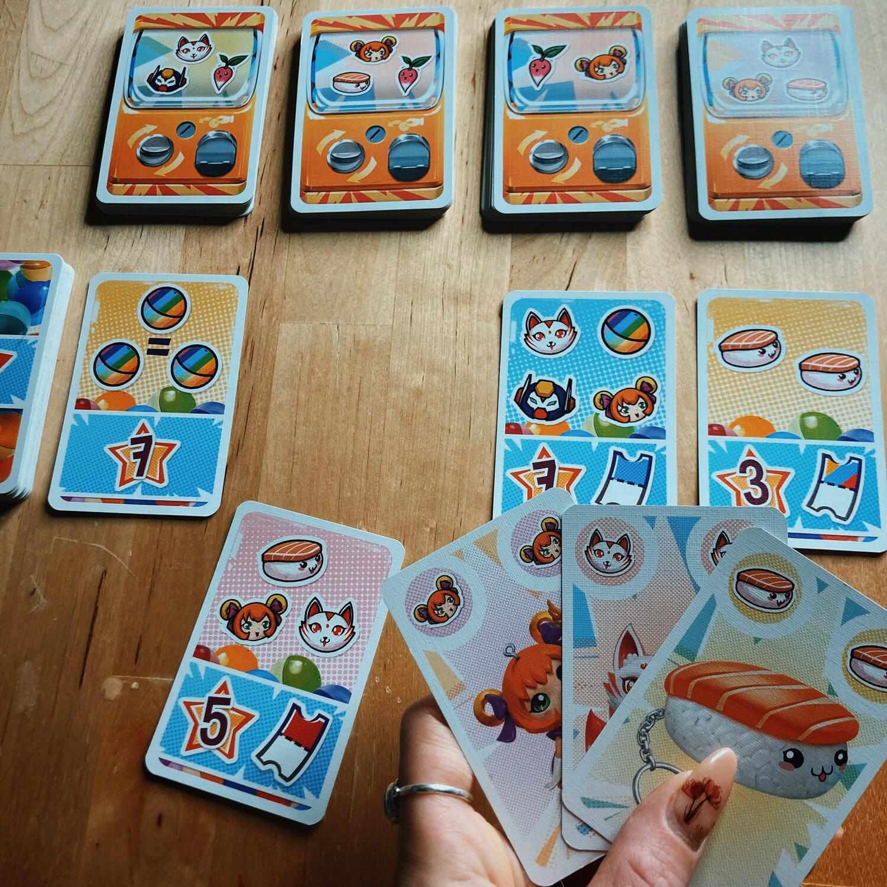
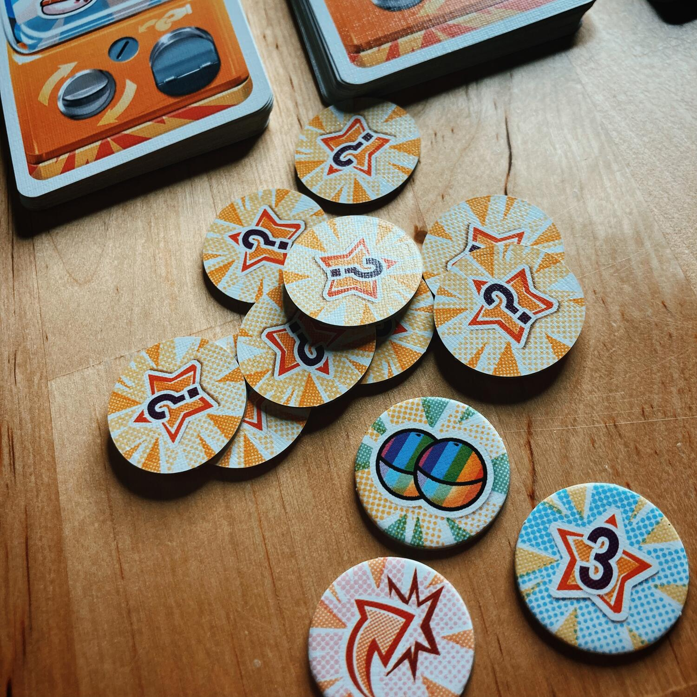

<Setting>

  Hai presente cosa sono i Gashapong? Quelle macchinette famosissime in
  Giappone con le quali puoi vincere pupazzetti colorati inserendo una monetina?
  Ecco questo gioco vuole esattamente ricreare quella sensazione di attesa e
  speranza (e ci riesce benissimo!).
   
  Ogni elemento del gioco urla Giappone, cosa che lo renderà estremamente
  appetibile per gli appassionati.

</Setting>

<Rules>

  Una volta effettuato il set up, i giocatori avranno due azioni tra cui
  scegliere:
   
  · Pescare due Carte Gasha da un singolo mazzo o da due mazzi diversi. 
   
  Se uno dei mazzi finisce, ridistribuire le carte rimanenti per crearne uno
  nuovo e, se non ci sono abbastanza carte per creare 4 mazzi, rimescolare gli
  scarti per formare nuovi mazzi, mantenendo in cima quelle che non erano ancora
  state pescate.
   
  
   
  · Scambiare Carte Gasha con una Carta Premio pagando la richiesta su di essa.
  Il giocatore dovrà tenere la carta appena presa davanti a sé e girare una
  nuova Carta Premio. Ci dovranno essere sempre 4 Carte Premio visibili.
   
  Tramite le Carte Premio si possono poi ottenere Segnalini Bonus; su alcune di
  esse, infatti, sono disegnati dei biglietti della lotteria con una sola metà
  colorata: quando si ottengono 2 Carte Premio che contengono mezzo Biglietto
  ciascuna, esse formano un biglietto intero, si potrà scegliere un Segnalino
  Bonus, rivelarlo e posizionalo sopra le due carte 
   
  NB: Se entrambe le metà biglietto usate sono dello stesso colore, il giocatore
  può pescare anche una Carta Gasha oltre al segnalino Bonus.
   
  
   
  I Segnalini Bonus hanno tre diverse abilità:
   
  · Svolgere un altro turno! 
   
  · 2 Gasha Jolly da spendere per completare collezioni future.
   
  · 3 punti vittoria
   
  Una volta compiuta l’azione, il giocatore gira il segnalino per mostrare che è
  stato speso.
   
  
   
  La partita finisce quando una di queste condizioni viene raggiunta:
   
  · L'ultimo segnalino Bonus viene reclamato.
   
  · Il mazzo di carte Premio è vuoto.
   
  · Mon si possono ricreare 4 mazzi Gasha (caso raro).
   
  Dal momento in cui viene raggiunta una di queste condizioni, ogni giocatore
  gioca ancora un turno: poi la partita finisce e si passa al calcolo del
  punteggio.

</Rules>

<Feedback>

  Gli elementi che rendono questo gioco gradevole sono diversi: la
  semplicità di tutti i suoi aspetti è sicuramente la sua caratteristica
  principale e indubbiamente anche il suo punto di forza; il set up e le regole,
  inoltre, sono immediati e lo rendono perfetto per essere un filler da avere in
  ogni “libreria”. 
   
  Non trascurabile è poi il richiamo alla cultura giapponese con i suoi elementi
  tipici come il Gundam, il sushi e il gatto a nove code raffigurati nei loro
  colori sgargianti che catturano e appagano subito l’occhio del
  giocatore.
   
  È perfettamente adatto anche ai più piccoli, sia per i disegni molto belli,
  sia perché la creazione delle combo richieste con le Carte Gasha è davvero
  immediata. Mi ha sorpreso la sua scalabilità: ottima dai 2 ai 4 giocatori;
  funziona bene anche in 5, ma risulta leggermente più lento, nonostante il
  turno sia di per sé molto veloce.
   

</Feedback>
