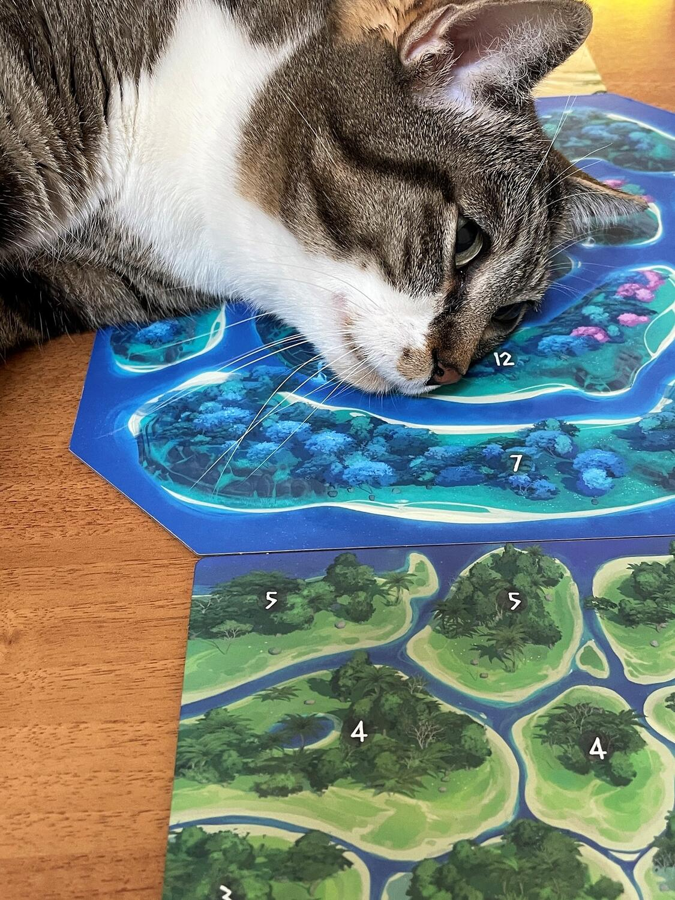

<Setting>

  In <em>Genesia</em> vedrete la civiltà evolversi nel corso di 3 <em>Epoche</em>, mentre conducete il vostro popolo
  alla conquista di terre lontane, con un approccio pacifico e volto allo sviluppo grazie alle grandi invenzioni della
  storia oppure con un approccio più bellicoso.
   
  &nbsp;
   

</Setting>

<Rules>

  Innanzitutto si sceglie la configurazione del tabellone centrale (raffigurante le <em>Regioni di Genesia</em>) e la
  quantità dei <strong>mazzi di carte</strong> in base al numero di giocatori; i set di carte da utilizzare, inoltre,
  sono a libera scelta, rendendo ogni partita diversa dall'altra. Si posizionano poi i <em>Continenti</em> dei giocatori
  intorno all'area centrale di Genesia e ciascun giocatore sceglie un <strong>obiettivo segreto</strong> tra due che gli
  vengono forniti.
   
  Una partita a <em>Genesia</em> si compone di 3 round (<em>Epoche</em>), all’inizio dei quali avviene una fase di{" "}
  <strong>card drafting</strong> tra i giocatori: vengono consegnate 6 carte ciascuno e si procede con il draft finché
  ognuno avrà 5 carte in mano. Ciascuna carta presenta in alto a sinistra il simbolo che indica al giocatore in quale
  fase di gioco la potrà utilizzare ed ottenere le azioni ad essa associate, che possono essere, tra le altre,{" "}
  <em>acquisire nuovi Clan, posizionare Città, muoversi tra le Regioni</em>.
   
  Ogni <em>Epoca</em> si divide poi in <strong>4 fasi</strong> da eseguire a turno in ordine:
   
  <ol>
    <li>      <strong>        <em>Crescita</em></strong>: oltre a giocare tutte le carte con il simbolo corrispondente, durante la prima fase è possibile <em>        reclutare nuovi Clan</em> da posizionare o nella propria <em>Patria</em> (area di partenza) o in Città già costruite;</li>
    <li>      <strong>        <em>Espansione</em></strong>: come per la fase 1, ma con la possibilità ulteriore di poter <em>        muovere i propri Clan da una Regione all'altra</em> per cercare di occupare aree dal punteggio più alto;</li>
    <li>      <strong>        <em>Attacco</em></strong>: tutti i giocatori rivelano le loro intenzioni attraverso il gettone Guerra/Pace; se tutti dichiarano Pace si passa alla fase successiva, se invece qualcuno dichiara Guerra si procede alla fase di attacco, purché siano rispettate le particolari condizioni di ingaggio; a supporto di Attacco e Difesa si possono giocare le carte corrispondenti;</li>
      <li>      <strong>        <em>Fine Epoca</em></strong>: alla fine del round si <em>costruiscono Città nelle Regioni</em> in cui sono stati collocati almeno 2 Clan e si giocano le carte di questa fase che danno punti netti parziali.</li>
  </ol>
    Alla fine della terza Epoca si passa al conteggio finale dei punti, sommando i punti parziali raccolti durante la
    partita, i punti per Regioni occupate avversarie, del proprio Continente e di Genesia, ed infine i punti per
    l'obiettivo segreto. Chi ha più punti è il vincitore.

</Rules>

<Feedback>

  Immaginando di rivolgersi a dei neofiti dei giochi da tavolo moderni, si potrà consigliare <em>Genesia</em> a tutti
  coloro che conoscono <em>Risiko</em>, dato che l'idea di dover conquistare territori attraverso l'uso di carte e
  quella di dover conseguire un obiettivo segreto lo ricorda molto.
   
  Il gioco in sé non è particolarmente articolato e si intavola bene con qualunque grado di esperienza si possieda nei
  giochi in scatola; è presente inoltre una <strong>scheda riassuntiva</strong> delle regole per ciascun giocatore che
  può essere un ottimo strumento di supporto nelle prime partite.
   
  Un <strong>punto a favore</strong> di Genesia è la <strong>variabilità</strong>, che consente di mixare a piacere i
  diversi mazzetti di carte disponibili, così da lasciar spazio a strategie e combo sempre differenti.
   
  Un <strong>punto a sfavore</strong> è l'assenza della sensazione di civilizzazione con la quale il gioco si presenta:
  la grafica e la didascalia delle carte seguono uno sviluppo storico, ma ai fini del gioco sono del tutto irrilevanti;
  di conseguenza, dopo qualche partita ignorerete totalmente questo aspetto, osservando solamente l'azione che ogni
  carta offre.
   
  In conclusione, non un must-have ma un titolo che val la pena provare se vi piace l'aspetto{" "}
  <strong>strategico</strong> della conquista dei territori e la presenza dominante delle carte.

</Feedback>

