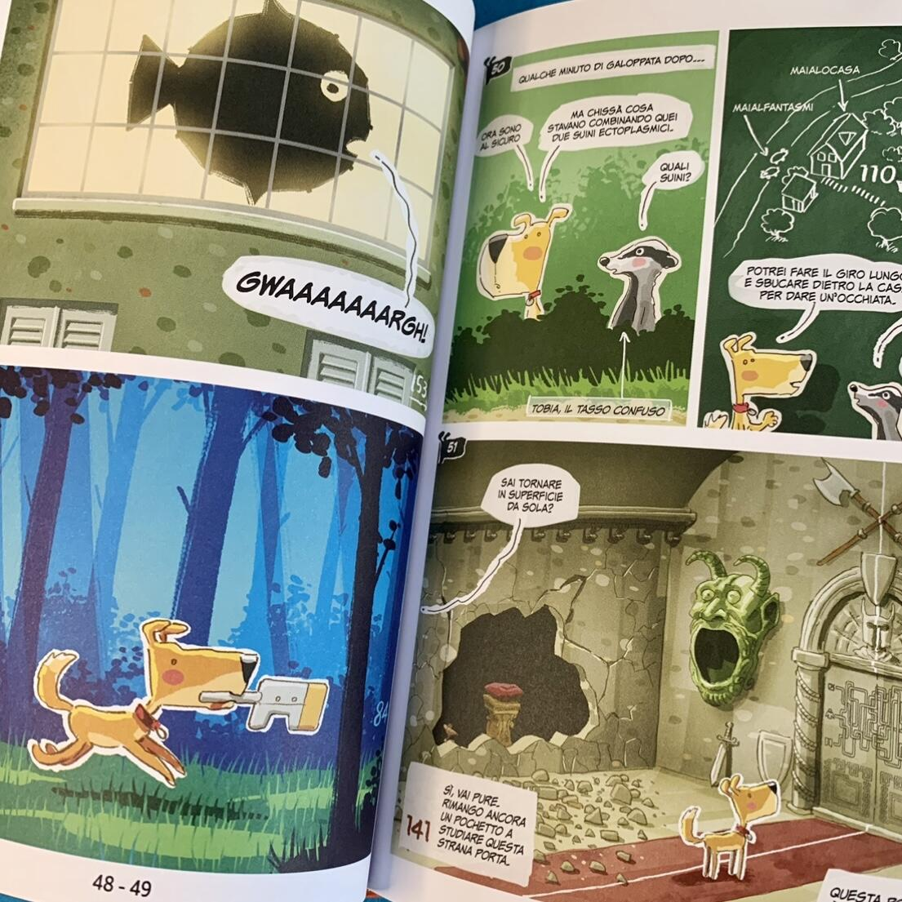

<Setting>

  “Un giorno da cana” è un librogame a fumetti interamente italiano realizzato dal fumettista Stefano Tartarotti e dal game designer Christian Giove. 
La protagonista è Lucy, una simpatica cagnolina di 4 anni, meticcia di taglia media mezza golden retriever e mezza levriero, che vive con “il pelato”, ovvero il suo padrone, che di mestiere fa il disegnatore.  
Visto che l’uomo è sempre distratto e costantemente indietro con il lavoro, <strong>Lucy si ritrova con molto tempo libero… che occupa curiosando nei dintorni</strong>, visitando luoghi ed incontrando altri animali.  
Tuttavia, il pelato non è conoscenza di queste scorribande, pertanto <strong>lei deve sempre tornare a casa in tempo per non farsi scoprire</strong>. Infatti, <strong>il finale della storia è sempre il ritorno a casa, ma Lucy può tornare soddisfatta dopo aver vissuto un’avventura interessante o perplessa perché ha la sensazione che le sia sfuggito qualcosa</strong>. 
In questo entusiasmante fumetto-gioco ci sono quattro storie principali da completare, eventi secondari e segreti da scoprire, così da poter leggere e rileggere questo fumetto scoprendo sempre una nuova e fantastica avventura!

</Setting>

<Rules>

 In ogni lettura di questo fumetto-gioco vi troverete ad <strong>accompagnare Lucy in una delle sue giornate di vagabondaggio </strong>a Piozzano, nelle colline piacentine. 
Sono proposti numerosissimi percorsi a bivi ed enigmi, che consentono al lettore di determinare passo dopo passo l’avventura di Lucy, come ad esempio chi incontra, cosa fa e come reagisce. 
Giocare è semplicissimo, <strong>si leggerà l’introduzione e poi si deciderà come procedere, scegliendo tra le opzioni indicate da numeri che rimandano al paragrafo corrispondente</strong>. Ma attenzione: alcune volte, per proseguire, ci sarà da risolvere degli enigmi per trovare il numero del paragrafo successivo, oppure bisognerà aguzzare la vista per trovare numeri nascosti (proprio come negli <Link to="/reviews/unlock-escape-adventures/"> Unlock </Link>). 
Durante l’avventura, Lucy potrà trovare degli oggetti interessanti, che potrà sotterrare in varie buche scavate nel giardino (con nomignoli buffi come <em>buca della pulce zoppa</em> e <em>buca del croccantino</em>), dove resteranno al sicuro tra una partita e l’altra. Insomma, è una sorta di inventario molto semplice, consultabile in qualsiasi momento.

</Rules>

<Feedback>

  Vivere “un giorno da cana” è molto più interessante di quanto potrebbe sembrare.  
Il fumetto presenta moltissime alternative, con 4 storie principali e ulteriori storielle con un finale ben preciso. Alcune avventure saranno semplici giornate “da cani”, ma altre si riveleranno surreali e anche un po’ paranormali. Tutte sono però piacevolissime da leggere e lo stile grafico si adatta perfettamente alla storia.  
Si tratta di un <strong>prodotto valido sia per bambini che per adulti, poiché, con una lettura più attenta, è possibile trovare diversi easter egg</strong> (come ad esempio da Guida galattica per autostoppisti). 
Le storie sono molto interessanti ed ogni lettura è unica a suo modo. Infatti, alcune avventure possono essere risolte semplicemente attraverso il “fiuto”, mentre altre con enigmi o ragionamenti, oppure in altre ancora si dovranno raccogliere indizi per risolvere il finale. Potrebbe anche capitare che per finire alcune partite bisognerà prima completare altre storie, per recuperare determinati oggetti utili alla risoluzione.  
Questo fumetto-gioco è perfetto anche per chi non è abituato a leggere, poiché in massimo 30 minuti si potranno vivere tantissime storie raccontate con leggerezza ed ironia e man mano che si gireranno le pagine il lettore si renderà conto delle enormi possibilità.  
Complimenti a <Link to="/designers/stefano-tartarotti">Stefano Tartarotti</Link> e <Link to="/designers/christian-giove">Christian Giove</Link> per questo capolavoro!

</Feedback>

