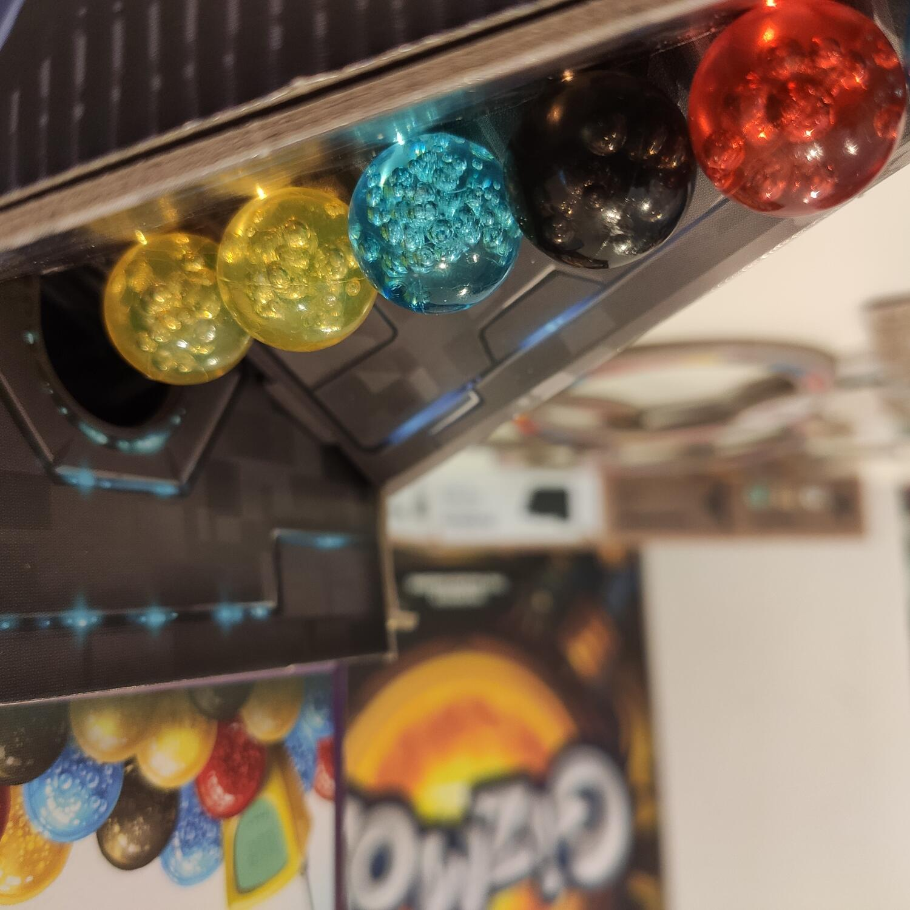
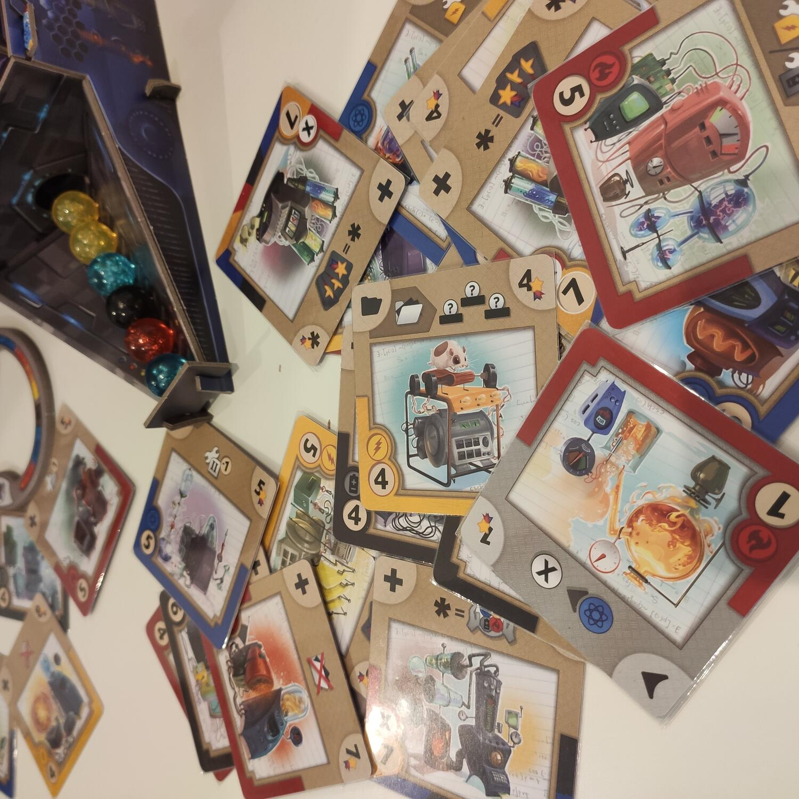

<Setting>

  Password  
  Ciuffo, ciuffo rosso, ...
   
  Nel Laboratorio degli Express… Se come me hai cominciato a canticchiare la celebre
  sigla non indugiare oltre, assicura Gizmos nel tuo carrello virtuale e schiaccia
  il bottone Ordina Subito. Bene, ora puoi continuare la lettura.
   
  Alla Grande Fiera della Scienza è stata indetta una gara per eleggere la mente
  più brillante: i partecipanti dovranno scontrarsi a colpi di creazioni e verrà
  eletto vincitore chi riuscirà a creare il marchingegno più efficiente in grado
  di far ottenere il numero di punti maggiore di tutti gli altri. Insomma, pane per
  i nostri denti.

</Setting>

<Rules>

  Le regole sono talmente poche e semplici che dovrò utilizzare tutta la mia
  scienza per far sì che non risulti il capitolo più breve di tutta la storia di
  Dudexpress.  
  Nel proprio turno ogni scienziato sarà chiamato ad effettuare una azione: raccogliere
  energia dal generatore sotto forma di affascinanti biglie colorate.
   
  Costruire un nuovo modulo, detto “gizmos", per noi è tanto semplice quanto scegliere
  di farlo; certo, tutto ha un costo, quindi basterà privarsi di un po 'di energia
  accumulata per poter ampliare le funzionalità nel proprio marchingegno. . 
  Lo so, lo so, spesso la nostra mente vaga ma la nostra riserva di energia ci
  riporta alla cruda realtà; ma non ti preoccupare, puoi spendere una tua azione
  per archiviare un gizmos non ancora costruito per poterlo attivare poi quando
  potrai permettertelo. Ehm no, mi dispiace, non c'è possibilità di
  finanziamento..
   
  Ma che scienziati siamo se non ci dedichiamo alla ricerca? L'azione ricerca
  permette di scavare tra i gizmos e poter scegliere il più adatto da esser
  costruito o archiviato. Fine..
   E dove sta la competizione chiedi? Ogni gizmos che andiamo a costruire darà
  degli effetti positivi a una specifica funzione, permettendoci di combinare e concatenare
  azioni pazzesche! Quindi sta alle nostre brillanti menti riuscire a concatenare
  questi effetti e a riuscire ad ottenere i migliori risultati. Ho archiviato un
  Gizmos? Bene, ora tutti i miei moduli si attivano e mi permettono di raccogliere
  della succosa energia, raccogliendola si attivano di conseguenza altri moduli...
  ah dimenticavo ho un modulo che…

</Rules>

<Feedback>

  Gizmos semplicemente funziona.  
  Intrattiene, diverte, ci mette alla prova per poi premiare le nostre fatiche. Funziona
  così bene che è consigliabile a tutti, soprattutto a novelli scienziati che vogliono
  mettersi alla prova su un terreno di gioco nuovo.
   
  Le azioni sono semplici, le regole sono poche e chiare, la vera sfida è data a
  noi: far funzionare la nostra macchina nel migliore dei modi, costruendo i moduli
  più congeniali ed effettuando le azioni più vantaggiose.  
  L'esperienza di gioco è breve e intensa ma senza mai fondere il cervello, si
  può partecipare anche sorseggiando una birra e scambiando qualche chiacchiera,
  cosa però che un vero scienziato fa di rado, soprattutto se indossa un camice
  bianco e degli stivaletti da schianto.

</Feedback>
