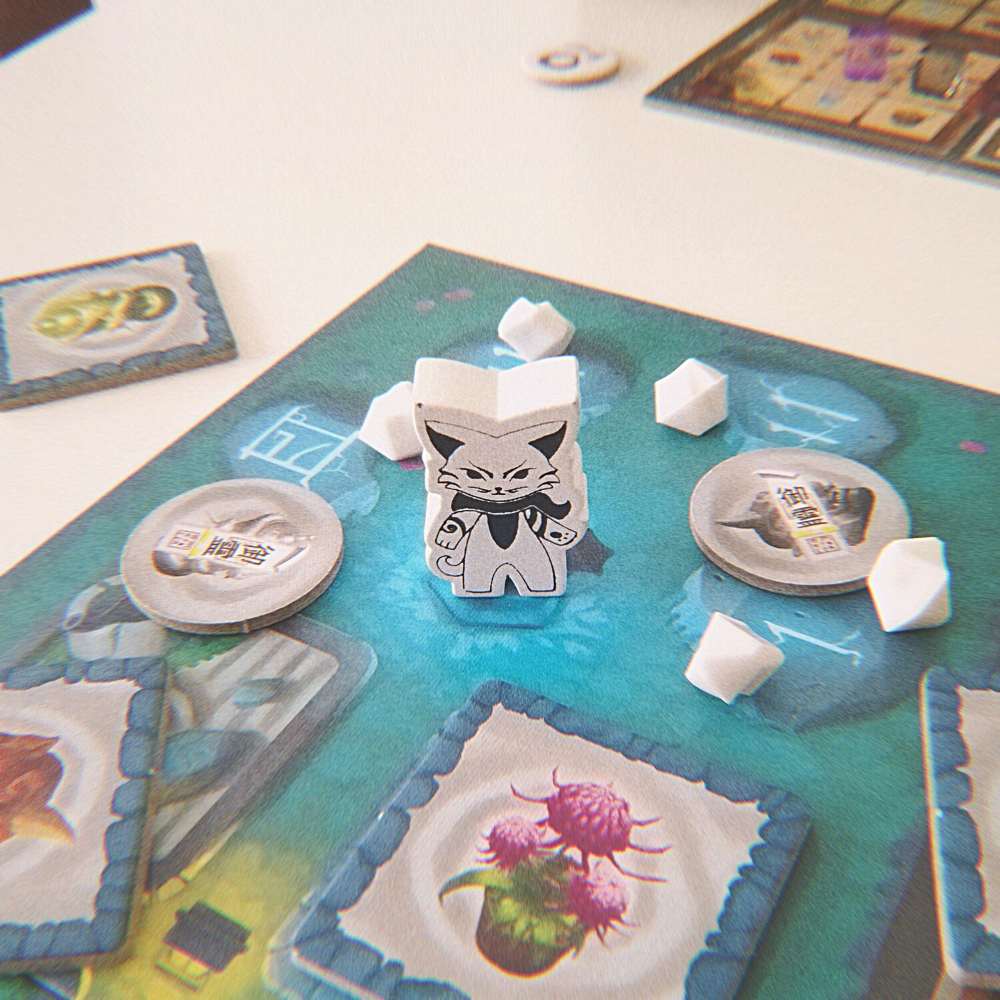
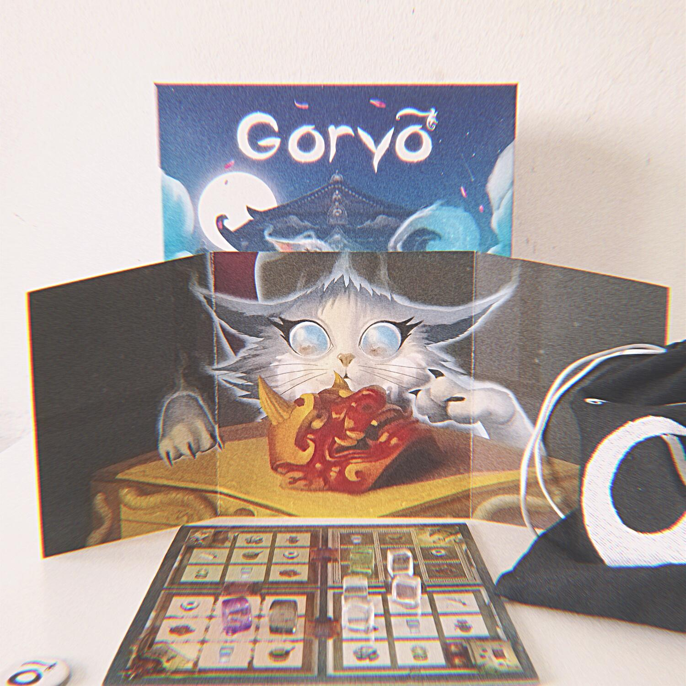
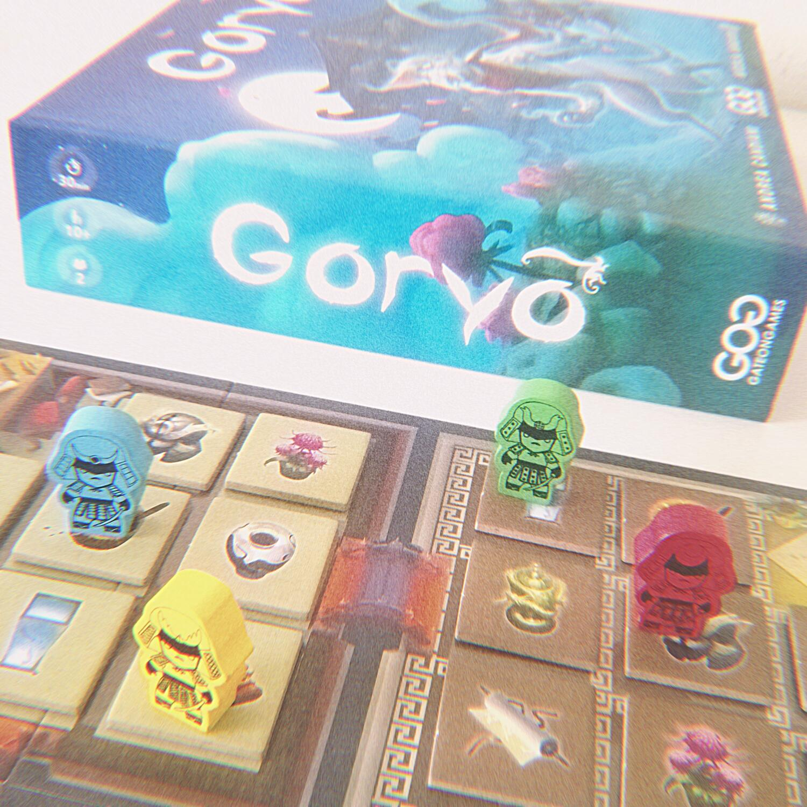

<Setting>

  Nell'antico castello di Edo una terribile vendetta sta per consumarsi. Un Goryo, uno spirito vendicativo, si è appena
  manifestato nelle stanze del palazzo per riuscire a vendicarsi di uno smacco subito in vita dallo scaltro Shogun.
  Solamente i Samurai a guardia del palazzo possono impedire il misfatto ad opera di questa oscura presenza che farà di
  tutto pur di compiere una terribile vendetta a misura di… gatto!
   
  Il Goryo cercherà di rompere gli oggetti custoditi nel palazzo, sfruttando la sua forma evanescente, mentre i Samurai
  dovranno coordinare i loro appostamenti per rintracciarne le mosse e intercettarlo.

</Setting>

<Rules>

  Goryo è un gioco di <strong>investigazione asimmetrico</strong> per 2 giocatori.
   
  Un giocatore assumerà il ruolo del <strong>Goryo</strong>, prendendo la plancetta della mappa, il pennarello, i
  cubetti movimento e lo schermo dietro al quale orchestrerà i suoi movimenti. L'altro, invece, impersonerà i{" "}
  <strong>4 Samurai</strong> che tenteranno di fermare lo spirito felino, spostandoli sulla mappa principale (composta
  da 4 stanze, ciascuna contenente una copia degli 8 oggetti) e aiutandosi con la plancia delle azioni dei Samurai. Il
  Goryo, inoltre, riceve dal sacchetto un oggetto "vincolato", che indicherà l'unico tipo di oggetto che non potrà
  rompere nel corso della partita.
   
  Ogni round si articola in un turno del Goryo seguito da un turno dei Samurai. Nel turno del Goryo, il giocatore
  organizzerà i cubetti movimento sulla plancetta al riparo dello schermo: quando sarà soddisfatto, potrà dichiararlo e
  porre fine al suo turno.
   
  Toccherà quindi ai Samurai. Fino a 3 di essi potranno compiere 2 azioni tra le seguenti 3:
   
  <ul>
    <li>      <strong>Movimento</strong>: il Samurai si sposta in una casella adiacente (questa è l'unica azione che può essere
      compiuta 2 volte dallo stesso Samurai nel medesimo turno);</li>
    <li>      <strong>Indagine</strong>: il Samurai indaga sulla casella su cui si trova;</li>
      <li>      <strong>Segugio</strong>: il Samurai indaga su una casella adiacente.</li>
      <li> <strong>Indagare </strong>indica l'azione di chiedere al giocatore del Goryo se su quella casella si trova uno dei
      suoi cubetti movimento: se l'intuizione sarà corretta, il giocatore dei Samurai vi apporrà una pedina verde come
      promemoria; in caso contrario, la pedina sarà rossa.</li>
  </ul>
  Alla fine del round, il Goryo rivela il posizionamento dei cubetti movimento: per ogni due indagini corrette dei Samurai
  (che si accumulano tra un turno e l'altro), il giocatore che li controlla prenderà un oggetto dal sacchetto, escludendo
  quindi uno dei possibili oggetti vincolati del Goryo; quell'oggetto, inoltre, non potrà più essere rotto durante la partita.
  Il Goryo, invece, romperà l'oggetto su cui ha terminato il movimento. Inoltre, se uno dei Samurai si troverà sulla casella
  di arrivo del Goryo, lo coglierà in fallo e girerà uno dei 3 gettoni appositi (e prenderà un ulteriore oggetto dal sacchetto).
   
  Accanto alla mappa, inoltre, sono presenti 8 tessere oggetto che indicano quali oggetti NON sono l'oggetto vincolato del
  Goryo (ed eventualmente segnano quelli "protetti" dai Samurai che il Goryo non può rompere).
   
  La partita termina quando, alla fine di un round, si verifica una delle seguenti condizioni:
  <ul>
    <li>Sono stati rotti 5 oggetti (vittoria del Goryo);</li>
    <li>      Rimane solo 1 degli 8 oggetti che non è ancora stato rotto/protetto, cioè l'oggetto vincolato (vittoria dei
      Samurai);</li>
    <li>Il Goryo rompe per sbaglio il suo oggetto vincolato (vittoria dei Samurai);</li>
    <li>I Samurai colgono sul fatto il Goryo tre volte (vittoria dei Samurai).</li>
  </ul>

</Rules>

<Feedback>

  La prima perplessità che sorge dopo aver letto il regolamento di questo gioco riguarda l'apparente{" "}
  <strong>sbilanciamento </strong>tra le condizioni di vittoria del Goryo e quelle dei Samurai (1 contro 3). D'altro
  canto, questa impressione sarà immediatamente smentita dalle prime partite, in cui ci si renderà presto conto che
  quello che il Goryo deve far per vincere è semplicemente seguire le regole, mentre il lavoro "sporco" tocca al
  Samurai, che dovrà anticipare le mosse dell'avversario e cercare di essere sempre un passo avanti.
   
  Quest'esperienza, dopo un paio di partite stravinte dallo spirito felino, comincerà ad essere{" "}
  <strong>frustrante</strong>, ed è del tutto naturale: <em>Goryo </em>ha infatti una{" "}
  <strong>lenta curva di apprendimento</strong>, cosa che però può permettersi, data la durata molto contenuta e la
  possibilità di scambiarsi i ruoli tra una partita e l'altra, per cercare di immedesimarsi nell'avversario e prevederne
  le macchinazioni. Sul lungo termine, infatti, i piatti della bilancia saranno riequilibrati dall'esperienza del
  Samurai, che potrà contare sulla prevedibilità della strategia del Goryo, il quale dovrà dare fondo ad una forte
  immaginazione strategica per riuscire a sfuggirgli.
   
  Una volta raggiunta questa situazione, <em>Goryo </em>potrà facilmente essere consacrato come "comfort game", quel
  titolo che può essere tirato fuori una volta ogni tanto quando si ha voglia di un'esperienza{" "}
  <strong>familiare ma stimolante</strong>. 
  Ma una buona parte del make-it-or-break-it di questo gioco la fa la <strong>produzione</strong>, su cui ci sono tante (e
  non sempre coerenti) parole da spendere.
   
  La componentistica è incredibilmente ricca, sia nella qualità che nella quantità, il che - visto il prezzo - non è una
  cosa da poco. Tuttavia, più lo si gioca, più si ha la sensazione che ci si trovi davanti ad un gioco "overproduced".
   
  Alcune delle operazioni di set up e diversi componenti legati al tenere traccia delle azioni finiscono per risultare del
  tutto <strong>superflui</strong>. Io, personalmente, ho incollato le 32 caselle degli oggetti su dei fogli, invece di disporli
  ad ogni partita nello stesso ordine (cosa che non porta alcun vantaggio significativo in termini di fruibilità del gioco).
  E anche la plancia con le azioni dei Samurai può tranquillamente ridursi ad uno schema mentale.
   
  A parte questo, Goryo può contare su una produzione davvero fuori dal comune nella sua fascia di prezzo, e in cui i materiali,
  al di là del valore estetico, sono stati studiati in modo da supportare perfettamente il gameplay, che - va detto - è strutturato
  in diversi livelli di astrazione.
   
  In conclusione, Goryo è un titolo che non convince da subito, ma che sa sicuramente ammaliare i giocatori con un'atmosfera
  fumosa e delle forti pennellate tattiche che riescono ad evocare l'ambientazione promessa dalla scatola. Al riparo dal
  suo schermo, il Goryo avrà un grande controllo sulla partita, mentre ai Samurai rimarrà l’impressione di muoversi alla
  cieca, proprio come se stessero dando la caccia ad un’entità invisibile. Mano a mano che la partita procederà, ai Samurai
  sembrerà di vederci chiaro e, se saranno abbastanza in gamba, potranno addirittura riuscire ad accerchiare il Goryo, senza
  lasciargli via di scampo.

</Feedback>

