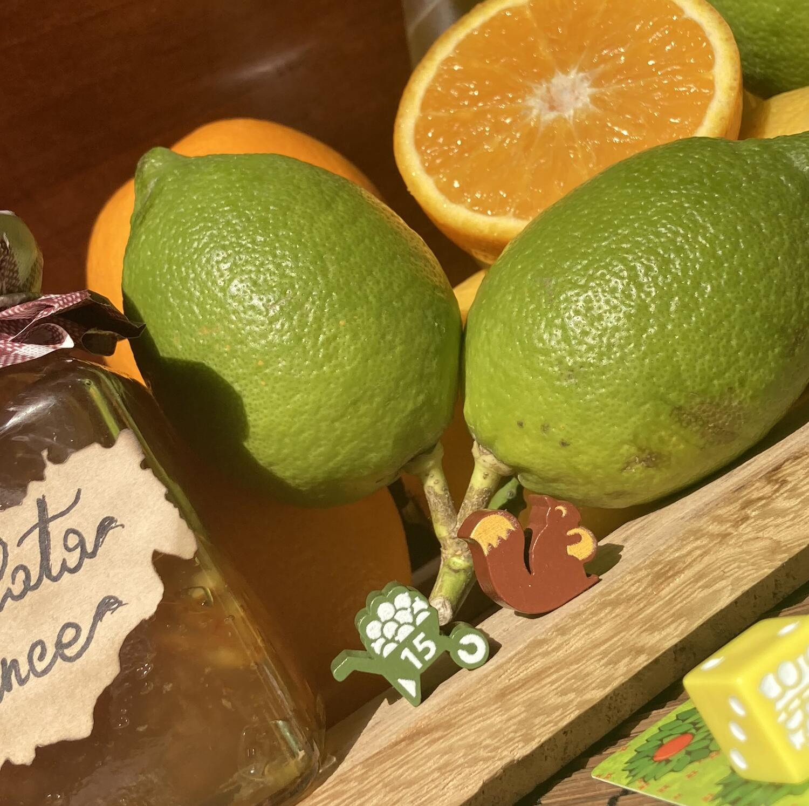
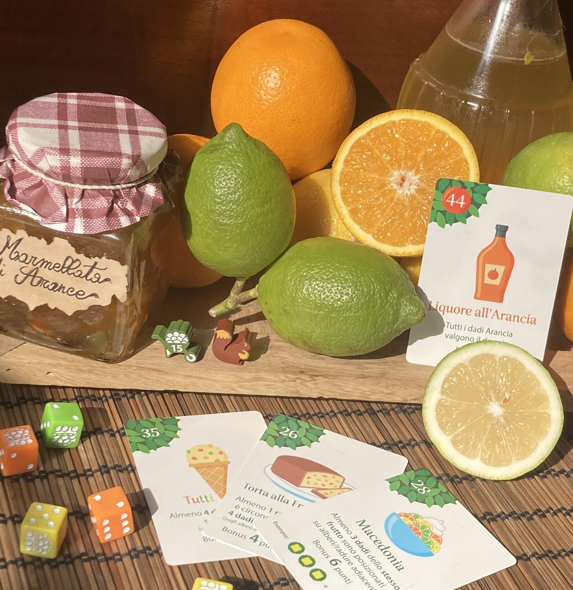

<Setting>

  D’un tratto, mentre stai passeggiando in un caldo pomeriggio d’estate, scorgi
  che il frutteto sta pian piano cambiando volto…  I meli lasciano il posto
  agli alberi di arance e i peri si trasformano in limoni; una fioca luce sfiora
  le folte chiome degli alberi, l’aria è intrisa di un intenso profumo d’agrumi
  e la mente in un attimo ti trasporta in Sicilia. La fitta coltre di alberi
  lascia spazio, di tanto in tanto, a delle verdi radure, quasi come se avesse
  il bisogno di respirare e in lontananza si ode distintamente lo squittire
  degli scoiattoli; camminando, innumerevoli sono i cesti stracolmi di frutta e,
  quando davanti a te si staglia una carriola ricca d’arance, forte è il
  desiderio che guida la tua mano nel coglierne una per assaggiarla.

</Setting>

<Rules>

  Preparare una partita è davvero immediato: il giocatore sceglie 9 delle 18
  carte, ponendone una davanti a sé scoperta per dare inizio al frutteto e
  tenendone due vicine come mano iniziale. Ogni turno consiste in:
  <ul>
    <li>Giocare una carta</li>
    <li>Posizionare i dadi</li>
    <li>Pescare un’altra carta</li>
  </ul>
  <u>GIOCARE UNA CARTA</u>  
  Il giocatore posiziona una delle due carte che ha in mano, girandola a piacimento,
  in modo che almeno un albero o una radura copra un albero della carta già posizionata
  sul tavolo. È indispensabile ricordare che per guadagnare punti possono essere
  sovrapposti solo alberi della stessa specie.
   
  <u>POSIZIONARE I DADI</u>
   
  Per ogni sovrapposizione, occorrerà posizionare un dado del colore corrispondente
  alla specie dell’albero su cui viene collocato; il dado dovrà indicare il numero
  dato dalla somma dei frutti presenti sugli alberi sovrapposti.
   
  Se su un albero è già presente un dado, il suo valore aumenterà del numero di frutti
  presenti sull’albero con cui si andrà a coprire.
   
  Superato il 6, il giocatore posizionerà il dado sul cesto di frutta con valore
  10 e, qualora si dovesse superare anche questo punteggio, sostituirà il dado con
  la carriola che avrà valore 15.
   
  Se non ci saranno più dadi del colore necessario disponibili, si salterà semplicemente
  questo passaggio.
   
  I giocatori dovranno poi porre molta attenzione alle regole speciali per le radure
  e ricordarsi che solo una volta per partita potranno sovrapporre alberi di specie
  diverse o un albero su un dado diverso dal colore dei suoi frutti, posizionando
  così lo scoiattolo che non potrà mai essere sovrapposto.
   
  La partita termina quando il giocatore avrà posizionato tutte e nove le carte a
  disposizione e potrà calcolare il punteggio sommando i valori di tutti i dadi presenti
  nel frutteto ricordando che:
  <ul>
    <li>I dadi sulle radure non danno punti</li>
    <li>      Occorre sottrarre un punto per lo scoiattolo e un punto in più per ogni
      dado presente su un albero ortogonalmente adiacente ad esso</li>
  </ul>
   
  <u>SFIDA RICETTA</u>
   
  Per rendere la sfida più allettante il giocatore potrà utilizzare i dorsi di
  due carte come obiettivi e per ottenere dei bonus a fine partita: sommando i
  due numeri presenti sul dorso delle carte nell’angolo in alto a sinistra si
  otterrà il Punteggio Bersaglio da raggiungere per vincere la partita e, se
  rispetterete le condizioni riportate sulle ricette, si guadagneranno punti
  extra.

</Rules>

<Feedback>

  Complici le piccole dimensioni della confezione e le regole semplicissime
  Grove è un gioco estremamente portatile che potrà farvi compagnia nelle più
  svariate occasioni.  
  Nonostante la sua brevità, rispetto al suo fratello maggiore <Link to="/reviews/orchard/">
    Orchard
  </Link> può essere considerato più sfidante perché la presenza delle radure rende
  il gioco leggermente più strategico: infatti, non sarà affatto facile sovrapporle
  tutte e si dovrà calibrare molto bene ogni mossa per non sprecare della preziosa
  frutta.  
  Indubbiamente la cosa che contraddistingue maggiormente questo titolo è la
  Sfida Ricette, che aggiunge pepe alla sfida rendendola ancora più avvincente.{" "}
   
  Come il suo predecessore, Grove è un must have per tutti gli appassionati perché
  non stuferà facilmente ed è perfetto per introdurre nel mondo dei giochi da tavolo
  (particolarmente i solitari) qualche amico ancora dubbioso.  
  Sì, è vero, forse essendo un solitario non sarà facile percepirne il valore in
  compagnia, ma se si dispone di più copie sarà possibile giocarlo in più
  giocatori; sulle istruzioni è riportato un paragrafo dedicato (un’altra vera
  genialata dell’autore!).

</Feedback>
