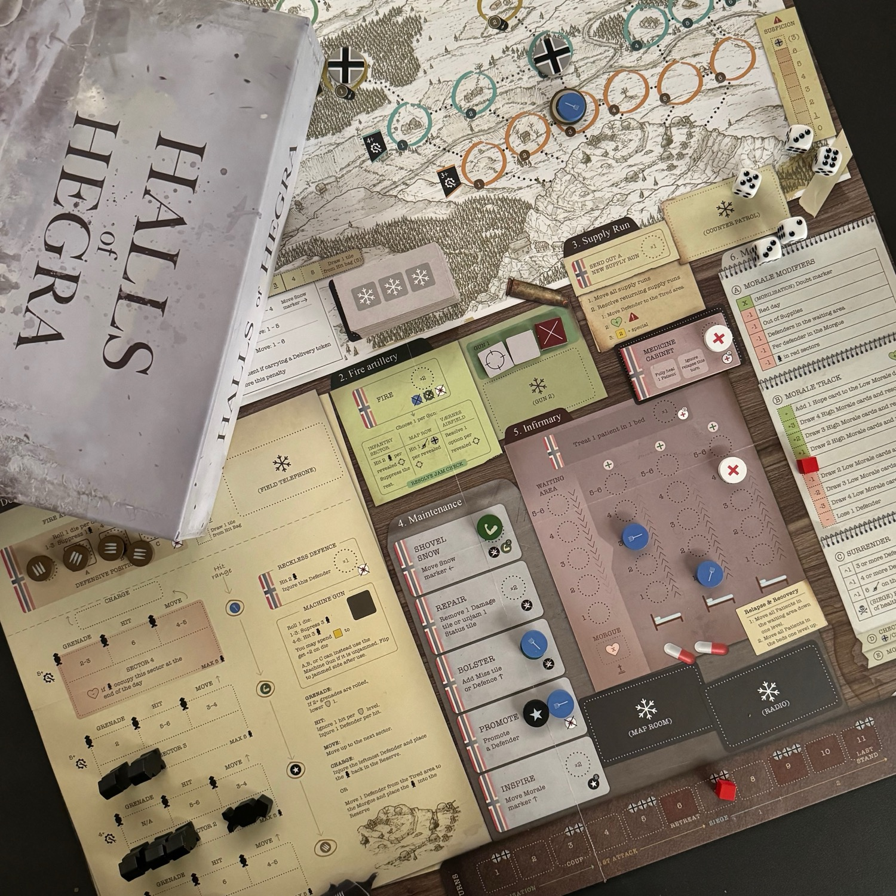
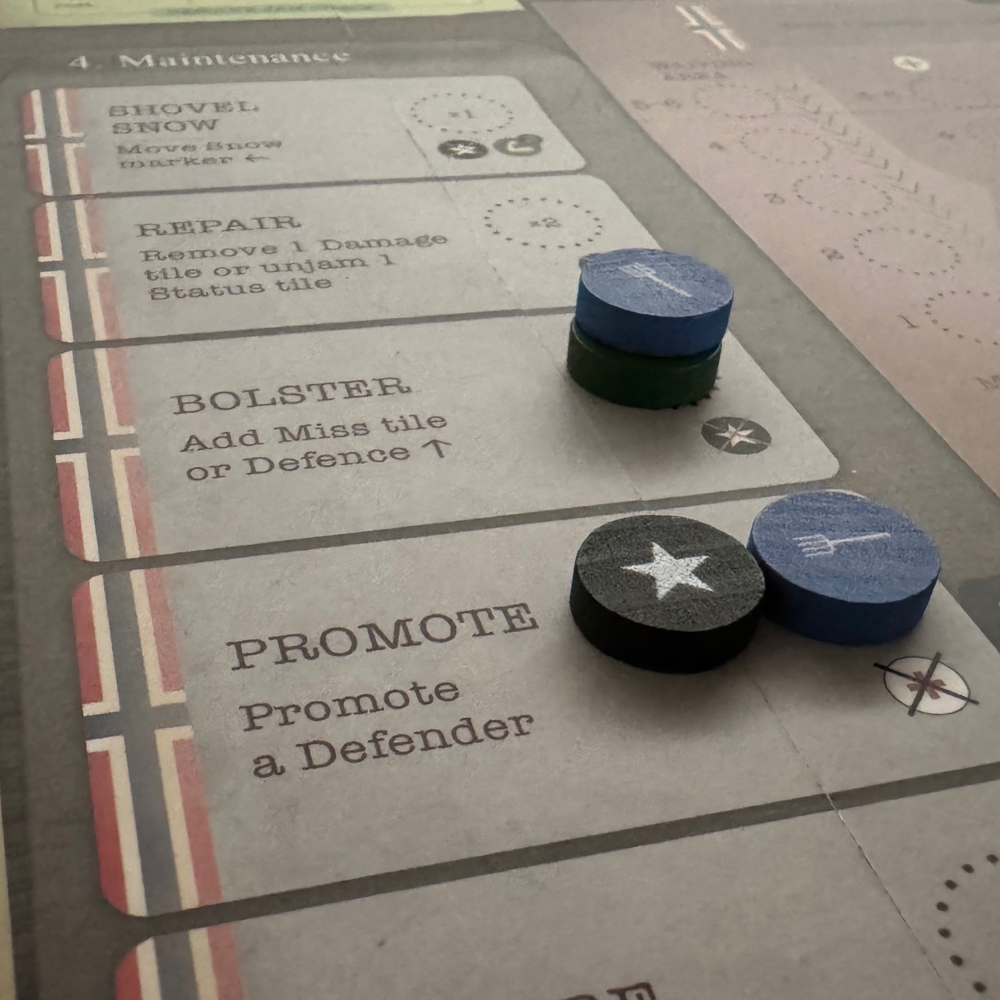
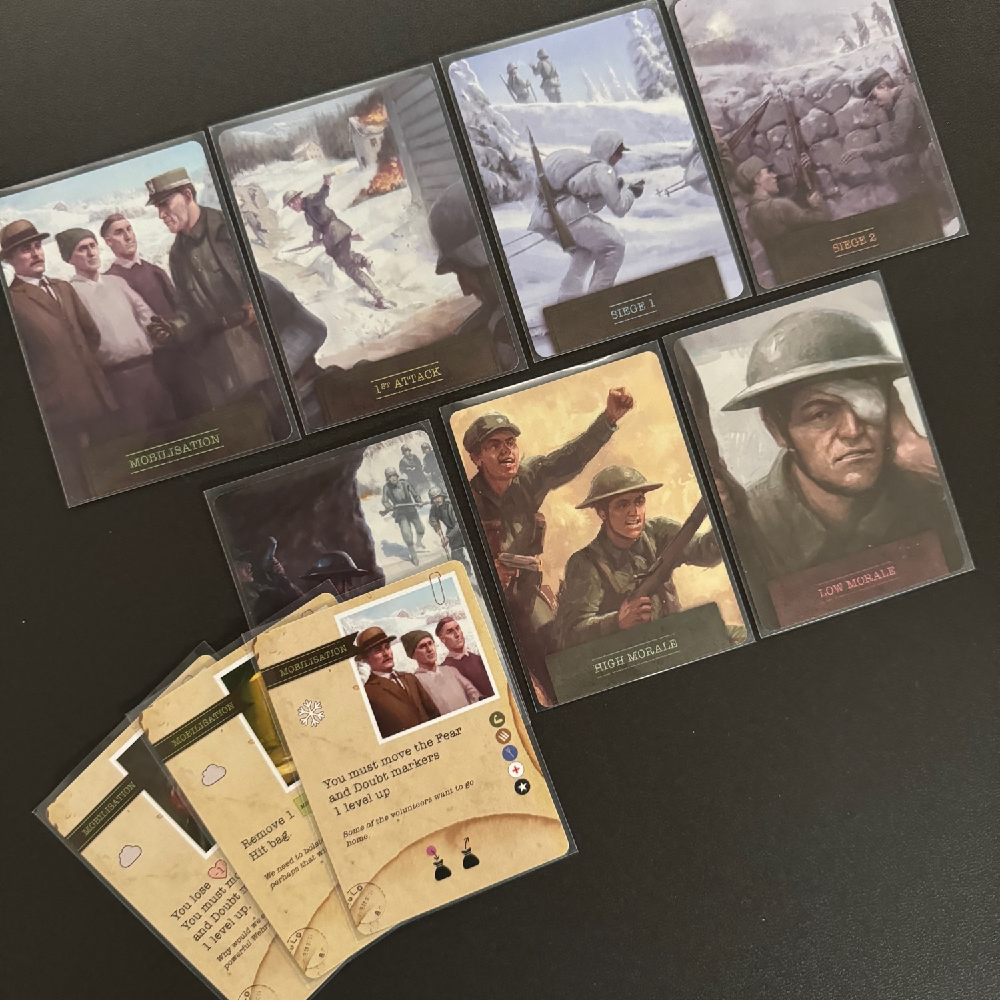

<Setting>

  Nell'oscurità delle lunghe notti nordiche, le luci tremolanti dei fuochi da campo illuminavano le ombre dei soldati norvegesi che preparavano le difese attorno al <strong>forte di Hegra</strong>. Questo antico baluardo, risalente alla Prima Guerra Mondiale, stava per diventare il simbolo di una resistenza inarrestabile. Un pugno di uomini e donne, guidati dalla risoluta maggiore <strong>Reidar Holtermann</strong>, aveva scelto di affrontare un nemico infinitamente superiore in numeri e in potenza di fuoco.  
All'alba del 15 aprile le forze tedesche si avvicinarono alla fortezza. I soldati norvegesi, con il vento gelido che sferzava i loro volti e la neve che copriva il paesaggio, aspettavano in silenzio, consapevoli della tempesta di fuoco che stava per abbattersi su di loro. Con il rombo dei cannoni e il sibilo delle bombe, i tedeschi lanciarono il loro attacco. <strong>Ma Hegra non cedette.</strong>  
Giorno dopo giorno, la piccola guarnigione respinse gli assalti nemici. I soldati norvegesi, molti dei quali erano civili arruolati all'ultimo momento, mostrarono un coraggio e una determinazione straordinari. Ogni colpo sparato dai loro fucili, ogni granata lanciata, era un atto di sfida contro l'oppressione. Sulle pareti rocciose del forte, le esplosioni lasciavano segni indelebili, ma non riuscivano a spezzare la volontà di quei difensori.  
La fame e la stanchezza iniziavano a farsi sentire. Le provviste erano scarse e le munizioni diminuivano. Eppure, nel cuore di quei soldati, ardeva un fuoco che nemmeno il freddo artico poteva spegnere. Ogni notte, sotto le stelle brillanti del cielo norvegese, gli uomini e le donne di Hegra sapevano che stavano scrivendo una pagina di storia.  
Il <strong>5 maggio 1940</strong>, dopo tre settimane di assedio, i difensori di Hegra si trovarono di fronte all'inevitabile. Le munizioni erano quasi esaurite e i rinforzi non sarebbero mai arrivati. Con il cuore pesante, ma con l'orgoglio intatto, Christensen ordinò la resa. <strong>I soldati tedeschi, impressionati dalla tenacia dei loro avversari, concessero loro l'onore delle armi.</strong>

</Setting>

<Rules>

 In Halles of Hegra bisogna respingere l'attacco nazista per <strong>11 giorni</strong>. Il vostro scopo è solamente uno: resistere all'invasore. 
Questi giorni sono suddivisi in quattro fasi distinte: Mobilitazione, primo attacco, primo e secondo assedio. Ogni turno è diviso in 3 parti comuni: prima, l'estrazione di una carta evento, poi una fase mattutina in cui si assegnano i lavoratori, e infine la fase giornaliera in cui si eseguono le azioni scelte in ordine numerico. Queste azioni permettono di fortificare la fortezza, di sparare contro il nemico, di curare eventuali compagni feriti e molto altro. Il gioco prevede <strong>diversi tipi di lavoratori</strong> da schierare: ufficiali, soldati, medici, cacciatori e volontari. Alcune tipologie di lavoratori permettono di svolgere specifiche azioni (soltanto l'ufficiale può far salire di grado i volontari), mentre altre di compiere azioni in maniera più efficace (un cacciatore spala la neve come qualsiasi altri due lavoratori). 
<ul>
<li>Si inizia con tre turni (1-3) di <strong>Mobilitazione</strong>, in cui bisogna prepararsi a essere circondati in una vecchia fortezza. Dovrete scoprire tutto ciò che è a vostra disposizione mentre fate i preparativi per l'imminente assedio; pensate a fortificare le difese e a stabilire le vie di rifornimento tra le linee nemiche.</li>
<li>Seguono tre turni (4-6) di <strong>1° attacco</strong>. Mentre cercate ancora di fortificare le vostre difese, dovete anche preoccuparvi dell'assedio iniziale. Le forze nemiche prendono d'assalto le vostre mura, che dovrete respingere per assicurarvi di essere pronti per gli inevitabili pezzi grossi.</li>
<li>Negli ultimi cinque giorni (dal 7 all'11) i proverbiali cannoni si rivelano piuttosto letali durante l'<strong>Assedio</strong>, dato che i tedeschi attaccano con l'artiglieria e persino con l'aviazione, oltre all'incessante flusso di attacchi della fanteria. L'Assedio consiste in due parti, ognuna con il proprio mazzo di carte evento.</li>
</ul>
Alla fine di ogni giorno, si risolve un effetto basato sul <strong>morale</strong> dell'equipaggio. Con l'avanzare del gioco, mantenere il morale diventa sempre più difficile e ogni giorno è sempre più duro. Non è possibile fare tutto ciò che si vuole fare in ogni turno e si dovrà dare priorità a ciò che si deve fare. 
Il gioco culmina alla fine dell'undicesimo giorno con l'assedio, se il vostro morale non è ancora sceso alla resa. <strong>Se riuscite a sopravvivere all'assedio, vincete la partita.</strong>

</Rules>

<Feedback>

  Halls of Hegra è bellissimo, nulla da dire.  
Dopo la prima partita che passerete tra regolamento e gioco effettivo, le successive andranno lisce come l'olio: ci sono <strong>molte parti in movimento</strong> ed è impensabile aver digerito tutti i dettagli già alla prima partita. Verranno a galla molte domande per cui troverete risposta nel regolamento abbastanza facilmente.  
Questo gioco si basa su alcune delle meccaniche che personalmente amo: il <Link to="/mechanisms/push-your-luck">push your luck</Link> (gestione del rischio) e il <Link to="/mechanisms/bag-building">bag building</Link>, oltre al <Link to="/mechanisms/piazzamento-lavoratori">piazzamento lavoratori</Link>. In altre parole, <strong>capire quando ha senso smettere di rischiare è la chiave della vittoria</strong>. Ad esempio, nella fasi di mobilitazione e del primo attacco, si estrarranno da un sacchetto i soldati che entreranno nelle nostra fila, per un massimo di 4; se viene estratto un token rosa, però, bisognerà sceglierne uno di quelli usciti fino a quel momento.  
La fase di <strong>worker placement</strong> è molto interessante: i lavoratori <em>pronti</em> verranno posizionati su alcune caselle per compiere la relativa azione. Queste azioni sono situazionali e, per questo, davvero molto forti e verranno scelte in momenti diversi della partita. L’azione più interessante del gioco è sicuramente quella di <strong>spalare la neve</strong>: in Norvegia nevica spesso e le difese del passato sono sepolte sotto il manto bianco. Si potranno così spendere dei lavoratori per trovare ulteriori spazi azioni o semplici risorse, o ancora alzare il morale della truppa (si pesca da un mazzo di tessere).  
Avete presente <Link to="/reviews/maquis/">Maquis</Link>? In Halls c'è un <strong>minigioco</strong> simile che vi servirà per portare risorse, nuove reclute ed altro alla vostra fortezza, evitando però i tedeschi che vi bloccheranno il passaggio, uccidendoli o passando vicini in maniera furtiva.  
Le <strong>risorse</strong> sono una delle chiavi per la vittoria: queste vi permetteranno di avere soldati sempre pronti a combattere, senza farli mai riposare; inutile dire che dovrete essere molto convinti prima di spenderle. 
Mentre all'inizio della partita tutto sembra molto semplice, giorno dopo giorno vi renderete conto che <strong>ogni scelta presa farà la differenza tra la vittoria e la sconfitta totale</strong> (è davvero imbarazzante come si può essere annientati a metà partita): avere abbastanza volontari è necessario, ma non tirate troppo la corda; occupare tanti uomini a cercare risorse è comodo, ma al contempo non lavoreranno nella fortezza. 
Oltre alla parte dove saremo noi a posizionare i nostri soldati, c'è tutta la parte in cui i tedeschi ci invadono, via terra e via aria. Attraverso il <strong>lancio di dadi o con l'estrazione da un altro sacchettino</strong>, verrà posizionata sulla plancia la fanteria e verranno eseguiti attacchi aerei.  
Avete presente quando dite "eh ma io faccio sempre 1, sono sfigato"? In Halls of Hegra ci sono lanci dove fare 1 è molto doloroso ed altri dove, fortunatamente, è la manna. 
Tornando alle considerazioni, la rigiocabilità è molto alta e il gioco è <strong>davvero molto stretto</strong>, oltre che bellissimo.  
Da amante di giochi in solitario e del periodo storico scelto, questo gioco entra a piè pari nella mia collezione e vi assicuro che resterà con me senza alcun dubbio.

</Feedback>

